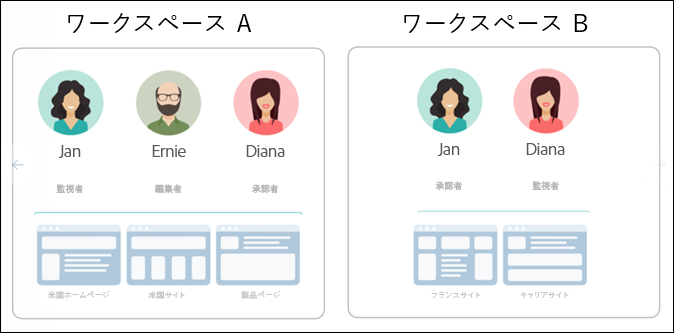
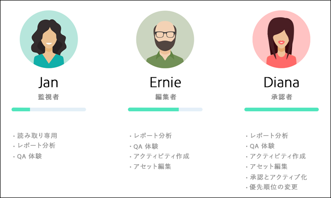
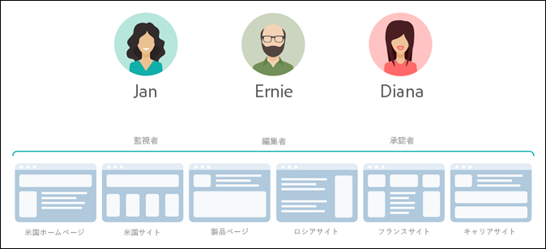
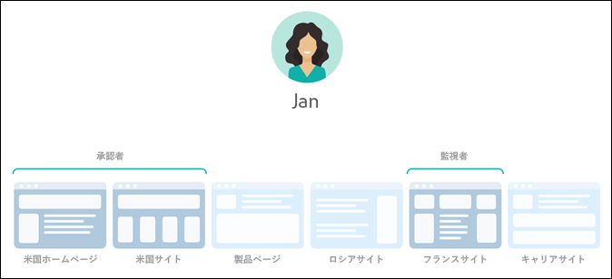
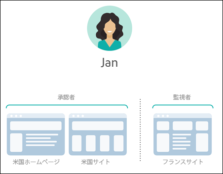
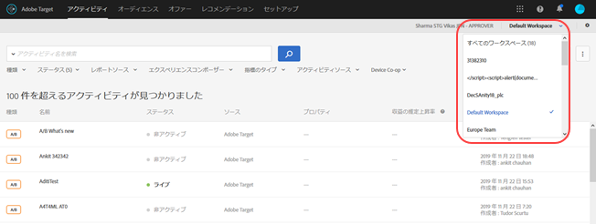
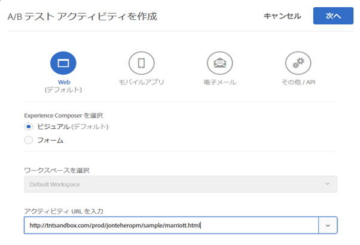
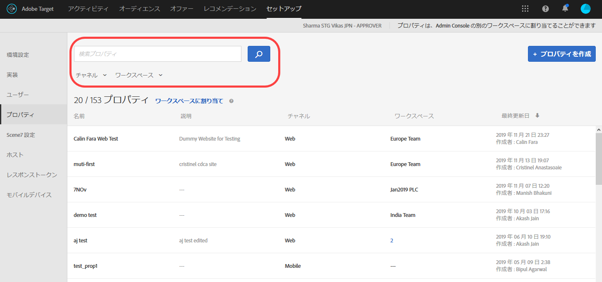

#  Enterprise ユーザーの権限{#enterprise-user-permissions}

Enterpriseユーザー権限は、Targetへのエンタープライズ規模のユーザーアクセスを公式に管理する手段です。Targetにユーザーを追加し、ロールに基づいて権限を割り当て、様々な部門、グローバル場所、チャネルおよびその他の論理的なグループに基づいて、チーム用のワークスペースを作成します。監視者、編集者または承認者の役割をユーザーに割り当てることができます。

## Enterprise ユーザー権限へのアクセス権があるかどうかを判断する

>[!NOTE]
>
>プロパティと権限の機能は Target Premium ソリューションの一部です。Target Premium ライセンスのない Target Standard では利用できません。
>
>Target の実装では、at.js または mbox.js のすべてのバージョンを使用できます。

保有しているライセンスが Standard か Premium かどうかは、[!DNL Target] の UI 上部の「[!UICONTROL 設定]」リンクをクリックすることで確認できます。

* **[!DNL Target Standard]のお客様**：「[!UICONTROL ユーザー]」タブ（[!UICONTROL 設定／ユーザー]）が表示された場合は、ライセンスは [!DNL Target Standard] です。[!DNL Target Standard] のお客様は、Adobe Admin Console でユーザーを追加したり権限を割り当てたりする際は、[ユーザー](/help/administrating-target/c-user-management/c-user-management/user-management.md)の手順に従ってください。

   [!DNL Target Standard] ユーザーが「[!UICONTROL プロパティ]」タブをクリックすると、以下のエラーメッセージが表示されます。[!DNL Target] に問題が発生しているわけではありません。これは、[!DNL Target Standard] ユーザーが [!DNL Target Premium] [!UICONTROL Enterprise 権限]機能にアクセスできないことを示しています。

   

* **[!DNL Target Premium]のお客様**：「[!UICONTROL プロパティ]タブ（[!UICONTROL 設定／プロパティ]）が表示された場合は、ライセンスは [!DNL Target Premium] です。[!DNL Target Premium] のお客様はこの記事と [Enterprise 権限の設定](/help/administrating-target/c-user-management/property-channel/properties-overview.md)の指示に従う必要があります。

## Enterprise 権限の使用を開始する前に

>[!IMPORTANT]
>
>Enterprise 権限の使用を開始する前に、以下の[注意事項](../../../administrating-target/c-user-management/property-channel/property-channel.md#section_9714311B1CD9497A86F4910F8AE635E2)のセクションを読んでください。

## この節で使用される用語と定義 {#section_F8D229544FEA41C3BC2EFD1F95AA0116}

以下の用語は、この節全体で使用されます。Target Premium でプロパティおよび権限機能を使用したいユーザーにとって目新しいものかもしれません。

### プロパティ

プロパティは、区別するために独自のコードスニペットを使用するという点で、実際は Dynamic Tag Management（Activation）内のものと同様です。

Web プロパティは、Web サイト（群）を意味し、複数のルールと 1 つの埋め込みコードで構成されます。Web プロパティは、1 つ以上のドメインやサブドメインをグループ化できます。

プロパティは、任意の呼び出し（mbox、api など）で、特定の名前と値のペアをパラメーターとして Target に追加することで有効化されます。をターゲットに設定します。
プロパティは、特定のチャネル（Web、モバイル、電子メールまたは API／その他）に属しています。

### ワークスペース（製品プロファイル）

ワークスペースを使用すると、組織は特定のユーザーのセットを特定のプロパティのセットに割り当てることができます。多くの点で、ワークスペースは Adobe Analytics のレポートスイートに似ています。

注意：ワークスペースは、Adobe Admin Console for Enterprise では製品プロファイルと呼ばれます。

多国籍組織に属している場合、欧州向け Web ページ、プロパティまたはサイトのワークスペースと、米国向け Web ページ、プロパティまたはサイトの別のワークスペースがあるかもしれません。複数ブランドを取り扱う組織に属している場合、ブランドごとに別のワークスペースがあるかもしれません。

ユーザーは複数のワークスペースに属すことができ、各ワークスペースで異なる役割を持つこともできます。

Analytics でレポートスイート間を移動して複数のビューを切り替える場合と同様に、ワークスペース間を移動することで、Adobe Target の複数のビューを切り替えることができます。

ワークスペースには、まったく異なるオーディエンス、コードオファー、アクティビティを含めることができます。

新しい Enterprise 権限モデルに移行する前に作成されたオーディエンスとアクティビティは、すべて以下で説明する「デフォルトのワークスペース」にまとめられます。

Adobe Experience Manager（AEM）、Adobe Mobile Services および Adobe Target Classic を使用して作成されたすべてのアクティビティも、「デフォルトのワークスペース」に含められます。

### デフォルトのワークスペース

Admin Console 内の既存のワークスペース（製品プロファイル）は、新しい Enterprise 権限モデルへの移行時に、すべて「デフォルトのワークスペース」という 1 つのワークスペースにまとめられます。

>[!IMPORTANT]
>
>デフォルトのワークスペースは削除しないでください。

すべてのユーザーの役割と Target のすべての機能へのアクセス権は、新しい Enterprise 権限モデルに移行する前と変わらずに引き継がれます。

### ユーザーグループ

開発者、アナリスト、マーケティング担当者、エグゼクティブなどのユーザーグループを作成して、複数のアドビ製品およびワークスペースにわたって権限を割り当てることができます。新しいチームメンバーに様々なアドビ製品にわたるすべての適切な権限を割り当てることは、特定のユーザーグループに追加するくらいに簡単です。

### 役割と権限

役割と権限は、Target 実装でユーザーがアクティビティを作成および管理する必要がある場合のアクセスレベルを決定します。Target では、役割には以下が含まれます。

* 監視者：アクティビティを表示できますが、作成または編集はできません。
* 編集者：アクティビティの作成および編集（アクティブでない場合に限る）はできますが、アクティビティの開始を承認することはできません。
* 承認者：アクティビティの作成、編集、アクティブ化、停止ができます。

### チャネル

チャネルは、Target アクティビティの配信先のコンテンツタイプを指します（Web ページ、モバイルアプリ、電子メールメッセージなど）。

新しいアクティビティを作成すると、現在選択しているワークスペースに作成されます。最初のダイアログボックスにチャネル選択オプションが表示されます。このダイアログボックスを使用すると、Web、モバイル、アプリ、電子メールまたはその他／API から、アクティビティ用の目的のチャネルを選択できます。

## 権限の概要 {#section_DC2172520DA84605B218A5E9FB6D187A}

以下の情報で、[!DNL Target] での以前の権限の適用方法と、[!UICONTROL プロパティ]および[!UICONTROL 権限]機能を使用した権限の適用方法について説明します。

新しい[!UICONTROL 権限]機能を使用すると、様々なプロジェクト（[!DNL Adobe Admin Console for Enterprise] では「製品プロファイル」と呼ばれる）を作成して、各プロジェクトへのユーザーのアクセス権を決定する 1 人のユーザーに対して、様々な権限を割り当てることができます。これらの独特なプロジェクトは、[!DNL Adobe Analytics] でのレポートスイートの動作方法と比較できます。各プロジェクトは、プロパティのセットに適用する特定の役割を持つ特定のユーザーを持つことができます。その結果、顧客は、次に示すように、地域、環境（開発／ステージング／実稼動）、チャネルまたはその他のカスタム条件で、ユーザーに対する表示、編集および承認アクセスを制限できます。

例えば、ある特定のユーザーが米国の Web サイトでの「承認」アクセス権を持つが、欧州のモバイルアプリでは「表示」アクセス権のみ持っているとします。この同じユーザーは、APAC 地域の Web およびモバイルプロパティで提供されるアクティビティについては、表示を含め、あらゆるアクセス権がありません。

現在の [!DNL Target][!UICONTROL  権限]モデルには、次に示すように、3 つの権限の役割（監視者、編集者、承認者）があります。

各役割には、様々なレベルの権限があります。

| 役割 | 説明 |
|--- |--- |
| 監視者 | アクティビティに対する読み取り専用アクセス権があります。アクティビティを表示できますが、作成または編集はできません。 |
| 編集者 | アクティビティの作成および編集（アクティブでない場合に限る）はできますが、アクティビティの開始を承認することはできません。 |
| 承認者 | アクティビティの作成、編集、アクティブ化、停止ができます。 |

各ユーザーの役割は、次に示すように、[!DNL Target] タグを含むアカウントのすべてのページ、プロパティまたはサイトに適用されることに注意する必要があります。

新しい [!DNL Target][!UICONTROL  権限]モデルには、同じ 3 つの権限の役割（監視者、編集者、承認者）があります。ただし、次に示すように、ユーザーの権限の役割を各ページ、プロパティまたはサイトに個別に割り当てることができます。

この例では、Jan は、米国ホームページおよび米国サイトに対する承認者権限を持ち、フランスサイトに対する監視者権限を持ちます。

さらに、Jan は、次に示すように、表示する権限を持たない [!DNL Target] のページ、プロパティまたはサイトを表示することはできません。

この例では、Jan は、商品ページ、ロシアサイト、キャリアサイトを表示できません。

## 使用例のシナリオ {#section_F3CE8576959E4F4CB13BEEED38311DD8}

以下の使用例で、[!DNL Target] を使用してマーケティング目標を達成するのにプロパティ、プロジェクト、役割および権限がどのように役立つかを説明します。

### 多国籍組織

多国籍組織に属している場合、欧州向け Web ページ、プロパティまたはサイトのワークスペースと、米国向け Web ページ、プロパティまたはサイトの別のワークスペースがあるかもしれません。再編成後、上の図の人物を使用して、以下のようなワークスペースおよび権限を設定してください。

* **Jan**：Jan は、組織の米国 Web ページ、プロパティ、サイトに関する研究センターの最適化部門のトップです。Jan はおそらく Adobe Experience Cloud のシステム管理者権限を持っています。

   役割として、米国ホームページおよび米国サイトの承認者権限を持っています。承認者権限により、アクティビティを作成、編集、アクティブ化、停止できます。

   また、Jan は、フランスの最適化チームと情報交換をおこなうので、フランスサイトの監視者権限を持ち、アクティビティへの読み取り専用アクセスを付与されています。Jan は、アクティビティを表示できますが、作成または編集はできません。

   Jan は、商品ページ、ロシアサイトまたはキャリアサイトの確認を必要とする役割を担っていないので、これらのサイトのアクティビティを表示できません。

* **Ernie**：Ernie は、組織のマーケティングマネージャーで、米国のマーケティングを担当しています。

   Ernie は組織に加わったばかりで、それほど Target の経験がないので、米国ホームページ、米国サイトおよび商品ページの編集者権限を持っています。編集者権限により、Ernie は、アクティビティの作成および編集（アクティブでない場合に限る）はできますが、アクティビティの開始を承認することはできません。承認権限を持つ誰か（Jan など）が、実稼動環境に移行する前に、アクティビティを承認する必要があります。

   Ernie は、ロシアサイト、フランスサイトまたはキャリアサイトの確認を必要とする役割を担っていないので、これらのサイトのアクティビティを表示できません。

* **Diana**：Diana は、現在は組織のアナリストで、米国ホームページ、米国サイト、商品ページ、ロシアサイトおよびフランスサイトの監視者権限を持ち、アクティビティへの読み取り専用アクセスを付与されています。Diana は、アクティビティを表示できますが、作成または編集はできません。

   Diana は、キャリアサイトの確認を必要とする役割を担っていないので、これらのサイトのアクティビティを表示できません。

### 複数ブランドを取り扱う組織

複数ブランドを取り扱う組織に属している場合、各ブランドの Web ページ、プロパティまたはサイトに別のワークスペースがあるかもしれません。

再編成後、上の図の人物を使用して、以下のようなプロジェクトおよび権限を設定してください。

* **Jan**：Jan は、病院向け製品および消費者向け製品の領域で活動する医療組織の研究センターの最適化部門のトップです。Jan はおそらく Adobe Experience Cloud のシステム管理者権限を持っています。

   役割として、病院向けサイトの承認者権限を持っています。承認者権限により、アクティビティを作成、編集、アクティブ化、停止できます。

   また、Jan は、消費者向け製品の最適化チームと情報交換をおこなうので、サイトの監視者権限を持ち、アクティビティへの読み取り専用アクセスを付与されています。Jan は、アクティビティを表示できますが、作成または編集はできません。

* **Ernie**：Ernie は、組織のマーケティングマネージャーで、消費者向け製品のマーケティングを担当しています。

   Ernie は組織に加わったばかりで、それほど Target の経験がないので、消費者向けサイトの編集者権限を持っています。編集者権限により、Ernie は、アクティビティの作成および編集（アクティブでない場合に限る）はできますが、アクティビティの開始を承認することはできません。消費者向けサイトの承認権限を持つ誰か（このシナリオでは Jan ではない）が、実稼動環境に移行する前に、アクティビティを承認する必要があります。

   Ernie は、病院向けサイトの確認を必要とする役割を担っていないので、このサイトのアクティビティを表示できません。

* **Diana**：Diana は、現在は組織のアナリストで、病院向けサイトおよび消費者向けサイトの監視者権限を持ち、アクティビティへの読み取り専用アクセスを付与されています。Diana は、アクティビティを表示できますが、作成または編集はできません。

## Target UI のプロパティおよび権限のタッチポイント {#section_3414371393BB42999A268628B5456EC9}

新しい権限機能は、[!DNL Target] UI の様々な場所に表示できます。

* **ワークスペース（製品プロファイル）ドロップダウンリスト：** ワークスペースドロップダウンリストが、[!UICONTROL アクティビティ]、[!UICONTROL オーディエンス]、[!UICONTROL オファー]の各ページの上部に表示されます。目的のワークスペースを選択して、リストをフィルターし、選択したワークスペースのアイテムのみを表示します。

   

* **アクティビティの作成：** 新しいアクティビティを作成すると、現在選択しているワークスペースに作成されます。最初のダイアログボックスにチャネル選択オプションが表示されます。このダイアログボックスを使用すると、Web、モバイル、アプリ、電子メールまたはその他／API から、アクティビティ用の目的のチャネルを選択できます。

   

* **オーディエンスの作成：** 新しいオーディエンスを作成すると、現在選択しているワークスペースに作成されます。
* **オファーの作成：** 新しいオファーを作成すると、現在選択しているワークスペースに作成されます。
* **プロパティページ（セットアップ／プロパティ）：**[!UICONTROL 検索]ボックス、「[!UICONTROL チャネル]」および「[!UICONTROL 製品プロファイル]」オプションを使用して、[!UICONTROL プロパティ]リストをフィルターできます。

   

## 注意事項 {#section_9714311B1CD9497A86F4910F8AE635E2}

Target Premium でプロパティおよび権限を使用または設定する際は、次の点を考慮してください。

* **重要**：アクティビティを含むワークスペースを削除しないでください。削除した場合は、ClientCare にお問い合わせのうえアクティビティを復元してください。
* すべてのマイワークスペースビューを使用する場合：

   * アクセスするための適切な役割と権限を持っているすべてのワークスペースのアクティビティ、オーディエンスおよびオファーを確認できます。
   * すべてのマイワークスペースビューを選択すると、新しい列がアクティビティ、オーディエンス、オファーの各ページに追加され、アイテムのワークスペースとそのアイテムに関連付けられているユーザー権限（監視者、編集者、承認者）が一覧表示されます。
   * すべてのマイワークスペースビューでアクティビティ、オーディエンスまたはオファーを作成する場合は、アイテムを作成するワークスペースを選択する必要があります。編集者または承認者の権限を持っているワークスペースのみ選択できます。
   * すべてのマイワークスペースビューでアクティビティ、オーディエンスまたはオファーをコピーする場合は、アイテムをコピーするワークスペースを選択する必要があります。編集者または承認者の権限を持っているワークスペースのみ選択できます。

* 次の設定ページでの設定は、どのワークスペースでもすべての承認者が管理できます。

   * 環境設定
   * 実装
   * Scene7 設定
   * ホスト

* ユーザーがあるワークスペース（製品プロファイル）から別のワークスペースにリソースを移動することはできません。ただし、コピーは可能です。
* [!DNL Audiences] ページからオーディエンスを表示する場合、ページは予想よりも遅く読み込まれます。どのような方法であれ検索バーを使用すると、オーディエンスはより迅速に表示されます。これは既知の問題であり、今後の更新で修正されます。この問題は、アクティビティ作成ワークフローでのオーディエンスの選択には影響しません。
* 次のリソースは、新しい Enterprise 権限モデルに含まれます。

   * ユーザーが権限を有効にした後に Target Standard/Premium 内で作成されたアクティビティ、オーディエンス、コードオファー（注意：ユーザーには Target Premium の使用資格が必要です）。
   * プロパティはデフォルトのワークスペースの既存アクティビティに追加できますが、これは変更される場合があります。
   * Enterprise 権限を有効にした後に Target Premium で作成された新しいリソース（アクティビティ、コードオファー、オーディエンスなど）のみ、権限による制限に使用できます。
   * 外部リソースは、デフォルトのワークスペースのユーザーのみ利用できます。デフォルトのワークスペースのユーザーの役割はグローバルに適用されます（Target のすべてのリクエストとリソースに適用されます）。

* 次のリソースは、新しい Enterprise 権限モデルに*含まれません*。

   * 画像オファー
   * 条件ライブラリ、デザインライブラリ、カタログ、Recommendations 設定を含むすべての Recommendations。
   * Enterprise 権限を有効にする前に Target Premium で作成された既存のリソース（アクティビティ、コードオファー、オーディエンスなど）は、コピーは可能ですが他のワークスペースに移動することはできません。
   * アクティビティ、オーディエンス、コードオファー、画像オファー、または以下のソリューションまたはメソッドを使用して作成されたその他のリソースは、Enterprise 権限モデルでは管理できませんが、デフォルトのワークスペース（Target Classic、Adobe Experience Manager（AEM）、Adobe Mobile Services、および API を利用して作成されたリソース）の一部になります。API を利用して作成されたリソースには、アクティビティ、オーディエンス、コードオファー、画像オファーが含まれます。
   * 現時点では、画像オファー（`https://[tenantName].marketing.adobe.com/content/mac/[tenantName]/target/offers.html#image-library` に保管されているアセット）は Enterprise 権限モデルでは管理できません。
   * clickTracking とリダイレクトは、表示先リンクまたはリンク先ページが、アクティビティに含まれているプロパティの一部になっている場合のみ機能します。また、clickTracking は、`targetPageParams()` 関数を使用する場合は機能しないことがあります。関数には、`targetPageParamsAll()` を使用することをお勧めします。
   Target は、現在、追跡が発生するすべてのページ上に `at_property` トークンが存在している必要があります。トークンが（1）存在しない場合、（2）（VEC 内での）アクティビティの設定時に検出されない場合、または（3）`targetPageParamsAll()` 関数で clickTracking mbox に渡されない場合、指標は増分されず、「0」と表示されます。

   同じことが、リダイレクトを使用するアクティビティにも当てはまります。リダイレクト先のページには、`at_property` トークンがあり、VEC 内での設定時に認識される必要があります。

   今後のリリースで、`at_property` トークンがないページや、異なる `at_property` トークンがあるページでも、Target が機能するようになります。

* [Adobe I/O の API 呼び出し](https://developers.adobetarget.com)では、Enterprise ユーザーの権限機能がサポートされていません。

## よくある質問 {#faqs}

企業権限に関する FAQ を次に示します。

### アクティビティを別のワークスペースに移動させることはできますか？

残念ながら、アクティビティを別のワークスペースに移動させることはできません。ただし、アクティビティを別のワークスペースにコピーすることは可能です（レポートデータは引き継がれませんのでご注意ください）。詳しくは、[ワークスペースを使用している際にアクティビティをコピー／編集する](../../../c-activities/edit-activity.md#section_45A92E1DD3934523B07E71EF90C4F8B6)の「ワークスペースを使用している際にアクティビティをコピー／編集する」を参照してください。

移行前に作成したアクティビティは、編集やプロパティの割り当てがおこなわれない限り、これまでと同じくデフォルトのワークスペースで実行されます。ワークスペースに存在するアクティビティは、そのワークスペースに割り当てられているプロパティに従って動作します。このため、動作が移行前と同じにならない可能性があります。

### プロパティが割り当てられているにもかかわらず、プロパティが関連付けられていないことを示すエラーメッセージが表示されるのはなぜですか。

実装していて[!DNL Target] も[!DNL Adobe Launch] 、アクティビティに関連付けられたプロパティがないことを示すエラーメッセージが表示された場合は、関数に`at_property` パラメータ`targetPageParams` を渡します。

### リダイレクトページとアクティビティ URL が異なるプロパティに属している場合、成功指標は記録されますか?

クリックの追跡は、ページおよびアクティビティ URL が異なるプロパティに属しているページには記録されません。

以下のシナリオを検討します（at.js と mbox.js の両方に適用）。

* ページ1 はプロパティ1 に属しています。
* ページ2 はプロパティ2 に属しています。
* アクティビティでは、ページ1 はページ2 にリダイレクトされ、クリックの追跡を含みます。

訪問者がブラウザーでページ1 を開くと、その訪問者はページ2 にリダイレクトされます。ページ2 にはアクティビティを配信する資格がないので、その Target の呼び出しはその応答内にクリックの追跡を含みません。

リダイレクトページとアクティビティ URL が同じプロパティに属している場合、クリックの追跡は期待どおりに機能します。詳しくは 、[クリックの追跡](/help/c-activities/r-success-metrics/click-tracking.md)を参照してください。

## トレーニングビデオ：Enterprise 権限のトレーニングビデオ {#section_2FA080303A064242B63FF16CFA6DB31D}

学習内容：

* Adobe Target ユーザーの 3 つの役割レベル
* プロパティとワークスペースの概念のほか、これらの違いとグループ分けを生かしてユーザーのアクセスレベルを管理する方法
* 組織に役立つ様々なプロパティの例

>[!VIDEO](https://video.tv.adobe.com/v/19042/?captions=jpn)