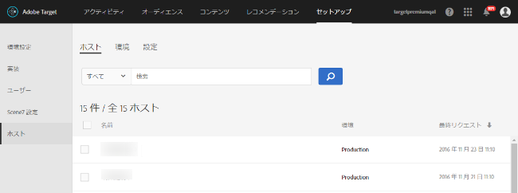

# ホスト{#hosts}

サイトおよび実稼動前環境を整理して、管理と個別レポートを容易にします。

## ホスト {#concept_516BB01EBFBD4449AB03940D31AEB66E}

サイトおよび実稼動前環境を整理して、管理と個別レポートを容易にします。

[!DNL Target Classic] にも同様の機能があります。[!DNL Target Classic] のホストグループは、[!DNL Target Standard/Premium] では「環境」と呼ばれています。

ホスト管理の主な目的は、非アクティブなコンテンツが誤って Web サイトに表示されるのを確実に防ぐことです。ホスト管理では、環境ごとにレポートデータを分離することもできます。

ホストは任意の Web サーバー（または Web ドメイン）です。ここから、プロジェクトの任意の段階で、コンテンツを提供します。mbox を提供するいずれのホストも認識されます。

ホストは、管理を容易にするために環境にバンドルされます。例えば、数十のホストを 2 つまたは 3 つの環境に分けることができます。あらかじめ用意されている環境には、実稼動、ステージングと開発があります。新しい環境を追加したり、希望に応じて環境の名前を変更したりすることができます。

デフォルトの 1 つの環境は実稼動という名前が事前に付けられています。このデフォルトの環境は、名前を変更した場合でも削除できません。[!DNL Target] では、この環境で、最終的な承認済みのアクティビティとテストを扱うことを前提としています。

新しい Web サイトまたはドメインから mbox リクエストが受信されると、それらの新しいドメインが必ず実稼動環境に表示されます。実稼動環境ではその設定を変更できません。そのため、未知のサイトまたは新しいサイトでは、アクティブで表示の準備が整ったコンテンツだけが確実に表示されます。ホスト管理では、アクティビティを有効化する前に、テスト、ステージングおよび開発環境を使って新しいアクティビティとコンテンツの質を容易に確保することもできます。

Target では、mbox を送受信できるホストを制限しないため、新たに追加されたサーバーやドメインは自動的に動作します（ホワイトリストまたはブラックリストを設定している場合を除く）。このように制限がないので、未知のまたは予期できない様々なドメインで広告テストをおこなうこともできます。

ホストと環境を管理するには、**[!UICONTROL セットアップ]**／**[!UICONTROL ホスト]**&#x200B;をクリックします。

## ホストの認識 {#concept_0D4B43E23AA9408F8B28A57ED754BF65}

[!DNL Target] がホストを認識し、これをホストのリストに追加するために満たす必要のある条件に関する情報を紹介します。

ホストが認識されるには、次の条件が満たされている必要があります。

* 1 つ以上の mbox がホストに存在する
* ホスト上のページには、以下のものが含まれている必要があります。

   * 正しい [!DNL mbox.js] の参照
   * mbox または自動生成されたグローバル mbox の呼び出し

* mbox を含むページがブラウザーで表示できる

ページを表示した後、ホストが[!UICONTROL ホスト]リストに表示され、環境内でホストを管理したり、アクティビティおよびテストをプレビューおよび開始したりできます。

>[!NOTE] {class="- topic/note "}
>
>この説明は、個人で使用する開発サーバーも対象となります。

ホストが[!UICONTROL ホスト]リストに追加された後、確実にホストが認識されるようにします。

1. **[!UICONTROL セットアップ]**／**[!UICONTROL ホスト]**&#x200B;をクリックします。
1. ホストが一覧に表示されていない場合は、ブラウザーを更新します。デフォルトでは、新しく認識されたホストは実稼動環境に配置されます。これは最も安全な環境です。その理由は、この環境に属するホストからは、非アクティブなアクティビティを表示できないからです。
1. （オプション）ホストを開発またはステージング環境に移動します。

>[!NOTE]
>
>実稼動環境は、名前を変更した場合でも削除できません。この環境で、最終的なアクティブなキャンペーンとテストを扱うことを前提としています。デフォルトの環境では、非アクティブなキャンペーンの表示は許可されていません。

## ホストと環境の管理 {#concept_90573F5A52E04600A8C3C5897880C10F}

レポートのデフォルトホストの設定、ホワイトリストの作成、環境名の変更、ホストの別環境への移動、ホストまたは環境の削除を含む、ホストと環境（ホストグループ）の管理に役立つ情報を紹介します。

「[!UICONTROL ホスト]」リストにアクセスするには、**[!UICONTROL セットアップ]**／**[!UICONTROL ホスト]**&#x200B;をクリックします。

## ホストのリストのフィルター適用、並べ替え、検索 {#section_068B23C9D8224EB78BC3B7C8580251B0}

環境を基準に「[!UICONTROL ホスト]」リストをフィルターするには&#x200B;**[!UICONTROL すべて]ドロップダウンリストをクリックし、目的の環境（実稼動、ステージング、開発またはユーザーが作成したカスタム環境）を選択します。**

「[!UICONTROL ホスト]」リストを並べ替えるには、任意の列ヘッダー（名前、環境、最終リクエスト）をクリックして、リストを昇順または降順で並べ替えます。

「[!UICONTROL ホスト]」リストを検索するには、「検索」ボックスに検索語を入力します。

## 複数のホストの選択 {#section_EF3B458475184B7EA997C3559714397C}

複数のホストを選択するには、目的のホストの「[!UICONTROL 名前]」列の横にあるチェックボックスを選択します。その後、選択したホストをすべて移動または削除することができます。

## 環境の作成 {#section_32097D0993724DF3A202D164D3F18674}

1. 「[!UICONTROL ホスト]」リストで「**[!UICONTROL 環境]」タブをクリックします。**
1. 「**[!UICONTROL 環境を作成]**」をクリックします。
1. 環境を説明する名前を指定します。
1. 目的の環境のアクティビティモード（「[!UICONTROL アクティブなアクティビティ]」または「[!UICONTROL アクティブおよび非アクティブなアクティビティ]」）を指定します。
1. 「**[!UICONTROL 保存]**」をクリックします。

## レポート用のデフォルトホストの設定 {#section_4F8539B07C0C45E886E8525C344D5FB0}

すべてのアクティビティレポートでデフォルトとして使用する環境を選択できます。

デフォルトとして「実稼動」を使用している場合、不明なホストはすべて自動的にここに追加されます。また、ここから取得されるレポートデータはデフォルトのレポートビューに表示されます。一方、「クリーン」な環境を作成すると、自分のコアサイト／ドメインのみが表示されます。

レポート用のデフォルトの環境を設定するには、以下の手順に従います。

1. 「[!UICONTROL ホスト]」リストで、「**[!UICONTROL 設定]」タブをクリックします。**
1. デフォルトのホストを&#x200B;**[!UICONTROL 環境設定]ドロップダウンリストから選択します。**
1. 「**[!UICONTROL 保存]**」をクリックします。

>[!NOTE]
>
>[!DNL Recommendations] ユーザーは、ホストのホストグループを切り替える場合、行動データベースおよび製品データベースを再構築する必要があります。

## Target に対して mbox 呼び出しを送信する権限のあるホストを指定するホワイトリストの作成{#section_0AF7F56C386A42C381AF704DEF08D5CC}

[!DNL Target] に対して mbox 呼び出しを送信する権限のあるホスト（ドメイン）を指定するホワイトリストを作成できます。呼び出しを生成するその他のすべてのホストに対しては、コメントアウト認証エラーの応答が送信されます。デフォルトでは、mbox 呼び出しを含むホストは、実稼動環境の [!DNL Target] に登録され、アクティブで承認済みのすべてのキャンペーンへのアクセス権を持ちます。これが期待された手法でない場合は、代わりにホワイトリストを使用して、mbox の呼び出しと [!DNL Target] コンテンツの受け取りの資格がある特定のホストを記録できます。すべてのホストは、「[!UICONTROL ホスト]」リストに引き続き表示されます。また、環境は引き続きこれらのホストをグループ化したり、ホストごとに異なるレベル（ホストがアクティブまたは非アクティブなキャンペーンを表示できるかどうかなど）を割り当てることができます。

ホワイトリストを作成するには、次の手順に従います。

1. 「[!UICONTROL ホスト]」リストで、「**[!UICONTROL 設定]」タブをクリックします。**
1. 「**[!UICONTROL コンテンツ配信用に認証済みホストを有効にする]」チェックボックスを選択します。**
1. 必要に応じて、「**[!UICONTROL ホストに含む]」ボックスで目的のホストを追加します。**

   複数のホストを追加することもできます。この場合、1 行に 1 つずつ表示されます。

1. 「**[!UICONTROL 保存]**」をクリックします。

権限のないホストで mbox が呼び出されると、応答は `/* no display - unauthorized mbox host */` になります。

ホワイトリストは環境に優先して適用されます。ホワイトリスト機能を使用する前にすべてのホストをクリアしてください。そうすると、ホワイトリストで許可されているホストのみがホストリストに表示されます。その後、ホストを必要な環境に移動できます。

場合によっては、他のサイトからのドメインが環境内に表示されることがあります。ドメインで mbox.js を呼び出す場合は、そのドメインがリストに表示されます。例えば、自分の Web ページのいずれかが他のユーザーのサーバーにコピーされた場合は、そのサーバーのドメインが自分の環境に表示されます。スパイダーエンジン、言語翻訳サイトまたはローカルディスクドライブからのドメインが表示されることもあります。

`mboxHost` が API 呼び出しで渡される場合、渡される環境のコンバージョンが記録されます。環境が渡されない場合は、この呼び出しでのホストはデフォルトの「Production」になります。

また、「[!DNL Target]ホストに含まれない[!UICONTROL 」ボックスに目的のホストを追加して、] への mbox 呼び出しの送信を許可しない特定のホスト（ドメイン）を指定するブラックリストを作成することもできます。

## 環境名の変更 {#section_9F5F94285F8E495E9CE69810CE94CA08}

1. 「[!UICONTROL ホスト]」リストで「**[!UICONTROL 環境]」タブをクリックします。**
1. 目的の環境の上にカーソルを移動し、「**[!UICONTROL 編集]」アイコンをクリックします。**
1. 環境名を変更します。
1. 「**[!UICONTROL 保存]**」をクリックします。

## ホストを別の環境に移動 {#section_9F52549958BD485EB74FE78C32773D2A}

1. 「[!UICONTROL ホスト]」リストで、移動するホストの上にカーソルを移動します。
1. 「**[!UICONTROL 移動]」アイコンをクリックします。**
1. 目的の環境をドロップダウンリストから選択し、チェックマークアイコンをクリックします。

## ホストの削除 {#section_F56355BA4BC54B078A1A8179BC954632}

不要になったホストは削除することができます。

1. 「[!UICONTROL ホスト]」リストで、削除するホストの上にカーソルを移動します。
1. 「**[!UICONTROL 削除]」アイコンをクリックします。**
1. 「**[!UICONTROL 削除]」をクリックして削除を確定します。**

>[!NOTE]
>
>ホスト上にある mbox が設定されたページが参照されると、そのホストが再度リストされます。

## 環境の削除 {#section_737F8869612047868D03FC755B1223D3}

不要になった環境は削除することができます。

1. 「[!UICONTROL ホスト]」リストで「**[!UICONTROL 環境]」タブをクリックします。**
1. 削除する環境の上にカーソルを移動します。
1. 「**[!UICONTROL 削除]」アイコンをクリックします。**
1. 「**[!UICONTROL 削除]」をクリックして削除を確定します。**

>[!NOTE]
>
>実稼動環境は削除できませんが、名前の変更はできます。

## ホストのトラブルシューティング {#concept_B3D7583FA4BB480382CC7453529FE1B7}

[!DNL Adobe Target] におけるホストの管理とトラブルシューティングのベストプラクティスを紹介します。

ホストにおいて問題が発生した場合は次のトラブルシューティングのヒントを試してください。

**ホストがアカウントの mbox リストに表示されない。**

* ブラウザーで[!UICONTROL ホスト]ページを再読み込みします。
* [!DNL mbox.js] の参照を含め、mbox コードが正しいかどうかを確認します。
* ホストのいずれかの mbox を参照します。ホスト上にあるどの mbox もブラウザーでレンダリングされない場合もあります。

**ランダムなドメインまたは不明なドメインが[!UICONTROL ホスト]リストに表示される。**

[!DNL Target] の呼び出しがドメインからおこなわれると、このリストにドメインが表示されます。場合によっては、スパイダーエンジン、言語翻訳サイトまたはローカルディスクドライブからのドメインが表示されることがあります。表示されるドメインがチームで使用していないドメインである場合は、「[!UICONTROL 削除]」をクリックして、そのドメインを削除します。

**mbox 呼び出しで /* no display - unauthorized mbox host */ が返される。**

権限のないホストで mbox が呼び出されると、応答は /* no display - unauthorized mbox host */ になります。

## Recommendations：環境（ホストグループ）別にコレクションと除外をフィルター

選択した環境（ホストグループ）の Recommendations コレクションと除外のコンテンツをプレビューできます。

>[!NOTE]
>Recommendations アクティビティは、Target Premium ソリューションの一部です。Target Premium ライセンスのない Target Standard では利用できません。

ホストグループを使用して、カタログの利用可能な項目をさまざまな用途に分割できます。例えば、ホストグループは開発環境と実稼動環境、さまざまなブランド、またはさまざまな地域に使用できます。デフォルトでは、カタログ検索、コレクションおよび除外のプレビュー結果はデフォルトのホストグループに基づいています。（環境フィルターを使用して、結果をプレビューする別のホストグループを選択することもできます）デフォルトでは、項目の作成または更新時に環境 ID が指定されている場合を除き、新しく追加された項目はすべてのホストグループで使用できます。配信される Recommendations は、リクエストで指定したホストグループによって異なります。

商品が表示されていない場合は、適切なホストグループが使用されていることを確認してください。例えば、ステージング環境を使用するようにレコメンデーションを設定し、ホストグループをステージングに設定した場合、商品を表示するために、ステージング環境のコレクションを再作成する必要がある可能性があります。各環境でどの商品が利用できるかを確認するには、各環境でカタログ検索を利用します。選択した環境（ホストグループ）の Recommendations コレクションと除外のコンテンツをプレビューすることもできます。

>[!NOTE]
>選択した環境を変更した後、「検索」をクリックして、返された結果を更新する必要があります。

環境フィルターは、Target UI の次の場所から利用可能です。

* カタログ検索（[!UICONTROL Recommendations／カタログ検索]）
* 「コレクションを作成」ダイアログボックス（[!UICONTROL Recommendations／コレクション／新規作成]）
* 「コレクションを更新」ダイアログボックス（[!UICONTROL Recommendations／コレクション／編集]）
* 「除外を作成」ダイアログボックス（[!UICONTROL Recommendations／除外／新規作成]）
* 「除外を更新」ダイアログボックス（[!UICONTROL Recommendations／除外／編集]）
