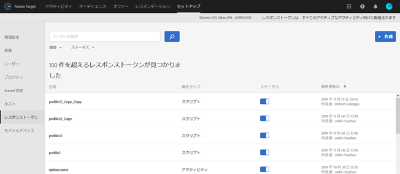

# レスポンストークン{#response-tokens}

レスポンストークンを利用すると、Target 固有の情報（キャンペーンの詳細、ユーザープロファイル情報、地域情報など）を自動的に出力し、デバッグや、サードパーティシステム（Clicktale など）との統合に利用することができます

Adobe Target Classic には、mbox の応答時に実行される JavaScript を送信できるサーバープラグインという機能がありました。レスポンストークンはプラグインと似ており、Target 固有の情報を取得して他の場所で利用できます。レスポンストークンでは、利用する変数を選んでから、それらの変数を mbox の応答に含めて送信できます。そのためには、スイッチを使用して変数を有効にします。そうすると、その変数が mbox の応答とともに送信され、ネットワーク呼び出しで検証できるようになります。レスポンストークンはプレビューモードでも機能します。

プラグインとレスポンストークンの主な違いは、プラグインでは配信時に実行される JavaScript をページに送信しますが、レスポンストークンでは、イベントリスナーを使用して読み込み、実行できるオブジェクトを送信するという点です。詳しくは、[at.js カスタムイベント](/help/c-implementing-target/c-implementing-target-for-client-side-web/atjs-custom-events.md)とこの記事の後の例を参照してください。レスポンストークンの方が安全性が高く、サードパーティ統合に伴う開発や管理を簡略化できます。

>[!NOTE]
>
>レスポンストークンは [!DNL at.js] 1.1 以降で利用できます。mbox.js には対応していません。

| 使用する Target ライブラリ | 推奨の操作 |
|--- |--- |
| at.js | 必ず at.js バージョン 1.1 以降を使用します。at.js の最新バージョンのダウンロードについて詳しくは、[at.js のダウンロード](/help/c-implementing-target/c-implementing-target-for-client-side-web/how-to-deployatjs/implementing-target-without-a-tag-manager.md) を参照してください。at.js の各バージョンでの新機能について詳しくは、[at.js のバージョンの詳細](/help/c-implementing-target/c-implementing-target-for-client-side-web/target-atjs-versions.md)を参照してください。<br>at.js を使用する場合は、プラグインを廃止しレスポンストークンを使用することをお勧めします。at.js にはなく、mbox.js にはある内部メソッドを使用するプラグインでは、配信されてもエラーが発生する場合があります。詳しくは、[at.js の制限](/help/c-implementing-target/c-implementing-target-for-client-side-web/t-mbox-download/c-target-atjs-implementation/target-atjs-limitations.md)を参照してください。 |
| mbox.js | mbox.js を使用している場合、プラグインは引き続きサポートされ、配信されます。<br>ただし、mbox.js とプラグインを使用している場合は、at.js とレスポンストークンに移行することをお勧めします。mbox.js を介して at.js を使用することの利点については、[at.js に関するよくある質問](/help/c-implementing-target/c-implementing-target-for-client-side-web/c-target-atjs-faq/target-atjs-faq.md)を参照してください。移行について詳しくは、[mbox.js から at.js への移行](/help/c-implementing-target/c-implementing-target-for-client-side-web/t-mbox-download/c-target-atjs-implementation/target-migrate-atjs.md)を参照してください。<br>2017 年 11 月の Target Classic の廃止以降は、場合によっては、既存のプラグインを編集または無効にするために、ClientCare までお問い合わせいただく必要があります。Target Classic の廃止より前にプラグインを確認し、必要のないプラグインを無効にしておく必要がありました。<br>Target Standard/Premium では、新しいプラグインは作成できません。その代わりにレスポンストークンを使用します。<br>古い SiteCatalyst プラグインは無効にして、[Adobe Target のレポートソースとして Adobe Analytics に置き換える](/help/c-integrating-target-with-mac/a4t/a4t.md)（A4T）必要があります。ttMeta プラグインは、無効にして [Adobe Experience Cloud デバッガー](https://chrome.google.com/webstore/detail/adobe-experience-cloud-de/ocdmogmohccmeicdhlhhgepeaijenapj)に置き換えてください。 |

## レスポンストークンの使用方法 {#section_A9E141DDCBA84308926E68D05FD2AC62}

1. 必ず [!DNL at.js] バージョン 1.1 以降を使用します。

   詳しくは、[at.js のダウンロード](../c-implementing-target/c-implementing-target-for-client-side-web/how-to-deployatjs/implementing-target-without-a-tag-manager.md#concept_1E1F958F9CCC4E35AD97581EFAF659E2)を参照してください。

1. [!DNL Target] で、**[!UICONTROL セットアップ]**／**[!UICONTROL レスポンストークン]**をクリックします。

   

1. `option.id`、`activity.id` などの対象のレスポンストークンを有効にします。

   デフォルトでは次のパラメーターを使用できます。

   | タイプ | パラメーター | メモ |
   |--- |--- |--- |
   | ビルトインプロファイル | `profile.activeActivities` | 訪問者が該当する `activityIds` の配列を返します。ユーザーが該当するたびに増分されます。例えば、2 種類のアクティビティを配信する 2 つの mbox を含むページでは、2 つ目の mbox には両方のアクティビティが含まれます。 |
   |  | `profile.isFirstSession` | 「true」または「false」を返します。 |
   |  | `profile.isNewSession` | 「true」または「false」を返します。 |
   |  | `profile.daysSinceLastVisit` | 訪問者の最後の訪問からの経過日数を返します。 |
   |  | `profile.tntId` | 訪問者の tntID を返します。 |
   |  | `profile.marketingCloudVisitorId` | 訪問者の Experience Cloud 訪問者 ID を返します。 |
   |  | `profile.thirdPartyId` | 訪問者のサードパーティ ID を返します。 |
   |  | `profile.categoryAffinity` | 訪問者のお気に入りのカテゴリを返します。 |
   |  | `profile.categoryAffinities` | 訪問者の上位 5 カテゴリの配列を文字列として返します。 |
   | アクティビティ | `activity.name`<br>`activity.id`<br>`experience.name`<br>`experience.id`<br>`option.name`<br>`option.id` | 現在のアクティビティの詳細です。「option」は「offer」と同義です。 |
   | 地域 | `geo.country`<br>`geo.state`<br>`geo.city`<br>`geo.zip`<br>`geo.dma`<br>`geo.domainName`<br>`geo.ispName`<br>`geo.connectionSpeed`<br>`geo.mobileCarrier` | アクティビティでの地域ターゲット設定について詳しくは、[地域](/help/c-target/c-audiences/c-target-rules/geo.md)を参照してください。 |

   ユーザープロファイル属性と顧客属性もリストに表示されます。

   >[!NOTE]
   >
   >特殊文字を含むパラメーターはリストに表示されません。英数字とアンダースコアのみサポートされます。

1. （条件付き）プロファイルパラメーターをレスポンストークンとして使用するときにパラメーターが mbox 呼び出し経由で渡されておらず、その結果 Target UI に読み込まれていない場合は、「作成」ボタンを使用してプロファイルを UI に追加できます。

   「**[!UICONTROL 作成]**」をクリックし、トークン名を指定して、「**[!UICONTROL アクティブ化]**」をクリックします。

   

1. アクティビティを作成します。

[at. jsカスタムイベント](/help/c-implementing-target/c-implementing-target-for-client-side-web/atjs-custom-events.md) を使用してmboxの応答をリッスンし、応答トークンを読み取ります。

以下のコードサンプルは、[!DNL at.js] カスタムイベントハンドラーを HTML ページに直接追加します。

```
<html> 
  <head> 
    .... 
    <script src="at.js"></script> 
    <script> 
      document.addEventListener(adobe.target.event.REQUEST_SUCCEEDED, function(e) { 
        console.log("Request succeeded", e.detail); 
      }); 
    </script> 
  <head> 
  <body> 
  ... 
  </body> 
</html>
```

Adobe Dynamic Tag Management（DTM）を使用して [!DNL at.js] カスタムイベントハンドラーを追加する手順を以下に示します。

1. DTM にログインします。
1. 適切なプロパティを参照します。
1. Target ツールを開きます。

   DTM では at.js がネイティブにサポートされないので、コードエディターを使用する必要があります。

1. コードエディターで、以下のコードを [!DNL at.js] に追加します。

   ```
   document.addEventListener(adobe.target.event.REQUEST_SUCCEEDED, function(e) { 
     console.log("Request succeeded", e.detail); 
   });
   ```

すべての要素を 1 つのファイルにまとめたい場合は、以下のスニペットをライブラリフッターの [at.js セットアップページ](../c-implementing-target/c-implementing-target-for-client-side-web/how-to-deployatjs/implementing-target-without-a-tag-manager.md#concept_2FA0456607D04F82B0539C5BF5309812)に追加できます。

```
document.addEventListener(adobe.target.event.REQUEST_SUCCEEDED, function(e) { 
  console.log("Request succeeded", e.detail); 
});
```

## レスポンストークンに関する FAQ {#section_3DD5F32C668246289CDF9B4CDE1F536D}

**レスポンストークンを有効または無効にするには、どの役割が必要ですか？**

レスポンストークンを有効または無効にできるのは、Target 管理者の役割のユーザーのみです。

**at.js 1.0 以前を使用している場合はどうなりますか？**

レスポンストークンは確認できますが、at.js で使用することはできません。

**サイトの一部のページでは at.js 1.1 以降を使用し、他のページでは mbox.js を使用している場合はどうなりますか？**

レスポンストークンは [!DNL at.js] mbox 応答には配信されますが、[!DNL mbox.js] 応答には配信されません。

**Target Classic プラグインとレスポンストークンの両方を同時に有効にすることはできますか？**

プラグインとレスポンストークンは同時に利用できますが、プラグインは廃止される予定です。

**レスポンストークンは、すべての mbox 応答を介して配信されますか、それともアクティビティを配信する mbox のみを介して配信されますか？**

レスポンストークンは、アクティビティを配信する mbox のみを介して配信されます。

**利用していた Target Classic プラグインに JavaScript が含まれていたのですが、レスポンストークンを使用してこの機能を複製するにはどうすればよいですか？**

そのタイプの JavaScript は、レスポンストークンに移行する際に、コードベースまたはタグ管理ソリューションに残しておく必要があります。このコードは、[!DNL at.js] カスタムイベントを使用してトリガーし、レスポンストークンの値を JavaScript 関数に渡すことができます。

**プロファイル／顧客属性パラメーターがレスポンストークンのリストに表示されないのはなぜですか？**

Target では通常、パラメーターが 15 分間隔で更新されます。この更新はユーザーの操作に依存し、データが更新されるのはレスポンストークンのページを表示したときのみです。パラメーターがレスポンストークンのリストに表示されない場合は、Target でデータがまだ更新されていない可能性があります。

また、英数字以外の文字や、アンダースコア以外の記号が含まれているパラメーターはリストに表示されません。現時点では、サポートされるのは英数字とアンダースコアのみです。

**プロファイルスクリプトまたはプロファイルパラメーターを使用してレスポンストークンを作成した後、そのプロファイルスクリプトまたはプロファイルパラメーターを削除した場合でも、レスポンストークンによって引き続きコンテンツは配信されますか？**

レスポンストークンはユーザープロファイルから情報を抽出し、その情報を配信します。プロファイルスクリプトまたはプロファイルパラメーターを削除しても、ユーザープロファイルから情報が削除されるわけではありません。ユーザープロファイルには該当のプロファイルスクリプトに対応するデータが残り、レスポンストークンによって引き続きコンテンツが配信されます。その情報がプロファイルに保存されていないユーザーや新規訪問者の場合は、プロファイルにデータがないので、このトークンは配信されません。

Target によって自動的にトークンが無効にされることはありません。プロファイルスクリプトを削除し、このトークンの配信が不要になった場合は、手動でトークンを無効にする必要があります。

**プロファイルスクリプトの名前を変更しましたが、そのスクリプトを使用しているトークンが変更前の名前のままで引き続き有効なのはなぜですか？**

前述したように、レスポンストークンはユーザーの保存済みのプロファイル情報を基に機能します。プロファイルスクリプトの名前を変更しても、お客様の Web サイトに訪問したユーザーのプロファイルには、変更前のプロファイルスクリプトの値が保存されています。トークンによって取得されるのは、ユーザープロファイルに既に保存されている変更前の値です。新しい名前でコンテンツを配信したい場合は、以前のトークンを無効にし、新しいトークンを有効にする必要があります。

**属性が変更された場合、いつリストから削除されますか？**

Target では、一定間隔で属性が更新されます。有効にされていない属性は、次回更新時にすべて削除されます。ただし、有効にされていた属性を削除した場合（トークンとして使用していたプロファイルスクリプトを削除した場合など）は、そのスクリプトは無効にされるまで属性リストから削除されません。Target では、削除または名前変更しても、無効にされている属性しかリストから削除されません。

## at.js を使用して Google Analytics にデータを送信する方法 {#section_04AA830826D94D4EBEC741B7C4F86156}

次のコードを HTML ページに追加することで、Google Analytics に at.js を介してデータを送信できます。

```
<script type="text/javascript"> 
  (function(i, s, o, g, r, a, m) { 
    i['GoogleAnalyticsObject'] = r; 
    i[r] = i[r] || function() { 
      (i[r].q = i[r].q || []).push(arguments) 
    }, i[r].l = 1 * new Date(); 
    a = s.createElement(o), 
      m = s.getElementsByTagName(o)[0]; 
    a.async = 1; 
    a.src = g; 
    m.parentNode.insertBefore(a, m) 
  })(window, document, 'script', 'https://www.google-analytics.com/analytics.js', 'ga'); 
  ga('create', 'Google Client Id', 'auto'); 
</script> 
 
<script type="text/javascript"> 
  document.addEventListener(adobe.target.event.REQUEST_SUCCEEDED, function(e) { 
    var tokens = e.detail.responseTokens; 
 
    if (isEmpty(tokens)) { 
      return; 
    } 
 
    var activityNames = []; 
    var experienceNames = []; 
    var uniqueTokens = distinct(tokens); 
 
    uniqueTokens.forEach(function(token) { 
      activityNames.push(token["activity.name"]); 
      experienceNames.push(token["experience.name"]); 
    }); 
 
    ga('send', 'event', { 
      eventCategory: "target", 
      eventAction: experienceNames, 
      eventLabel: activityNames 
    }); 
  }); 
 
  function isEmpty(val) { 
    return (val === undefined || val == null || val.length <= 0) ? true : false; 
  } 
 
  function key(obj) { 
     return Object.keys(obj) 
    .map(function(k) { return k + "" + obj[k]; }) 
    .join(""); 
  } 
 
  function distinct(arr) { 
    var result = arr.reduce(function(acc, e) { 
      acc[key(e)] = e; 
      return acc; 
    }, {}); 
   
    return Object.keys(result) 
    .map(function(k) { return result[k]; }); 
  } 
</script>
```

## デバッグ（ttMeta プラグインと同様） {#section_DB3392B6E80749C1BFB520732EDF3BCE}

ttMeta プラグインと同様のデバッグ機能は、HTML ページに次のコードを追加することで作成できます。

```
<script type="text/javascript" > 
  document.addEventListener(adobe.target.event.REQUEST_SUCCEEDED, function (e) { 
    window.ttMETA= typeof(window.ttMETA)!="undefined" ? window.ttMETA : []; 
 
    var tokens=e.detail.responseTokens; 
 
    if (isEmpty(tokens)) { 
      return; 
    } 
     
    var uniqueTokens = distinct(tokens); 
 
    uniqueTokens.forEach(function(token) { 
      window.ttMETA.push({ 
        'CampaignName': token["activity.name"], 
        'CampaignId' : token["activity.id"], 
        'RecipeName': token["experience.name"], 
        'RecipeId': token["experience.id"], 
        'OfferId': token["option.id"], 
        'OfferName': token["option.name"], 
        'MboxName': e.detail.mbox}); 
      console.log(ttMETA); 
    }); 
  }); 
 
  function isEmpty(val){ 
    return (val === undefined || val == null || val.length <= 0) ? true : false; 
  } 
 
  function key(obj) { 
     return Object.keys(obj) 
    .map(function(k) { return k + "" + obj[k]; }) 
    .join(""); 
  } 
 
  function distinct(arr) { 
    var result = arr.reduce(function(acc, e) { 
      acc[key(e)] = e; 
      return acc; 
    }, {}); 
   
    return Object.keys(result) 
    .map(function(k) { return result[k]; }); 
  } 
</script>
```

## トレーニングビデオ：レスポンストークンおよび at.js カスタムイベント {#section_3AA0A6C8DBD94A528337A2525E3E05D5}

次のビデオでは、レスポンストークンと at.js カスタムイベントを使用して Target とサードパーティシステムの間でプロファイル情報を共有する方法について説明します。

>[!VIDEO](https://video.tv.adobe.com/v/23253/)
