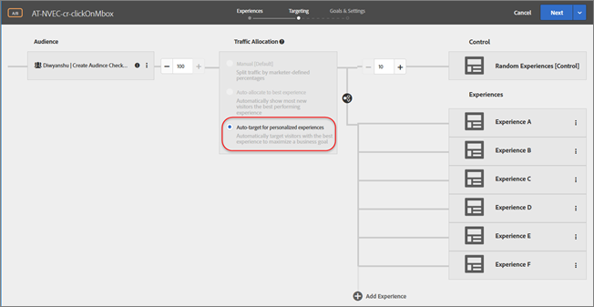
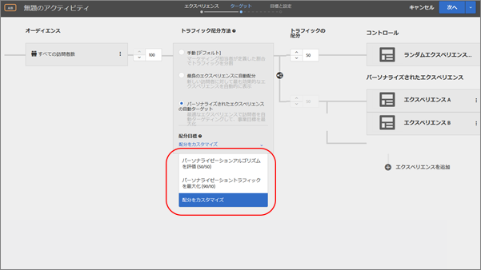
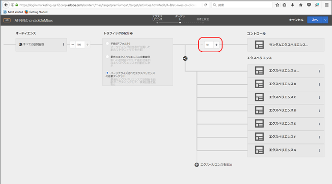

#  自動ターゲット{#auto-target}

[!UICONTROL 自動ターゲット] は高度な機械学習を使用して、複数のマーケティング担当者が定義したエクスペリエンスから選択し、コンテンツをパーソナライズし、コンバージョンを推進します。自動ターゲットは、個々の顧客プロファイルに基づいて、また類似プロファイルを持つ以前の訪問者の行動に基づいて、各訪問者に最適なエクスペリエンスを提供します。

>[!NOTE]
>
>[!UICONTROL 自動ターゲット] は、この [!DNL Target Premium] ソリューションの一部として使用できます。この機能は、ライセンス [!DNL Target Standard] なし [!DNL Target Premium] では使用できません。

3ステップの [ガイドによるワークフローを使用してA/Bアクティビティを作成する際に](../c-activities/t-test-ab/t-test-create-ab/test-create-ab.md#task_68C8079BF9FF4625A3BD6680D554BB72)、 [!UICONTROL パーソナライズされたエクスペリエンスの自動ターゲット] オプションを使用してトラフィックを割り当てることができます:

## 概要 {#section_972257739A2648AFA7E7556B693079C9}

A/B アクティビティフロー内で [!UICONTROL 自動ターゲット] オプションを利用すると、マーケティング担当者が定義したエクスペリエンスのセットを基に、機械学習を生かしたパーソナライゼーションをクリック 1 回でおこなうことができます。[!UICONTROL 自動ターゲットは従来の A/B テストや自動配分とは違い、各訪問者にどのエクスペリエンスを提供するかを判断することで、可能な限りの最適化をおこなう仕組みになっています。]1つの勝者を見つけるためのA/Bアクティビティとは異なり、 [!UICONTROL 自動ターゲット] は、特定の訪問者に対して（プロフィールやその他のコンテキスト情報に基づいて）最適なエクスペリエンスを自動的に決定し、高度にパーソナライズされたエクスペリエンスを提供します。

Automated Personalization と同じように、 [!UICONTROL 自動ターゲットt] では先進のデータサイエンスアンサンブル手法であるランダムフォレストアルゴリズムを使用して、訪問者に表示する最適なエクスペリエンスを決定します。 [!UICONTROL 自動ターゲット] なら訪問者の行動の変化に対応できるので、恒久的に実行して上昇率を高めることができます。これは、「常時稼働」モードとも呼ばれます。

特定の訪問者のエクスペリエンス配分が定着であるA/Bアクティビティとは異なり、 [!UICONTROL 自動ターゲット] は、各訪問で指定したビジネス目標を最適化します。[!UICONTROL Auto Personalization] と同様に [!UICONTROL 自動ターゲット] でも、上昇率を計測するために、デフォルトではアクティビティのトラフィックの一部がコントロールグループに配分されます。コントロールグループの訪問者には、アクティビティのランダムエクスペリエンスが配信されます。

[!UICONTROL 自動ターゲット]を使用する際に注意すべき重要な注意事項は次のとおりです。

* 特定のアクティビティを自動ターゲットから [!UICONTROL Automated Personalization] に切り替えることはできません。逆も同様です。
* 手動トラフィック配分（従来のA/Bテスト）から [!UICONTROL 自動ターゲット] への切り替えや、アクティビティの有効化後には、手動で切り替えることはできません。
* ホストおよび環境（ホストグループ）を使用する場合、モデルは「実稼働」環境用にのみ作成されます。すべての環境がデータを提供して「実稼働」キャンペーンのモデルを作成します。
* 最低 2 つのエクスペリエンスを使用する必要があります。

## 用語 {#section_A309B7E0B258467789A5CACDC1D923F3}

[!UICONTROL 自動ターゲッ]トを説明する際には、次の用語が役立ちます。

| 用語 | 定義 |
|---|---|
| マルチアームバンディット | 調査学習とその学習の活用のバランスの最適化のためのマルチアームバンディットアプローチです。 |
| ランダムフォレスト | ランダムフォレストは、優れた機械学習手法です。データサイエンス分野においては、訪問者と訪問の属性に基づいて大量のデシジョンツリーを構築することで機能するアンサンブル分類または回帰手法を指します。Target では、個々の訪問者がコンバージョンに至る可能性が最も高い（または訪問あたりの売上高が最も高い）と予想されるエクスペリエンスを決定するためにランダムフォレストが使用されます。Target でのランダムフォレストについて詳しくは、[ランダムフォレストアルゴリズム](../c-activities/t-automated-personalization/algo-random-forest.md#concept_48F3CDAA16A848D2A84CDCD19DAAE3AA)。 |
| トンプソンサンプリング | トンプソンサンプリングの目的は、全体的に最良の（パーソナライズされていない）エクスペリエンスを最小限の「コスト」で特定することです。トンプソンサンプリングでは、2 つのエクスペリエンスに統計的な差異がない場合でも、必ず勝者が選定されます。詳しくは、[トンプソンサンプリング](https://en.wikipedia.org/wiki/Thompson_sampling)を参照してください。 |

## [!UICONTROL 自動ターゲット] の仕組み {#section_77240E2DEB7D4CD89F52BE0A85E20136}

以下のリンクにある、 [!UICONTROL 自動ターゲット] とAutomated Personalizationのデータおよびアルゴリズムについての詳細をご覧ください。

| 用語 | 詳細 |
|--- |--- |
| [ランダムフォレストアルゴリズム](/help/c-activities/t-automated-personalization/algo-random-forest.md) | [!UICONTROL 自動ターゲット] とAutomated Personalizationの両方 で使用されるTargetの主なパーソナライゼーションアルゴリズムは、ランダムフォレストです。ランダムフォレストのようなアンサンブル手法は、複数の学習アルゴリズムを使用して、どの構成学習アルゴリズムを使用した場合よりも優れた予測パフォーマンスを実現します。Automated Personalization システムのランダムフォレストアルゴリズムは、トレーニング時に多数のデシジョンツリーを構成することで機能する分類または回帰手法です。 |
| [Target のパーソナライゼーションアルゴリズムのデータのアップロード](/help/c-activities/t-automated-personalization/algo-random-forest.md) | [!UICONTROL 自動ターゲット] とAutomated Personalizationモデルのデータを入力するには、いくつかの方法があります。 |
| [Targetのパーソナライゼーションアルゴリズムのデータ収集](/help/c-activities/t-automated-personalization/ap-data.md) | Target のパーソナライゼーションアルゴリズムは様々なデータを自動収集します。 |

## トラフィック配分の決定 {#section_AB3656F71D2D4C67A55A24B38092958F}

アクティビティの目標に合わせて、様々な方法でコントロールとパーソナライズされたエクスペリエンスにトラフィックを配分できます。アクティビティをライブにする前に、アクティビティの目標を決めておくことをお勧めします。

[!UICONTROL カスタム配分]ドロップダウンリストで、以下のオプションを選択できます。

* パーソナライゼーションアルゴリズムを評価
* パーソナライゼーショントラフィックを最大化
* カスタム配分

| アクティビティの目標 | 推奨のトラフィック配分 | メリットとデメリット |
|--- |--- |--- |
| パーソナライゼーションアルゴリズムの評価（50/50）目標は、パーソナライゼーションアルゴリズムが対照（ランダムに提供されるエクスペリエンスなど）とどの程度機能しているかを判断することです。パーソナライゼーションプログラムを評価する初期段階に該当します。 | 配分はコントロールエクスペリエンスに 50％、パーソナライズされたエクスペリエンスに 50％ | <ul><li>コントロールと比較した場合のパーソナライゼーションの上昇率の精度を最大化できます。</li><li>パーソナライズされたエクスペリエンスが提供される訪問者が比較的少なくなります。</li></ul> |
| パーソナライゼーショントラフィックの最大化（90/10）目標は、パーソナライズされたトラフィックの量を最大限にする「常時」パーソナライゼーションアクティビティを作成することです。コントロールを上昇率のベンチマークとして比較対象にし続けながら、上昇率を最大限に高めます。 | 最適な配分はコントロールエクスペリエンスに 10％から 30％、パーソナライズされたエクスペリエンスに 70％から 90％ | <ul><li>パーソナライズされたエクスペリエンスを提供する訪問者数を最大化できます。</li><li>上昇率を最大化できます。</li><li>アクティビティの上昇率の精度が落ちます。</li></ul> |
| カスタム配分 | 配分の割合を手動で調節します。 | <ul><li>想定どおりの結果が得られない場合もあります。目安がわからない場合は、上述のいずれかのオプションを使用することをお勧めします。</li></ul> |

コントロールの割合を調整するには、- または + 記号をクリックします。コントロールグループの割合を 10％未満にすることはできません。

## [!UICONTROL 自動ターゲット] をAutomated Personalizationで選択するには、どうしたらよいですか? {#section_BBC4871C87944DD7A8B925811A30C633}

Automated Personalizationで [!UICONTROL 自動ターゲッ] トを使用する場合は、いくつかのシナリオがあります。

* 自動的に組み合わせられてエクスペリエンスを形成する個々のオファーではなく、エクスペリエンス全体を定義したい場合。
* [!UICONTROL 自動パーソナライゼーション]でサポートされていないVisual Experience Composer（VEC）機能のフルセットを活用するには: カスタムコードエディター、複数エクスペリエンスオーディエンスなど。
* 複数のエクスペリエンスで、ページに構造的な変更を加えたい場合。例えば、ホームページの要素の順序を変更する場合、 [!UICONTROL 自動ターゲット] はAutomated Personalizationよりも適しています。

## [!UICONTROL 自動ターゲット] とAutomated Personalizationの共通点 {#section_2A601F482F9A44E38D4B694668711319}

**訪問ごとに好ましい結果を得るためにアルゴリズムが最適化されます。**

* 最高のエクスペリエンスを提供するために、アルゴリズムによって、訪問者のコンバージョンの傾向（またはコンバージョンによる推定売上高）を予測します。
* 訪問者は、既存のセッションの終了時に新しいエクスペリエンスの対象になります（ただし、コントロールグループの訪問者には、最初の訪問時に提供されたエクスペリエンスがその後の訪問でも提供されます）。
* セッション内では、ビジュアルの一貫性を維持するために、予測による変更はおこなわれません。

**訪問者の行動の変化にアルゴリズムが対応します。**

* マルチアームバンディットにより、モデルは常にトラフィックのごく一部を利用して、アクティビティの学習期間全体にわたって学習を続け、それまでに学習したトレンドの乱用を防止します。
* Target がユーザーの好みの変化に常に付いていけるように、24 時間ごとに訪問者の最新の行動データを使用して基になるモデルを再構築します。
* アルゴリズムによって個々の勝者エクスペリエンスを特定できなかった場合は、総合的なパフォーマンスが最も高いエクスペリエンスを表示する方式に自動的に切り替わります。その間もパーソナライズされた勝者の特定は続行されます。最もパフォーマンスが高いエクスペリエンスは、[トンプソンサンプリング](https://en.wikipedia.org/wiki/Thompson_sampling)によって割り出されます。

**単一の目標指標に合わせてアルゴリズムが絶えず最適化されます。**

* この指標には、コンバージョンベースと売上高ベース（具体的には、訪問あたりの売上高）があります。

**[!DNL Analytics]をデータソースまたはレポートエンドポイントとして使用することができません。**

**Target は、パーソナライゼーションモデルを構築するために、訪問者に関する情報を自動的に収集します。**

* [!UICONTROL 自動ターゲット] およびAutomated Personalizationで使用されるパラメーターについて詳しくは、 [Automated Personalizationのデータ収集](../c-activities/t-automated-personalization/ap-data.md#reference_255BD3DE7AD04DC9B766E0BC78961058) を参照してください。

**Target は、パーソナライゼーションモデルを構築するために、Experience Cloud のすべての共有オーディエンスを自動的に使用します。**

* オーディエンスをモデルに追加するために特別な作業をおこなう必要はありません。Target で Experience Cloud オーディエンスを使用する方法について詳しくは、[Experience Cloud オーディエンス](../c-integrating-target-with-mac/mmp.md#concept_F4863DE4C92D4805AB690B4B3D487969)

**パーソナライゼーションモデルを構築するために、オフラインデータや傾向スコアなどのカスタムデータをアップロードできます。**

* [自動ターゲットおよびAutomated Personalization用のデータのアップロード](../c-activities/t-automated-personalization/uploading-data-for-the-target-personalization-algorithms.md#concept_85EA505B37E54514A1C8AB91553FEED6) について詳細情報を説明します。

## [!UICONTROL 自動ターゲット] のAutomated Personalizationとの相違点 {#section_BA4D83BE40F14A96BE7CBC7C7CF2A8FB}

通常、パーソナライズされたモデルの作成に必要なトラフィックの量は、**[!UICONTROL 自動ターゲット]の方が Automated Personalization よりも少なくなります。**

モデルの構築に必要な*エクスペリエンスごと*のトラフィック量は、[!UICONTROL 自動ターゲット]と [!UICONTROL Automated Personalization] で違いはありませんが、エクスペリエンスの数は、通常は[!UICONTROL 自動ターゲット]アクティビティよりも Automated Personalization アクティビティの方が多くなります。例えば、2つの場所のある場所ごとに2つのオファーを作成した [!UICONTROL 自動パーソナライゼーション] アクティビティの場合、アクティビティに含まれるエクスペリエンスの合計は4（2=4）になります（除外なし）。[!UICONTROL 自動ターゲット] を使用して、エクスペリエンス1を場所1にオファー1および場所2にオファー2を含め、エクスペリエンス2を場所1にオファー1および場所2にオファー2を含めた設定をします。 [!UICONTROL 自動ターゲットで] は、1つのエクスペリエンス内で複数の変更を行うことができるので、アクティビティ内のエクスペリエンスの合計数を減らすことができます。

[!UICONTROL 自動ターゲット] の場合、シンプルなサムのルールを使用してトラフィック要件を把握できます。

* **コンバージョンが成功指標の場合：**エクスペリエンスごとに、1 日に訪問 1,000 回、コンバージョン 50 回以上。また、アクティビティで訪問 7,000 回以上、コンバージョン 350 回以上。
* **1 訪問あたりの売上高が成功指標の場合：**エクスペリエンスごとに、1 日に訪問 1,000 回、コンバージョン 50 回以上。また、アクティビティでエクスペリエンスごとにコンバージョン 1,000 回以上。RPV の場合は、モデルの構築により多くのデータが必要になることが一般的です。コンバージョン率と比べ、訪問あたりの売上高の方がデータの相違が大きいことが多いためです。

**[!UICONTROL 自動ターゲット]には本格的な設定機能があります。**

* [!UICONTROL 自動ターゲット] は A/B アクティビティワークフローに埋め込まれるので、より成熟した本格的なVisual Experience Composer（VEC）からの [!UICONTROL 自動ターゲット] のメリットが得られます。また、 [自動ターゲット](../c-activities/c-activity-qa/activity-qa.md#concept_9329EF33DE7D41CA9815C8115DBC4E40) と共に [!UICONTROL QA リンク] を利用することもできます。

**[!UICONTROL 自動ターゲット]は広範なオンラインテストフレームワークを提供します。**

* マルチアームバンディットは、データサイエンティストや研究者が現実の状況における継続的な改善のメリットを把握できるようにする、大規模なオンラインテストフレームワークの一部です。
* 将来的には、このテストベッドを使用して、データに精通したお客様向けにアドビの機械学習プラットフォームを公開し、Target のモデルを拡張する独自のモデルを導入できるようにする予定です。

## レポートと [!UICONTROL 自動ターゲット] {#section_42EE7F5E65E84F89A872FE9921917F76}

詳細については、「[レポート](../c-reports/reports.md#concept_B5077F5503AA4C98901AA99EDCE6CDE6)」セクションの「[自動ターゲット概要レポート](../c-reports/auto-target-summary-report.md#concept_E2171F7B57C1417DAAD7E7909A3FB073)」を参照してください。

## 自動ターゲットに関するよくある質問 {#section_5C120A2B11D14D9BAF767BBAB50FED23}

**[!UICONTROL 自動ターゲット]アクティビティを設定するためのベストプラクティスは何ですか。**

* 訪問あたりの売上高（RPV）の成功指標に、追加のトラフィック要件に見合うビジネスバリューがあるかどうかを見極めます。RPV はコンバージョンと違い、アクティビティが機能するためにはエクスペリエンスごとに 1,000 回以上のコンバージョンが必要になるのが一般的です。
* アクティビティを開始する前に、目標を考慮してコントロールエクスペリエンスとパーソナライズされたエクスペリエンスの配分を決めます。
* パーソナライゼーションモデルが適切な時間をかけてビルドするために、 [!UICONTROL 自動ターゲット] アクティビティが実行されるページに十分なトラフィックがあるかどうかを判断します。
   * パーソナライゼーションアルゴリズムをテストする際は、アクティビティがライブ状態の間はエクスペリエンスを変更したり、プロファイル属性を追加または削除したりしないでください。

* [!UICONTROL 自動ターゲット] アクティビティで使用するオファーと場所の間のA/Bアクティビティの完了を検討して、場所とオファーが最適化目標に与える影響を確認してください。A/Bアクティビティが著しい違いを実証できない場合、 [!UICONTROL 自動ターゲット] はリフトの生成にも失敗します。

   * A/B テストでエクスペリエンス間に統計的に有意な差が示されなかった場合は、対象のオファーが他と大差ない、選択した場所は成功指標に影響しない、あるいはコンバージョンファネル内の最適化目標が遠すぎて、選択したオファーの効果が及ばないといった可能性が高くなります。

* アクティビティを実行している間はエクスペリエンスに大幅な変更を加えないでください。

**レポートの日付範囲が変更された場合、エクスペリエンスのモデル構築済みを示すチェックマークは更新されますか。**

いいえ。モデル構築のチェックマークは、それまでに構築されたモデルのみを示します。過去に遡ったり、モデルが作成された日時を確認したりすることはできません。

**訪問者が[!UICONTROL 自動ターゲット]アクティビティとコンバージョンを表示しない場合、アクティビティでそのコンバージョンはカウントされますか。**

いいえ。 [!UICONTROL 自動ターゲット] アクティビティに振り分けて表示した訪問者のみが、レポートでカウントされます。

**[!UICONTROL 自動ターゲットアクティビティ]で上昇率が表示されません。何が原因でしょうか。**

[!UICONTROL 自動ターゲッ] アクティビティでリフトを生成するには、4つの要因が必要です。

* 訪問者に影響が生じるように、オファーに十分な差異を持たせる必要があります。
* 最適化目標に対する影響度が高い場所にオファーを配置する必要があります。
* 上昇率を検出するために、テストに十分なトラフィックと統計的「検出力」が必要です。
* パーソナライゼーションアルゴリズムが適切に機能する必要があります。

まず、パーソナライゼーションをおこなわない簡単な A/B テストを実施して、アクティビティのエクスペリエンスを構成するコンテンツと場所が、全体的な反応率に一定以上の効果をもたらすかどうかを確認することをお勧めします。事前にサンプルサイズを算出して、信頼できる上昇率を導き出せるだけのトラフィックがあるかを確認し、一定期間 A/B テストを実施します。その間、テストを中断せず、変更も加えません。

A/B テストの結果から、統計的に有意な上昇率を示したエクスペリエンスが見つかったら、パーソナライズされたアクティビティが高い効果を発揮する公算が高いと考えられます。もちろん、エクスペリエンスの全体的な反応率に差異がなかった場合でも、パーソナライゼーションが効果を発揮する可能性があります。よくあるのは、オファーや場所が最適化目標に与える効果が小さいことが原因で、統計的に有意な差が検出されないという問題です。

**[!UICONTROL 自動ターゲット]アクティビティはいつ停止すべきですか。**

[!UICONTROL 自動ターゲットは、持続的に最適化がおこなわれる「常時稼働」のパーソナライゼーションとして利用できます。]特に、エバーグリーンコンテンツの場合、 [!UICONTROL 自動ターゲット] アクティビティを停止する必要はありません。

[!UICONTROL 自動ターゲット] アクティビティのコンテンツに大幅な変更を加える場合、重要なことは新しいアクティビティを開始することで、他のユーザーが異なるコンテンツで過去の結果を混同したり関連付けたりしないようにすることです。

**モデルが構築されるまでに、どの程度待てばよいですか。**

[!UICONTROL 自動ターゲット] アクティビティでのモデルの作成に要する時間は、通常、選択したアクティビティの場所へのトラフィックとアクティビティの成功指標に依存します。

[!UICONTROL 自動ターゲット] の場合、シンプルなサムのルールを使用してトラフィック要件を把握できます。

* **コンバージョンが成功指標の場合：**エクスペリエンスごとに、1 日に訪問 1,000 回、コンバージョン 50 回以上。また、アクティビティで訪問 7,000 回以上、コンバージョン 350 回以上。
* **1 訪問あたりの売上高が成功指標の場合：**エクスペリエンスごとに、1 日に訪問 1,000 回、コンバージョン 50 回以上。また、アクティビティでエクスペリエンスごとにコンバージョン 1,000 回以上。RPV の場合は、モデルの構築により多くのデータが必要になることが一般的です。コンバージョン率と比べ、訪問あたりの売上高の方がデータの相違が大きいことが多いためです。

**アクティビティでモデルが 1 つ構築されました。そのエクスペリエンスへの訪問に対して、パーソナライゼーションはおこなわれますか。**

いいえ。パーソナライゼーションは、アクティビティで少なくとも 2 つのモデルが構築されてから開始されます。

**[!UICONTROL 自動ターゲット]アクティビティの結果を見ることはできますか。**

モデルが構築されたエクスペリエンスのために、モデルが構築（緑色のチェックマーク）された状態で、少なくとも2つのエクスペリエンスを作成した後、 [!UICONTROL 自動ターゲット] テストの結果を確認できます。

## [!UICONTROL 自動ターゲットのトラブルシューティング] {#section_23995AB813F24525AF294D20A20875C8}

アクティビティで不測の問題が生じることもあります。[!UICONTROL 自動ターゲット] の使用中に直面する可能性のある潜在的な課題と推奨される解決策を次に示します。

**[!UICONTROL 自動ターゲット]アクティビティが長すぎてモデルを構築できません。**

複数のアクティビティの設定変更があり、 [!UICONTROL 自動ターゲット] アクティビティのエクスペリエンス数、サイトへのトラフィック、選択した成功指標など、モデルの作成にかかる時間を短縮できます。

**解決策：**アクティビティの設定を見て、モデルの構築を早めるために加えられる変更がないか確認します。

* 成功指標が RPV の場合は、コンバージョンに変更することをお勧めします。コンバージョンアクティビティは、モデルの構築に要するトラフィックが比較的少なくて済みます。RPV からコンバージョンに成功指標を変更しても、アクティビティのデータは失われません。
* セールスファネル上での成功指標とアクティビティのエクスペリエンスの位置が離れていないか確認します。最低限必要なコンバージョン数があるので、アクティビティのコンバージョン率が低いとモデルの構築に必要なトラフィック量が増えます。
* アクティビティから不要なエクスペリエンスを削除します。アクティビティのエクスペリエンスの数を減らせば、より短期間でモデルを構築できます。
* 対象のアクティビティの成果が高まる、よりトラフィックの多いページはありませんか。アクティビティの場所のトラフィックとコンバージョンが多いほど、モデルの構築が早くなります。

**[!UICONTROL 自動ターゲット]アクティビティはリフトを生成しません。**

AP アクティビティの上昇率を確認するためには、次の 4 つの条件を満たす必要があります。

* 訪問者に影響が生じるように、オファーに十分な差異を持たせる必要があります。
* 最適化目標に対する影響度が高い場所にオファーを配置する必要があります。
* 上昇率を検出するために、テストに十分なトラフィックと統計的「検出力」が必要です。
* パーソナライゼーションアルゴリズムが適切に機能する必要があります。

**解決策：**まず、アクティビティでトラフィックに対するパーソナライゼーションがおこなわれているか確認します。すべてのエクスペリエンスにモデルが構築されていない場合、 [!UICONTROL 自動ターゲット] アクティビティは、可能な限り迅速にすべてのモデルを構築しようとすると、訪問のかなりの部分をランダムに提供します。モデルが構築されていない場合、 [!UICONTROL 自動ターゲット] はトラフィックをパーソナライズしません。

次に、パーソナライゼーションをおこなわない簡単な A/B テストを実施して、オファーやアクティビティの場所が、全体的な反応率に大きく影響するか確認します。事前にサンプルサイズを算出して、信頼できる上昇率を導き出せるだけのトラフィックがあるかを確認し、一定期間 A/B テストを実施します。その間、テストを中断せず、変更も加えません。A/B テストの結果から、統計的に有意な上昇率を示したエクスペリエンスが見つかったら、パーソナライズされたアクティビティが高い効果を発揮する公算が高いと考えられます。もちろん、エクスペリエンスの全体的な反応率に差異がなかった場合でも、パーソナライゼーションが効果を発揮する可能性があります。よくあるのは、オファーや場所が最適化目標に与える効果が小さいことが原因で、統計的に有意な差が検出されないという問題です。

**コンバージョン指標に依存する指標がコンバートされない。**

これは期待されたとおりです。

[!UICONTROL 自動ターゲット] アクティビティでは、コンバージョン指標（最適化目標または投稿目標）がコンバートされると、ユーザーはエクスペリエンスから解放され、アクティビティが再開されます。

例えば、コンバージョン指標（C1）および追加の指標（A1）を持つアクティビティがあります。A1 は、C1 に依存しています。訪問者が初めてアクティビティに入り、A1 および C1 をコンバートするための基準がコンバートされない場合、成功指標の依存関係が原因で指標 A1 はコンバートされません。訪問者が C1 をコンバートし、次に A1 をコンバートした場合、C1 がコンバートされるとすぐに訪問者は解放されるので、A1 は、依然としてコンバートされません。

## トレーニングビデオ: 自動ターゲットアクティビティについて

このビデオでは [!UICONTROL 、自動ターゲット] A/Bアクティビティを設定する方法について説明します。

このトレーニングでは、以下の内容について学習します。

* [!UICONTROL 自動ターゲット] テストの定義
* [!UICONTROL 自動ターゲット] とAutomated Personalizationの比較とコントラスト
* [!UICONTROL 自動ターゲット] アクティビティの作成

>[!VIDEO](https://video.tv.adobe.com/v/18558)