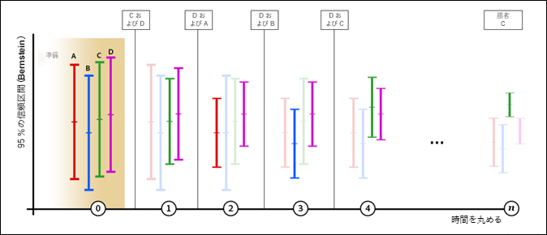

# 自動配分{#auto-allocate}

自動配分は、複数のエクスペリエンス間の勝者を識別し、その結果、テストが継続して実行して学習する間に、コンバージョンを増やすためのより多くのトラフィックを推奨結果に自動的に配分します。

>[!IMPORTANT]
>
>自動配分は、[!DNL Target for Analytics]（A4T）レポートをサポートしていません。

[3 ステップのガイドによるワークフローを使用して A/B アクティビティを作成する](../../c-activities/t-test-ab/t-test-create-ab/test-create-ab.md#task_68C8079BF9FF4625A3BD6680D554BB72)ときに、「[!UICONTROL 最良のエクスペリエンスに自動配分]」オプションを選択できます。

## 課題 {#section_85D5A03637204BACA75E19646162ACFF}

標準的な A/B テストには、固有のコストがあります。各エクスペリエンスのパフォーマンスを測定するためにトラフィックを費やす必要があり、分析を通じて勝者エクスペリエンスを見つけ出す必要があります。トラフィックの配分は、一部のエクスペリエンスが他よりもパフォーマンスに優れているとわかった後でも、固定されたままです。また、サンプルサイズの計算が複雑で、アクティビティは、勝者に対して働きかけられるようになる前に全コースを実行する必要があります。これをすべておこなった後でも、特定した勝者が真の勝者ではない可能性があります。

## 解決策: 自動配分 {#section_98388996F0584E15BF3A99C57EEB7629}

自動配分は、このコストおよび勝者エクスペリエンスの判別のオーバーヘッドを削減します。自動配分では、すべてのエクスペリエンスの目標指標パフォーマンスを監視し、パフォーマンスの高いエクスペリエンスに、パフォーマンスの高さに応じて多くの新規参加者を送ります。他のエクスペリエンスを調査するのに十分なトラフィックが予約されます。学習と平行してアクティビティの最適化を実行中であっても、結果に対するテストのメリットを確認できます。

自動配分は、アクティビティが終了して勝者が決まるまで待たずに、訪問者を徐々に勝者エクスペリエンスに近づけます。成功していないエクスペリエンスに送られたアクティビティ参加者は勝者エクスペリエンスの可能性を示しているので、より迅速に上昇するメリットが得られます。

Target の通常の A/B テストの場合、対抗と対照の一対比較しかできません。例えば、アクティビティにエクスペリエンス A、B、C および D がある場合（ここで、A は対照）、通常の Target A/B テストは、A 対 B、A 対 C および A 対 D を比較します。

このようなテストの場合、Target を含むほとんどの製品では、スチューデントの t 検定を使用して p 値ベースの信頼値を生成します。その後、この信頼値を使用して、対抗が対照と十分に異なるかどうかを特定します。ただし、Target は、「最良の」エクスペリエンスを見つけるために必要な暗黙の比較（B 対 C、B 対 D および C 対 D）を自動的に実行することはありません。その結果、マーケティング担当者は、「最良の」エクスペリエンスを判断するために結果を手動で分析する必要があります。

自動配分は、エクスペリエンス全体に対してすべての暗黙の比較を実行し、「真」の勝者を見つけます。このテストには「対照」エクスペリエンスという概念がありません。

自動配分は、最良のエクスペリエンスの信頼区間が他のエクスペリエンスの信頼区間と重複しなくなるまで、エクスペリエンスに新しい訪問者をインテリジェントに配分します。通常、このプロセスで偽陽性が生成される可能性がありますが、自動配分では、繰り返された評価を補正する[ベルンシュタインの不等式](https://en.wikipedia.org/wiki/Bernstein_inequalities_(probability_theory))に基づいた信頼区間が使用されます。この段階で、真の勝者が見つかります。自動配分が停止すると、ページに到達した訪問者に対して大きな時間依存性がないと、少なくとも95%の確率で、自動配分が勝者エクスペリエンスの真の応答を1%（相対的）未満のエクスペリエンスを返すエクスペリエンスが、少なくとも95%の確率で返されます。

## A/B テストや自動パーソナライゼーションに対して自動配分をいつ使用するか {#section_3F73B0818A634E4AAAA60A37B502BFF9}

* アクティビティを最初から最適化して、なるべく早く勝者エクスペリエンスを特定したい場合に、**自動配分**を使用します。パフォーマンスの高いエクスペリエンスをより頻繁に提供することで、アクティビティ全体のパフォーマンスを向上させます。
* サイトを最適化する前に、すべてのエクスペリエンスのパフォーマンスの特性を明らかにしたい場合に、標準的な **[A/B テスト](../../c-activities/t-test-ab/test-ab.md#task_05E33EB15C4D4459B5EAFF90A94A7977)**を使用します。自動トラフィック配分がパフォーマンスが最上位のエクスペリエンスを見つけてもパフォーマンスが低いものの間の差別化を保証しないのに対して、A/B テストは、すべてのエクスペリエンスをランク付けするのに役立ちます。
* 個別のプロファイル属性に基づいて予測を構築する機械学習モデルなど、最も複雑なアルゴリズムを最適化したい場合に、[Automated Personalization](../../c-activities/t-automated-personalization/automated-personalization.md#task_8AAF837796D74CF893CA2F88BA1491C9) を使用します。自動トラフィック配分は、（標準的な A/B テストのような）エクスペリエンスの集計行動に目を向け、訪問者を区別しません。

## 主要なメリット {#section_0913BF06F73C4794862561388BBDDFF0}

* A/B テストの正確性を保持する
* 統計的に有意な勝者を手動の A/B テストよりも早く見つける
* 手動の A/B テストよりも高い平均キャンペーン上昇率を提供する

## 用語 {#section_670F8785BA894745B43B6D4BFF953188}

自動配分の重要な用語を次に示します。

**マルチアームバンディット：**[マルチアームバンディット](https://en.wikipedia.org/wiki/Multi-armed_bandit)は、調査学習とその学習の活用のバランスを最適化するためのアプローチです。

## アルゴリズムの仕組み {#section_ADB69A1C7352462D98849F2918D4FF7B}

自動配分の背後にある全体的なロジックには、測定されたパフォーマンス（コンバージョン率など）と累積データの信頼区間が組み込まれています。トラフィックがエクスペリエンス間で均等に分割される標準的な A/B テストとは異なり、自動配分ではエクスペリエンス間でトラフィックの配分が変化します。

* 訪問者の 80％は、以下に説明するインテリジェントロジックを使用して配分されますを参照してください。
* 訪問者の 20％は、変化する訪問者の行動に対応するために、すべてのエクスペリエンスにランダムに配分されます。

マルチアームバンディットアプローチでは、パフォーマンスの良いエクスペリエンスを活用している間も、一部のエクスペリエンスを自由に調査できるようにしておきます。変化する状況に対応する能力を維持しながら、より多くの新規訪問者がパフォーマンスのより優れたエクスペリエンスに配置されます。最新のデータを反映するために、これらのモデルは少なくとも 1 時間に 1 回更新されます。

より多くの訪問者がアクティビティに入るにしたがって、一部のエクスペリエンスの成功率が向上し始め、より多くのトラフィックが成功エクスペリエンスに送られます。すべてのエクスペリエンスを調査するために、トラフィックの 20％が、引き続きランダムに配分されます。パフォーマンスの低いエクスペリエンスの 1 つのパフォーマンスが向上し始めると、そのエクスペリエンスに配分されるトラフィックが増えます。一方、パフォーマンスの高いアクティビティの成功率が低下すると、そのエクスペリエンスに配分されるトラフィックは少なくなります。例えば、あるイベントが原因で訪問者がサイト上で異なる情報を期待している場合と小売サイトで週末セールを期待している場合で、異なる結果が提供されます。

次の図に、4 つのエクスペリエンスを扱うテストでこのアルゴリズムがどのように実行されるかを示します。

この図は、明確な勝者が決定されるまで、複数ラウンドのアクティビティの有効期間にわたって各エクスペリエンスに配分されるトラフィックがどのように変化するかを示しています。

| ラウンド数 | 説明 |
|--- |--- |
|  | **ウォームアップラウンド（0）**: ウォームアップラウンドでは、アクティビティの各エクスペリエンスが最低1,000人の訪問者と50個のコンバージョンを持つまで、各エクスペリエンスのトラフィック配分が均等になります。<ul><li>エクスペリエンス A=25 ％</li><li>エクスペリエンス B=25 ％</li><li>エクスペリエンス C=25 ％</li><li>エクスペリエンス D=25 ％</li></ul>各エクスペリエンスで訪問者が 1,000 人、コンバージョンが 50 回に達すると、Target はトラフィックの自動配分を開始します。数ラウンドですべての配分が発生し、各ラウンドごとに 2 つのエクスペリエンスが選出されます。 次のラウンドに進むエクスペリエンスは2つのみです。DおよびCの 場合、次の2つのエクスペリエンスはトラフィックの80%を均等に配分しますが、他の2つのエクスペリエンスは引き続き参加しますが、新しい訪問者がアクティビティに入ると20%のランダムトラフィックの配分の一部としてのみ提供されます。 すべての配分は 1 時間ごとに更新されます（上記の x 軸のラウンド数で示されています）。各ラウンドの後、累積データが比較されます。 |
|  | **ラウンド1**: このラウンドでは、トラフィックの80%がエクスペリエンスCおよびD（それぞれ40%のエクスペリエンス）に配分されます。トラフィックの 20％がエクスペリエンス A、B、C および D にランダムに配分されます（5％ずつ）。このラウンドでは、エクスペリエンス A のパフォーマンスが優れています。<ul><li>アルゴリズムにより、（各アクティビティの垂直スケールの  が示しているように）コンバージョン率が最も高いという理由で、エクスペリエンス D が選出され、次のラウンドに進みます。</li><li>アルゴリズムにより、残りのエクスペリエンスでベルンシュタインの 95％信頼区間の上限が最も高いという理由で、エクスペリエンス A も選出され、次に進みます。</li></ul>エクスペリエンス D と A が次に進みます。 |
|  | **ラウンド2**: このラウンドでは、トラフィックの80%がエクスペリエンスAおよびD（それぞれ40%のエクスペリエンス）に配分されます。トラフィックの 20％がランダムに配分されます。つまり、エクスペリエンス A、B、C および D のそれぞれがトラフィックの 5％を獲得します。このラウンドでは、エクスペリエンス B のパフォーマンスが優れています。<ul><li>アルゴリズムにより、（各アクティビティの垂直スケールの  が示しているように）コンバージョン率が最も高いという理由で、エクスペリエンス D が選出され、次のラウンドに進みます。</li><li>アルゴリズムにより、残りのエクスペリエンスでベルンシュタインの 95％信頼区間の上限が最も高いという理由で、エクスペリエンス B も選出され、次に進みます。</li></ul>エクスペリエンス D と B が次に進みます。 |
|  | **ラウンド3**: このラウンドでは、トラフィックの80%がエクスペリエンスBとD（それぞれ40%のエクスペリエンス）に配分されます。トラフィックの 20％がランダムに配分されます。つまり、エクスペリエンス A、B、C および D のそれぞれがトラフィックの 5％を獲得します。このラウンドでは、エクスペリエンス D が引き続きパフォーマンスが優れ、エクスペリエンス C もパフォーマンスが優れています。<ul><li>アルゴリズムにより、（各アクティビティの垂直スケールの  が示しているように）コンバージョン率が最も高いという理由で、エクスペリエンス D が選出され、次のラウンドに進みます。</li><li>アルゴリズムにより、残りのエクスペリエンスでベルンシュタインの 95％信頼区間の上限が最も高いという理由で、エクスペリエンス C も選出され、次に進みます。</li></ul>エクスペリエンス D と C が次に進みます。 |
|  | **ラウンド4**: このラウンドでは、トラフィックの80%がエクスペリエンスCおよびD（それぞれ40%のエクスペリエンス）に配分されます。トラフィックの 20％がランダムに配分されます。つまり、エクスペリエンス A、B、C および D のそれぞれがトラフィックの 5％を獲得します。このラウンドでは、エクスペリエンス C のパフォーマンスが優れています。<ul><li>アルゴリズムにより、（各アクティビティの垂直スケールの が示しているように）コンバージョン率が最も高いという理由で、エクスペリエンス C が選出され、次のラウンドに進みます。</li><li>アルゴリズムにより、残りのエクスペリエンスでベルンシュタインの 95％信頼区間の上限が最も高いという理由で、エクスペリエンス D も選出され、次に進みます。</li></ul>エクスペリエンス C と D が次に進みます。 |
|  | **ラウンド n**：アクティビティが進むにつれて、パフォーマンスの高いエクスペリエンスが現れ始め、勝者エクスペリエンスが現れるまでプロセスが継続されます。コンバージョン率が最高のエクスペリエンスの信頼区間が他のエクスペリエンスの信頼区間と重複しない場合、そのエクスペリエンスは勝者としてラベル付けされ、[アクティビティのページとアクティビティリストにバッジが表示](/help/c-activities/automated-traffic-allocation/determine-winner.md)されます。<ul><li>アルゴリズムにより、エクスペリエンス C が明確な勝者として選出されます</li></ul>この時点で、アルゴリズムにより、トラフィックの 80％がエクスペリエンス C に配分され、トラフィックの 20％が、引き続きすべてのエクスペリエンス（A、B、C および D）にランダムに配分されます。後継で、C はトラフィックの 85％を獲得します。万一、勝者の信頼区間が再び重複し始めた場合、アルゴリズムにより、前述のラウンド 4 の動作に戻されます。 **重要**: プロセスの前の推奨結果を手動で選択すると、誤ったエクスペリエンスを選択できます。このため、アルゴリズムが勝者エクスペリエンスを決定するまで待つことをお勧めします。 |

アクティビティに 2 つのエクスペリエンスしかない場合、Target が 90％の信頼性のエクスペリエンスを見つけるまでは、両方が均等のトラフィックを得ます。見つけた時点で、トラフィックの 70％が勝者に、30％が敗者に配分されます。エクスペリエンスが 95％の信頼性に達した後は、トラフィックの 100％が勝者に、0％が敗者に配分されます。

自動配分アクティビティのモデルが準備できる（各エクスペリエンスに 1,000 人以上の訪問者と 50 回以上のコンバージョンがある）と、UI からの以下の操作は許可されなくなります。

* 「トラフィック配分」モードから「手動」への切り替え
* 目標指標タイプの変更
* 「詳細設定」パネルでのオプションの変更

## 注意事項 {#section_5C83F89F85C14FD181930AA420435E1D}

**自動配分 A/B アクティビティは、Analytics for Target（A4T）ではサポートされなくなる。**

Target 16.10.1.0 リリース（2016 年 10 月 26 日）では、自動配分 A/B アクティビティのレポートソースとして Analytics をサポートしません。A4T が有効なすべてのアクティブな自動配分 A/B アクティビティは、手動モード（同一のトラフィックの配分）に切り替わります。

**自動配分機能は、詳細指標設定の 1 つ（「カウントを増分、アクティビティでユーザーを保持」）でのみ利用できる。**

「カウントを増分、ユーザーをリリース、再入場を許可」および「カウントを増分、ユーザーをリリース、再入場を許可しない」の詳細指標設定はサポートされていません。

**頻繁な再訪問者は、エクスペリエンスのコンバージョン率を水増しさせる可能性がある。**

エクスペリエンス A を表示した訪問者が頻繁に再訪し、複数回のコンバージョンをおこなうと、エクスペリエンス A のコンバージョン率（CR）は、人為的に増加します。これを、訪問者はコンバージョンをおこないますが、頻繁には再訪しないエクスペリエンス B と比較します。結果として、A の CR は B の CR よりも優れているように見えるので、新規訪問者は、B よりも A に配分されるようになります。参加者あたり 1 回のみカウントすることを選択すると、A の CR と B の CR は同じになるかもしれません。

再訪問者がランダムに配分されると、そのコンバージョン率への影響は、より安定する傾向があります。この効果を軽減させるには、目標指標のカウント方法を参加者あたり 1 回のみに変更することを検討します。

**パフォーマンスの低いものからではなく、パフォーマンスの高いものから区別する。**

自動配分は、パフォーマンスの高いエクスペリエンスの間で区別する（そして勝者を見つける）のが得意です。パフォーマンスの低いエクスペリエンスの間での十分な区別がないこともあり得ます。

すべてのエクスペリエンスで統計的に有意な区別をつけたい場合は、手動のトラフィック配分モードの使用を検討してください。

**時間相関のある（または文脈が変化する）コンバージョン率は、配分量をゆがめる可能性がある。**

すべてのエクスペリエンスに等しく影響するので、標準的な A/B テストの間無視できる要因は、自動配分テストでは無視できません。そのアルゴリズムは、観測されたコンバージョン率に敏感です。次に、エクスペリエンスのパフォーマンスに不平等に影響する可能性のある要因の例を示します。

* 文脈（時間、場所、性別など）の関連性が変化するエクスペリエンス。

   次に例を示します。

   * 「花の金曜日」は、金曜日に高いコンバージョンをもたらす
   * 「月曜日からジャンプスタート」は、月曜日にコンバージョンが高くなる
   * 「東海岸の冬に備える」は、東海岸または冬が過酷な場所でコンバージョンが高くなる

A/B テストはより長い期間にわたって結果を分析するので、これらは、A/B テストに比べて自動配分テストの結果をゆがめる可能性があります。

* おそらくメッセージの緊急性のために、コンバージョンの遅延が変化するエクスペリエンス。

   例えば、「30％セールは本日限り」は、訪問者に本日コンバージョンさせるきっかけになりますが、「初回購入は 50％オフ」は、緊急性において同じ感覚を生みません。

## よくある質問 {#section_0E72C1D72DE74F589F965D4B1763E5C3}

**再訪問者は、自動的にパフォーマンスの高いエクスペリエンスに再配分されますか？**

いいえ。新規訪問者のみが自動的に配分されます。再訪問者には、引き続き元のエクスペリエンスが表示されます。これにより、A/B テストの正当性を保護します。

**アルゴリズムでは、偽陽性をどのように扱いますか？**

勝者バッジが表示されるまで待った場合、アルゴリズムは 95 ％の信頼性または 5 ％の偽陽性率を保証します。

**自動配分では、トラフィックの配分をいつ開始しますか？**

アクティビティのすべてのエクスペリエンスに 1,000 人以上の訪問者と 50 回以上のコンバージョンがあれば、アルゴリズムが機能し始めます。

**アルゴリズムは、どれくらい積極的に活用しますか？**

トラフィックの 80％は自動配分を使用して配分され、トラフィックの 20％はランダムに配分されます。勝者が特定されると、トラフィックの 80％すべてが勝者に配分され、20％の一部が勝者エクスペリエンスを含むすべてのエクスペリエンスに引き続き配分されます。

**そもそも失敗エクスペリエンスは表示されますか？**

はい。マルチアームバンディットでは、すべてのエクスペリエンスにわたる変更のパターンまたはコンバージョン率を調査するために、トラフィックの少なくとも 20 ％が予約されます。

**長時間のコンバージョンの遅延があるアクティビティはどうなりますか？**

最適化されたすべてのエクスペリエンスが同じ遅延に直面する限り、動作は、より高速なコンバージョンサイクルのアクティビティと同じです（ただし、50 回のコンバージョンのしきい値に到達してトラフィック配分プロセスが開始するまでにより多くの時間がかかります）。

**自動配分と自動パーソナライゼーションの違いは何ですか？**

自動パーソナライゼーションは、各訪問者のプロファイル属性を使用して、最良のエクスペリエンスを判定します。その際に、そのユーザーのアクティビティを最適化するだけでなく、パーソナライズします。

一方、自動配分は、集計の勝者を提示する A/B テストです（最も一般的なエクスペリエンスですが、必ずしも各訪問者にとって最も効果的なエクスペリエンスとは限りません）。

**再訪問者は、成功指標のコンバージョン率を水増しさせますか？**

現時点では、ロジックは、すぐにコンバージョンをおこなう訪問者やより頻繁な訪問に有利に働きます。これは、そうした訪問者が、その属するエクスペリエンスの全体的なコンバージョン率を一時的に水増しさせるためです。アルゴリズム自体は頻繁に調整されるので、コンバージョン率の増加は、各スナップショットで増幅されます。サイトに多くの再訪問者が来ると、そのコンバージョンは、潜在的にその属するエクスペリエンスの全体的なコンバージョン率を水増しさせる可能性があります。再訪問者がランダムに配分される可能性は高く、この場合、集計の効果（増加した上昇率）は安定します。この効果を軽減させるには、成功指標のカウント方法を参加者あたり 1 回のみに変更することを検討します。

**自動配分を使用して、勝者を特定するためにアクティビティが実行される時間を見積もる際に、サンプルサイズ計算ツールを使用できますか。**

テストの実行時間を見積もるためにボンフェローニ補正を適切に適用すれば、既存の[サンプルサイズ計算ツール](https://docs.adobe.com/content/target-microsite/testcalculator.html)を使用できます。実験では、自動配分アクティビティは、このサンプルサイズよりもずっと早く終了しました。

**自動配分アクティビティからパフォーマンスの低いエクスペリエンスを削除するには、勝者を決定するプロセスを迅速に行う必要がありますか。**

パフォーマンスの低いエクスペリエンスを削除する理由は本当にありません。自動配分はパフォーマンスの高いエクスペリエンスをより頻繁に提供し、パフォーマンスの低いエクスペリエンスをあまり頻繁に提供しません。パフォーマンスの劣るエクスペリエンスをアクティビティに残すと、勝者を決定する速度に大きく影響しません。

訪問者の20%は、すべてのエクスペリエンスにランダムに配分されます。パフォーマンスの低いエクスペリエンスに提供されるトラフィックの量は最小（20%をエクスペリエンス数で割った値）です。

## トレーニングビデオ {#section_893E5B36DC4A415C9B1D287F51FCCB83}

以下のビデオでは、この記事で説明する概念について詳しく説明しています。

### アクティビティワークフロー - ターゲット設定（2:14）

このビデオには、トラフィック配分の設定に関する情報が含まれています。

* オーディエンスのアクティビティへの割り当て
* トラフィックの増減調整
* トラフィック配分方法の選択
* 様々なエクスペリエンスへのトラフィック配分

>[!VIDEO](https://video.tv.adobe.com/v/17385)

### A/B テストの作成（8:36）

このビデオでは、Target で 3 ステップのガイドによるワークフローを使用して A/B テストを作成する方法を説明します。自動トラフィック配分の説明は、4:45 から始まります。

* Adobe Target での A/B アクティビティの作成
* 手動分割または自動トラフィック配分によるトラフィックの配分

>[!VIDEO](https://video.tv.adobe.com/v/17391)