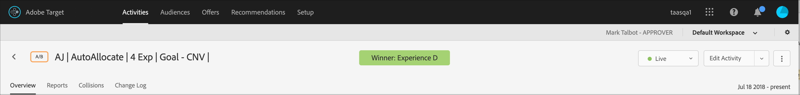

# 自動配分レポートの解釈 {#determine-a-winner}

自動配分A/Bアクティビティの結果を解釈するには、ターゲットUIの上昇率や信頼性など、重要な指標を調べます。

多くのマーケティング担当者は、計算結果によって明確な勝者が示される前に、勝者エクスペリエンスを早めに宣言してしまうというミスを犯します。そこで、勝者を簡単に特定できるようにしました。

>[!NOTE]
>
>推奨結果の宣言に関する一般的な情報については、 [10件の一般的なA/Bテストの落とし穴とそれらを回避する方法を参照してください](/help/c-activities/t-test-ab/common-ab-testing-pitfalls.md)。

## 勝者エクスペリエンスの特定 {#section_24007470CF5B4D30A06610CE8DD23CE3}

[!UICONTROL 自動配分]機能を使用すると、[!DNL Target] は、アクティビティが十分な信頼性のあるコンバージョンの最低数に達するまで、アクティビティのページの最上部に「まだ勝者がありません」ということを示すバッジを表示します。

明らかな勝者が宣言されると、[!DNL Target] は、「勝者：エクスペリエンス X」と表示します。

>[!NOTE]
>
>自動配分アクティビティは、対照との一対比較だけでなく、すべてのオプションの中で最高のエクスペリエンスを見つけるように設計されています。

## Statistical guarantees of Auto-Allocate {#section_7AF3B93E90BA4B80BC9FC4783B6A389C}

自動配分は、A/B アクティビティの終了時に、決定された勝者の有効な偽陽性率が 5 ％であることを保証します。これはその時点のみの 5 ％を意味し、決定された勝者が実際にアクティビティのすべてのエクスペリエンスの中で最高のエクスペリエンスというわけではありません。（同一のエクスペリエンスでの）A/A テストの場合、その時点の 5％未満でテストを終了します。（同一のエクスペリエンスでの）A/A テストに対して期待される動作は無期限に実行されることであるので、勝者バッジは決して表示されません。

自動配分では p 値ベースの信頼値を使用しません。

自動配分アクティビティの信頼性列（下図参照）には、あるエクスペリエンスが 1％以内の誤差で勝者になる確率が表示されます（つまり、このアルゴリズムは最高のコンバージョン率と 2 番目のコンバージョン率の間で検出可能な影響の最小値である 1％を使用します）。アルゴリズムは、[ベルンシュタインの不等式](https://en.wikipedia.org/wiki/Bernstein_inequalities_(probability_theory))を使用してこの確率を計算することに注意してください。

通常の A/B テストは、p 値に基づいて信頼性を計算します。自動配分は、p 値を使用しません。p 値は、特定のエクスペリエンスが対照と異なる確率を「おおまかに」計算します。これらの p 値は、エクスペリエンスが対照と異なるかどうかを判定するためにのみ使用できます。これらの値は、エクスペリエンスが（対照ではない）他のエクスペリエンスと異なるかどうかを判定するためには使用できません。

>[!IMPORTANT]
>
>ターゲットは、事前に定義された最小コンバージョン数の後に勝者を表示します。ただし、推奨結果を決定する最終的な決定は、常にAdobe Targetの [サンプルサイズ計算ツールの結果に従う必要があります](https://docs.adobe.com/content/target-microsite/testcalculator.html)。 ターゲットは、サイトの基本コンバージョン率や、アクティビティの期間を決定するために計算ツールに入力されるその他の重要な側面については考慮しません。 その結果、ターゲットは、最小限のコンバージョン数に基づいて、保証されるよりも早く勝者を表示する場合があります。 詳しくは、「 [サンプルサイズ計算ツール](/help/c-activities/t-test-ab/sample-size-determination.md#section_6B8725BD704C4AFE939EF2A6B6E834E6)」を参照してください。

## 自動配分アクティビティの上昇率と信頼性のレポートを理解します。 {#lift-confidence}

自動配分アクティビティでは、最初のエクスペリエンス（デフォルトの名前はエクスペリエンスA）が、常に「レポート」タブの「コントロール」エクスペリエンスとして定義されます。 このエクスペリエンスは、エクスペリエンスのパフォーマンスの判定に使用されるモデリングでの真の統計制御として扱われませんが、レポート内の一部の指標に対する参照またはベースラインとして扱われます。

「上昇率」の数値および各エクスペリエンスの95%の境界は、常に、定義された「コントロール」エクスペリエンスを参照して計算されます。 定義された「コントロール」エクスペリエンスは、それ自体に対する上昇を持つことができないので、このエクスペリエンスに対して空の「 — 」値がレポートされます。 A/Bテストとは異なり、自動配分テストでは、エクスペリエンスのパフォーマンスが定義済みのコントロールよりも低い場合、負の上昇率値はレポートされません。代わりに、「 — 」が表示されます。

表示される信頼区間バーは、エクスペリエンスのコンバージョン率の予測の平均値を中心に、95%の信頼区間を表します。 これらも、定義された「コントロール」エクスペリエンスに応じて色分けされます。 「コントロール」エクスペリエンスのバーは、常に灰色で表示されます。 「コントロール」エクスペリエンスの信頼区間より下の信頼区間の部分は赤色で表示され、「コントロール」エクスペリエンスより上の信頼区間の部分は緑色で表示されます。

最上位のエクスペリエンスの95%の信頼区間が他のエクスペリエンスと重複しない場合、勝者が見つかります。 勝者エクスペリエンスは、エクスペリエンス名の左側に緑の星バッジが表示され、「勝者」バナーに表示されます。 星が表示されない場合、バナーには「まだ勝者がありません」と表示され、勝者がまだ見つかりません。

「信頼性」の数値も、現在のリーディングエクスペリエンスまたは勝者エクスペリエンスの横にレポートされます。 この数値は、最上位のエクスペリエンスの信頼性が60%以上に達するまでのみレポートされます。 自動配分テストで2つのエクスペリエンスが存在する場合、この数値は、そのエクスペリエンスのパフォーマンスが他のエクスペリエンスよりも優れているという信頼性レベルを表します。 自動配分テストで3つ以上のエクスペリエンスが存在する場合、この数値は、定義された「コントロール」エクスペリエンスよりもエクスペリエンスのパフォーマンスが優れている信頼性レベルを表します。 「コントロール」エクスペリエンスが勝っている場合は、「信頼性」の数値はレポートされません。

## よくある質問 {#section_C8E068512A93458D8C006760B1C0B6A2}

**アクティビティに入って数日が経過しました。すべての信頼性の値が 0％のままなのはなぜですか。**

レポートですべてのアクティビティの[!UICONTROL 信頼性]列に 0％と表示される理由は、次のうちのいずれかです。

* 手動の A/B テストと自動配分は、異なる統計を使用して信頼性の値を表示します。

   手動の A/B テストは、[スチューデントの t 検定](https://en.wikipedia.org/wiki/Student%27s_t-test)に基づく p 値を使用します。p 値は、実際にはそのような違いはないと仮定すると、エクスペリエンスと対照の観測された（またはより極端な）違いの確率です。これらの p 値は、観測データが、同じ特定のエクスペリエンスおよび対照と一致するかどうかを判定するためにのみ使用できます。これらの値は、エクスペリエンスが（対照ではない）他のエクスペリエンスと異なるかどうかを判定するためには使用できません。

   自動配分は、特定のエクスペリエンスがアクティビティのすべてのエクスペリエンスにわたる真の勝者になる確率を示します。これは、勝者エクスペリエンス（勝者になる可能性が最も高い）のみが、ゼロ以外の信頼性の値を持つことを意味します。その他すべては、敗者になる可能性が最も高く、0％と表示されます。

* 自動配分は、勝者エクスペリエンスが 60％の信頼性を集めた後にのみ、信頼性を表示し始めます。これらの信頼性レベルは、通常のA/Bテストが完了するまでの約半分の時間に出現します（ただし、これは保証されていません）。 To determine how long a normal A/B test would run, please use a [sample size calculator](https://docs.adobe.com/content/target-microsite/testcalculator.html): plug control&#39;s conversion-rate in &quot;Baseline conversion rate,&quot; &quot;5%&quot; for &quot;Lift,&quot; and 95% for &quot;Confidence.&quot; 通常、信頼性は、各エクスペリエンスがエクスペリエンスごとに必要なサンプルの少なくとも 50％ を蓄積した後に表示し始めます。これによって、信頼性が表示され始めるタイミングを把握できます。
* レポートがボード全体で 0％を表示している場合、アクティビティに入るのが早すぎた可能性があります。

