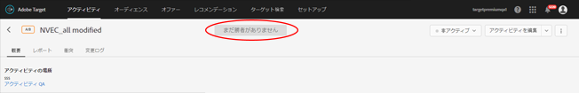
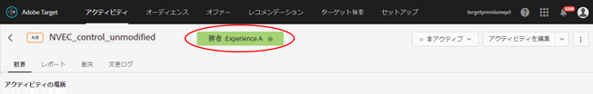
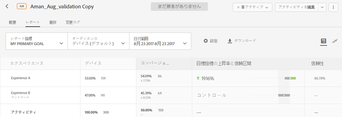
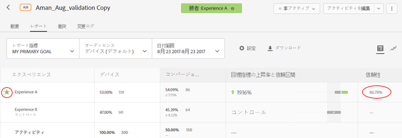

# 勝者の特定{#determine-a-winner}

自動配分の A/B アクティビティの勝者を特定するには、Target UI の表示を確認します。

多くのマーケティング担当者は、計算結果によって明確な勝者が示される前に、勝者エクスペリエンスを早めに宣言してしまうというミスを犯します。そこで、勝者を簡単に特定できるようにしました。

## Target UI に勝者バッジを表示 {#section_24007470CF5B4D30A06610CE8DD23CE3}

[!UICONTROL 自動配分]機能を使用すると、[!DNL Target] は、アクティビティが十分な信頼性のあるコンバージョンの最低数に達するまで、アクティビティのページの最上部に「まだ勝者がありません」ということを示すバッジを表示します。

明らかな勝者が宣言されると、[!DNL Target] は、「勝者：エクスペリエンス X」と表示します。

>[!NOTE]
>
>自動配分アクティビティは、対照との一対比較だけでなく、すべてのオプションの中で最高のエクスペリエンスを見つけるように設計されています。

## 自動配分の統計的保証 {#section_7AF3B93E90BA4B80BC9FC4783B6A389C}

自動配分は、A/B アクティビティの終了時に、決定された勝者の有効な偽陽性率が 5 ％であることを保証します。これはその時点のみの 5 ％を意味し、決定された勝者が実際にアクティビティのすべてのエクスペリエンスの中で最高のエクスペリエンスというわけではありません。（同一のエクスペリエンスでの）A/A テストの場合、その時点の 5％未満でテストを終了します。（同一のエクスペリエンスでの）A/A テストに対して期待される動作は無期限に実行されることであるので、勝者バッジは決して表示されません。

自動配分では p 値ベースの信頼値を使用しません。

自動配分アクティビティの信頼性列（下図参照）には、あるエクスペリエンスが 1％以内の誤差で勝者になる確率が表示されます（つまり、このアルゴリズムは最高のコンバージョン率と 2 番目のコンバージョン率の間で検出可能な影響の最小値である 1％を使用します）。アルゴリズムは、[ベルンシュタインの不等式](https://en.wikipedia.org/wiki/Bernstein_inequalities_(probability_theory))を使用してこの確率を計算することに注意してください。

通常の A/B テストは、p 値に基づいて信頼性を計算します。自動配分は、p 値を使用しません。p 値は、特定のエクスペリエンスが対照と異なる確率を「おおまかに」計算します。これらの p 値は、エクスペリエンスが対照と異なるかどうかを判定するためにのみ使用できます。これらの値は、エクスペリエンスが（対照ではない）他のエクスペリエンスと異なるかどうかを判定するためには使用できません。

次の図は、まだ勝者がいないアクティビティを示しています。

次の図は、勝者がいるアクティビティを示しています。

## よくある質問 {#section_C8E068512A93458D8C006760B1C0B6A2}

**アクティビティに入って数日が経過しました。すべての信頼性の値が 0％のままなのはなぜですか。**

レポートですべてのアクティビティの[!UICONTROL 信頼性]列に 0％と表示される理由は、次のうちのいずれかです。

* 手動の A/B テストと自動配分は、異なる統計を使用して信頼性の値を表示します。

   手動の A/B テストは、[スチューデントの t 検定](https://en.wikipedia.org/wiki/Student%27s_t-test)に基づく p 値を使用します。p 値は、特定のエクスペリエンスが対照と異なる確率を計算します。これらの p 値は、エクスペリエンスが対照と異なるかどうかを判定するためにのみ使用できます。これらの値は、エクスペリエンスが（対照ではない）他のエクスペリエンスと異なるかどうかを判定するためには使用できません。

   自動配分は、特定のエクスペリエンスがアクティビティのすべてのエクスペリエンスにわたる真の勝者になる確率を示します。これは、勝者エクスペリエンス（勝者になる可能性が最も高い）のみが、ゼロ以外の信頼性の値を持つことを意味します。その他すべては、敗者になる可能性が最も高く、0％と表示されます。

* 自動配分は、勝者エクスペリエンスが 60％の信頼性を集めた後にのみ、信頼性を表示し始めます。自動配分は、通常の A/B テストの約 2 倍高速です。通常の A/B テストが実行されるのにどれくらい時間がかかるかを判断するには、[サンプルサイズ計算ツール](https://docs.adobe.com/content/target-microsite/testcalculator.html)を使用して、対照のコンバージョン率を「ベースラインコンバージョン率」に、5％ を「上昇率」に、95％ を「信頼性」に代入してください。通常、信頼性は、各エクスペリエンスがエクスペリエンスごとに必要なサンプルの少なくとも 50％ を蓄積した後に表示し始めます。これによって、信頼性が表示され始めるタイミングを把握できます。
* レポートがボード全体で 0％を表示している場合、アクティビティに入るのが早すぎた可能性があります。

