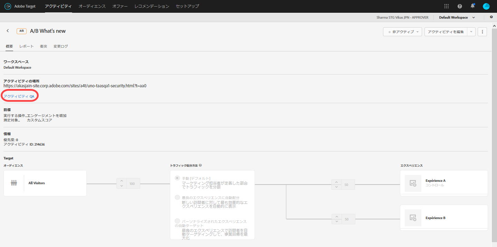
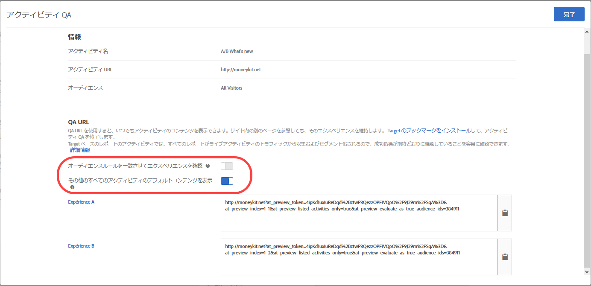

# アクティビティ QA{#activity-qa}

QA URL を利用すると、変更されないプレビューリンク、オプションのオーディエンスのターゲット設定、実際のアクティビティデータとは別に保持されている QA レポートを使用して、簡単なエンドツーエンドのアクティビティ QA を実行できます。

## 概要 {#section_11B761A522A14E61978275772210A4C2}

アクティビティ QA では、ライブになる前に Target アクティビティを詳細にテストできます。アクティビティ QA の機能は次のとおりです。

* エクスペリエンスやアクティビティが更新されても変更されることがなく、再生成の必要がないリンクをチームのメンバーと共有できるの呼び出しの後におこなわれる場合です。これにより、ユーザーの遍歴全体でアクティビティを完全にテストできます。
* 考慮するオーディエンス条件を任意で選択できるので、マーケティング担当者は、オーディエンス条件を満たさなくてもターゲット条件をテストしたり無視したりして、エクスペリエンスのデザインの QA をおこなえる.
* QAレポートをキャプチャすると、マーケティング担当者は指標が期待どおりに増分され、QAレポートデータが実稼動レポートとは別に維持されることを確認できます（A4Tレポート以外）。
* エクスペリエンスを別個にプレビューすることや、配信条件（ページ／mbox／オーディエンス）を満たす他の実際のアクティビティと共にプレビューすることができる。
* ユーザの遍歴全体をQAする能力。QA リンクを使用してサイトに 1 回アクセスすれば、アクティビティ QA 内でサイト全体を閲覧することができます。セッションを終了するか、[QA Target ブックマークレット](../../c-activities/c-activity-qa/activity-qa-bookmark.md#concept_A8A3551A4B5342079AFEED5ECF93E879)を使用してアクティビティ QA から強制的に離脱しない限り、アクティビティ QA 内にとどまります。この機能は、複数の Web ページにわたるアクティビティがある場合に特に便利です。

## QA URL へのアクセスおよび共有 {#section_1C59BAA247B247BDB125D1BE8EAD4547}

1. アクティビティの[!UICONTROL 概要]ページ（Automated Personalization を除くすべてのタイプ）で「**[!UICONTROL アクティビティ QA]」リンクをクリックします。**

   

1. 以下の設定を指定します。

   

   * **オーディエンスルールを一致させてエクスペリエンスを確認**：オーディエンスの一致を機能させたいときもあれば、アクティビティのデザインをチェックしたいだけのときもあります。この設定を「オン」にすると、ターゲット条件を満たすテスターのみがエクスペリエンスの表示対象になります。エクスペリエンスのターゲット設定（XT）アクティビティでは、単一のアクティビティ URL が提供されます。表示されるエクスペリエンスは、ユーザーがどのターゲットルールに一致するかによって決まります。

      この設定を「オフ」にした場合は、ユーザーがリンクをクリックすると、ルールに一致するかどうかに関係なく、エクスペリエンスが表示されます。QA を実行する際は、このオーディエンスのターゲット設定を考慮するかしないかを切り替えることができます。

   * **その他のすべてのアクティビティのデフォルトコンテンツを表示：**このオプションを「オン」に切り替えた場合、他のすべてのアクティビティにデフォルトコンテンツが表示されます（例えば、同じページ／mbox 上の他のすべての実際のアクティビティが考慮されることなく、プレビューが別個に表示されます）。

      「オフ」にした場合は、以下の点を考慮します。

      * テスト対象のアクティビティとその他のライブアクティビティとの間で衝突が発生する場合は、[通常の優先順位ルール](../../c-activities/priority.md#concept_1780C11FEA57440499F0047DD6900E0F)が適用されます。そのため、QA を実施したいアクティビティが表示されない場合もあります。
      * 指標は表示されたアクティビティについて増分しますが、それは QA レポートの環境内のみです。

1. 「**[!UICONTROL 完了]」をクリックして変更を保存します。**
1. アクティビティリンクの URL をチームのメンバーと共有し、テストを実施します。

   アクティビティリンクは有効期限がないので、アクティビティまたはエクスペリエンスに変更を加えた場合でも再送信は不要です。ただし、単にアクティビティを編集したのではなく、オーディエンスライブラリから違うオーディエンスを適用した場合は、新しいリンクが生成されるので、共有し直す必要があります。

   それぞれのアクティビティリンクの URL（Exp A、Exp B など）をクリックすることで、対応するエクスペリエンスからのユーザージャーニーを開始できます。特定のエクスペリエンス用に生成された URL をクリックしてから、通常どおりサイトを閲覧し、様々なページ（複数のページがある場合）でエクスペリエンスを表示できます。エクスペリエンスごとに URL が 1 つだけ生成されます。テンプレートのテストや複数ページのテストなど、複数のページにまたがるエクスペリエンスの場合でもそれは同様です。アクティビティ QA は固定式なので、サイト内を移動して他のページを表示できます。

1. アクティビティリンク URL から生成されたレポートを表示するには、アクティビティの「**[!UICONTROL レポート]**」ページをクリックし、「**[!UICONTROL 設定]**」アイコン（）をクリックして、「**[!UICONTROL 環境]**」ドロップダウンリストから「**[!UICONTROL QA モード]**」を選択します。

## 注意点 {#section_B256EDD7BFEC4A6DA72A8A6ABD196D78}

* 自動パーソナライゼーション（AP）を除くすべてのアクティビティタイプの[!UICONTROL 概要]ページに「[!UICONTROL アクティビティ QA]」リンクが表示されます。AP アクティビティでは、[プレビューリンク](../../c-activities/t-automated-personalization/experience-preview.md#task_586C6655A6FD4AF08F5678FC3F481EFC)を使用できます。
* アクティビティ QA URL は、Analytics がレポートソースに設定されている（A4T）アクティビティで使用できます。アクティビティ QA を使用した QA の実行中に生成されたヒットは、アクティビティがライブになった後でも、アクティビティのデータが渡されるのと同じレポートスイートに渡されます。
* アクティビティ QA は、アーカイブされたアクティビティまたは終了日を過ぎたアクティビティに対してコンテンツを表示しません。終了したアクティビティを非アクティブ化した場合、アクティビティ QA が動作するためにはアクティビティを再度保存する必要があります。
* Target Classic などから Target Standard/Premium にインポートされたアクティビティでは、QA URL は利用できません。
* 自動配分、自動ターゲットおよび Recommendations アクティビティでは、アクティビティ QA で記録された訪問によってモデルに影響が及ぶことはありません。
* アクティビティ QA は固定式なので、アクティビティ QA で Web サイトを閲覧した後、通常の訪問者と同じようにサイトを閲覧できるようにするには、Target のセッションの期限が切れるか、アクティビティ QA から離脱するよう Target を設定する必要があります。アクティビティ QA から強制的に離脱するには、[Target QA ブックマークレット](../../c-activities/c-activity-qa/activity-qa-bookmark.md#concept_A8A3551A4B5342079AFEED5ECF93E879)を使用します。

   また、空の値（など）を `at_preview_token` 使用してサイト上のページを読み込むことで、手動で自分を除外 `https://www.mysite.com/?at_preview_token=`することもできます。

* &quot;URLが」を指定して、Visual Experience [Composerのフォームベースのコンポーザー](../../c-experiences/form-experience-composer.md#task_FAC842A6535045B68B4C1AD3E657E56E) または [ページ配信オプションでアクティビティの絞り込みを作成した場合、](../../c-experiences/c-visual-experience-composer/viztarget-options.md#reference_3BD1BEEAFA584A749ED2D08F14732E81) アクティビティQAはURLパラメーターを追加するので、QA URLは機能しません。この問題に対処するには、QA URL をクリックしてサイトに移動し、追加されたパラメーターを URL から削除してから新しい URL を読み込みます。
* Safari ブラウザーの場合、アクティビティ QA を正常に機能させるためにはサードパーティ Cookie を有効にする必要があります。
* アクティビティで複数のエクスペリエンスオーディエンス（例えば、同じアクティビティに含まれる米国や英国のサイト）が使用されている場合、4つの組み合わせ（エクスペリエンスA/USサイト、エクスペリエンスA/英国サイト、エクスペリエンスB/USサイト、エクスペリエンスB/英国サイト）用にQAリンクが生成されません。エクスペリエンス A とエクスペリエンス B に対する 2 つだけが生成されます。オーディエンス条件を満たすユーザーにのみ、該当のページが表示されます。英国の QA ユーザーには、米国サイトは表示されません。
* `at_preview` すべてのパラメーターと値は、既にURLエンコードされています。ほとんどの場合は、すべてが期待どおりに動作します。しかし、お客様によっては、クエリ文字列パラメーターを再度エンコードしようとするロードバランサーまたは Web サーバーが配置されている場合があります。

   Target では、`at_preview_token` をデコードしようとするときに、この二重エンコードが原因で正しいトークンの値を抽出できないので、プレビューが正常に機能しません。

   これらの値が変換されないように、IT チームに相談してすべてのプレビューパラメーターをホワイトリストに登録することをお勧めします。

   次の表に、ドメイン内でホワイトリストに入れることができるパラメーターを示します。

   | パラメーター | タイプ | 値 | 説明 |
   |--- |--- |--- |--- |
   | `at_preview_token` | 暗号化された文字列 | 必須、デフォルト値なし | QA モードで実行できるキャンペーン ID のリストを含む、暗号化されたエンティティです。 |
   | `at_preview_index` | 文字列 | 空 | パラメータの形式 `<campaignIndex>` または `<campaignIndex>_< experienceIndex>` 両方のインデックスは1から始まります。 |
   | `at_preview_listed_activities_only` | ブール値（true／false） | デフォルト値：false | &quot;true&quot;の場合、 `at_preview_index` パラメーターで指定されているすべてのキャンペーンが処理されます。 「false」の場合、プレビュートークンで指定されていない場合でも、ページのすべてのキャンペーンが処理されます。 |
   | `at_preview_evaluate_as_true_audience_ids` | 文字列 | 空 | mbox リクエストの範囲内で（ターゲットおよびレポートレベルで）常に「true」として評価される必要がある、アンダースコア（_）で区切られた SegmentId のリストです。 |
   | `_AT_Debug` | 文字列 | ウィンドウまたはコンソール | コンソールログまたは新規ウィンドウです。 |
   | `adobe_mc_ref` | デフォルトのページの参照 URL を新しいページに渡します。バージョン2.1以降で `AppMeasurement.js` 使用する場合、このパラメーター値 [!DNL Adobe Analytics] を新しいページの参照URLとして使用します。 |
   | `adobe_mc_sdid` | [!DNL Supplemental Data Id] [!DNL Experience Cloud Org Id] (SDID) およびAnalytics for Target（A4T）を新しいページに渡し、デフォルトページでTargetリクエストを「ステッチ」して、新しいページでのAnalyticsリクエストを実行します。 |

* Target QAモードUIは、複数ページアクティビティのエクスペリエンスの最初のURLのみを表示します。その前提は、旅行テストを作成し、URL1からURL2に移動することです。ただし、URL2に対して個別にアクセスする場合は、URL1に対して提供されているすべてのURLパラメーターをコピーして、&quot;?&quot;を配置した後URL2に適用します。URL1に表示されますが、