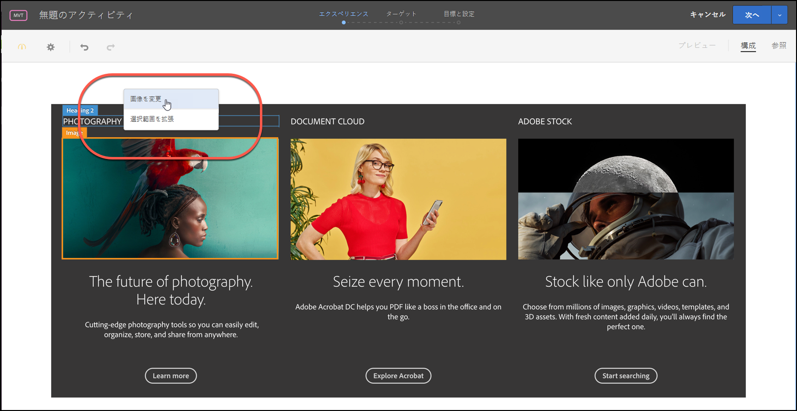
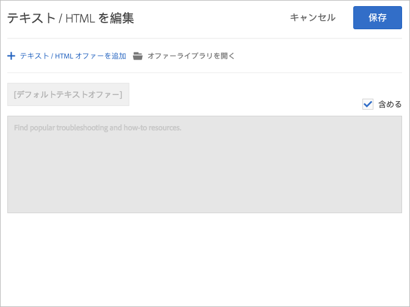

# 組み合わせの作成{#create-combinations}

Visual Experience Composer を使用して、テストに組み込むオファーを作成します。

>[!NOTE]
>
>ページ上のオブジェクトを選択するときに「**[!UICONTROL 選択範囲を拡張]**」をクリックすると、選択した要素に加えて親要素を選択できます。親要素を選択しているときは、その要素のすべての子が自動的に選択されます。選択の拡張は繰り返し実行できます。

Visual Experience Composer では、オファー、オファー名および場所名を編集できます。変更した場所を示すオーバーレイが表示されます。

## 画像オファー {#section_A48333211DB149ED926AE467D0032914}

複数の画像オファーを特定の場所でテストして、どの画像が最も効果が高いかを判断します。

1. ページ上の画像をクリックし、「**[!UICONTROL 画像を変更]**」を選択します。

   

1. テストに含めるすべての画像を選択し、「**[!UICONTROL 保存]**」をクリックします。

   

各画像は、その場所での別々のエクスペリエンスになります。

## HTML オファー {#section_DF016101AFA9412C9B99862C23DE77B1}

複数のテキスト/HTML オファーを場所内でテストし、どのオファーが最も大きな成功を収めているか判断します。

1. ページのテキスト/HTML オファーをクリックし、「**[!UICONTROL テキスト/HTML を変更]**」をクリックします。

   

1. 「**[!UICONTROL テキスト/HTML オファーを追加]**」をクリックし、オファーに名前を付けて、テキスト/HTML オ ファーのコードを入力または貼り付けます。

   

   >[!NOTE]
   >
   >Internet Explorer10 では、HTML5 入力プレースホルダーはサポートされていません。そのため、IE 10 を使用してコンテンツを入力するときは、「コンテンツを追加」プレースホルダーテキストがテキストフィールドに残ったままになります。

   追加のテキスト/HTMLオファーを追加します。

1. 「 **[!UICONTROL 保存]**」をクリックします。

各テキスト/HTML オファーは、その場所の個別のエクスペリエンスになります。

## ベストプラクティス {#section_2E98C23D2F1A460FA732A31799CE6291}

* テストに必要となる以上の場所を組み込まないでください。テストに組み込むエクスペリエンスの数が増えると、期待に添った結果を実現するために必要なトラフィック量および時間が大幅に増加します。例えば、それぞれ 3 つのオファーが組み込まれたページ要素がある場合は、9 つの組み合わせ（3 x 3）になります。3 つの要素があり、そのうちの 2 つの要素に 3 つのオファーが、1 つの要素に 2 つのオファーが組み込まれている場合は、組み合わせは 18（3 x 3 x 2）になります。要素やオファーの数が増えると、組み合わせの数は大きく増加します。
* 多変量分析テストを作成する際、テストから 10％を超えるエクスペリエンスを除外することができるようになりました。ただし、分析にはオフラインレポートを使用しなければならないという警告に同意する必要があります。
* 望ましくないコンテンツの組み合わせを避けるためにプレビュー機能を利用します。例えば、同じ商品やサービスに対して異なる割引率を提供する 2 つの画像がある場合が考えられます。同じページにこれらの両方の画像を表示することは意味がなく、訪問者を混乱させるだけです。
* トラフィック見積もりを使用して、ページで予想されるトラフィック量に合ったテストをおこないます。望ましい結果を得ることができるように、トラフィック見積もりでテスト設定が適切であることを確認します。
* テストする要素を 3 つ以上選択します。それより少ない場合は、一連のA/B テストを実行します。
* 各要素の代替オプションの内容が互いに大きく異なっているようにすることをお勧めします。
* 各要素に、同じ数の代替オプションを指定することをお勧めします。ただし、同じ数にすることは必須ではありません。

