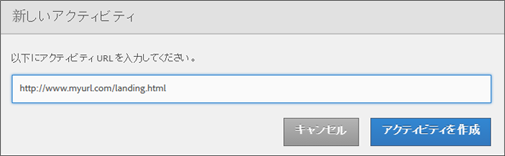
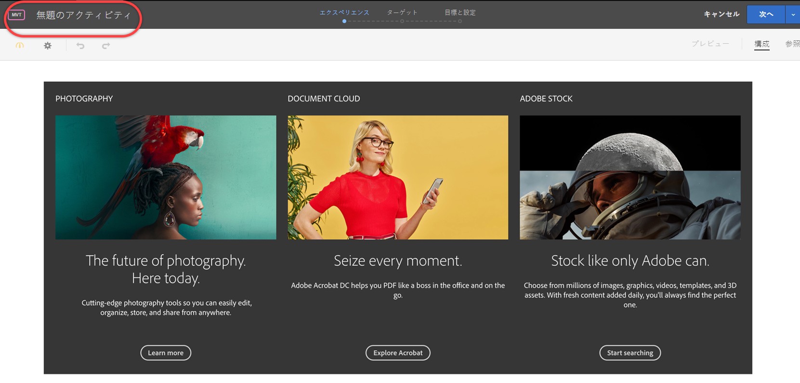
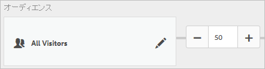
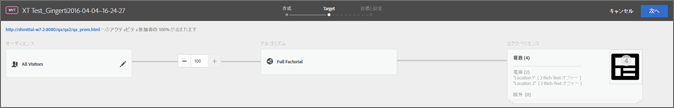
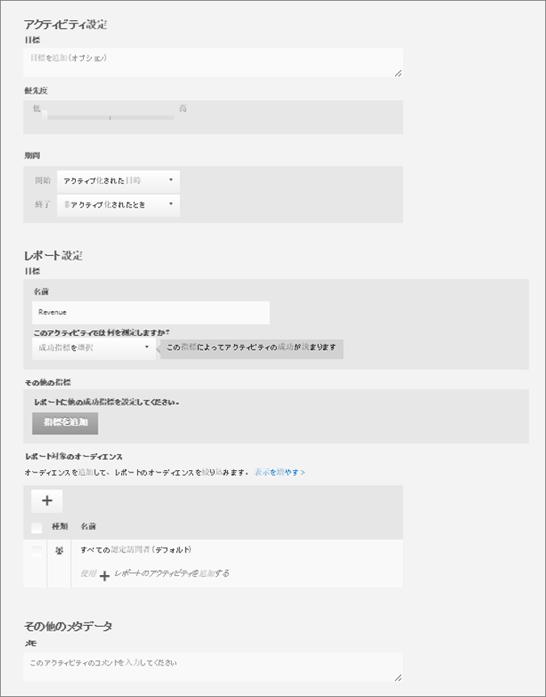

# 多変量分析テストの作成{#create-a-multivariate-test}

Target の Visual Experience Composer を使用すると、Target に対応したページで適切なテストを作成し、Target 内でページの一部を変更する作業が簡単に行えます。

Target のポイント＆クリック方式のエディターを使用して、任意の場所を選択し、複数のオファーを追加できます。

多変量分析テストでは、ページ本位のレポートが生成されます。つまり、テストは特定の URL に対して実行され、そのページに対して設計されたエクスペリエンスが表示されます。

1. 「**[!UICONTROL アクティビティを作成]**」／「**[!UICONTROL 多変量分析テスト]**」の順にクリックします。

   

1. [テストするページのURLを指定](../../../c-activities/c-multivariate-testing/t-create-multivariate-test/url.md#concept_C12E4A85FF3B4E518E3110F6CF1AF9C0)し、「**[!UICONTROL アクティビティを作成]**」をクリックします。

   

   >[!NOTE]
   >
   >先頭に HTTP または HTTPS を含め、完全な URL を使用します。

   ブラウザーで混合コンテンツを有効にするように求めるメッセージが表示された場合は、メッセージの指示に従います。ブラウザーで混合コンテンツを有効にした後、再度手順 1 から開始します。

   Visual Experience Composer が開きます。

   問題がある VEC のトラブルシューティング情報については、[Visual Experience Composer のトラブルシューティング](../../../c-experiences/c-visual-experience-composer/r-troubleshoot-composer/troubleshoot-composer.md#reference_77743144F10143A3A89D56E116D296E4)を参照してください。
1. アクティビティ名を入力します。

   

   次の文字はアクティビティ名として入力できません。

   | 文字 | 説明 |
   |--- |--- |
   | / | フォワードスラッシュ |
   | ? | 疑問符 |
   | # | 番号記号 |
   | : | コロン |
   | = | イコール |
   | + | プラス |
   | - | マイナス |
   | @ | アットマーク |

1. [それぞれの場所でオファーを作成します](../../../c-activities/c-multivariate-testing/t-create-multivariate-test/add-offers.md#concept_DCE6B45C30F7419B8EC17AFDEE8D8AA6)。

   

   以下の種類のオファーを追加できます。

   * HTML
   * 画像
   * テキスト

1. [エクスペリエンスをプレビューします](../../../c-activities/c-multivariate-testing/t-create-multivariate-test/preview-experiences.md#task_21A700587E88453A9FC2210C0DE53A28)。

   

   各エクスペリエンスを表示し、テストに組み込まないエクスペリエンスを除外できます。
1. [トラフィック見積もりを使用](../../../c-activities/c-multivariate-testing/t-create-multivariate-test/traffic-estimator.md#task_71AA6922AFD447EA8C5E610A78ABA714)して、テスト計画の実行可能性をテストします。

     

1. アクティビティに参加する資格のある訪問者のオーディエンスおよび割合を選択します。

   

   例えば、すべての訪問者の 50％に参加を制限したり、カリフォルニア州のオーディエンスの 45％に参加を制限したりできます。

   >[!NOTE]
   >
   >既存のオーディエンスの選択に加え、新規のオーディエンスを作成する代わりに、複数のオーディエンスを結合してアドホック結合オーディエンスを作成できます。詳しくは、[複数のオーディエンスの結合](../../../c-target/combining-multiple-audiences.md#concept_A7386F1EA4394BD2AB72399C225981E5)を参照してください。

1. [テスト概要を確認](../../../c-activities/c-multivariate-testing/t-create-multivariate-test/test-summary.md#reference_971AB225963A4DC18EEB5B0E20F0A4A7)して、必要な変更を行い、「**[!UICONTROL 次へ]**」をクリックします。

   

1. [テストの目標と設定を指定](../../../c-activities/c-multivariate-testing/t-create-multivariate-test/goals-and-settings.md#reference_B25389FD6F3A4989801E740364B089CC)します。

   

1. 「**[!UICONTROL 保存して閉じる]**」をクリックして、アクティビティを作成します。

## トレーニングビデオ:　多変量分析テストの作成（9:25）

このビデオでは、Target の 3 ステップのガイドによるワークフローを使用して、多変量分析テストを計画し、作成する方法についてデモをおこないます。

* 多変量分析テストの定義と設計
* 多変量分析テストの作成

>[!VIDEO](https://video.tv.adobe.com/v/17395)
