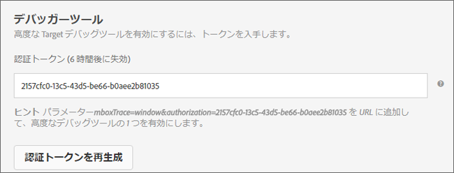

# コンテンツ配信のトラブルシューティング{#troubleshoot-content-delivery}

ページに意図するコンテンツが表示されない場合は、コンテンツ配信をデバッグするためにいくつかの手順をおこないます。

* アクティビティやキャンペーンコードを慎重に確認します。タイポやその他のエラーがあると、意図するコンテンツが表示されない場合があります。
* mboxTrace や mboxDebug を使用して mbox をトラブルシューティングします。
* Adobe Experience Cloud デバッガーは mboxDebug と同じ情報を入手できる使いやすいツールです。このツールを使用して mbox のトラブルシューティングができます。

ページに Target を設定して、mbox が呼び出されていることと、cookie が設定されていることを確認するときは、mboxDebug が特に便利です。ただし、mboxDebug は、コンテンツ配信のデバッグに役立つ詳細までは調べません。ページにアクティビティが表示されない場合や、意図していないコンテンツが表示される場合は、mboxTrace を使用してページの調査とデバッグを詳細におこないます。

## デバッグツールで使用するための認証トークンの取得 {#section_BED130298E794D1FA229DB7C3358BA54}

mboxTrace と mboxDebug は、外部パーティにキャンペーンデータとプロファイルデータを公開するので、認証トークンが必要です。認証トークンは、[!DNL Target] UI で取得できます。トークンは 6 時間有効です。

認証トークンを取得するには、次の手順に従います。

1. 「**[!UICONTROL セットアップ]**」／「**[!UICONTROL 実装]**」の順にクリックします。
1. 「**[!UICONTROL mbox.js]**」または「**[!UICONTROL at.js]**」を選択します。
1. 「**[!UICONTROL 認証トークンを生成]**」をクリックします。

   

1. 生成されたトークンをパラメーターとして URL に追加して、高度なデバッグツールの 1 つを有効にします。

## mboxTrace {#section_256FCF7C14BB435BA2C68049EF0BA99E}

mboxTrace を使用すると、mbox のリプライに付属する追跡情報を受信できます。追跡情報は、mbox 呼び出し（コンバージョンやインプレッションなど）の結果と、この特定の結果の発生理由を判断するのに役立つことがある追加データ（キャンペーンでの選択肢となった使用可能なブランチのセットなど）を反映します。この情報を使用してコンテンツ配信をデバッグします。

次のパラメーターを使用できます。

| mboxTrace のオプション | 結果 |
|--- |--- |
| `?mboxTrace=console` | コンソールログにオブジェクトとして出力します。 at.js の場合は、mbox.js のように新しいブラウザーウィンドウをポップアップしたりコンソールに出力したりする代わりに、ネットワークリクエストを調べて、プレビュー（Chrome）または応答（Firefox）を確認する必要があります。 |
| `?mboxTrace=json` | コンソールログにリテラル JSON 文字列として出力します。 |
| `?mboxTrace=window` | ポップアップウィンドウに JSON 文字列として出力します。 |
| `?mboxTrace=disable` | セッションモードのトレースをオフにします。 |

**mboxTrace 呼び出しの例**

`https://www.mysite.com/page.html?mboxTrace=window&authorization=f543abf-0111-4061-9619-d41d665c59a6`

出力に、コンテンツに関するきわめて詳しい情報が表示されます。mboxTrace は、キャンペーンまたはアクティビティとプロファイルの詳細を表示します。また、実行前のプロファイルのスナップショットと、実行後の変化を示すスナップショットも提供します。さらに、各場所で評価されたキャンペーンやアクティビティも表示します。

情報によっては、一致するセグメント、一致しないセグメントおよびターゲット ID が含まれる場合もあります。

* **SegmentId**：セグメントの ID。再利用可能なセグメントライブラリか、特定のキャンペーン用に作成された匿名セグメントのいずれかのものです。
* **TargetId**：ターゲットの ID。ターゲットエクスプレッションライブラリか、キャンペーンの任意のセグメント用の匿名ターゲットのものです。
* **Unmatched**：リクエストは、この呼び出しで、セグメントまたはターゲットに適していませんでした。
* **Matched**：リクエストは、指定されたセグメントまたはターゲットに適していました。

**レコメンデーションページでの mboxTrace の使用**：レコメンデーションを含むページに mboxTrace をクエリパラメーターとして追加すると、ページ上のレコメンデーションのデザインが、mboxTrace の詳細ウィンドウに置き換わり、以下を含むレコメンデーションに関する詳細が表示されます。

* 返されたレコメンデーションと要求されたレコメンデーション
* 使用されたキーと、それがレコメンデーションを生成するかどうか
* 条件によって生成されたレコメンデーションとバックアップレコメンデーション
* 条件の設定
* 適用される除外とインクルージョン
* 収集ルール

クエリパラメーターには、`=console`、`=json`、または `=window` を含める必要はありません。mboxTrace の詳細が完了したら、`=disable` を追加して、**[!UICONTROL Enter]** キーを押すと、通常の表示モードに戻ります。

サイトの通常の機能や外見は、mboxTrace の影響を受けません。訪問者には、通常のレコメンデーションのデザインが表示されます。

## mboxDebug {#section_DC92A0E4388A4A2787365AD9D556FEFA}

mboxDebug を使用するには、URL の末尾に mboxDebug パラメーターを追加します。mbox に関連する URL パラメーターについての情報を次の表に示します。

>[!NOTE]
>
>mboxDebug パラメーターによっては、使用するのに認証を必要とするものと、認証を必要としないものがあります。

| URL パラメーター | 目的 |
|--- |--- |
| `mboxDebug=1` | デバッガー mbox が定義された任意の URL にこのパラメーターを追加すると、ポップアップウィンドウが開き、有用なデバッグ詳細情報が表示されます。Cookie 情報、PCID およびセッション ID の値が記述され、mbox URL がすべて表示されます。mbox URL をクリックして、その mbox の応答を表示できます。詳しくは、[mbox_debug.pdf](/help/assets/mbox_debug.pdf) を参照してください。 |
| `mboxDebug=x-cookie` | cookie の変更 |
| `mboxDisable=1` | ページ上の mbox を無効化 |
| `mboxDebug=x-profile` | プロファイルセットを表示 |
| `mboxDebug=x-time` | 個々の mbox リクエストに対する応答時間を表示 |
| `mboxOverride.browserIp=<Insert IP address>` | Geotargeting のテスト Geotargeting をこの URL パラメーターでテストします。この属性の値に IP アドレスを入力すると、Test&amp;Target のジオターゲティングがこの IP アドレスを評価し、キャンペーン内のジオターゲティングまたはセグメント化セットに一致させます。 |

## Adobe Experience Cloud デバッガー {#section_A2798ED3A431409690A4BE08A1BFCF17}

Adobe Experience Cloud デバッガーを使用すると、Target の実装をすばやく簡単に理解できます。ライブラリ設定をすばやく表示し、リクエストを検証してカスタムパラメーターが正しく渡されたことを確認し、コンソールのログを有効にして、Target のすべてのリクエストを無効にすることができます。Experience Cloud への認証をおこなうと、強力な Mbox Trace ツールを使用して、アクティビティ、オーディエンスの資格情報、訪問者プロファイルを調査できます。

詳しくは、以下のトレーニングビデオを参照してください。

詳しくは、[*Adobe Experience Cloud デバッガー拡張*のドキュメント](https://marketing.adobe.com/resources/help/en_US/experience-cloud-debugger/)を参照してください。

## 配信中に target.js を読み込めなかった場合 {#section_ABBA5EFDFFB749D8BEE172DB1F973058}

配信中に target.js の読み込みに失敗した場合は、mbox.js から訪問者に対して「em-disabled」という cookie が送信されます。この cookie は、Visual Experience Composer を使用して作成されたオファーがサイトに表示されないようにします。この cookie が設定された訪問者には、テストコンテンツが表示されず、それらのアクティビティレポートでもカウントされません。その他すべてのオファーコンテンツ（例えば Target Classic のキャンペーンのコンテンツ）は引き続き読み込まれます。この cookie の有効期間は、読み込み失敗時から 30 分です。

## レコメンデーションにトップセラーが表示されない {#section_3920C857270A406C80BE6CBAC8221ECD}

*`SIteCatalyst: purchase`*mbox は、購入アルゴリズムトラフィックデータには使用できません。代わりに*`orderConfirmPage`* mbox を使用します。

## アクティビティの優先度を確認 {#section_3D0DD07240F0465BAF655D0804100AED}

[!DNL Target Standard/Premium] で作成されたフォームベースのアクティビティは、[!DNL Target Classic] UI で作成され、優先度が同じで、使用している mbox も同じアクティビティと競合する場合があります。

## Internet Explorer 8 でカスタムコードが期待どおりの結果を返さない{#section_FAC3651F19144D12A37A3E4F14C06945}

Target は、IE 8 をサポートしていません。

## グローバル mbox で提供される JavaScript コンテンツが、mbox.js の使用時に読み込まれない{#section_03EC9B9C410B4F52A7FCD81840311709}

[!DNL mbox.js] のバージョンを 58 以降にアップグレードしてください。

mbox.js バージョン 58 以降では、HTML `BODY` タグのすぐ後で、グローバル mbox の非 JavaScript コンテンツが実行されます。グローバル mbox の `<script>` タグ内の JavaScript コンテンツは、`DOMContentLoaded` イベントの発生後に実行されます。このようなコンテンツの配信順序によって、グローバル mbox の JavaScript コンテンツが適切に配信かつレンダリングされます。

## Target の Cookie が設定されない {#section_77AFEB541C0B495EB67E29A4475DF960}

サイトにサブドメイン（[!DNL us.domain.com] など）がある場合で Target の cookie を（[!DNL domain.com] ではなく）[!DNL us.domain.com] に設定する必要がある場合、`cookieDomain` 設定を上書きする必要があります。詳しくは、「[targetGlobalSettings（）](/help/c-implementing-target/c-implementing-target-for-client-side-web/targetgobalsettings.md)」を参照してください。を参照してください。

## 要素が AEM パーソナライゼーションにも含まれていると、Target のコンテンツがちらつく、または表示されない{#section_9E1DABEB75AB431FB9F09887E6DD07D3}

DOM 要素が Adobe Experience Manager（AEM）パーソナライゼーションのターゲット設定と Target アクティビティの両方に含まれていると、Target コンテンツがちらついたり表示されなかったりする場合があります。

これを修正するには、Target が実行されているページで AEM パーソナライゼーションを無効にします。

## URL が無効なのでリダイレクトおよびリモートオファーを配信できない {#section_7D09043B687F43B39DAEDF17D00375AC}

リダイレクトまたはリモートオファーで無効な URL が使用されていると、配信できない可能性があります。

リダイレクトオファーの場合、mbox の応答に含められるものは、`/* invalid redirect offer URL */`

または

リモートオファーの場合、mbox の応答は、`/* invalid remote offer URL */`を含められます。

mbox 応答をブラウザーで確認するか、mboxTrace を使用して確認できます。有効な URL について詳しくは、[https://tools.ietf.org/html/std66](https://tools.ietf.org/html/std66) を参照してください。

## mboxがサイトで実行されない。

at. jsは、無効なdoctypeを使用している場合、Target mboxは実行しません。at. jsにはHTML5doctypeが必要です。

## トレーニングビデオ

以下のビデオでは、この記事で説明されている概念について詳しく説明しています。

### 拡張機能の追加

>[!VIDEO](https://video.tv.adobe.com/v/23114t2/)

### 基本的な Target デバッグ

>[!VIDEO](https://video.tv.adobe.com/v/23115t2/)

### Mbox Trace

>[!VIDEO](https://video.tv.adobe.com/v/23113t2/)