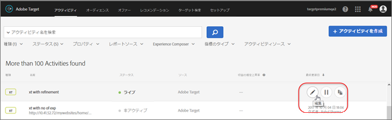
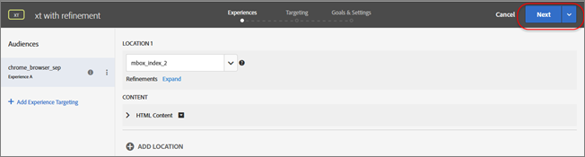
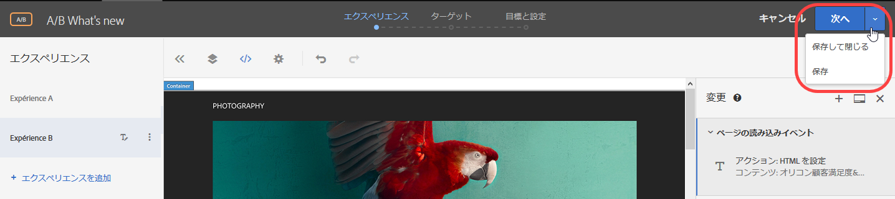
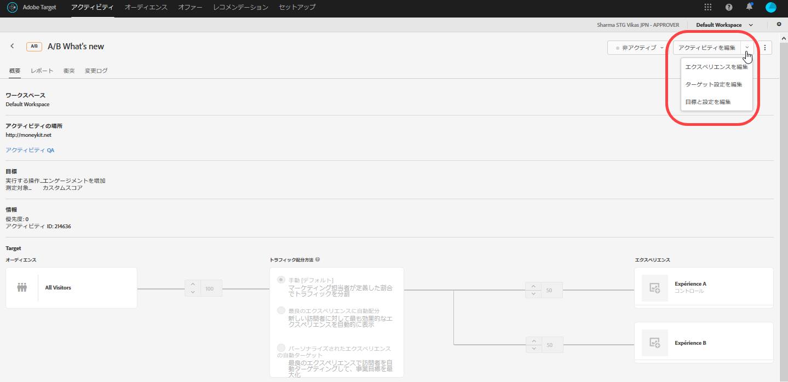
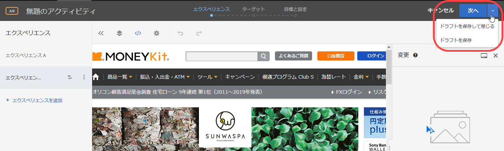

# アクティビティを編集またはドラフトとして保存{#edit-an-activity-or-save-as-draft}

アクティビティをドラフト形式で保存する方法を含む、既存のアクティビティの様々な編集方法に関する情報をまとめています。

Target では、UI 内の様々な場所で既存のアクティビティを編集できます。編集方法によって手順は変わります。

## アクティビティページでホバーボタンを使用してアクティビティを編集する {#section_29EE2ECA6B88473A8F9AC5600FFBB174}

1. **[!UICONTROL アクティビティ]**ページで編集するアクティビティにカーソルを合わせ、**編集[!UICONTROL アイコンをクリックします。]**

   

   アクティビティが開き、エクスペリエンスページが表示されます（3 ステップのガイドによるワークフローの最初の手順）。以下のように、ページ右上にスプリットボタンが表示されます。

   

1. このスプリットボタンを使用して、アクティビティを編集できます。

   

   * **次へ：** 3 ステップのワークフローの別のページを編集する場合は、「**[!UICONTROL 次へ]」をクリックして目的のステップに進みます。**例えば、上記の図では、「[!UICONTROL 次へ]」をクリックすると「ターゲット設定」のステップが表示されます。
   * **保存して閉じる：**現在のステップで必要な変更を加え、スプリットボタンのドロップダウンをクリックして「**[!UICONTROL 保存して閉じる]**」を選択すると、変更内容が保存され、アクティビティの[!UICONTROL 概要]ページが表示されます。
   * **保存：**各ステップで必要な変更を加え、スプリットボタンのドロップダウンをクリックして「**[!UICONTROL 保存]」を選択すると、変更内容が保存されます。この場合は現在のステップに留まり、変更作業を続行できます。**保存が完了するまで待ってから次の変更作業に移ってください。保存が完了すると VEC が再読み込みされ、変更内容が反映されます。

## アクティビティページでアクティビティの名前をクリックしてアクティビティを開き、編集する {#section_176180DAD17E40CEA441903F39E0AA1C}

1. ワークフローのステップを進める代わりに、アクティビティページで目的のアクティビティをクリックして開き、**[!UICONTROL アクティビティを編集]ドロップダウンリストからオプションを選択することもできます。**

   

1. 選択できるオプションは次のとおりです。

   * **エクスペリエンスを編集：**[!UICONTROL エクスペリエンス]ページ（ガイド付きワークフローの最初のステップ）に直接移動します。必要な変更を加えたら、上述のスプリットボタンを使用してアクティビティを保存します。

      * 「**[!UICONTROL 保存して閉じる]」をクリックすると変更内容が保存され、アクティビティの概要ページが表示されます。**
      * 「**[!UICONTROL 保存]」をクリックすると変更内容が保存されますが、現在のステップに留まり、変更作業を続行できます。**保存が完了するまで待ってから次の変更作業に移ってください。保存が完了すると VEC が再読み込みされ、変更内容が反映されます。
   * **ターゲット設定を編集：**[!UICONTROL ターゲット設定]ページ（ガイド付きワークフローの 2 番目のステップ）に直接移動します。必要な変更を加えたら、上述のスプリットボタンを使用してアクティビティを保存します。

      * 「**[!UICONTROL 保存して閉じる]」をクリックすると変更内容が保存され、アクティビティの概要ページが表示されます。**
      * 「**[!UICONTROL 保存]」をクリックすると変更内容が保存されますが、現在のステップに留まり、変更作業を続行できます。**保存が完了するまで待ってから次の変更作業に移ってください。保存が完了すると VEC が再読み込みされ、変更内容が反映されます。
   * **目標と設定を編集：**[!UICONTROL 目標と設定]ページ（ガイド付きワークフローの最後のステップ）に直接移動します。必要な変更を加えたら、上述のスプリットボタンを使用してアクティビティを保存します。

      * 「**[!UICONTROL 保存して閉じる]」をクリックすると変更内容が保存され、アクティビティの概要ページが表示されます。**
      * 「**[!UICONTROL 保存]」をクリックすると変更内容が保存されますが、現在のステップに留まり、変更作業を続行できます。**保存が完了するまで待ってから次の変更作業に移ってください。保存が完了すると VEC が再読み込みされ、変更内容が反映されます。

## アクティビティをドラフトとして保存する {#section_968CD7A63027432EBD8FAE3A0F7404C3}

まだ保存されていない新しいアクティビティを作成しているときや、以前にドラフトとして保存されたアクティビティを編集しているときは、スプリットボタンに「ドラフトを保存」オプションが表示されます。

設定を開始したものの、まだ実行する準備が整っていないアクティビティは、ドラフトとして保存できます。

1. 新しいアクティビティを作成するか、ドラフト形式の既存のアクティビティを編集します。
1. スプリットボタンから目的のオプションを選択します。

   

   * **次へ：** 3 ステップのワークフローの別のページを編集する場合は、「**[!UICONTROL 次へ]」をクリックして目的のステップに進みます。**
   * **ドラフトを保存して閉じる：**現在のステップで必要な変更を加え、スプリットボタンのドロップダウンをクリックして「**[!UICONTROL ドラフトを保存して閉じる]**」を選択すると、変更内容が保存され、アクティビティの[!UICONTROL 概要]ページが表示されます。
   * **ドラフトを保存：**各ステップで必要な変更を加え、スプリットボタンのドロップダウンをクリックして「**[!UICONTROL ドラフトを保存]」を選択すると、変更内容が保存され、現在のステップに留まります。**

## ワークスペースを使用している際にアクティビティをコピー／編集する {#section_45A92E1DD3934523B07E71EF90C4F8B6}

ワークスペースを使用すると、組織は特定のユーザーのセットを特定のプロパティのセットに割り当てることができます。多くの点で、ワークスペースは [!DNL Adobe Analytics] のレポートスイートに似ています。

>[!NOTE]
>
>ワークスペースは、[!DNL Target Premium] ソリューションの一部として利用できるプロパティと権限機能に含まれています。[!DNL Target Standard] では、[!DNL Target Premium] ライセンスがなければ、利用できません。

多国籍組織に属している場合、欧州向け Web ページ、プロパティまたはサイトのワークスペースと、米国向け Web ページ、プロパティまたはサイトの別のワークスペースがあるかもしれません。複数ブランドを取り扱う組織に属している場合、ブランドごとに別のワークスペースがあるかもしれません。

ワークスペースと Enterprise ユーザーの権限の機能について詳しくは、[Enterprise ユーザーの権限](../administrating-target/c-user-management/property-channel/property-channel.md#concept_E396B16FA2024ADBA27BC056138F9838).

環境内で Enterprise ユーザーの権限が有効になっている場合は、同一または別のワークスペースにアクティビティをコピーできます。現時点では、アクティビティを別のワークスペースに移すことはできません。アクティビティを別のワークスペースにコピーするには、[!UICONTROL アクティビティ]ページで、コピーするアクティビティにカーソルを合わせて[!UICONTROL コピー]アイコンをクリックした後、ドロップダウンリストから対象のワークスペースを選択します。

ワークスペースでコピー／編集機能を使用する際の重要なポイントは次のとおりです。

* 同一のワークスペース内でアクティビティをコピーするときは、新たにコピーされるアクティビティの作成フローの最初のステップが編集モードで開きます。
* アクティビティを別のワークスペースにコピーするときは、アクティビティの作成フローが開かずにコピーされます。アクティビティが正常にコピーされたら、そのことを示すメッセージが表示されます。このメッセージには、その新しいアクティビティを開くリンクも含まれています。

環境内で Enterprise ユーザー権限が有効になっていない場合は、コピーの前に、すべてのアクティビティが編集モードで開きます。
