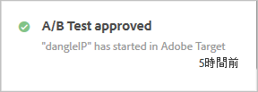
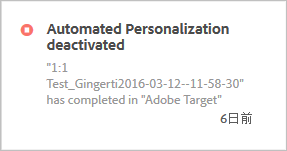
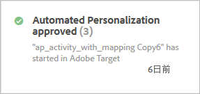
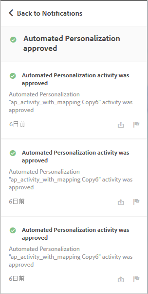

# アクティビティの通知{#activity-notifications}

Target は、Adobe Pulse を使用して、他の Adobe Experience Cloud ソリューションと通知を交換できます。Target は、すべてのアクティビティタイプに関して 2 種類の通知（アクティビティがライブになったときの通知と、アクティビティが非アクティブになったときの通知）を送信します。

[!DNL Target Standard/Premium] の [!DNL Experience Cloud] 製品コンテキストを持つユーザーは、すべてのソリューションで、[!DNL Target] からの通知を見れます。

通知の設定について詳しくは、ドキュメントの [「通知](https://marketing.adobe.com/resources/help/en_US/mcloud/notifications.html)[!DNL Adobe Experience Cloud] 」を参照してください。

アクティビティ作成ワークフロー内を除いて、[!DNL Target] の任意の場所から通知にアクセスできます。ページヘッダーにあるベルのアイコンをクリックして、通知ウィジェットの表示／非表示を切り替えます。

[!DNL Target] は、すべてのアクティビティタイプに関して 2 種類の通知を送信します。

* アクティビティがライブになり、オファーの配信が開始された場合：

   次に例を示します。

   

* アクティビティが非アクティブ化され、オファーの配信が停止された場合：

   次に例を示します。

   

スケジュールされたアクティビティが開始日に到達した場合、および終了日に到達して終了する場合にも、似たような通知が表示されます。

すべての [!DNL Target] 通知には、承認または非アクティブ化されたアクティビティの名前が表示され、見分けやすいように「Adobe Target」という語が含まれています。

単一のアクティビティが同じ種類の複数の通知を送信する場合、表示される通知の数と共に単一のカードに結合されます。次に例を示します。

通知カードをクリックすると、個々の通知の詳細が表示されます。

例えば、上に示すカードをクリックすると、3 つの通知が表示されます。

## 制限事項 {#section_B466EB20B2554CE7B1915374B39F4322}

* 通知では、誰がアクティビティの承認、非アクティブ化またはインポートをおこなったかは示されません。
* MVT 通知は、[!DNL Target Classic] で A/B キャンペーンとして同期されるので、「A/B テスト」として表示されます。

