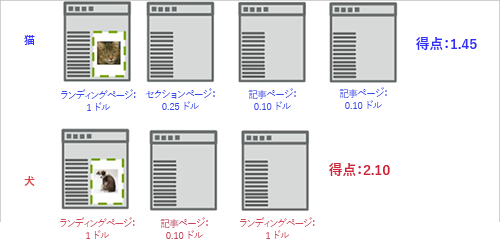
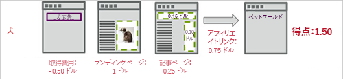

# スコアキャプチャ{#capture-score}

スコアキャプチャのエンゲージメント指標では、閲覧されたサイトのページに割り当てられた値に基づいて、訪問者がキャンペーンの最初の表示 mbox を最初に見た時点からの集計スコアを計算します。

次の例は、猫の画像と犬の画像の 2 つのエクスペリエンスをテストするキャンペーンのスコアエンゲージメントの計算方法を示しています。

この例では、最初の訪問者は猫のエクスペリエンスを体験します。グローバル mbox が、ページの値に基づいてページスコアを渡すことを想定します。マーケティング担当者が、`**any mbox**` に関連する成功指標について閲覧ページ数のエンゲージメントをキャプチャした場合、訪問スコアは、猫の画像を囲んでいるディスプレイ mbox が表示された後に検出された mbox リクエストを集計したものになります。

最初のページでスコアに 1 が加えられ、2 番目のページで 0.25、3 番目のページで 0.10、4 番目のページで 0.10 がそれぞれ加えられ、合計で 1.45 になります。この数値は、通貨またはポイントのいずれかに換算できます。別の訪問では、訪問者は犬のエクスペリエンスを体験します。表示したページは猫のエクスペリエンスよりも少なかったにも関わらず、スコアは 2.10 と高くなっていますが、これは犬のエクスペリエンスの方がページの価値が高いためです。

獲得コストとアフィリエイトリンクの売上高を計算に入れるには、後続のページフローに示すように、adbox とリダイレクターを渡します。この例では、記事ページの 2 つの mbox がスコア（おそらく既知の CPM を表す）を渡しています。

**ページスコアの割り当て**

サイトのページに値を割り当てる場合、自分にとってそのページが持つ価値に基づいて割り当てることができます。例えば、料理サイトでは、エクスペリエンスのセクションではなく、特集記事ページのほうが広告を高く売ることができるとします。この場合、特集記事はエクスペリエンスのセクションよりも価値が高くなります。ページにスコアを割り当てることによって、単にエクスペリエンスを閲覧するだけの訪問者よりも特集記事を読む訪問者の方が高い「ポイント」が得られるように、訪問の総合的な「価値」を作成することができます。

ページにスコアを割り当てるには次の 2 つの方法があります。

* mbox コードで、`mboxPageValue` という mbox パラメーターを作成します。

   例：`('global_mbox', 'mboxPageValue=10');`

   その mbox を含むページを表示するごとに、指定した値が加算されます。ページ内の複数の mbox にそれぞれスコア値が割り当てられている場合、そのページのスコアはすべての mbox の値の合計になります。`mboxPageValue` は、mbox に値を渡してエンゲージメントスコアをキャプチャするための予約済みパラメーターです。正の値も負の値も渡される可能性があります。各訪問者の訪問の最後に合計が計算され、その訪問の合計スコアが算出されます。

* ページの URL で `?mboxPageValue=n` パラメーターを渡します。

   例：`https://www.mydomain.com?mboxPageValue=5`

   この方法では、指定した値がページ内の各 mbox ごとに、スコアに加算されます。例えば、パラメーター `?mboxPageValue=10` を渡し、ページに 3 つの mbox がある場合、そのページのスコアは 30 となります。

>[!NOTE] {class=&quot;- topic/note &quot;}
>
>キャンペーンの最初のディスプレイ mbox の上にある mbox はスコアには含まれません。

スコアに加算されるようにする最良の方法は、mbox コードで値を割り当てることです。これにより、各 mbox のコンテンツに基づいて、ページの値を正確に計測することができます。

>[!NOTE] {class=&quot;- topic/note &quot;}
>
>メンテナンスを容易にするために、JavaScript の条件ロジックを含んだ [!DNL at.js] または [!DNL mbox.js] ファイル内で、サイトのページスコア値の割り当てを設定できます。これにより、ページに多くのコードを記述しなくても済みます。サポートが必要な場合は、担当のアカウントコンサルタントにお問い合わせください。

上記の 2 つの方法を組み合わせることもできますが、スコアは予期したよりも高くなる場合があります。例えば、3 つの mbox それぞれに 10 の値を割り当て、4 つ目の mbox には値を割り当てないで URL パラメーター `?mboxPageValue=5` を渡した場合、ページのスコアは 50 になります（値を割り当てた 3 つの mbox が 30 となり、ページ内の 4 つの mbox それぞれが 5 となります）。

カウンターは、入り口の mbox ではなく、最初の表示 mbox から開始されます。例えば、表示 mbox のないホームページのキャンペーンから入り、表示 mbox を含むカタログページのリンクを開いた場合、カウンターはカタログページに移動した時点から開始されます。

また、費用がかかるページや訪問者が見る価値のないページには、負の値を割り当てることができます。負の値もまたスコアの総計に入れられます。このテクニックを広告から訪問者が移動するページに適用して、CPC の値を判定することができます。また、訪問者がそのページから連絡をとったり、ヘルプを要求することがわかっている連絡先ページやサポートページに、負の値を割り当てることもできます。
