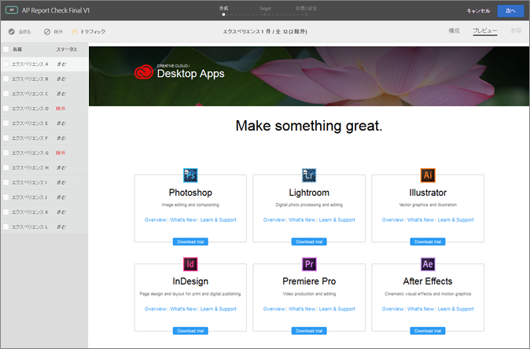
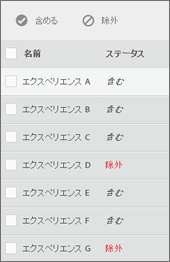

#  Visual Experience Composer での Automated Personalization のエクスペリエンスのプレビュー{#preview-experiences-for-automated-personalization-in-the-visual-experience-composer}

Automated Personalization テストでは、ページ上で複数のオファーを比較するので、各エクスペリエンスのページをプレビューできると便利です。

1. Experience Composerで、「**[!UICONTROL プレビュー]**」をクリックします。

   すべてのエクスペリエンスのリストが表示されます。

   

1. リスト内の特定のエクスペリエンスをクリックして表示します。

1. アクティビティからエクスペリエンスを除外するには、そのエクスペリエンスを選択して、「**[!UICONTROL 除外]**」をクリックします。

   

   矛盾するバリエーションを表示するエクスペリエンスや、デザイン的にバランスのとれていないエクスペリエンスなどを除外します。

   自動パーソナライゼーションアクティビティには、デフォルトで、すべてのエクスペリエンスが組み込まれます。除外したエクスペリエンスを組み込むには、除外したエクスペリエンスを選択して、「**[!UICONTROL 含める]**」をクリックします。

「**[!UICONTROL プレビューモードを終了]**」をクリックして Experience Composer に戻り、必要な変更を加えるか、「**続行[!UICONTROL 」をクリックしてターゲット設定のステップに移ります。]**
