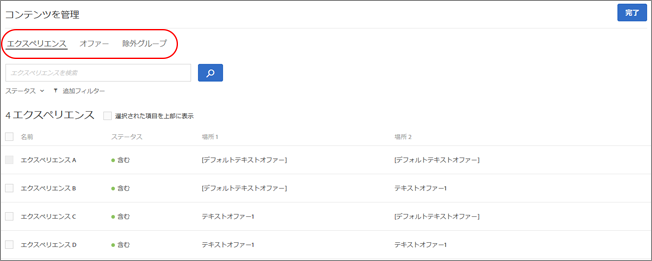

#  Target の Automated Personalization オファー{#target-automated-personalization-offers}

Automated Personalization アクティビティで、特定のオーディエンスに対してオファーをターゲット設定できます。

この機能を使用すると、特定の訪問者が閲覧できるオファーの数を減らすことができます。例えば、3 つのオファーを含む Automated Personalization（AP）アクティビティがあるとしましょう。オファー 1 には、表示をオーディエンス A に限定するターゲットルールがあります。この AP アクティビティを 2 人の訪問者が閲覧します。

|  | 訪問者 1 | 訪問者 2 |
|--- |--- |--- |
| オーディエンス資格認定 | オーディエンス A | オーディエンス B |
| オファー 1 Target パーソナライゼーションモデルスコア | 90 | 90 |
| オファー 2 Target パーソナライゼーションモデルスコア | 50 | 70 |
| オファー 3 Target パーソナライゼーションモデルスコア | 80 | 60 |

このシナリオでは、訪問者 1は（オーディエンス A に属すると認定されているので）、オファー 1 を閲覧します。それがこの訪問者の最高スコアになります。一方、訪問者 2 は（オーディエンス A に属していないので）、オファー 1 の場合に最高スコアになるとしても、オファー 2 を閲覧します。この例は、ビジネスニーズに応えるにはターゲットルールを慎重に使用する必要がある理由を示しています。これらのルールを追加すると、Target のパーソナライゼーションモデルの有効性が弱まるおそれがあります。

## ターゲットルールを設定する方法

1. ターゲット設定したいオファーを含む自動パーソナライゼーションアクティビティを作成します。
1. Visual Experience Composer でアクティビティのオファーを設定したら、「**[!UICONTROL コンテンツ]**」をクリックします。

   コンテンツを管理ダイアログボックスが開きます。

   

   >[!NOTE]
   >
   >場所は 50 カ所を設定でき、場所ごとに最大 250 個のオファーを設定できます。

1. **[!UICONTROL コンテンツ]**列で、オファーを選択して、「**[!UICONTROL ターゲット設定]**」をクリックして、オファーを閲覧する資格を付与するオーディエンスを選択します。

   選択されたオーディエンスだけにオファーが表示されます。

   >[!NOTE]
   >
   >既存のオーディエンスの選択に加え、新規のオーディエンスを作成する代わりに、複数のオーディエンスを結合してアドホックな結合オーディエンスを作成することができます。詳しくは、[複数のオーディエンスの結合](../../c-target/combining-multiple-audiences.md#concept_A7386F1EA4394BD2AB72399C225981E5)を参照してください。

1. 「 **[!UICONTROL 完了]**」をクリックします。
