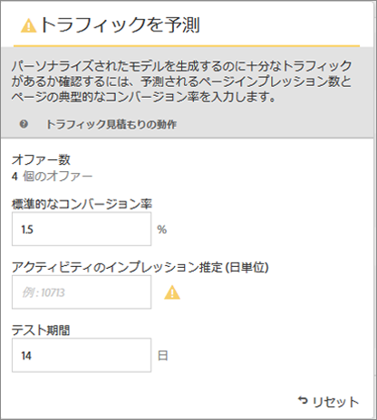
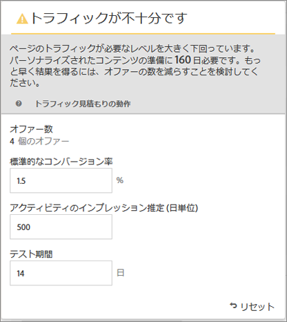
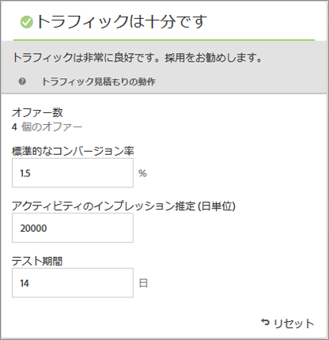

#  成功のために必要なトラフィックの見積もり{#estimate-the-traffic-required-for-success}

トラフィック見積もりでは、アクティビティを正常に完了させるために十分なトラフィックが確保されているかどうかを知らせるフィードバックが提供されます。

自動パーソナライゼーションアクティビティは複数のオファーの組み合わせを使用するので、有意な結果を確認するにはどのぐらいのトラフィック量が必要かを知ることが重要です。トラフィック見積もり機能は、ページに関する統計情報とテスト中のエクスペリエンスの数に基づいて、アクティビティを正常に完了させるために必要なトラフィック量とテスト期間を見積もります。

この機能では、ページのページインプレッション数の見積もりと、一般的なコンバージョン率を比較することで、パーソナライズされたモデルを生成するために十分なトラフィックがあるかどうかを判断します。アクティビティの成功のためには、パーソナライズされたコンテンツがアクティビティ期間の 50％以内または 14 日以内（どちらか短い方）に準備されるようなサンプルサイズにするのが理想的です。これにより、パーソナライズされたコンテンツの取得と、配信するコンテンツの学習に十分な時間を確保できます。

Target では、パーソナライゼーションアルゴリズムが構築されるまではランダムにエクスペリエンスを提供します。各オファーでモデルの構築が完了し、Target によるパーソナライゼーションコンテンツの提供が可能になると、そのオファーの横にチェックマークアイコンが表示されます。モデルが準備完了になった後にのみ指標の上昇が期待されるので、視覚的な表示によって、適切に予想を立てることができます。Visual Experience Composer（VEC）のトラフィック見積もりは、いつモデルが準備されるかについてのガイドラインとして使用できます。

1. Experience Composer で、「**[!UICONTROL トラフィック]**」をクリックします。

   

   トラフィック見積もりが表示されます。再度「**[!UICONTROL トラフィック]**」をクリックすると、トラフィック見積もりを非表示にできます。

   

1. 標準コンバージョン率（このアクティビティで期待できるコンバージョン率）、アクティビティの 1 日あたりの推定インプレッション数、テスト期間を確認できます。

   * コンテンツ組み合わせ数：除外後にアクティビティの一部として作成されるエクスペリエンスの数に基づいて自動的に計算されます。
   * 標準コンバージョン率：コンバージョン率は、推定または分析システムの過去のデータに基づき、パーセンテージで表されます。
   * 1 日あたりの推定訪問数：ターゲットの条件に基づいてこのアクティビティの表示対象になる訪問者を割り出し、そこから算出される 1 日あたりの推定訪問数です。この数値は、分析データに基づいて決定することができます。この数値は実訪問者数ではなく、訪問数であることにご注意ください。
   * テスト期間：アクティビティを実行する日数です。
   トラフィック見積もりでは、これらの統計情報を使用して、テストの実行を成功させるために必要な調整の内容を特定します。

   トラフィック見積もりの上部付近に、入力した値に基づく計算結果が表示されます。

   

   数値を変更すると、見積もりも変更されます。例えば、大量の組み合わせをテストする場合に、コンバージョン率とインプレッション数を非常に低く設定すると、テストを正常に完了させるために必要な期間の長さが表示されます。また、トラフィックが少ない場合は、希望の日数のテストを実行できるように、オファーの組み合わせの数を少なくするよう提案されることがあります。

   十分なトラフィックがない場合は、次のいずれかまたはすべてをおこなうことができます。

   * Automated Personalization ではなく自動ターゲットを使用し、1 つのエクスペリエンスのバリエーション内で、複数のオファーの変更を含むエクスペリエンスを作成します。
   * Automated Personalization アクティビティ内のオファーの組み合わせの数を減らします。
   * アクティビティの実行期間を長くします。
   十分なトラフィックが確保されるという評価が得られるまで数字を調整し、それに応じて、テストをデザインします。

   

   トラフィックが十分になると、トラフィックアイコンに緑のチェックマークが表示されます。トラフィックが不十分な場合は、赤の警告ラベルが表示されます。
