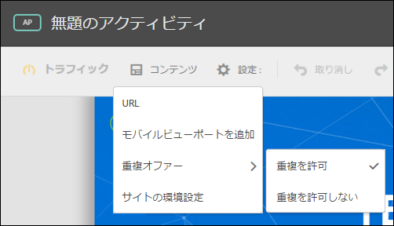
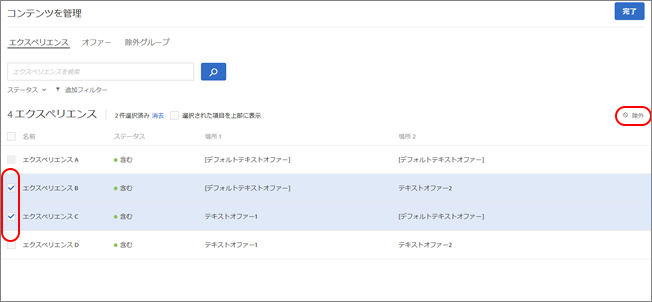
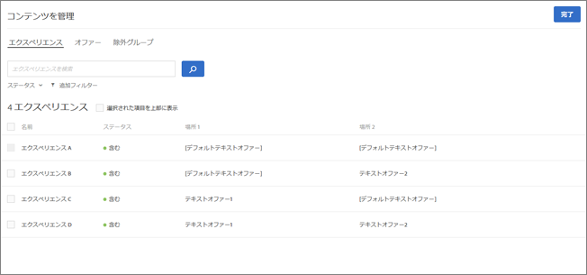
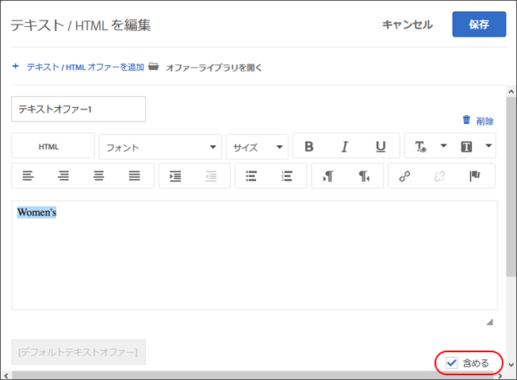
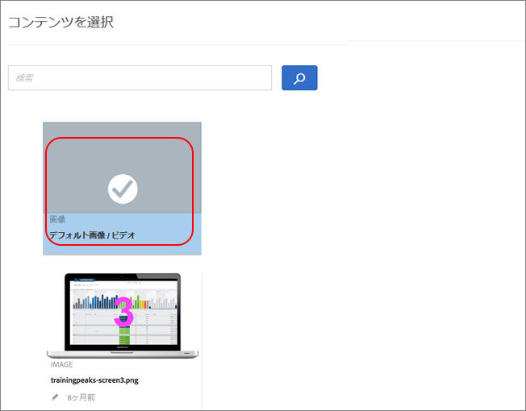
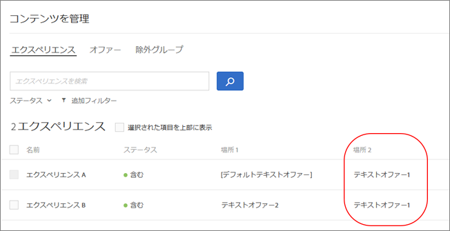
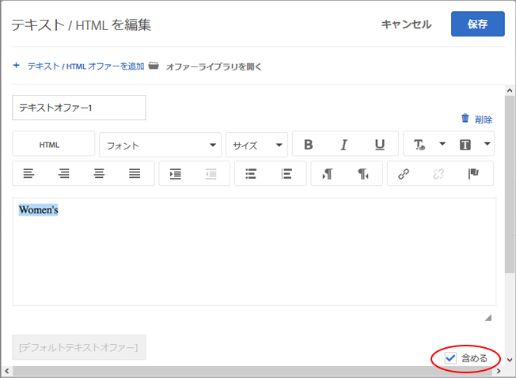
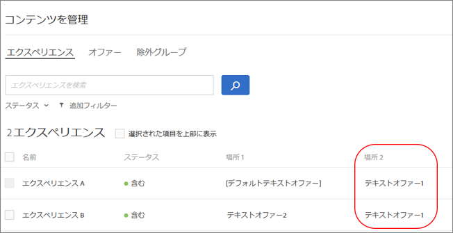

# 除外の管理{#manage-exclusions}

Automated Personalization（AP）アクティビティで除外グループと重複するオファーを管理します。

## 除外グループの作成 {#task_AAAA6C7239A84F7696C8492F04B575A2}

Automated Personalization（AP）アクティビティで除外グループを作成し、指定したオファーを含むエクスペリエンスが自動的に除外されるようにします。

除外グループは、複数の場所における同一のエクスペリエンスで、不適切なオファーが提示されないようにできる便利な機能です。例えば、全商品を対象とした 20％割引と 15％割引の 2 つのオファーがあるとします。この 2 つのオファーが、同一のエクスペリエンスの訪問者に提示されないようにする必要があります。その場合はこの 2 つのオファーを除外グループに追加することで対処できます。

**除外グループを作成する手順は次のとおりです。**

1. AP アクティビティを作成または編集しているときに、ヘッダーバーの「**[!UICONTROL コンテンツを管理]**」をクリックします。
1. 「[!UICONTROL コンテンツを管理]」 ダイアログボックスで、「**[!UICONTROL 排他グループ]**」をクリックします。

   

   以前に作成した除外グループがある場合は、リスト内に表示されます。除外グループをまだ作成していない場合は、作成するよう求められます。
1. 「**[!UICONTROL 除外グループを作成]**」をクリックします。

   

1. （必須）除外グループにわかりやすい名前を付けます。

   わかりやすい名前を付ければ、そのグループをすばやく見つけたり、用途を把握したりしやすくなります。

1. 除外グループに追加するオファーを見つけて選択します。

   除外グループでは同じ場所から複数のオファーを選択できます。

1. 「**[!UICONTROL 保存]**」をクリックします。

除外グループのオファーは、以降、同一のエクスペリエンスから自動的に除外されます。

## 重複するオファーの除外 {#concept_4EF78013F80E48EFA024AE0274C9F037}

オファーライブラリからのオファーが [!UICONTROL Automated Personalization] アクティビティの複数のロケーションで使用される場合に重複しないようにします。

例えば、ページ上で 6 つのロケーションと 12 件のオファーがあるアクティビティがあるとします。同じオファーがアクティビティ内の 1 つまたは複数のロケーションに配置される場合があります。この機能では、同一アクティビティ内の別の場所で、重複するオファーが同時に表示されるのを防ぐことができます。

「**[!UICONTROL 設定]**」／「**[!UICONTROL 重複オファー]**」／「**[!UICONTROL 重複を許可]**」または「**[!UICONTROL 重複を許可しない**]」の順にクリックします。

## 特定のエクスペリエンスの除外 {#task_C17D36EF58AF4908B17A3D84CA6DE85A}

特定のオファーの組み合わせを Automated Personalization アクティビティから除外したい場合は、特定のエクスペリエンスを除外できます。

効果的ではない組み合わせがある場合や、テスト対象のエクスペリエンスの数を制限し、アクティビティのトラフィック要件を下げたい場合もあるでしょう。

1. AP アクティビティを作成または編集しているときに、ヘッダーバーの「**コンテンツを管理**」をクリックします。

   [!UICONTROL エクスペリエンス]のリストに、すべてのコンテンツと場所のオプションの順列を基に作成された各エクスペリエンスが表示されます。

1. 必要に応じてエクスペリエンスを除外します。

   エクスペリエンスを除外する際は、対象のエクスペリエンスにカーソルを合わせてから除外アイコンをクリックします。

   

   複数のエクスペリエンスのチェックボックスをオンにしてから、ダイアログボックスの右上隅にある「**除外**」ボタンをクリックすることで、エクスペリエンスを一括で除外（または追加）することもできます。「除外」ボタンは、エクスペリエンスのチェックボックスがオンになっているときに表示されます。

   

   このリスト表示では、[!UICONTROL ステータス]ドロップダウンリストをクリックすることでフィルターを適用し、除外済みのアクティビティまたは追加済みのアクティビティのみを表示できます。

   以上でアクティビティからエクスペリエンスが除外され、[!UICONTROL ステータス]が[!UICONTROL 除外]になります。

   

## デフォルトコンテンツの除外 {#task_DCB4528989DF4C05A3A4729E5891D18F}

デフォルトのコンテンツを、Automated Personalization アクティビティから除外したい場合もあるでしょう。この設定方法は、除外グループの作成方法とは異なります。この方法を使用すれば、ある場所の 1 つのオファー（デフォルトのコンテンツとは異なる）のみを Automated Personalization アクティビティに含めることができます。

Automated Personalization アクティビティでテストするオファーに合わせてページの他の部分のデザインを変更したい場合は、デフォルトのコンテンツを除外する方法が効果的です。例えば、テスト対象のオファーのカラーパレットを一致させたい場合は、ページの背景色を変更し、デフォルトの背景色を除外します。

**Visual Experience Composer（VEC）を使用してデフォルトのコンテンツを除外する方法は次のとおりです。**

1. AP アクティビティを作成または編集するときに、置き換えるコンテンツを選択し、「**[!UICONTROL テキスト／HTML を変更]**」、「**[!UICONTROL 画像を変更]**」または「**[!UICONTROL 背景色を変更**]」をクリックします。
1. ダイアログボックスで新しいコンテンツを作成し、デフォルトコンテンツの右側にある「**含める**」をオフにします（またはコンテンツを選択画面の「デフォルト画像 / ビデオ」をオフにします）。

   コンテンツ／オファーのタイプによっては、「[!UICONTROL 含める]」チェックボックスの位置が若干異なります。

   テキスト／HTML コンテンツの場合：

   

   画像／ビデオコンテンツの場合：

   

   背景色の場合：

   

1. 「**[!UICONTROL 保存]**」をクリックします。

   [!UICONTROL コンテンツを管理]で、指定したオファーを基に作成されたエクスペリエンスを確認できます。[!UICONTROL コンテンツを管理]には、除外したデフォルトのオファーを使用して作成されたエクスペリエンスがないことがわかります。

   

**フォームベースの Experience Composer を使用してデフォルトのコンテンツを除外する方法は次のとおりです。**

1. AP アクティビティを作成または編集しているときに、「**[!UICONTROL コンテンツ]**」で「**[!UICONTROL テキスト／HTML を変更]**」または「**[!UICONTROL 画像オファーを変更**]」をクリックします。
1. ダイアログボックスで新しいコンテンツを作成し、デフォルトコンテンツの右側にある「**[!UICONTROL 含める]」をオフにします（またはコンテンツを選択画面の「デフォルト画像 / ビデオ」をオフにします）。**

   コンテンツ／オファーのタイプによっては、「含める」チェックボックスの位置が若干異なります。

   テキスト／HTML コンテンツの場合：

   

   画像／ビデオコンテンツの場合：

   

1. 「**[!UICONTROL 保存]**」をクリックします。

   [!UICONTROL コンテンツを管理]で、指定したオファーを基に作成されたエクスペリエンスを確認できます。[!UICONTROL コンテンツを管理]には、除外したデフォルトのオファーを使用して作成されたエクスペリエンスがないことがわかります。

   
