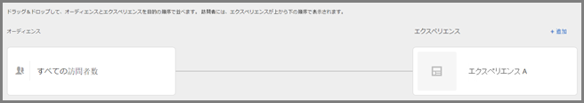
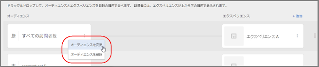
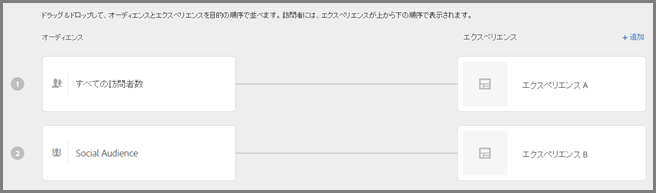
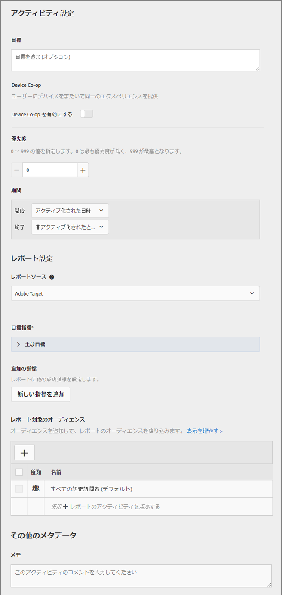

# エクスペリエンスのターゲット設定アクティビティの作成{#create-an-experience-targeting-activity}

[!UICONTROL Visual Experience Composer] （VEC）を使用して、Target対応ページで [!UICONTROL エクスペリエンスターゲット設定] （XT）アクティビティを作成し、ページの一部を変更 [!DNL Adobe Target]します。

1. 「[!UICONTROL アクティビティ]」リストで、「**[!UICONTROL アクティビティを作成**]／**[!UICONTROL エクスペリエンスのターゲット設定]**」の順に選択します。

   

   >[!NOTE]
   >
   >利用可能なアクティビティタイプは、Target アカウントによって異なります。一部のアクティビティタイプがリストに表示されない可能性があります。例えば、自動パーソナライゼーションは [Target Premium機能](/help/c-intro/intro.md#premium)です。

   アクティビティのタイプについて詳しくは [、アクティビティ](../../../c-activities/activities.md#concept_D317A95A1AB54674BA7AB65C7985BA03) および [Targetアクティビティのタイプ](/help/c-activities/target-activities-guide.md)を参照してください。

1. 必要に応じて **[!UICONTROL 、「ビジュアル（デフォルト）]**」を選択します。

   

   フォームベースの Experience Composer を使用したい場合は、そちらのオプションを選択します。詳しくは、[フォームベースの Experience Composer](https://marketing.adobe.com/resources/help/en_US/target/target/t_form_experience_composer.html) を参照してください。

   >[!NOTE]
   >
   >VECおよびフォームベースのExperience Composerに加えて、Targetは単一ページアプリケーションVECおよびVEC forモバイルアプリを提供します。様々なコンポーザーについて詳しくは [、エクスペリエンスとオファー](/help/c-experiences/experiences.md)を参照してください。

   問題がある VEC のトラブルシューティング情報については、[Visual Experience Composer のトラブルシューティング](../../../c-experiences/c-visual-experience-composer/r-troubleshoot-composer/troubleshoot-composer.md#reference_77743144F10143A3A89D56E116D296E4)を参照してください。

1. [アクティビティURLを指定](../../../c-activities/t-experience-target/t-xt-create/xt-activity-url.md#concept_D28549AAA0A14E3BB5F05F32BE8ABC90)し、「 **[!UICONTROL 次へ]**」をクリックします。

   アカウントにデフォルトの URL が設定されている場合は、その URL がデフォルトで表示されます。デフォルトの URL を別の URL に変更できます。

   Visual Experience Composer が表示され、URL で指定したページが表示されます。

   

1. 用意されている領域に、アクティビティの名前を入力します。

   

   次の文字はアクティビティ名として入力できません。

   | 文字 | 説明 |
   |--- |--- |
   | `/` | フォワードスラッシュ |
   | `?` | 疑問符 |
   | `#` | 番号記号 |
   | `:` | コロン |
   | `=` | イコール |
   | `+` | プラス |
   | `-` | マイナス |
   | `@` | アットマーク |

1. [新しいエクスペリエンスを作成します](../../../c-activities/t-experience-target/t-xt-create/xt-add-experience.md#task_454646F2895242D3B92DC395A0CE1A00)（ページ上の要素の変更）。

   デフォルトでは、バナーの回転など JavaScript を含む要素については、Visual Experience Composer で変更できません。このような要素を Visual Experience Composer を使用して変更するには、JavaScript を無効にします。

   >[!NOTE]
   >
   >1 つ以上のエクスペリエンスに対してページに変更を加えた後、URL を変更すると、エクスペリエンスは新しいページを使用してリセットされ、おこなった変更が失われます。

   ページ上の要素にマウスカーソルを重ねると、その要素が強調表示されます。強調表示された要素は、Experience Composer を使用して変更できます。

   Target Classic（旧称 Test&amp;Target）を使用してページに mbox を作成していた場合は、mbox 名を表示する要素として mbox が表示され、他の要素と同様に修正することができます。

   >[!NOTE]
   >
   >メインページ以外のソースから画像を提供する場合（例えば、akamai.net 上でホストされている画像を dell.com で提供する場合）、フロー図内のページのサムネールには画像が表示されません。

1. 「**[!UICONTROL 次へ]**」をクリックします。

   フロー図が開きます。

   

   フロー図を使用すると、アクティビティに対するオーディエンスの選択、およびエクスペリエンスの設定を順に実行できます。
1. オーディエンスにカーソルを合わせ、表示された「**[!UICONTROL 編集]**」アイコン（縦並びの省略記号）／「**[!UICONTROL オーディエンスを変更]**」の順にクリックし、アクティビティの最初のエクスペリエンスのオーディエンスを選択します。

   

   オーディエンスライブラリが表示されます。オーディエンスライブラリには、Target の一部として事前設計された一般的なオーディエンスを含め、以前に定義したオーディエンスが含まれています。ライブラリからオーディエンスを選択するか、または[新しいオーディエンスを作成](../../../c-target/c-audiences/audiences.md#concept_65BE870D290E412D8BBF557EEA67C271)します。すべての参加者に同じエクスペリエンスを表示する場合は、「すべての訪問者数」を選択します。

   >[!NOTE]
   >
   >既存のオーディエンスの選択に加え、新規のオーディエンスを作成する代わりに、複数のオーディエンスを結合してアドホックな結合オーディエンスを作成することができます。詳しくは、[複数のオーディエンスの結合](../../../c-target/combining-multiple-audiences.md#concept_A7386F1EA4394BD2AB72399C225981E5)を参照してください。

   オーディエンスの作成時に、場所（mbox）を選択して、その場所のパラメーターを指定できます。「カスタムパラメーター」から mbox を選択し、必要なパラメーターを指定します。

   >[!NOTE]
   >
   >オーディエンスリストを開いたときに、インポートされたオーディエンスが 10 分以上経っている場合は、オーディエンスがバックグラウンドで自動的にインポートされます。

   表示された[!UICONTROL 編集]アイコン（縦並びの省略記号）をクリックし、「[!UICONTROL オーディエンスを削除]」をクリックして既存のオーディエンスを削除します。
1. 「**[!UICONTROL エクスペリエンスのターゲット設定を追加]**」をクリックします。

   >[!NOTE]
   >
   >オーディエンスに対してエクスペリエンスをターゲット設定する場合は、エクスペリエンスを追加する前にオーディエンスを選択する必要があります。オーディエンスを選択するように促すメッセージが表示されます。

1. （オプション）「**[!UICONTROL 追加]**」をクリックして、ターゲットを設定したエクスペリエンスを追加で設定します。

   

   この手順を終了したら、「**[!UICONTROL 続行]」をクリックします。**
1. アクティビティの[目標と設定](../../../c-activities/t-experience-target/t-xt-create/xt-goals-and-settings.md#reference_B25389FD6F3A4989801E740364B089CC)を指定します。

   

1. 「**[!UICONTROL 保存して閉じる]**」をクリックします。
