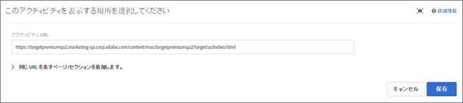

# アクティビティ URL{#activity-url}

アクティビティ URL は、テストで使用され、設計したテストで表示されるページを指定します。

アクティビティ作成中にアクティビティ URL の入力を求められたら、URL を指定します。`https://` を含む完全な URL を入力して、「**[!UICONTROL 作成]**」をクリックします。

>[!NOTE]
>
>[!DNL Target] は URL プロトコル（[!DNL https] および [!DNL http]）を区別しません。結果として、[!DNL `http://www.adobe.com`] と [!DNL `https://www.adobe.com`] は両方とも合致します。

デフォルトでは、アカウントの基本設定で指定されたページが [!UICONTROL Visual Experience Composer] で開かれます。アクティビティ作成中に、異なるページを指定することもできます。

[!UICONTROL Visual Experience Composer] を開いた後に異なるページを表示するには、**[!UICONTROL 設定]**の歯車アイコンをクリックして、「**[!UICONTROL ページ配信**」を選択します。]「アクティビティ URL」フィールドに URL を入力します。

アクティビティにさらにページまたはセクションを追加するには、「**[!UICONTROL テンプレートルールを追加]」をクリックします。**

追加のルールは、以下のいずれかに基づいています。

* URL
* ドメイン
* パス
* ハッシュ（#）フラグメント
* クエリ
* mbox パラメーター

追加のルールは、AND または OR を使用してアクティビティ URL と結合できます。追加したすべてのルールは、AND を使用してお互いに評価されます。

終了したら「**[!UICONTROL 保存]」をクリックします。**

>[!NOTE]
>
>Standard の JavaScript コードを含まないサイトの URL を入力すると、ページ要素を選択できません。[!DNL Target]

デフォルトでは、バナーの回転など JavaScript を含む要素については、[!UICONTROL Visual Experience Composer] で変更できません。**[!UICONTROL Visual Experience Composer]を使用してこのような要素を変更するには、「**[!UICONTROL JavaScript を使用してレンダリング]」をオフにします。

>[!NOTE]
>
>1 つ以上のエクスペリエンスに対してページに変更を加えた後、URL を変更すると、エクスペリエンスは新しいページを使用してリセットされ、行った変更が失われます。
