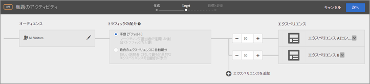
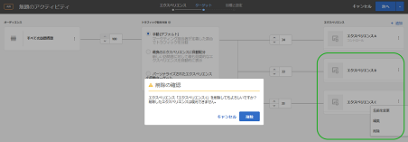

# エクスペリエンスの追加{#add-experience}

Visual Experience Composer は、ページ上のエクスペリエンスを編集するための視覚的なインターフェイスを備えています。

エクスペリエンスについて詳しくは、[エクスペリエンス](../../../c-experiences/experiences.md#concept_A2E10F6AFB3D4AEAB6951EE14688848D)を参照してください。

1. 「**[!UICONTROL エクスペリエンスを追加]**」をクリックします。

   >[!NOTE]
   >
   >オーディエンスに対してエクスペリエンスをターゲット設定する場合は、エクスペリエンスを追加する前にオーディエンスを選択する必要があります。オーディエンスを選択するように促すメッセージが表示されます。

1. アクティビティ URL の入力を求められたら、URL を入力します。`https://` を含む完全な URL を入力して、「**[!UICONTROL 続行]**」をクリックします。

   「アカウントの基本設定」で指定されたページが Experience Composer（[エクスペリエンス](../../../c-experiences/experiences.md#concept_1D011219034B492BB03C08B3BB80E3F0)を参照）で開かれます。別のページを表示するには、地球のアイコンをクリックして、Experience Composer の「URL の選択」ボックスに URL を入力し、「**[!UICONTROL 続行]**」をクリックします。Target Standard の JavaScript コードを含まないサイトの URL を入力すると、ページ要素を選択できません。

   デフォルトでは、バナーの回転など JavaScript を含む要素については、Visual Experience Composer で変更できません。このような要素を Visual Experience Composer を使用して変更するには、JavaScript を無効にします。

   >[!NOTE]
   >
   >1 つ以上のエクスペリエンスに対してページに変更を加えた後、URL を変更すると、エクスペリエンスは新しいページを使用してリセットされ、おこなった変更が失われます。

1. 変更する要素を選択し、必要な変更をおこないます。

   ページ上の要素にマウスカーソルを重ねると、その要素が強調表示されます。強調表示された要素は、Experience Composer を使用して変更できます。

   Target Classic（旧称 Test&amp;Target）を使用してページに mbox を作成していた場合は、mbox 名を表示する要素として mbox が表示され、他の要素と同様に修正することができます。

   エクスペリエンスを変更するために表示されるページの要素で実行可能なアクションのリストについては、[Visual Experience Composer のオプション](/help/c-experiences/c-visual-experience-composer/viztarget-options.md)を参照してください。

   >[!NOTE]
   >
   >メインページ以外のソースから画像を提供する場合（例えば、akamai.net 上でホストされている画像を dell.com で提供する場合）、フロー図内のページのサムネールには画像が表示されません。

1. エクスペリエンスの設計が終了したら、チェックマークのボタンをクリックします。

   アクティビティ図が表示されます。

   

   エクスペリエンスにクロスドメインコンテンツが含まれる場合、サムネールは正確に表示されないことがあります（その場合はアイコンに置き換えられます）。

1. アクティビティ内の各エクスペリエンスを表示する訪問者の割合を指定します。

   同じオーディエンスに対して複数のエクスペリエンスを表示することができます。選択したオーディエンスと、アクティビティに追加したエクスペリエンスが図に表示されます。各エクスペリエンスを表示する時間の割合を指定します。この割合は、全エクスペリエンス間で均等に配分することも、エクスペリエンスごとに大きく（または小さく）設定することもできます。全エクスペリエンスの合計が 100％になるようにします。「**[!UICONTROL エクスペリエンスを追加]」をクリックして別のエクスペリエンスをアクティビティに追加することもできます。**

   この手順を終了したら、「**[!UICONTROL 続行]」をクリックします。**

## エクスペリエンスでの名前変更、編集、または削除

A/B テストまたはエクスペリエンスターゲット設定（XT）アクティビティでは、エクスペリエンスのその他（縦並びの省略記号）アイコンをクリックして、次のオプションから必要に応じて選択することができます。

* 名前変更
* 編集
* 削除

エクスペリエンスに名前を付けたり、名前を変更したりする場合、以下の文字は使用できないことに注意してください。

| 文字 | 説明 |
|--- |--- |
| / | フォワードスラッシュ |
| ? | 疑問符 |
| # | 番号記号 |
| : | コロン |
| = | イコール |
| + | プラス |
| - | マイナス |
| @ | アットマーク |

## エクスペリエンスの複製

A/B テストでは、エクスペリエンスをコピーすることで、ゼロからエクスペリエンスを再作成しなくても、エクスペリエンスに軽微な変更を加えることができます。

**[!UICONTROL エクスペリエンス]**ページ（3 ステップのガイドによるワークフローの最初の手順）で、縦並びの省略記号／**[!UICONTROL 複製]**をクリックします。

## トレーニングビデオ：Visual Experience Composer の使用

以下のビデオでは、Visual Experience Composer のオプションの使用に関する情報を提供しています。(7:17)

* ページのコンテンツの変更
* ページのレイアウトの変更

>[!VIDEO](https://video.tv.adobe.com/v/17399)
