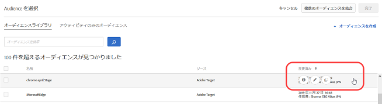
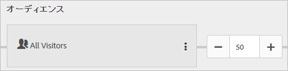

# オーディエンスの選択{#select-audience}

オーディエンスは、アクティビティの対象となるサイト訪問者を特定します。

>[!NOTE]
>
>既存のオーディエンスの選択に加え、新規のオーディエンスを作成する代わりに、複数のオーディエンスを結合してアドホックな結合オーディエンスを作成することができます。詳しくは、[複数のオーディエンスの結合](../../../c-target/combining-multiple-audiences.md#concept_A7386F1EA4394BD2AB72399C225981E5)を参照してください。

「[!UICONTROL オーディエンス]」ボックスで、編集アイコン（縦並びの省略記号）をクリックしてから、「**[!UICONTROL オーディエンスを置換]**」をクリックします。

デフォルトでは、すべての訪問者がオーディエンスです。ただし、オーディエンスを変更することができます。オーディエンスは、オーディエンスライブラリから選択できます。また、アクティビティのみのオーディエンスを作成することもできます。オーディエンスライブラリには、Target の一部として事前設計された一般的なオーディエンスを含め、以前に定義したオーディエンスが含まれています。ライブラリからオーディエンスを選択するか、[新しいオーディエンスを作成するか](../../../c-target/c-audiences/create-audience.md#task_1D507519D3AD4390B507F188BD294DC1)、[アクティビティのみのオーディエンスを作成する](../../../c-target/creating-activity-only-audience.md#concept_A6BADCF530ED4AE1852E677FEBE68483)ことができます。特定のオーディエンスのターゲット設定をしない A/B テストの場合は、デフォルトの「すべての訪問者数」を選択します。

以下のように、[!UICONTROL オーディエンスを選択]ダイアログボックスで対象のオーディエンスにカーソルを合わせることで、オーディエンスを編集またはコピーすることもできます。オーディエンスのコピーは、既存のオーディエンスと同様のオーディエンスを作成したい場合に便利です。オーディエンスのコピーを作成して編集し、新しいオーディエンスとして保存できます。このホバー機能は、他のタイプのアクティビティでも利用できます。

オーディエンスの作成時に、場所（mbox）を選択して、その場所のパラメーターを指定できます。「カスタムパラメーター」から mbox を選択し、必要なパラメーターを指定します。

>[!NOTE]
>
>オーディエンスリストを開いたときに、インポートされたオーディエンスが 10 分以上経っている場合は、オーディエンスがバックグラウンドで自動的にインポートされます。

下向き矢印をクリックして、既存のオーディエンスを削除するか、オーディエンスを変更します。

アクティビティに含める資格のある訪問者の割合を指定できます。例えば、すべての訪問者の 50％を含めることを選択できます。

Target が[トラフィックの自動割り当て](../../../c-activities/automated-traffic-allocation/automated-traffic-allocation.md#concept_A1407678796B4C569E94CBA8A9F7F5D4)をおこなうように選択することもできます。

## トレーニングビデオ

次のビデオでは、この記事に記載されている概念についてさらに詳しく説明します。

### Adobe Target での Audiences の使用（6：21）

このビデオでは、[!DNL Target Standard/Premium] におけるオーディエンスの使用方法を説明します。

* 用語「オーディエンス」の説明
* 最適化のためにオーディエンスを使用する 2 つの方法の説明
* オーディエンスリストでのオーディエンスの検索
* アクティビティのオーディエンスへのターゲット設定
* アクティビティの受動的なレポート用でのオーディエンスの使用

>[!VIDEO](https://video.tv.adobe.com/v/17398)

### アクティビティワークフロー - ターゲット設定（2:14）

このビデオでは、オーディエンスのセットアップに関する情報が説明されています。

* オーディエンスのアクティビティへの割り当て
* トラフィックの増減調整
* トラフィック配分方法の選択
* 様々なエクスペリエンスへのトラフィック配分

>[!VIDEO](https://video.tv.adobe.com/v/17385)

詳しくは、[オーディエンス](../../../c-target/c-audiences/audiences.md#concept_65BE870D290E412D8BBF557EEA67C271)を参照してください。
