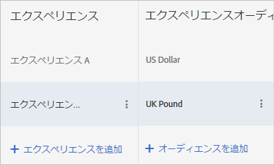

# A/B テストの複数のエクスペリエンスオーディエンス

[!DNL Adobe Target] A/Bアクティビティー内の異なるオーディエンスに、同じエクスペリエンスのバージョンをターゲットできます。 Visual Experience Composer またはフォームベースの Experience Composer で、1 つのエクスペリエンスに対して複数のオーディエンスを設定できます。

ユーザーは、プロファイルの変更に応じて、エクスペリエンスオーディエンスを切り替えることができます。アクティビティの有効期間では、ユーザーは同じエクスペリエンスに縛られません。

例えば、サイトがページや製品を通して一貫性のあるデザインを使用していて、同じエクスペリエンスを複数のオーディエンスに使用したい場合（ブラウザーの言語が異なる訪問者など）、エクスペリエンスのバージョンを複数設定することができます。例えば、英語と日本語の訪問者に同じエクスペリエンスを提示し、テキストだけを訪問者の言語に置き換えることがあります。エクスペリエンスのデータを言語に関係なく収集すれば、レポートは、バージョンのパフォーマンスではなくエクスペリエンスのパフォーマンスを示すことになります。

エクスペリエンスのバージョンを設定する機能がなければ、（この用例では）それぞれの言語に異なるテストを設定し、結果を手動で集計して、両言語で提供した単一のエクスペリエンスがどのようなパフォーマンスを示したかを推定しなければなりません。そのため、結果が不正確になります。テストによっては、訪問者がランダム化されるため、こういった計算が役に立たないこともあります。

1 つのエクスペリエンスから複数のバージョンを作成することで、手動の計算をしたり前提条件を立てたりしなくても、より正確な情報を入手できます。

## シナリオ

ジオターゲティングのバナーと汎用のバナーの 2 つのエクスペリエンスをテストしています。バナーは地域ごとに異なる必要がありますが、テスト全体の目的は、ジオターゲティングが汎用コンテンツの表示よりも良い結果を生むかどうかを確かめることです。各地域に異なるエクスペリエンスを設定すると、汎用バナーと比較した場合にジオターゲティングが成功目標に到達するために役立つかではなく、地域同士の効果の比較を測定することになってしまいます。

この場合に必要なのは、エクスペリエンスの地域特定のバージョンです。これにより、地域ターゲットのエクスペリエンスと地域ターゲットでないコントロールを対比してテストすることができます。

1. [通常通りに A/B アクティビティを作成](/help/c-activities/t-test-ab/t-test-create-ab/test-create-ab.md)します。

   複数のバージョンを持つエクスペリエンスを設定する際に、次の手順のようにして各バージョンのオーディエンスを選択します。

1. エクスペリエンスを選択し、**[!UICONTROL 設定]**／**[!UICONTROL オーディエンス]**／**[!UICONTROL 複数のオーディエンス]**&#x200B;をクリックします。

   

1. 「**[!UICONTROL オーディエンスを追加]**」をクリックし、ターゲットにしたい最初のオーディエンスを選択します。各オーディエンスについて繰り返します。

   

   オーディエンスがまだ存在しない場合は、「[オーディエンスを作成](/help/c-target/c-audiences/create-audience.md#task_E18BD77A9A8F4ED0AC50569F94556558)」をクリックして設定します。

   訪問者が 2 つ以上のオーディエンスにあてはまる場合は、すべてのオーディエンスのコンテンツが戻され、そのリストの中で最後のものが実際にページにレンダリングされます。

1. 続けてアクティビティを設定します。

## ベストプラクティス

* 互いに排反するオーディエンスを選択します。アクティビティが VEC で作成され、訪問者が 2 つ以上のオーディエンスにあてはまる場合は、それぞれのオーディエンスのコンテンツが戻され、リストの最後のオーディエンスのコンテンツが実際にページに表示されます。
* ダイアグラムで定義されたアクティビティエントリオーディエンスは、エクスペリエンスオーディエンスと AND の条件で組み合わされます。アクティビティに入るためには、訪問者はアクティビティのオーディエンスとエクスペリエンスオーディエンスのうちの 1 つにあてはまらなければなりません。
* レポートのセグメントとして、同じオーディエンスを追加します。これにより、高いレベルでのテスト結果（エクスペリエンス A 対エクスペリエンス B）と低いレベルでのテスト結果（「ブラウザー言語 ja_JP」だけのエクスペリエンス A 対エクスペリエンス B）を見るのに役立ちます。これは、Target ベースのレポートのみで機能するもので、Analytics ベースのレポートでは機能しません。

