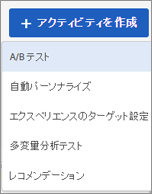
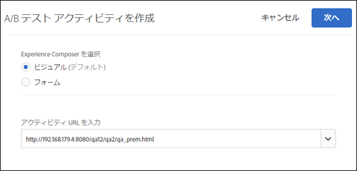
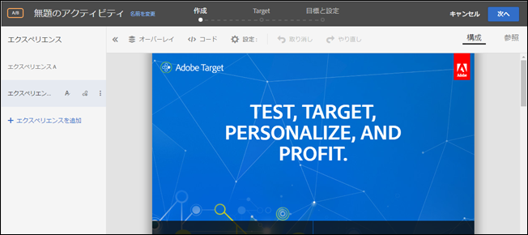
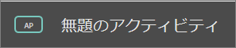
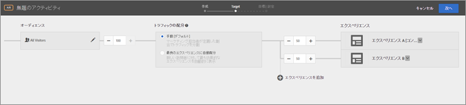
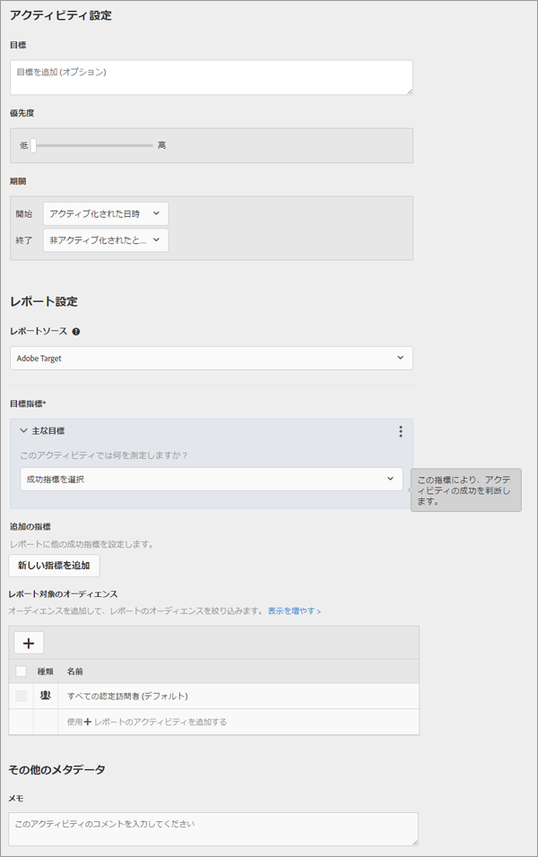

# A/B テストの作成{#create-an-a-b-test}

Target の Visual Experience Composer を使用すると、Target を有効にしたページに直接テストを作成し、Target 内でページの一部を変更することができます。

1. 「[!UICONTROL アクティビティ]」リストで、**[!UICONTROL アクティビティを作成]**／**[!UICONTROL A/B テスト]**を選択します。

   

   >[!NOTE]
   >
   >利用可能なアクティビティタイプは、[!DNL Target] アカウントによって異なります。一部のアクティビティタイプがリストに表示されない可能性があります。

   各種のアクティビティのタイプについて詳しくは、[アクティビティ](../../../c-activities/activities.md#concept_D317A95A1AB54674BA7AB65C7985BA03).

   

1. 必要があれば、**[!UICONTROL Visual Experience Composer]** を選択します。

   問題がある VEC のトラブルシューティング情報については、[Visual Experience Composer のトラブルシューティング](../../../c-experiences/c-visual-experience-composer/r-troubleshoot-composer/troubleshoot-composer.md#reference_77743144F10143A3A89D56E116D296E4)を参照してください。

   フォームベースの Experience Composer を使用したい場合は、そちらのオプションを選択します。詳しくは、[フォームベースの Experience Composer](https://marketing.adobe.com/resources/help/en_US/target/target/t_form_experience_composer.html) を参照してください。
1. [アクティビティ URL](../../../c-activities/t-test-ab/t-test-create-ab/ab-activity-url.md#concept_D28549AAA0A14E3BB5F05F32BE8ABC90) を指定してから、「**[!UICONTROL 作成]**」をクリックします。

   アカウントにデフォルトの URL が設定されている場合は、その URL がデフォルトで表示されます。デフォルトの URL を別の URL に変更できます。

   [!UICONTROL Visual Experience Composer] が表示され、URL で指定したページが表示されます。

   

1. 用意されている領域に、アクティビティの名前を入力します。

   

   次の文字はアクティビティ名として入力できません。

   | 文字 | 説明 |
   |--- |--- |
   | `/` | フォワードスラッシュ |
   | `?` | 疑問符 |
   | `#` | 番号記号 |
   | `:` | コロン |
   | `=` | イコール |
   | `+` | プラス |
   | `-` | マイナス |
   | `@` | アットマーク |

1. 新しいエクスペリエンスを作成します（ページ上の要素の変更）。

   新しいアクティビティを作成すると、[!UICONTROL Visual Experience Composer] の左側に「エクスペリエンス A」と「エクスペリエンス B」の 2 つのタブが表示されます。エクスペリエンス A はコントロールエクスペリエンスです。ここで注目するのは、必要に応じて変更が可能な「エクスペリエンス B」タブの方です。エクスペリエンス B は代替エクスペリエンスで、テストに追加することができます。テストには複数のエクスペリエンスを追加できます。デフォルトのサイトエクスペリエンスをオプションとして使用しない場合は、エクスペリエンス A をアクティビティから削除できます。

   [!UICONTROL Visual Experience Composer] でのエクスペリエンスの追加と変更について詳しくは、[エクスペリエンスの追加](../../../c-activities/t-test-ab/t-test-create-ab/ab-add-experience.md#task_454646F2895242D3B92DC395A0CE1A00).エクスペリエンス B を変更するには、ステップ 3 から始めます。

1. [!UICONTROL Visual Experience Composer] の上部にある「 **[!UICONTROL Target]**」をクリックして、3 ステップのガイドによるワークフロー内の次のステップに移ります。

   フロー図が開きます。

   

   フロー図を使用すると、アクティビティに対するオーディエンスの選択、およびエクスペリエンスの設定を順に実行できます。
1. [!UICONTROL オーディエンス]ボックスで編集アイコンをクリックし、アクティビティの[オーディエンスを選択](../../../c-activities/t-test-ab/t-test-create-ab/ab-audience.md#concept_A268236C1224451DB7844BF67F41A087)します。

   デフォルトで、オーディエンスはすべての訪問者に設定されています。1. アクティビティに参加する資格のある訪問者の割合を選択します。

   

   例えば、すべての訪問者の 50％に参加を制限したり、カリフォルニア州のオーディエンスの 45％に参加を制限したりできます。
1. トラフィックの配分を設定します。

   同じオーディエンスに対して複数のエクスペリエンスを表示することができます。選択したオーディエンスと、アクティビティに追加したエクスペリエンスが図に表示されます。

   「**[!UICONTROL 手動]**」を選択する場合、各エクスペリエンスを表示する参加者の割合を指定します。この割合は、全エクスペリエンス間で均等に配分することも、エクスペリエンスごとに大きく（または小さく）設定することもできます。全エクスペリエンスの合計が 100％になるようにします。

   「**[!UICONTROL 最良のエクスペリエンスに自動配分]**」を選択した場合は、ほとんどのアクティビティ参加者が、パフォーマンスの高いエクスペリエンスに自動的にリダイレクトされます。一部の訪問者は、エクスペリエンスの調査を継続し、パフォーマンスの傾向の変化を認識するために、すべてのエクスペリエンスに配分されます。[自動トラフィック配分](../../../c-activities/automated-traffic-allocation/automated-traffic-allocation.md#concept_A1407678796B4C569E94CBA8A9F7F5D4)を参照してください。

   「**[!UICONTROL 自動ターゲットで最適化]**」を選択した場合、Target は高度な機械学習アルゴリズムを使用して、目標を最大化できるよう訪問者を自動的に最適なエクスペリエンスに関連付けます。

   >[!NOTE]
   >
   >この「ファーストルック」は、テストおよびフィードバックのために、このリリースの数名のお客様に対して有効化されます。

   詳しくは、[自動ターゲットで最適化](../../../c-activities/auto-target-to-optimize.md#concept_67779E5B7F67427A97D7EA2A6FB919B3)を参照してください。

   「**[!UICONTROL エクスペリエンスを追加]」をクリックして別のエクスペリエンスをアクティビティに追加することもできます。**
1. オーディエンスとエクスペリエンスの選択が完了したら、「**[!UICONTROL 次へ]**」をクリックして、3 ステップのガイドによるワークフロー内の 3 番目のステップに移ります。
1. アクティビティの[目標と設定](../../../c-activities/t-test-ab/t-test-create-ab/ab-goals-and-settings.md#reference_B25389FD6F3A4989801E740364B089CC)を指定します。

   

1. 「**[!UICONTROL 保存]**」をクリックします。

アクティビティの作成後、「概要」タブに、アクティビティの図などアクティビティに関する情報が表示されます。

## トレーニングビデオ：A/Bテストの作成（8:36）

このビデオでは、[!DNL Target] で 3 ステップのガイドによるワークフローを使用して A/B テストを作成する方法を説明します。

* Adobe Target での A/B アクティビティの作成
* 手動分割または自動トラフィック配分によるトラフィックの配分

>[!VIDEO](https://video.tv.adobe.com/v/17391)
