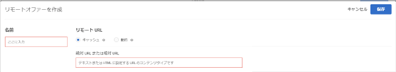

# リモートオファーを作成{#create-remote-offers}

リモートオファーを使用すると、Target 外にあり、Target が参照してユーザーのウェブサイトに提供するコンテンツをホスティングすることができます。このコンテンツは、利便上の理由またはセキュリティ上の理由で、コンテンツ管理や他のシステムにある場合があります。

>[!NOTE]
>
>リモートオファーは、フォームベースのコンポーザーでのみ作成することができます。mbox 位置にコンテンツが注入されるため、多くの場合グローバル mbox には適しません。
>
>[!DNL Target Classic]に同様の機能がありました。[!UICONTROL Offer on Your Site] と [!UICONTROL Offer Outside Test&amp;Target] です。

リモートオファーの例をいくつか挙げます。

* 様々なバージョンのクロス販売
* 動的な買い物かごのメッセージ
* フォーム
* カルキュレーター
* 金利の更新

**リモートオファーを作成するには：**

1. 「**[!UICONTROL オファー]**」をクリックしてから、「**コードオファー[!UICONTROL 」タブを選択します。]**
1. **[!UICONTROL 作成]** / **[!UICONTROL リモートオファー]**をクリックします。

   

1. オファーのわかりやすい名前を入力します。

   わかりやすい名前を付けると、後で [!UICONTROL アセット] ライブラリからオファーをすばやく見つけることができます。

1. リモートオファーのリモート URL を指定します。 

   | オプション | 説明 |
   |--- |--- |
   | キャッシュ | キャッシュされたリモートオファーが Target から提供されます。 [!DNL Target] は 2 時間ごとにリモート URL にあるコンテンツを取得し、コンテンツを Target 内に保存します。リモートオファーを含むエクスペリエンスで訪問者がサイトを読み込むと、Target がオファーを提供します。 キャッシュされたリモートオファーでは、Target にログインしたユーザーがコンテンツを変更することができないため、セキュリティも強化されます。コンテンツを変更するには、コンテンツ管理または他のシステムにログインしてそこでコンテンツを変更する必要があります。 キャッシュされたリモートオファーには、絶対または相対 URL を指定することができます。 |
   | 動的 | 動的リモートオファーは、Target から提供されるのではなく、コンテンツ管理または他のシステムから提供されます。 リモートオファーを含むエクスペリエンスで訪問者がサイトを読み込むたびに、Target が定期的にコンテンツをキャッシュし、その後配信するようにするのではなく、その代わりに、コンテンツをホスティングしているシステムを呼び出し、場合によっては特定の情報を渡すことで、戻ってくるオファーをユーザーごとに動的に（または異なるように）したい場合があります。 例えば、あるユーザーが、動的リモートオファーのエクスペリエンスを含むクレジットカード用ウェブサイトにログインしたら、そのユーザーのアカウント情報をパラメーターとして URL に渡すことができます。そうすると、ウェブサイトは、アカウントの残高など、ユーザーに特化した情報を提供することができます。 1 つ以上の mbox またはリクエストパラメーターを追加するには「[!UICONTROL パラメーターを追加]」をクリックします。 |

1. 「**[!UICONTROL 保存]**」をクリックします。

## リモートオファー使用時のベストプラクティス {#section_7718512D08E14121B6F6B8C38134F4BC}

アクティビティでリモートオファーを使用する際のベストプラクティス：

* mbox と同じドメインにオファーがある場合、「[!UICONTROL キャッシュ]」オプションを使用すると、オファーの位置を指定するのに相対 URL を使うことができます。

   つまり、ステージングサーバーから実稼動サーバーにアクティビティを移動する際、URL を手動で変更しなくても、そのコンテンツに自動的にアクセスできるようになります。

* サーバーが動的に生成するデータでテストをおこなう場合は、「[!UICONTROL 動的]」オプションを選択することをお勧めします。
* 既存のリモートオファーコンテンツの外見のテストをおこなう予定であれば、[!UICONTROL Visual Experience Composer] を使用し、コンテンツ管理システムから戻されるコンテンツの外観と操作性を変更します。
* リモートオファー選択マトリックスを使用して、特定の事例に最適なオファーを選択できます。ご質問がある場合は、アカウント担当者にお問い合わせください。

## 動的なリモートオファーの仕組み {#concept_CC2A969420B34364A9FA78C1CE251818}

動的なオファーでは、動的なページテクノロジーを使用してオファーに値を渡します。

オファーはページのレンダリング後に実行されます。非表示の iframe でデータを収集し、フレーム外にそのデータをコピーして、ページ上に挿入します。ここで、渡された値がロードされます。

## リモートオファー選択のマトリックス {#reference_B23BEDD29DDD47709A7651AFD27E776B}

リモートオファーには[!UICONTROL キャッシュ]と[!UICONTROL 動的]の 2 つのタイプがあり、リモートオファー選択のマトリックスは、どちらのタイプを選択するか判断するのに役立ちます。

| 機能 | キャッシュ | 動的 |
|--- |--- |--- |
| 訪問者がリクエストするたびに更新 | × | ○ |
| コンテンツの更新 | 2 時間ごとにキャッシュ | リクエストのたびにすぐに更新 |
| 読み込み時間 | 高速 | リクエスト処理が原因となり低速 |
| ページ上での JavaScript の確認 | ○ | 不可（URL 経由で渡すことは可能） |
| オファーへの JavaScript の追加 | ○ | × |
| オファーの URL | 絶対または相対 | 相対 |
| リクエストするコンピューター | Adobe サーバー | 訪問者の Cookie を処理する訪問者のコンピューター |