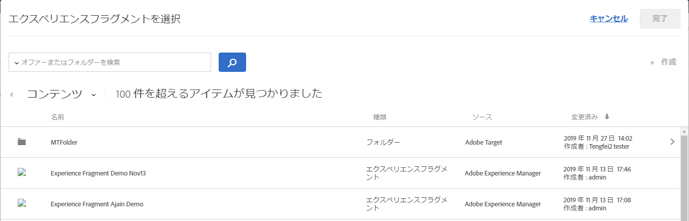

# AEM エクスペリエンスフラグメント{#aem-experience-fragments}

Information about using experience fragments created in [!DNL Adobe Experience Manager] (AEM) in [!DNL Target] activities to aid optimization or personalization.

>[!NOTE]
>
>This feature requires that you are an [!DNL Adobe Experience Manager] (AEM) customer. 詳しくは、以下の「[要件](../../c-experiences/c-manage-content/aem-experience-fragments.md#section_AE6F0971E1574B3AA324003599B96E5A)」を参照してください。

## 概要 {#section_95A91830530F493B81C5C9CDB9B783EA}

Using experience fragments created in AEM in [!DNL Target] activities lets you combine the ease-of-use and power of AEM with powerful Automated Intelligence (AI) and Machine Learning (ML) capabilities in [!DNL Target] to test and personalize experiences at scale.

AEM では、パーソナライゼーション戦略に生かせるよう、すべてのコンテンツとアセットが一元化されます。コードを記述しなくても、デスクトップ、タブレット、モバイルデバイス向けのコンテンツを 1 か所で簡単に作成できます。各デバイスにページを作成する必要はありません。 AEMは、コンテンツを使用して各エクスペリエンスを自動的に調整します。

[!DNL Target] では、行動、コンテキスト、オフラインの変数を組み込んだルールベースの手法と AI 駆動の機械学習手法を組み合わせ、それを土台にしてパーソナライズされたエクスペリエンスを幅広く提供できます。With [!DNL Target] you can easily set up and run [A/B Test](/help/c-activities/t-test-ab/test-ab.md) and [Multivariate](/help/c-activities/c-multivariate-testing/multivariate-testing.md) (MVT) activities to determine the best offers, content, and experiences.

Experience fragments represent a huge step forward to link the content/experience creators and managers to the optimization and personalization professionals who are driving business outcomes using [!DNL Target].

## 要件 {#section_AE6F0971E1574B3AA324003599B96E5A}

You must be provisioned with the experience fragments functionality within [!DNl Target]. さらに、適切なサービスパックまたは AEM 6.4（またはそれ以降）と共に AEM 6.3 を使用する必要があります。アカウント担当者が、この機能を利用するための条件を満たすお手伝いをいたします。

* Adobe Experience Manager 6.4（またはそれ以降）。
* Adobe Experience Manager 6.3 SP2（またはそれ以降）。
* Adobe Target Standard または Adobe Target Premium アカウント。
* Contact [Adobe Target Customer Care](/help/cmp-resources-and-contact-information.md#reference_ACA3391A00EF467B87930A450050077C) to enable the integration and to provide you with authentication details.

## AEM でエクスペリエンスフラグメントを作成および設定する {#section_745C8EFE29F547A2958FDBF61A5ADF7B}

In order to use AEM experience fragments in [!DNL Target], you must perform the following steps:

### 手順 1：AEM と Target を統合する

詳しくは、次を参照してください。

* **AEM 6.3**: [Adobe Experience Manager 6.3のドキュメントで](https://docs.adobe.com/docs/en/aem/6-3/administer/integration/marketing-cloud/opt-in.html) 、Adobe AnalyticsおよびAdobe targetにオ _プトインします_ 。
* **AEM 6.4**: [Adobe Experience Manager 6.4のドキュメントで](https://helpx.adobe.com/experience-manager/6-4/sites/administering/using/opt-in.html) 、Adobe AnalyticsおよびAdobe targetにオ _プトインします_ 。
* **AEM 6.5**: [Adobe Experience Manager 6.5のドキュメントで](https://helpx.adobe.com/experience-manager/6-5/sites/administering/using/opt-in.html) 、Adobe AnalyticsおよびAdobe targetにオ *プトインします* 。

### 手順 2：エクスペリエンスフラグメントを作成する

エクスペリエンスフラグメントは AEM 内に作成されます。詳しくは、次を参照してください。

* **AEM 6.3**: [Experience](https://docs.adobe.com/docs/en/aem/6-3/author/experience-fragments.html) Fragments( *Adobe Experience Manager 6.3ドキュメント* )。
* **AEM 6.4**: [Experience](https://helpx.adobe.com/experience-manager/6-4/sites/authoring/using/experience-fragments.html) Fragments( *Adobe Experience Manager 6.4ドキュメント)を参照してください* 。
* **AEM 6.5**: [Experience](https://helpx.adobe.com/experience-manager/6-5/sites/authoring/using/experience-fragments.html) Fragments( *Adobe Experience Manager 6.5ドキュメント* )。

### 手順 3：AEM でエクスペリエンスフラグメントを Target と共有するよう設定する

1. From within AEM, select the desired experience fragment or its containing folder, then click **[!UICONTROL Properties]**.
2. Click the **[!UICONTROL Cloud Services]** tab, then from the **[!UICONTROL Cloud Service Configuration]** drop-down list, select **[!UICONTROL Adobe Target]**.

   >[!NOTE]
   >
   >The previous step assumes that someone in your organization has created the [!DNL Adobe Target] configuration.

3. 「**[!UICONTROL 保存して閉じる]**」をクリックします。

### 手順 4：エクスペリエンスフラグメントを発行し、Target にエクスポートする

AEMのバージョンに応じて、次のリンクを参照して手順を確認してください。

* **AEM 6.3**: [Adobe Experience Manager 6.3ドキュメン](https://helpx.adobe.com/experience-manager/6-3/sites/administering/using/experience-fragments-target.html) トで、エクスペリエンスフラグメントをTargetに書き出します ** 。
* **AEM 6.4**: [Adobe Experience Manager 6.4ドキュメン](https://docs.adobe.com/content/help/en/experience-manager-64/administering/integration/experience-fragments-target.html) トで、エクスペリエンスフラグメントをTargetに書き出します ** 。
* **AEM 6.5**: [Adobe Experience Manager 6.5ドキュメン](https://helpx.adobe.com/experience-manager/6-5/sites/administering/using/experience-fragments-target.html) トで、エクスペリエンスフラグメントをTargetに書き出します ** 。

## Target アクティビティ でのエクスペリエンスフラグメントの使用 {#section_17CE4BE6B2B74CCEBAE0C68DEB84ABB9}

ここまでのタスクを完了すると、エクスペリエンスフラグメントが Target の[!UICONTROL オファー]ページに表示されます。

>[!NOTE]
>
>[!DNL Target] は現在、読み込むエクスペリエンスフラグメントを 10 分ごとに検索します。The imported experience fragment should be available in [!DNL Target] within ten minutes, but this time frame should shorten going forward.

>[!IMPORTANT]
>
>The experience fragment is currently imported into [!DNL Target] as an HTML offer. エクスペリエンスフラグメントの「マスター」バージョンは、AEM 内に残ります。Target でエクスペリエンスフラグメントを編集することはできません。

You can hover over an experience fragment in the list, then click the View icon  to see additional information about the experience fragment, including its public offer delivery URL, its AEM path, and a deep link to open the experience fragment inside of AEM.

You can consume Experience Fragments in [!DNL Target] activities using the [Visual Experience Composer](/help/c-experiences/c-visual-experience-composer/visual-experience-composer.md) (VEC) or the [Form-Based Experience Composer](/help/c-experiences/form-experience-composer.md).

>[!NOTE]
>
>To fully utilize the [!DNL Target] AI and ML functionality, you can select [Auto-Allocate](../../c-activities/automated-traffic-allocation/automated-traffic-allocation.md#concept_A1407678796B4C569E94CBA8A9F7F5D4) or [Auto-Allocate](/help/c-activities/automated-traffic-allocation/automated-traffic-allocation.md) while creating an A/B Test.

**VEC でエクスペリエンスフラグメントを使用するには：**

1. In [!DNL Target], while creating or editing an experience in the [Visual Experience Composer](../../c-experiences/experiences.md#concept_A2E10F6AFB3D4AEAB6951EE14688848D), click the location on the page where you want to insert AEM content, then select the desired option to display the [!UICONTROL Choose an Experience Fragment] list.

   * [!UICONTROL 前に挿入]
   * [!UICONTROL 後ろに挿入]
   * [!UICONTROL エクスペリエンスフラグメントとの置き換え]
   The [!UICONTROL Experience Fragment] list displays all of the content created in AEM that is now natively available from within [!DNL Target].

   >[!NOTE]
   >
   >「[!UICONTROL エクスペリエンスフラグメントと交換]」オプションは、画像には使用できません。画像にこのオプションを使用する場合は、目的の画像を含むコンテナ要素をクリックします。

   

1. Select the desired experience fragment, then click **[!UICONTROL Done]**.
1. アクティビティの設定を終了します。

   各タイプのアクティビティを設定する方法について詳しくは、次のトピックを参照してください。

   * **A/B テスト：** [A/B テストの作成](../../c-activities/t-test-ab/t-test-create-ab/test-create-ab.md#task_68C8079BF9FF4625A3BD6680D554BB72)
   * **自動配分：** [自動配分](../../c-activities/automated-traffic-allocation/automated-traffic-allocation.md#concept_A1407678796B4C569E94CBA8A9F7F5D4)
   * **自動ターゲット：** [パーソナライズされたエクスペリエンスの自動ターゲット](../../c-activities/auto-target-to-optimize.md#concept_67779E5B7F67427A97D7EA2A6FB919B3)
   * **自動パーソナライゼーションアクティビティ（AP）：**[自動パーソナライゼーションアクティビティの作成](../../c-activities/t-automated-personalization/create-ap-activity.md#task_8AAF837796D74CF893CA2F88BA1491C9)
   * **エクスペリエンスターゲット設定（XT）：** [エクスペリエンスのターゲット設定アクティビティの作成](../../c-activities/t-experience-target/t-xt-create/xt-create.md#task_D6B3429AC31549E1A70EDF04B3DDC765)
   * **多変量分析テスト（MVT）：** [多変量分析テストの作成](../../c-activities/c-multivariate-testing/t-create-multivariate-test/create-multivariate-test.md#task_BF870FA60A8245AB8F0B775BE32EA710)
   * **Recommendations：** [Recommendations アクティビティの作成](../../c-recommendations/t-create-recs-activity/create-recs-activity.md#task_6874328773C64C44A73F0A130AD3F96F)

**フォームベースの Experience Composer でエクスペリエンスフラグメントを使用するには：**

1. In [!DNl Target], while creating or editing an experience in the [Form-Based Experience Composer](../../c-experiences/form-experience-composer.md#task_FAC842A6535045B68B4C1AD3E657E56E), select the location on the page where you want to insert AEM content, then select **[!UICONTROL Change Experience Fragment]** to display the [!UICONTROL Choose an Experience Fragment] list.

   

   The [!UICONTROL Experience Fragment] list displays all of the content created in AEM that is now natively available from within [!DNL Target].

1. 対象のエクスペリエンスフラグメントを選択し、「**[!UICONTROL 保存]**」をクリックします。
1. アクティビティの設定を終了します。

## 注意点 {#considerations}

* [!DNL Target] は現在、読み込むエクスペリエンスフラグメントを 10 分ごとに検索します。The imported experience fragment should be available in [!DNL Target] within ten minutes, but this time frame should shorten going forward.
* The experience fragment is currently imported into [!DNL Target] as an HTML offer. エクスペリエンスフラグメントの「マスター」バージョンは、AEM 内に残ります。You cannot edit the experience fragment in [!DNL Target].
* JSONオファーをエクスペリエンスフラグメントとしてに読み込むことができま [!DNL Target]す。 ただし、これらのオファーはHTMLオファーとして読み込まれます。 JSONオファー（エクスペリエンスフラグメント）は、現在、 [!DNL Target] UIで完全にはサポートされていません。

## トレーニングビデオ：AEM エクスペリエンスフラグメントと Adobe Target の使用{#section_C0EDC54063464F41A182492D2045BC64}

次のビデオでは、エクスペリエンスフラグメントの設定および使用方法について説明します。[Adobe Target での AEM エクスペリエンスフラグメントの使用](https://helpx.adobe.com/experience-manager/kt/sites/using/experience-fragment-target-feature-video-use.html)
