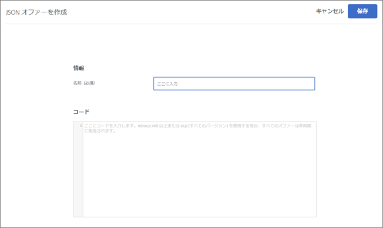
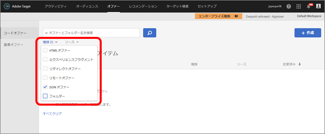

# JSON オファーの作成{#create-json-offers}

オファーライブラリにフォームベースの Experience Composer で使用する JSON オファーを作成します。

JSON オファーはフォームベースのアクティビティで使用し、SPA フレームワークまたはサーバー側統合で使用するオファーを JSON 形式で送信するために、Target の判定が必要な使用例に対応できます。

JSON オファーを使用する際は次の点を考慮してください。

* JSON オファーは現在、AB および XT アクティビティのみで利用できます。
* JSON オファーはフォームベースのアクティビティのみで使用できます。
* JSON オファーは、サーバー側 API、Mobile SDK または NodeJS SDK を使用している場合は直接取得できます。
* ブラウザーでは、JSON オファーは、at.js 1.2.3 以降と[getOffer()](/help/c-implementing-target/c-implementing-target-for-client-side-web/adobe-target-getoffer.md) を介して、`setJson` アクションによってアクションをフィルタリングすることでのみ取得できます。
* JSON オファーは、文字列ではなくネイティブの JSON オブジェクトとして配信されます。これらのオブジェクトを利用する際に、オブジェクトを文字列として処理し、JSON オブジェクトに変換する必要はなくなりました。
* JSON オファーはビジュアルオファーではないので、他のオファー（HTML オファーなど）とは異なり自動的に適用されることはありません。開発者は  [getOffer（）](/help/c-implementing-target/c-implementing-target-for-client-side-web/adobe-target-getoffer.md)を参照してください。
* JSON オファーは、mbox.js を使用している場合はサポートされません。

## JSON オファーの作成方法 {#section_BB9C72D59DEA4EFB97A906AE7569AD7A}

1. 「**[!UICONTROL オファー]**」をクリックしてから、「**コードオファー[!UICONTROL 」タブを選択します。]**
1. **[!UICONTROL 作成]** / **[!UICONTROL JSON オファー]**をクリックします。

   

1. オファー名を入力します。
1. 「**[!UICONTROL コード]」ボックスに JSON コードを入力するか貼り付けます。**
1. 「 **[!UICONTROL 保存]**」をクリックします。

## 例 {#section_A54F7BB2B55D4B7ABCD5002E0C72D8C9}

JSON オファーは、フォームベースの Experience Composer を使用して作成されたアクティビティでのみ利用できます。現時点で JSON オファーを使用できる方法は、直接の API 呼び出しのみとなっています。

次に例を示します。

```
adobe.target.getOffer({ 
  mbox: "some-mbox", 
  success: function(actions) { 
    console.log('Success', actions); 
  }, 
  error: function(status, error) { 
    console.log('Error', status, error); 
  } 
});
```

success コールバックに渡すアクションは、オブジェクトの配列です。次のコンテンツを含む単一の JSON オファーがあるとします。

```
{ 
  "demo": {"a": 1, "b": 2} 
}
```

アクション配列は次のような構成になります。

```
[ 
 { 
   action: "setJson", 
   content: [{ 
     "demo": {"a": 1, "b": 2} 
   }] 
 }  
]
```

JSON オファーを抽出するには、アクションを繰り返し処理して `setJson` アクションを含むアクションを見つけ、コンテンツ配列を繰り返し処理します。

## ユースケース {#section_85B07907B51A43239C8E3498EF58B1E5}

次の JSON オファーが Web ページに配信されるとします。

```
{ 
    "_id": "5a65d24d8fafc966921e9169", 
    "index": 0, 
    "guid": "7c006504-c6f7-468d-a46f-f72531ea454c", 
    "isActive": true, 
    "balance": "$2,075.06", 
    "picture": "https://placehold.it/32x32", 
    "tags": [ 
      "esse", 
      "commodo", 
      "excepteur", 
    ], 
    "friends": [ 
      { 
        "id": 0, 
        "name": "Carla Lyons" 
      }, 
      { 
        "id": 1, 
        "name": "Ollie Mooney" 
      }, 
    ], 
    "greeting": "Hello, Stephenson Fernandez! You have 4 unread messages.", 
    "favoriteFruit": "strawberry" 
} 
  
```

次のコードは、「greeting」属性にアクセスする方法を示しています。

```
adobe.target.getOffer({   
  "mbox": "name_of_mbox", 
  "params": {}, 
  "success": function(offer) {           
        console.log(offer[0].content[0].greeting); 
  },   
  "error": function(status, error) {           
      console.log('Error', status, error); 
  } 
});
```

## JSON オファータイプでのオファーのフィルタリング {#section_52533555BCE6420C8A95EB4EB8907BDE}

**[!UICONTROL 種類]**ドロップダウンリストをクリックし、「**JSON オファー[!UICONTROL 」チェックボックスをオンにすることで、オファーライブラリにフィルターを適用して JSON オファータイプを抽出できます。]**



