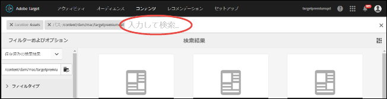
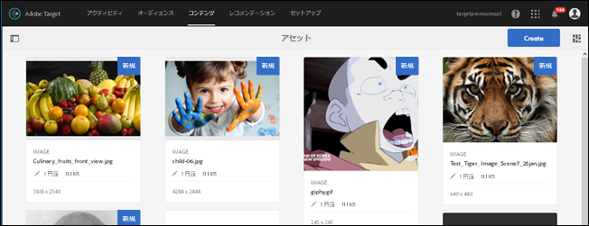
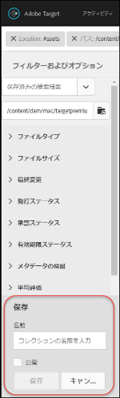
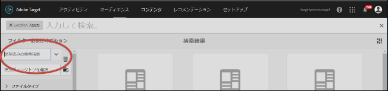

# コンテンツの検索とスマートコレクションの作成{#search-content-and-create-smart-collections}

キーワードでアセットを検索し、スマートコレクションと呼ばれる検索フォルダーを保存します。スマートコレクションは、検索結果を反映して自動的に更新されます。

このセクションでは、以下について説明します。

* [キーワードによるアセットの検索](../../c-experiences/c-manage-content/filter-and-search-content.md#section_2465A71BC95942588F586B1EC8B9E5DB)
* [スマートコレクションの保存](../../c-experiences/c-manage-content/filter-and-search-content.md#section_5C95159543B5405EB8C8E47B518DF4AB)

## キーワードによるアセットの検索 {#section_2465A71BC95942588F586B1EC8B9E5DB}

1. **[!UICONTROL オファー]**／**[!UICONTROL 画像オファー]**をクリックして、[!UICONTROL アセットライブラリ]にアクセスします。

   右上隅の[!UICONTROL カード表示]アイコンをクリックして、カード表示形式でアセットを表示します。

   または

   右上隅の[!UICONTROL リスト表示]アイコンをクリックして、リスト表示形式でアセットを表示します。

1. 左上隅の**[!UICONTROL コンテンツのみ]アイコンをクリックして、検索ボックスを表示します。**

   

1. 検索ボックスに探しているアセットのキーワードを入力して、Enter キーを押します。

## スマートコレクションの保存 {#section_5C95159543B5405EB8C8E47B518DF4AB}

スマートコレクションと呼ばれる保存済み検索を作成して、同様の検索を実行する際に時間を節約できます。保存済み検索によって、検索結果が自動的に更新されるスマートコレクションが作成されます。

1. **[!UICONTROL オファー]**／**[!UICONTROL 画像オファー]**をクリックして、[!UICONTROL アセットライブラリ]にアクセスします。

   

1. 左上隅の**[!UICONTROL コンテンツのみ]**アイコンをクリックして、左側のレールに[!UICONTROL フィルターおよびオプション]パネルを表示します。
1. **[!UICONTROL 参照]**アイコンをクリックして、[!UICONTROL パスを選択]ダイアログボックスを表示します。

   

1. スマートコレクションの基盤として希望するフォルダーを参照して選択し、**[!UICONTROL 確認]アイコンをクリックします。**

   

1. （オプション）様々なオプションから選択して、ファイルタイプやサイズなどで検索結果を絞りこむことができます。
1. **[!UICONTROL フィルターおよびオプション]パネルの下部で「**[!UICONTROL スマートコレクションを保存]」をクリックして、「保存」オプションを表示します。

   

1. スマートコレクションの名前を指定し、[!DNL Target] アカウントのすべてのユーザーがこのスマートコレクションにアクセスできるようにする場合は、「**[!UICONTROL 公開]**」チェックボックスを選択して、「**[!UICONTROL 保存]**」をクリックします。

   保存済み検索結果のリストにこのスマートコレクションが追加され、以降使用できるようになります。

   

保存されたスマートコレクションを編集するには、[!UICONTROL 保存済みの検索結果]ドロップダウンリストからこれを選択して開き、「[!UICONTROL スマートコレクションを編集]」をクリックします。
