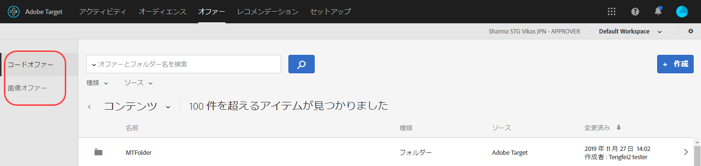
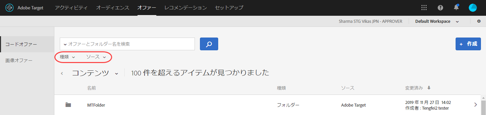
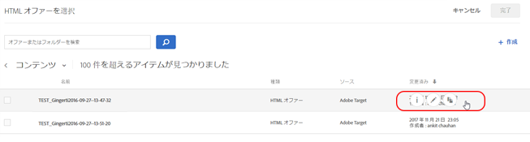
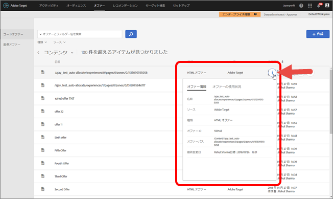
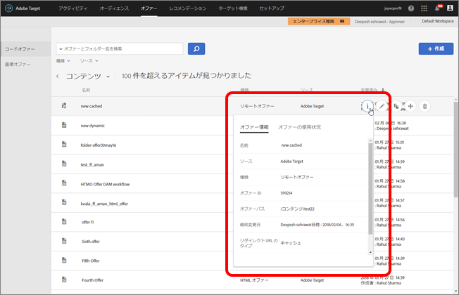

# オファー{#offers}

オファーライブラリを使用して、コードオファーおよび画像オファーコンテンツを管理します。

>[!NOTE]
>
>2017 年 1 月のリリースでは、[!DNL Target Classic]、[!DNL Adobe Experience Manager]（AEM）、[!DNL Adobe Mobile Services]（AMS）および API で作成されたオファーが [!DNL Target Standard/Premium] ユーザーインターフェイスに表示されるようになりました。過去 2 年間（2015 年 1 月以降）にこれらの方法で更新されたオファーが表示されます。組織の任意のユーザーが[!UICONTROL オファー]ページを初めて開く際に、最初の同期が発生します。最初の同期にかかる時間は、データ量によって異なります。最初の同期の後、データは増分で同期されます。このリリース以前にコードとイメージを同一フォルダー内に保存していた場合、コードとイメージは [!DNL Target] によって 2 つの重複フォルダーに分けられます。更新日時は、フォルダーが移行された際の時間を示し、元々フォルダーを作成した日付は反映されないことに注意してください。

**[!UICONTROL オファー]をクリックして、ライブラリを開きます。**ライブラリには、[!DNL Target Standard/Premium]、[!DNL Target Classic]、[!DNL Adobe Experience Manager]（AEM）、[!DNL Adobe Mobile Services]（AMS）および API で設定されたオファーが含まれています。[!DNL Target Classic] またはその他のソリューションで作成されたオファーは [!DNL Target Standard/Premium] で編集可能です。

[!UICONTROL オファー]ページには、右側に「コードオファー」と「画像オファー」の 2 つのタブがあり、タイプ別にオファーを表示できます。

タイプ別（HTML オファー、リダイレクトオファー、リモートオファー、フォルダー）およびソース別（Adobe Target、Adobe Target Classic、Adobe Experience Manager、Adobe Mobile Services または API）にオファーをフィルターできます。

フォルダーまたはオファーを編集またはコピーするには、目的の項目にカーソルを移動し、編集またはコピーアイコンをクリックします。

## オファー定義の表示 {#section_6B059DD121434E6292CAB393507D010E}

オファー定義の詳細は、オファーを開かなくても、オファーライブラリのポップアップカードで確認できます。

例えば、以下に示す HTML オファーのオファー定義カードは、コンテンツリスト上のオファーにカーソルを合わせ、情報アイコンをクリックすると表示されます。

以下の情報が表示されます。

* 名前
* ソース
* タイプ
* オファー ID
* オファーパス
* 最終変更日

「[!UICONTROL オファーの使用状況]」タブをクリックし、各オファー定義のポップアップカードのコードオファーを参照しているアクティビティを表示します。この機能は画像オファーには適用されません。これにより、オファーの編集中に他のアクティビティに影響が及ぶことを防止できます。情報にはライブアクティビティおよび非アクティブなアクティビティも含まれます。

以下に示すリダイレクトオファーのオファー定義カードの場合：

以下の情報が表示されます。

* 名前
* ソース
* タイプ
* オファー ID
* オファーパス
* 最終変更日
* リダイレクト URL
* すべての URL パラメーターを含める（オンまたはオフ）
* mbox のセッション ID を渡す（オンまたはオフ）

以下に示すリモートオファーのオファー定義カードの場合：

以下の情報が表示されます。

* 名前
* ソース
* タイプ
* オファー ID
* オファーパス
* 最終変更日
* リダイレクト URL のタイプ
* 絶対 URL または相対 URL

## トレーニングビデオ:Content Repository

このビデオでは、オファーの管理について説明します。

* [Experience Cloud アセットライブラリ](https://marketing.adobe.com/resources/help/en_US/mcloud/creative_cloud.html)と Target コンテンツライブラリの間の接続
* カスタム HTML オファー
* Visual Experience Composer のカスタム HTML オファー

>[!VIDEO](https://video.tv.adobe.com/v/17387)