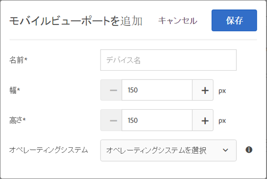
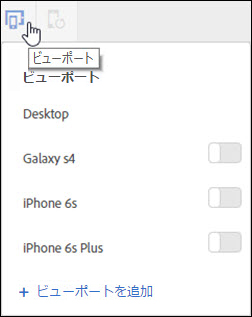
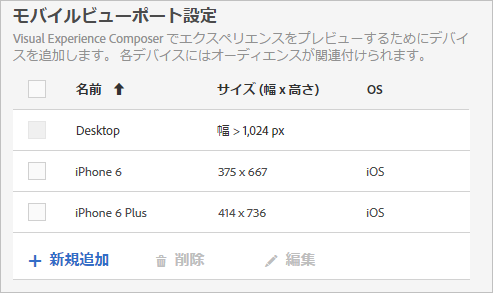
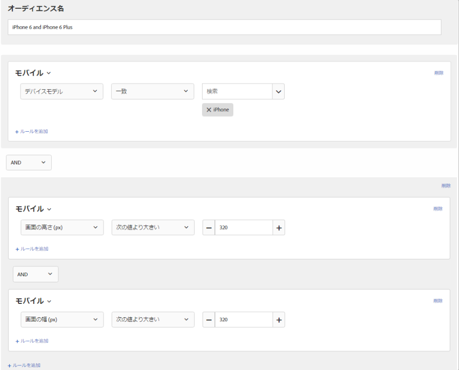

# レスポンシブエクスペリエンスのためのモバイルビューポート{#mobile-viewports-for-responsive-experiences}

モバイルビューポートを使用すると、様々な画面サイズでのアクティビティの表示をプレビューできます。

モバイルビューポートのプレビュー機能は、レスポンシブサイト用に設計されています。サイトがレスポンシブで、デスクトップページと同じ要素が異なる設定でモバイルページに使用されている場合、モバイルビューポートを使用します。[!DNL m.mysite.com]などの別の構造を持つ別のモバイルサイトがある場合は、[複数ページアクティビティ](../../c-experiences/c-visual-experience-composer/multipage-activity.md#concept_277E096063E14813AC5D8EDFA1D2ED48)を使用します。

>[!NOTE]
>
>リダイレクトオファーのオーバーレイと重複する場合、モバイルビューポートは利用できません。

ビューポートは、画面いっぱいに広げられた Web ページの長方形のサイズで定義されます。ブラウザーウィンドウのサイズからスクロールバーとツールバーを引いたサイズになります。ブラウザーは、「CSS ピクセル」を使用します。Retina ディスプレイを備えたデバイスなど、多くのデバイスでは、ビューポートは、宣伝されているデバイスの解像度より小さくなります。

次に、一般的なデバイスのビューポートと解像度を示します。Target では、ビューポートのサイズを使用することを忘れないでください。

| デバイス | ビューポートのサイズ | デバイスの解像度 |
|---|---|---|
| iPhone X | 375（w） x 812（h） | 1125（w） x 2436（h） |
| iPhone 8 Plus | 414（w） x 736（h） | 1,080（w） x 1,920（h） |
| iPhone 8 | 375（w） x 667（h） | 750（w） x 1334（h） |
| iPhone 7 Plus | 414（w） x 736（h） | 1,080（w） x 1,920（h） |
| iPhone 7 | 375（w） x 667（h） | 750（w） x 1334（h） |
| iPhone 6 | 375（w） x 667（h） | 750（w） x 1334（h） |
| iPhone 6s | 414（w） x 736（h） | 1,080（w） x 1,920（h） |
| iPadPro | 1024（w） x 1366（h） | 2048（w） x 2732（h） |
| iPad 第 3 ＆第 4 世代 | 768（w） x 1,024（h） | 1,536（w） x 2,048（h） |
| iPad Air 1 &amp; 2 | 768（w） x 1,024（h） | 1,536（w） x 2,048（h） |
| iPad Mini | 768（w） x 1,024（h） | 768（w） x 1,024（h） |
| iPad Mini 2 &amp; 3 | 768（w） x 1,024（h） | 1,536（w） x 2,048（h） |
| Nexus 6P | 411（w） x 731（h） | 1440（w） x 2560（h） |
| Nexus 5X | 411（w） x 731（h） | 1,080（w） x 1,920（h） |
| Google Pixel | 411（w） x 731（h） | 1,080（w） x 1,920（h） |
| Google Pixel XL | 411（w） x 731（h） | 1440（w） x 2560（h） |
| Google Pixel 2 | 411（w） x 731（h） | 1,080（w） x 1,920（h） |
| Google Pixel 2 XL | 411（w） x 731（h） | 1440（w） x 2560（h） |
| Samsung Galaxy Note 5 | 480（w） x 853（h） | 1440（w） x 2560（h） |
| LG G5 | 480（w） x 853（h） | 1440（w） x 2560（h） |
| One Plus 3 | 480（w） x 853（h） | 1,080（w） x 1,920（h） |
| Samsung Galaxy S9 | 360（w） x 740（h） | 1440（w） x 2960（h） |
| Samsung Galaxy S9+ | 360（w） x 740（h） | 1440（w） x 2960（h） |
| Samsung Galaxy S8 | 360（w） x 740（h） | 1440（w） x 2960（h） |
| Samsung Galaxy S8+ | 360（w） x 740（h） | 1440（w） x 2960（h） |
| Samsung Galaxy S7 | 360（w） x 640h | 1440（w） x 2560（h） |
| Samsung Galaxy S7 Edge | 360（w） x 640h | 1440（w） x 2560（h） |
| Nexus 7 (2013) | 600（w） x 960（h） | 1200（w） x 1,920（h） |
| Nexus 9 | 768（w） x 1,024（h） | 1,536（w） x 2,048（h） |
| Samsung Galaxy Tab 10 | 800（w） x 1280（h） | 800（w） x 1280（h） |
| Chromebook Pixel | 1280（w） x 850（h） | 2560（w） x 1700（h） |

人気のデバイスのビューポートのサイズは様々な web サイトに表記されています。For example, see [https://mediag.com/news/popular-screen-resolutions-designing-for-all/](https://mediag.com/news/popular-screen-resolutions-designing-for-all/) or consult the device maker&#39;s website.

特定のデバイスを使用するユーザーにアクティビティを配信したい場合、アクティビティ図でそのデバイスに最適なオーディエンスを選択します。Mobile Web Composer を使用して、そのデバイスのアクティビティのページを編集します。デジタルエクスペリエンス全体にわたってアクティビティを実行したい場合で、すべてのデバイスで良好な見た目になるようにする場合、ターゲティングを適用せず、モバイルビューポートを使用して各スクリーンサイズでアクティビティをプレビューしてください。

レスポンシブサイトがある場合、通常、サイトは、特定の画面サイズのデバイスでアクセスされると、異なるビューで開くようにデザインされています。新しいビューをトリガーするこれらの画面サイズは、*CSS ブレークポイント*とも呼ばれます。Target で CSS ブレークポイントを保存して、定義した各ビューでエクスペリエンスをプレビューできます。これらの各エクスペリエンスは、Target インターフェイスのモバイルビューポートに表示されます。ディスプレイの上部にあるビューポートをクリックして、各画面サイズのビューを開きます。

サイトがレスポンシブでない場合、アクティビティが特定のデバイスをターゲットにしていれば、引き続き Mobile Web Composer を使用してサイトを表示できます。

>[!NOTE]
>
>モバイルビューポート内からエクスペリエンスを編集できますが、これらの変更は作業中のビューポートだけではなく、すべてのビューポートおよびデバイスに適用されます。同様に、通常のデスクトップビューでのエクスペリエンスの編集は、そのデスクトップビューだけでなく、すべての画面サイズのページを変更します。現在は、ビューポート専用のページの変更はサポートしていません。

## モバイルビューポート設定 {#task_B4B161499DC0470584ED922A4D20FCAB}

エクスペリエンスを作成する際に、使用可能にするモバイルビューポートを設定します。

1. **[!UICONTROL セットアップ]**／**[!UICONTROL 環境設定]** をクリックします。
1. アカウント環境設定ページの「モバイルビューポート設定」セクションで、「**[!UICONTROL 新規追加]**」をクリックしてモバイルビューポートを追加します。

   既存のモバイルビューポートの設定を変更するには、そのビューポートを選択して、編集（鉛筆）アイコンをクリックします。

   

1. モバイルビューポートの名前を入力します。

   モバイルビューポートに認識しやすい説明的な名前を付けます。名前は、36 文字まで入力できます。
1. モバイルデバイスの画面サイズの幅と高さを入力します。

   幅は、150 ～ 968 ピクセルの範囲で指定できます。高さは、150 ～ 1280 ピクセルの範囲で指定できます。

   >[!NOTE]

1. （オプション）デバイスのオペレーティングシステムを選択します。

   オプション：

   * Android
   * iOS
   * Windows
   * Symbian
   * BlackBerry
   [拡張 Experience Composer](../../c-experiences/experiences.md#section_34265986611B4AB8A0E4D6ACC25EF91D) を使用してオペレーティングシステムを選択する場合、Target は、ページを表示する際にデバイスをエミュレートします。例えば、レスポンシブサイトが iOS と比べて Android のルックアンドフィールが異なる場合、Target はその動作を模倣します。
1. 「**[!UICONTROL 保存]**」をクリックします。

## レスポンシブエクスペリエンスの作成 {#task_D6332438B5EE48CCA8AF199270F1CAEF}

Target アクティビティにモバイルビューポートを追加して、モバイル画面用のレスポンシブエクスペリエンスを作成します。

1. アクティビティを作成します。
1. Visual Experience Composer で、**[!UICONTROL 設定]**（歯車）アイコンをクリックし、「**[!UICONTROL モバイルビューポートを追加]**」を選択します。
1. 「**[!UICONTROL デバイス]**」アイコンをクリックし、モバイルビューポートの設定が必要な各デバイスを有効にします。

   

   モバイルビューポートは、幅が最小のものから最大のものへと順番にリストされます。
1. 必要に応じて、モバイルビューポートを編集します。

   エクスペリエンスに加えたすべての変更（例えば、見出しのテキストを変更した場合）は、すべてのデバイスのエクスペリエンスに適用されます。

   ビューポート名の上にマウスポインターを置くと、ビューポートのサイズが表示されます。
1. 必要に応じて、向きアイコンをクリックして縦長モードと横長モードを切り替えます。

   * 縦長：
   * 横長：

## 使用例：2 つの iPhone バージョンのターゲット化 {#task_CC3144BF5BA54034996E1D3DB0BC1A35}

この使用例では、Target Standard のモバイルビューポート機能を使用して、iPhone 6 と iPhone 6 Plus の 2 つのバージョンでエクスペリエンスを設定する方法を示しています。

1. Target Standard で、**[!UICONTROL セットアップ]**／**[!UICONTROL 環境設定]** をクリックします。
1. 環境設定ページのモバイルビューポート設定セクションで、iPhone 6 と iPhone 6 plus のモバイルビューポートを作成します。

   各ビューポートで次の設定を使用します。

   | 名前 | 幅 | 高さ | オペレーティングシステム |
   |---|---|---|---|
   | iPhone 6 | 375 | 667 | iOS |
   | iPhone 6 Plus | 414 | 736 | iOS |

   

1. ターゲット設定するエクスペリエンスでアクティビティを作成します。
1. iPhone 6 または iPhone 6 Plus からサイトにアクセスする訪問者をターゲットとするエクスペリエンスを選択します。
1. ターゲットを選択する際に、「**[!UICONTROL オーディエンスを作成]**」をクリックしてから、次の図のようにオーディエンスを設定します。

   

   電話機を横向きにすることもできるため、高さと幅の両方が同時に 320 より大きいことを必須にすると、iPhone デバイスモデルと組み合わせた場合に iPhone 6 と 6 Plus しか満たさない条件が作成されます。
1. 「**[!UICONTROL 保存]**」をクリックします。
1. 通常どおりにアクティビティの設定を続けます。

## トレーニングビデオ

以下のビデオは、この記事で説明する概念についてさらに詳しく説明しています。

### Visual Experience Composer（2／2）（7：29）

以下のデモビデオには、Visual Experience Composer を使用したモバイルビューポートとの連携に関する情報が含まれています。

* エクスペリエンスの名前の変更と複製
* リダイレクトエクスペリエンスの作成
* 単一の URL または URL のグループに対するアクティビティのターゲット化
* 複数ページのアクティビティの作成
* レスポンシブ Web サイト用のエクスペリエンスのプレビューおよび構築
* オーバーレイを使用した要素のタイプのハイライト

>[!VIDEO](https://video.tv.adobe.com/v/17401?captions=jpn)

### Adobe Target でのアカウントの環境設定

このビデオの 4:40 の時点から、アカウントの基本設定でモバイルビューポートを設定する方法について説明しています。

>[!VIDEO](https://video.tv.adobe.com/v/17379?captions=jpn)