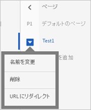

# 複数ページアクティビティ{#multipage-activity}

複数ページアクティビティを使用すると、各ページが固有のデザインを持つ複数のページにわたるストーリーを作成できます。

例えば、特定の金額を超える買い物をした顧客に対して送料を無料にするオファーをテストできます。そのオファーをランディングページ、カテゴリページおよび特定の商品のページに表示しますが、ページのタイプに応じて異なる場所に異なるサイズで表示します。ホームページには目立つようにオファーを表示し、他の関連ページには小さく表示してオファーを強化できます。

また、複数ページアクティビティを使用して、デスクトップおよびノンレスポンシブモバイルサイト用の異なるレイアウトを定義できます。サイトに[!DNL `www.mysite.com`]ではなく[!DNL m.mysite.com]のような別のモバイルサイトがある場合は、[複数ページアクティビティ](../../c-experiences/c-visual-experience-composer/multipage-activity.md#concept_277E096063E14813AC5D8EDFA1D2ED48)を作成し、[!DNL m.mysite.com]を別のページとして追加してから、モバイル編集を適用して、同じエクスペリエンスのデスクトップバージョンとモバイルバージョンで適切な変更を行う必要があります。レスポンシブモバイルサイトでは、[モバイルエクスペリエンスの編集](../../c-experiences/c-visual-experience-composer/mobile-viewports.md#concept_8E45527C4ABC41D59AA3553BEDC76FA5)を使用します。

>[!NOTE]
>
>複数ページアクティビティは、同じオファーを複数のページで異なる外観で表示するアクティビティのためのものです。すべてのページでオファーを同じ外観で表示する場合は、[テンプレートテスト](../../c-experiences/c-visual-experience-composer/temtest.md#task_2539D51A18044F82B0D9895636546781)のほうがより効率的です。

複数ページテストでは、各ページにテンプレートルールを指定できます。例えば、複数ページテストでカテゴリページにテンプレートルールを適用することで、ホームページおよびすべてのカテゴリページで複数ページテストを実行できます。詳しくは、[類似のページに同じエクスペリエンスを組み込む](../../c-experiences/c-visual-experience-composer/temtest.md#task_2539D51A18044F82B0D9895636546781)を参照してください。

テストにページを追加するには：

1. **[!UICONTROL 設定]の歯車アイコンをクリックします。**
1. 「**[!UICONTROL 追加ページを追加]**」をクリックします。

   画面の左側に、ナビゲーションバーが表示されます。

   

1. このナビゲーションバーを使用してページを指定し、デフォルトページを設定します。

   「**[!UICONTROL ページを追加]」をクリックして、ページを追加します。**

   縦並びの省略記号アイコンをクリックして、アクションメニューを表示します。

   

   このメニューを使用して、ページの名前変更、複数ページアクティビティからのリダイレクトテストの実行、ページの削除をおこないます。

1. Visual Experience Composer を使用して、各ページでのオファーの外観をデザインします。

