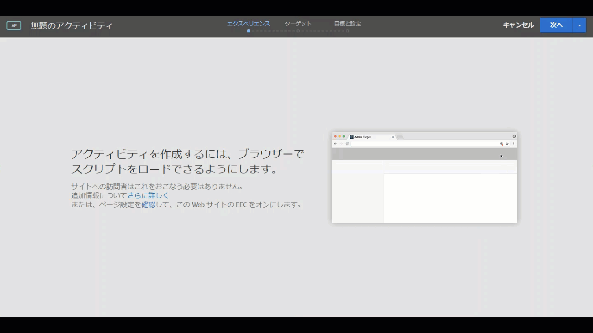

# ブラウザーでの混在するコンテンツの有効化{#enabling-mixed-content-in-your-browser}

安全なコンテンツと安全でないコンテンツが混在している場合、一部のブラウザーではページの表示がブロックされます。

## ブラウザーでの混在するコンテンツの有効化 {#concept_46D022D50280468C9EF6D5DF6EFC911C}

安全なコンテンツと安全でないコンテンツが混在している場合、一部のブラウザーではページの表示がブロックされます。

Visual Experience Composer（VEC）が、安全なコンテンツと安全でないコンテンツが混在しているページを開こうとすると、ブラウザーでのブロックを無効にする方法を説明したメッセージが表示されます。その方法に従うことで、HTTP サイトや、HTTPS と HTTP の呼び出しが混在しているサイトを開くことができます。

以前までは、このような混合コンテンツが許可されていない場合でも、アクティビティの作成時に、3 ステップのガイドによるワークフローのステップ 1 については一部の操作を実行することができました。Target では、ステップ 1 の操作がブロックされるようになりました。このメッセージが表示された場合は、混合コンテンツを許可しないと先に進めません。

ブラウザーのセキュリティ設定によって、混合コンテンツや安全でない（HTTP）コンテンツが、安全な（HTTPS）ページやフレーム（VEC など）に読み込まれないようにブロックされている場合があります。ブラウザーのセキュリティ設定を無効にしたくない場合は、HTTPS の Web サイトが必要です。

Web サイトが安全でない（HTTP）ドメインで実行されている場合は、VEC によるアクティブな混合コンテンツの読み込みを許可する必要があります。

>[!NOTE]
>
>混合コンテンツの許可によって影響が生じるのは VEC のみです。ライブ Web サイトには影響しません。

詳しくは、*Mozilla Developer Network*（MDN）の Web サイトにある[混在コンテンツ](https://developer.mozilla.org/en-US/docs/Web/Security/Mixed_content)を参照してください。

## Firefox で混合コンテンツを有効化 {#task_5448763B8DC941FD80F84041AEF0A14D}

Firefox では、安全なコンテンツと安全でないコンテンツが混在しているページは、デフォルトではブロックされます。この設定は、[!DNL Target] を使用するように永久的に変更することをお勧めします。

<!-- 

target/t_mixed_content_firefox.xml

 -->

1. Firefox で、アドレスバーに`about:config`を入力します。
1. Firefox に表示された警告メッセージを確認します。
1. 検索バーに「`block_active`」と入力 します。
1. ダブルクリック ` **[!UICONTROL security.mixed_content.block_active_content]**` .

   値を「True」から「False」に変更します。値が「False」と表示されたら、完了です。この設定を変更した後、コンピューターを再起動することをお勧めします。

## Internet Explorer で混合コンテンツを有効化 {#task_59E7D13C04DF486C92CD78D0C63DDDE8}

Internet Explorer では、安全なコンテンツと安全でないコンテンツが混在しているページは、デフォルトではブロックされます。この設定は、Target Standard を使用するように永久的に変更することをお勧めします。

<!-- 

target/t_mixed_content_ie.xml

 -->

1. Internet Explorer で、「設定」アイコン / **[!UICONTROL インターネットオプション]**&#x200B;をクリックします。
1. 「[!UICONTROL セキュリティ]」タブを開きます。
1. 「**[!UICONTROL インターネット]**」を選択し、 「**[!UICONTROL カスタムレベル]**」をクリックします。
1. 「**[!UICONTROL その他]**」を選択します。
1. 「[!UICONTROL その他]」の下の「**[!UICONTROL 混在したコンテンツを表示する]**」を有効にします。
1. 「**[!UICONTROL OK]** / **[!UICONTROL はい]** / **[!UICONTROL 適用]**」をクリックします。

この設定を変更した後、コンピューターを再起動することをお勧めします。

## Chrome で混合コンテンツを有効化 {#task_FF297A08F66E47A588C14FD67C037B3A}

安全な接続を介してサイトに訪問している場合は、Web ページ上のコンテンツが安全に転送されたかどうかを Google Chrome が確認します。

<!-- 

target/t_mixed_content_chrome.xml

 -->

Google Chrome ヘルプの[安全でないコンテンツを含むページ](https://support.google.com/chrome/answer/1342714?hl=en)に関する説明を参照してください。
