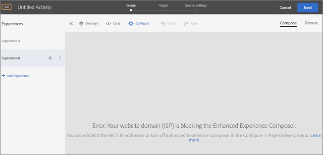

# 拡張 Experience Composer に関連する問題のトラブルシューティング{#troubleshooting-issues-related-to-the-enhanced-experience-composer}

拡張 Experience Composer（EEC）では、特定の状況で表示の問題が起きることがあります。

## EEC で、公開 IP ではアクセスできない内部 QA 用 URL が読み込まれません。（EEC のみ）{#section_D29E96911D5C401889B5EACE267F13CF}

この問題は、以下の IP アドレスをホワイトリストに登録することで解決できます。これらの IP アドレスは、拡張 Experience Composer プロキシで使用されるアドビのサーバーのものです。これらは、アクティビティの編集にのみ必要です。サイトへの訪問者については、これらの IP アドレスをホワイトリストに登録する必要はありません。

次の IP アドレスをホワイトリストに登録するように、IT チームに依頼します。

| 地域 | IP アドレス | hostnames |
|--- |--- |--- |
| 米国 | 52.55.99.45 | `us1-proxy.adobemc.com` |
| ヨーロッパ、中東、アフリカ（EMEA） | 52.51.238.221 | `emea1-proxy.adobemc.com` |
| アジア太平洋（APAC） | 52.193.67.35 | `apac1-proxy.adobemc.com` |

Target では次のエラーメッセージが表示される場合があります。

`Error: Your website domain (ISP) is blocking the Enhanced Experience Composer. You can whitelist the Enhanced Experience Composer's IP addresses or turn off Enhanced Experience Composer in [!UICONTROL Configure] > [!UICONTROL Page Delivery] menu.`

このエラーメッセージが表示される理由と、問題の解決方法は次のとおりです。

* **問題：** Web サイトのドメイン（ISP）によって拡張 Experience Composer がブロックされています。

   **解決方法：**上述のリストの IP アドレスをホワイトリストに登録します。

* **問題：** IP アドレスはホワイトリストに登録されていますが、Web サイトが TLS バージョン 1.2 をサポートしていません。Target は現在 1.2 のデフォルト設定を利用します。Target 18.4.1 （2018 年 4 月 26 日）前までは、デフォルト設定で TLS 1.0 をサポートしていました。詳細は、「[TLS（Transport Layer Security）暗号化の変更](../../../c-implementing-target/c-considerations-before-you-implement-target/tls-transport-layer-security-encryption.md#concept_CC1001E9D3AE4BABAF90B8311B0A6451)」を参照してください。

   **解決策：**次の質問（TLS 1.2 を使用しているサイトのセキュリティで保護されているページで、拡張 Visual Experience Composer が読み込まれません）を参照してください。

## TLS 1.0 を使用しているサイトのセキュリティで保護されているページで、EEC が読み込まれません。（EEC のみ）{#section_C5B31E3D32A844F68E5A8153BD17551F}

上述の IP アドレスがホワイトリストに登録されていても、Web サイトが TLS バージョン 1.0 に対応していない場合は、上述のエラーメッセージが表示される場合があります（サイトのセキュリティで保護されているページで、拡張 Visual Experience Composer が読み込まれません）。Target は現在 1.2 のデフォルト設定を利用します。Target 18.4.1 （2018 年 4 月 26 日）前までは、デフォルト設定で TLS 1.0 をサポートしていました。詳細は、「[TLS（Transport Layer Security）暗号化の変更](../../../c-implementing-target/c-considerations-before-you-implement-target/tls-transport-layer-security-encryption.md#concept_CC1001E9D3AE4BABAF90B8311B0A6451)」を参照してください。

Firefox を使用して、Web サイトの TLS バージョンをチェックする方法は次のとおりです（他のブラウザーでの手順も同様です）。

1. Firefox で対象の Web サイトを開きます。
1. ブラウザーのアドレスバーにある**[!UICONTROL サイトの情報を表示します]アイコンをクリックします。**

   

1. 「**[!UICONTROL 接続の詳細の表示]**」／「**[!UICONTROL 詳細を表示]**」の順にクリックします。

   

1. 「技術情報」の下にある TLS バージョンを確認します。

   

1. Web サイトが TLS 1.0 を示している場合、Target の TLS サポートポリシーの詳細については、[Target の TLS サポートポリシーについては、TLS (Transport Layer Security) 暗号化の変更](../../../c-implementing-target/c-considerations-before-you-implement-target/tls-transport-layer-security-encryption.md#concept_CC1001E9D3AE4BABAF90B8311B0A6451)を参照してください。現在までの状況（2018 年 9 月 12 日まで有効）を解決するには、TLS バージョンとドメインの設定について[カスタマーケア](../../../cmp-resources-and-contact-information.md#reference_ACA3391A00EF467B87930A450050077C)にお問い合わせください。

## プロキシが有効なサイトを読み込む際に、タイムアウトまたは「アクセスが拒否されました」というエラーが表示されます。（EEC のみ）{#section_60CBB9022DC449F593606C0E6252302D}

ご使用の環境でプロキシ IP がブロックされていないことを確認してください。
