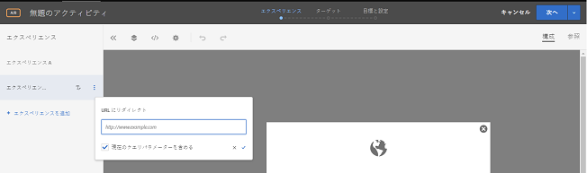

# URL にリダイレクト{#redirect-to-a-url}

同じページにコンテンツを表示するのではなく、訪問者を別のページに送る場合に、このオプションを使用します。

ページ内でコンテンツの一部を変更するのではなく、まったく異なる 2 つのページをテストすることができます。この場合、A/B テストではページ A とページ B を比較します。A/B テストキャンペーンを 2 つのエクスペリエンスで設定します。1 つはデフォルトのページ A をポイントするエクスペリエンス、もう 1 つはページ B にリダイレクトするエクスペリエンスです。エクスペリエンスに対して表示される文字のラベルをクリックして表示できるエクスペリエンスのアクションメニューで、「**[!UICONTROL URL にリダイレクト]」を選択して、ページ B の URL を指定します。訪問者を別のページにリダイレクトするオファーが設定されます。**

リダイレクトオファーでは、JavaScript コードを実行してブラウザーをリダイレクトします。このオファーでは`window.location.replace();`メソッドを使用するので、訪問者のリダイレクト元のページはブラウザー履歴に保存されません。そのため、訪問者はブラウザーの「戻る」ボタンを引き続き使用できます。

リダイレクトオファーには、いくつかの制限があります。

* A4T を使用してアクティビティでリダイレクトオファーを使用する場合、実装が特定の最小要件を満たす必要があります。また、知っておくべき重要な情報があります。詳しくは、[リダイレクトオファー - A4T に関する FAQ](../../c-integrating-target-with-mac/a4t/r-a4t-faq/a4t-faq-redirect-offers.md#concept_21BF213F10E1414A9DCD4A98AF207905) を参照してください。
* フォームベースの Experience Composer を使用する場合、リダイレクトオファーはページの一部である mbox で使用しないでください。リダイレクトオファーは、HTML の`<head>`の一部であるスクリプトタグからのみ使用する必要があります。常に自動作成を使用して、グローバル mbox にリダイレクトオファーを設定する必要があります。

>[!NOTE] {class=&quot;- topic/note &quot;}
>
>ランディングページのリファラー値を渡す場合、リダイレクトオファーではなく HTML オファーを使用することをお勧めします。

リダイレクトオファーを作成する手順は次のとおりです。

1. エクスペリエンスを作成します。
1. マウスでエクスペリエンスの上にカーソルを移動し、「URL にリダイレクト」アイコン（）をクリックします。

   

1. URL を入力します。
1. 必要に応じて、現在のクエリパラメーターを含めるオプションを選択します。

   このオプションを選択すると、訪問者の URL の ? の後にある要素が、リダイレクト時にリダイレクト URL に追加されます。

   このオプションはデフォルトで選択されています。
1. （オプション）追加のルールを作成します。

   追加のルールは、以下のいずれかに基づいています。

   * URL
   * ドメイン
   * パス
   * ハッシュ（#）フラグメント
   * クエリ
   * mbox パラメーター
   追加のルールは、AND または OR を使用してアクティビティ URL と結合できます。追加したすべてのルールは、AND を使用してお互いに評価されます。
