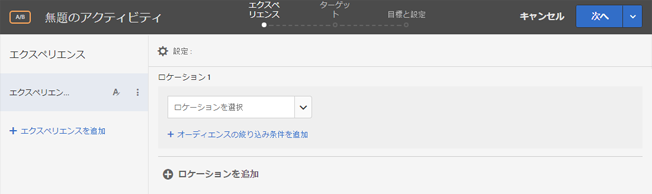
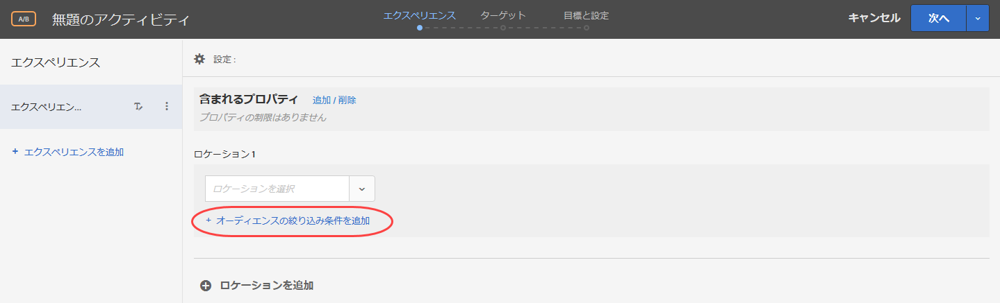
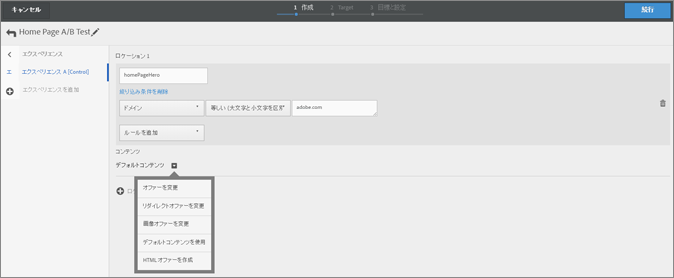
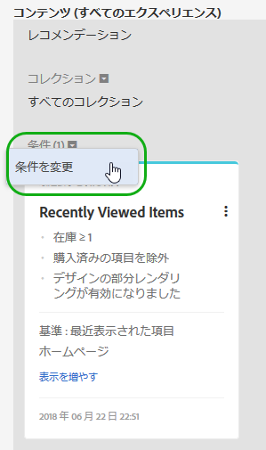
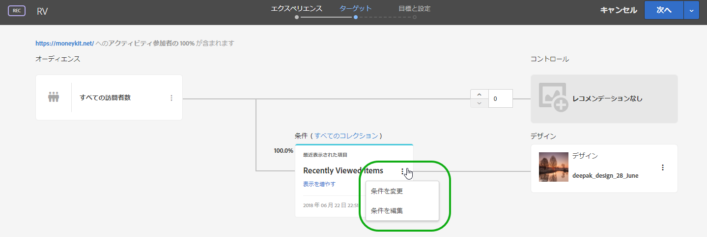

# フォームベースの Experience Composer{#form-based-experience-composer} 

フォームベースのExperience Composerは、Visual Experience Composerが使用できない場合や実用的である場合に、A/Bテスト、エクスペリエンスターゲット設定、自動パーソナライゼーションおよびRecommendationsアクティビティで使用するエクスペリエンスを作成する際に役立つ、非視覚的なエクスペリエンスおよびオファーの作成インターフェイスです。例えば、フォームベースのコンポーザーを使用して、電子メール、キオスクおよびボイスアシスタントで配信するエクスペリエンスおよびオファーを作成できます。

Recommendations アクティビティを作成している場合、エクスペリエンスはありません。条件およびデザインを選択します。複数の条件またはデザインを選択する場合、Target は自動的にエクスペリエンスを生成します。

1. 「**[!UICONTROL アクティビティを作成]**」をクリックして、作成するアクティビティのタイプを選択します。

   フォームベースの Experience Composer は、A/B テスト、エクスペリエンスのターゲット設定、自動パーソナライゼーションおよび Recommendations アクティビティで利用できます。
1. [!UICONTROL 新しいアクティビティ]ダイアログボックスで、「**[!UICONTROL フォームベースの Experience Composer]**」を選択します。

   フォームベースの Experience Composer が表示されます。

   

   Recommendations アクティビティを作成している場合、この画面は異なります。Recommendations アクティビティには、エクスペリエンスは含まれません。
1. アクティビティの名前を設定します。
1. 場所を選択します。

   「ロケーションを選択」ボックスをクリックすると、利用可能な場所の一覧が表示されます。いずれかの場所を選択します。target.js によって提供されるグローバルな場所を選択するには、「target-global-mbox」を選択します。

   ここに表示されていない場所を入力することもできます。これは、mbox がまだページで作成または表示されていない場合に便利です。場所の名前を入力します。まだ存在していない場所を入力する場合は、注意が必要です。mbox の呼び出し時に、スペルや大文字／小文字が一致していないと、アクティビティが配信されません。手動で入力した場所がリストに保存されます。
1. 「**[!UICONTROL 絞り込み条件を追加]**」をクリックし、このアクティビティ用の[オーディエンス](../c-target/target.md#concept_A782F8481A5041EBA75103CB26376522)を 1 つ以上選択します。

   

   フォームベースの Experience Composer で、絞り込みが完全なオーディエンス機能で置き換えられました。既存のアクティビティの絞り込みが、[アクティビティのみのオーディエンス](../c-target/creating-activity-only-audience.md#concept_A6BADCF530ED4AE1852E677FEBE68483)に移行されました。
1. その場所に表示するコンテンツのタイプを選択します。

   

1. 選択したコンテンツタイプに対して、コンテンツを指定します。

   **HTML オファーの変更：** HTML オファーを選択します。

   **画像オファーの変更：** Target のコンテンツライブラリに保存された画像を選択します。

   また、画像にリンク（クリックスルー、宛先、ランディングなど）を追加することもできます。

   1. 「[!UICONTROL 画像オファーの変更]」をクリックします。
   1. 希望する画像を選択してから、「[!UICONTROL リンクの編集]」をクリックします。
   1. 希望する URL またはサイトのページを指定して、「[!UICONTROL 更新]」をクリックします。
   **JSON オファーの変更：** JSON オファーを選択します。

   **エクスペリエンスフラグメントの変更：** エクスペリエンスフラグメントを選択します。

   **リダイレクトオファーの変更：** リダイレクトオファーを選択します。

   **リモートオファーの変更：** リモートオファーを選択します。

   **HTML オファーを作成:**

   1. 「[!UICONTROL オファー]」をクリックしてから、「[!UICONTROL コードオファー]」タブを選択します。
   1. [!UICONTROL 作成]／[!UICONTROL HTML オファー]をクリックします。
   1. オファー名を入力します。
   1. 「コード」ボックスに HTML コードを入力するか貼り付けます。
   1. 「[!UICONTROL 保存]」をクリックします。
   **JSON オファーの作成：**

   1. 「[!UICONTROL オファー]」をクリックしてから、「[!UICONTROL コードオファー]」タブを選択します。
   1. [!UICONTROL 作成]／[!UICONTROL JSON オファー]をクリックします。
   1. オファー名を入力します。
   1. 「コード」ボックスに JSON コードを入力するか貼り付けます。
   1. 「[!UICONTROL 保存]」をクリックします。
   Recommendations アクティビティでは、コンテンツドロップダウンに「Recommendation を追加」オプションが表示されます。「**[!UICONTROL Recommendation を追加]**」をクリックして、ページタイプを選択します。次に、[Recommendations アクティビティを作成する](https://marketing.adobe.com/resources/help/en_US/target/recs/t_create_recs_activity.html)ためにインターフェイスで定義した通常の手順に従います。

   フォームベースの Experience Composer で Recommendations の条件を選択する際には、選択した条件カードへの直接リンクが追加されるようになったので、条件をすばやく容易に編集できます。

   

   Target の 3 つの手順から成るガイド付きワークフローのターゲット設定ページから：

   

1. （AB アクティビティ、Automated Personalization、エクスペリエンスのターゲット設定の場合はオプション）このプロセスをその他の場所に対して繰り返すには、`Add Location` をクリックして場所とコンテンツを設定します。
1. 「**[!UICONTROL 続行]**」をクリックして、アクティビティタイプに対して、通常どおりアクティビティ作成手順を実行します。

* [A/B テストの作成](../c-activities/t-test-ab/t-test-create-ab/test-create-ab.md#task_68C8079BF9FF4625A3BD6680D554BB72)
* [エクスペリエンスのターゲット設定アクティビティの作成](../c-activities/t-experience-target/t-xt-create/xt-create.md#task_D6B3429AC31549E1A70EDF04B3DDC765)
* [Recommendations アクティビティの作成](../c-recommendations/t-create-recs-activity/create-recs-activity.md#task_6874328773C64C44A73F0A130AD3F96F)

## トレーニングビデオ：フォームベースのコンポーザー

このビデオは、フォームベースのコンポーザーのデモを紹介します。

* フォームベースの Experience Composer を使用したアクティビティの作成
* フォームベースの Experience Composer と Visual Experience Composer のどちらを使用するかの理解
* 場所のターゲット設定の調整

>[!VIDEO](https://video.tv.adobe.com/v/17390?captions=jpn)