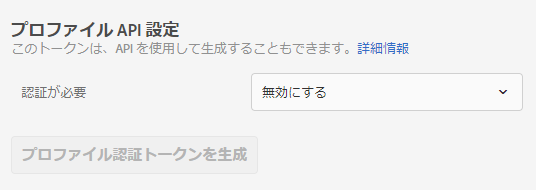
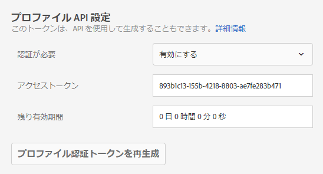

# プロファイル API 設定{#profile-api-settings}

API による一括更新の認証を有効または無効にし、プロファイル認証トークンを生成します。

Adobe Target では、個々のユーザーごとにプロファイルが作成され、管理されます。このプロファイルは Target のエッジクラスターに保管され、訪問のたびにリアルタイムで更新されますが、個別に更新したり、API を使用して一括で更新したりできます。

セキュリティ強化のために、バルク更新 API を呼び出す際にリクエストのヘッダーで有効なアクセストークンを渡すことを要求するよう設定できます。承認者の許可を得たユーザーが、プロファイル API の認証トークンを生成および有効にできます。

**Target UI で認証を必須に設定し、アクセストークンを生成する手順は次のとおりです。**

1. 「**[!UICONTROL セットアップ]**」／「**[!UICONTROL 実装]**」の順にクリックします。
1. 「**[!UICONTROL プロファイル API 設定]**」で、**認証が必要[!UICONTROL ドロップダウンリストを使用して認証の要求を有効または無効にします。]**

   

1. （条件付き）認証の要求を有効にする場合、「**[!UICONTROL プロファイル認証トークンを生成]**」をクリックします。

   

   トークンの有効期限は、[!UICONTROL 残り有効期間]ボックスに記載されている日時です。

   >[!NOTE]
   >
   >API を使用してプロファイル認証トークンを生成もできます。詳しくは、[Adobe Target Developers の Web サイト](https://developers.adobetarget.com/)の[プロファイル](https://developers.adobetarget.com/api/#profiles)を参照してください。

1. トークンをコピーし、リクエストのヘッダーに追加します（形式は "Authorization" : "Bearer"）。

必要に応じて「[!UICONTROL プロファイル認証トークンを再生成]」をクリックし、トークンを再生成します。

>[!IMPORTANT]
>
>このトークンをリセットすると、現在のトークンを使用した API 呼び出しに失敗します。その場合は、このトークンを使用するすべてのスクリプトとアプリを更新する必要があります。

