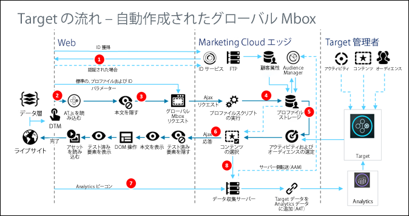

# at.js の仕組み{#how-at-js-works}

クライアント側の [!DNL Adobe Target] を実装するには、at.js ライブラリを使用する必要があります。

クライアント側での [!DNL Adobe Target] の実装では、[!DNL Target] アクティビティに関連付けられたエクスペリエンスをクライアントブラウザーに直接配信します。ブラウザーは、表示するエクスペリエンスを決定して表示します。クライアント側の実装では、WYSIWYG エディターの [Visual Experience Composer](/help/c-experiences/c-visual-experience-composer/visual-experience-composer.md) （VEC）または非ビジュアルインターフェイスである[フォームベースの Experience Composer](/help/c-experiences/form-experience-composer.md) を使用して、テストエクスペリエンスとパーソナライゼーションエクスペリエンスを作成できます。

## at.js について

[at.js ライブラリ](/help/c-implementing-target/c-implementing-target-for-client-side-web/t-mbox-download/c-target-atjs-implementation/target-atjs-implementation.md#concept_8AC8D169E02944B1A547A0CAD97EAC17)は、Target の新しい実装ライブラリです。at.js ライブラリは、Web 実装のページ読み込み時間を改善し、シングルページアプリケーション向けのより優れた実装オプションを提供します。at.js は推奨される実装ライブラリであり、頻繁にアップデートされて新しい機能が追加されます。すべてのお客様に対して、[at.js の最新バージョン](/help/c-implementing-target/c-implementing-target-for-client-side-web/target-atjs-versions.md#reference_DBB5EDB79EC44E558F9E08D4774A0F7A)を実装するか、最新バージョンに移行することをお勧めします。

詳細については、「[Target JavaScript ライブラリ](/help/c-intro/how-target-works.md#libraries)」を参照してください。

下の図に示す [!DNL Target] 実装では、Analytics、Target、およびAudience Management の [!DNL Adobe Experience Cloud] ソリューションが実装されています。さらに、Adobe Launch、オーディエンスおよび訪問者 ID サービスの Experience Cloud コアサービスが実装されています。

## at.js 1.*x* と at.js 2.x のワークフロー図の違いは何ですか？

2.0 と 1. のバージョン間の違いについて詳しくは、「[at.js 1.x から at.js 2.x へのアップグレード](/help/c-implementing-target/c-implementing-target-for-client-side-web/upgrading-from-atjs-1x-to-atjs-20.md)」を参照してください。*x*.

抽象度の高い表示では、2 つのバージョン間にいくつかの違いがあります。

* at.js 2.x は、グローバル mbox リクエストの概念がなく、ページ読み込みリクエストを使用します。ページ読み込みリクエストは、Web サイトの最初のページ読み込み時に適用されるコンテンツを取得するリクエストとして表示できます。
* at.js 2.x は、シングルページアプリケーション（SPA）で使用されるビューの概念を管理します。at.js 1.*x* はこの概念に対応していません。

## at.js 2.x 図

次の図は、ビューを使用した at.js 2 ワークフローと、これが SPA 統合をどのように強化するかについて説明しています。at.js 2.x で使用されている概念に関するより詳しい概要については、「[シングルページアプリケーションの実装](/help/c-implementing-target/c-implementing-target-for-client-side-web/how-to-deployatjs/target-atjs-single-page-application.md)」を参照してください。

| 手順 | 詳細 |
| --- | --- |
| 1 | 呼び出しユーザーが認証されると、呼び出しが [!DNL Experience Cloud ID]を返し、別の呼び出しが顧客 ID を同期します。 |
| 2 | at.js ライブラリがドキュメント本文を同期的に読み込み、非表示にします。 at. jsは、非同期でロードすることもできます。オプションで、ページに実装されているスニペットを非表示にすることもできます。 |
| 3 | すべての設定済みパラメーター（MCID、SDID および顧客 ID）を含む、ページ読み込みリクエストがおこなわれます。 |
| 4 | プロファイルスクリプトが実行されてから、プロファイルストアにフィードされます。ストアは、オーディエンスライブラリから正規のオーディエンスをリクエストします（例えば、Adobe Analytics、Audience Management などから共有されたオーディエンス）。 顧客属性がバッチ処理でプロファイルストアに送信されます。 |
| 5 | URL リクエストパラメーターとプロファイルデータに基づいて、[!DNL Target] が現在のページおよび将来のビューでどのアクティビティおよびエクスペリエンスを訪問者に返すかを決定します。 |
| 6 | ターゲットコンテンツが（オプションで、追加のパーソナライゼーションに関するプロファイル値を含めて）ページに送り返されます。 デフォルトコンテンツがちらつくことなく、可能な限り迅速に現在のページ上のターゲットコンテンツが表示されます。 SPA でのユーザーアクションの結果として表示されるビューのターゲットコンテンツは、ブラウザーにキャッシュされます。そのため、`triggerView()` を介してビューがトリガーされたときに追加のサーバー呼び出しをおこなわずに即座にターゲットコンテンツを適用できます。 |
| 7 | Analytics データがデータ収集サーバーに送信されます。 |
| 8 | ターゲットデータは、SDID を使用して Analytics データに適合され、Analytics レポートストレージへと処理されます。 A4T レポートを使用して、Analytics データが Analytics と Target の両方に表示できるようになります。 |

これで、`triggerView()` が SPA のどこに 実装されているかに関わらず、ビューとアクションはキャッシュから取得され、サーバー呼び出しなしでユーザーに表示されるようになります。`triggerView()` は、インプレッション数を増分して記録するために、[!DNL Target] バックエンド に通知リクエストもおこないます。ビューを使用した SPA での at.js について詳しくは、「[シングルページアプリケーションの実装](/help/c-implementing-target/c-implementing-target-for-client-side-web/how-to-deployatjs/target-atjs-single-page-application.md)」を参照してください。

| 手順 | 詳細 |
| --- | --- |
| 1 | `triggerView()` は SPA で呼び出され、ビューをレンダリングし、ビジュアル要素を変更ためのアクションを適用します。 |
| 2 | ビューのターゲットコンテンツがキャッシュから読み取られます。 |
| 3 | デフォルトコンテンツがちらつくことなく、可能な限り迅速にターゲットコンテンツが表示されます。 |
| 4 | 通知リクエストが [!DNL Target] プロファイルストア に送信され、アクティビティで訪問者がカウントされ、指標が増分されます。 |
| 5 | Analytics データがデータ収集サーバーに送信されます。 |
| 6 | Target データは、SDID を使用して Analytics データに適合され、Analytics レポートストレージへと処理されます。A4T レポートを使用して、Analytics データが Analytics と Target の両方に表示できるようになります。 |

## at.js 1.x の図

| 手順 | 説明 | 呼び出し | 説明 |
|--- |--- |--- |--- |
| 1 | ユーザーが認証されると、呼び出しが [!DNL Experience Cloud ID]（MCID）を返し、別の呼び出しが顧客 ID を同期します。 | 2 | at.js ライブラリがドキュメント本文を同期的に読み込み、非表示にします。 |
| 3 | すべての設定済みパラメーター、MCID、SDID および顧客 ID（オプション）を含む、グローバル mbox リクエストがおこなわれます。 | 4 | プロファイルスクリプトが実行されてから、プロファイルストアにフィードされます。ストアは、[!UICONTROL オーディエンスライブラリ]から正規のオーディエンスをリクエストします（例えば､[!DNL Adobe Analytics]、[!DNL Audience Manager] などから共有されたオーディエンス）。 顧客属性がバッチ処理で [!DNL Profile Store] に送信されます。 |
| 5 | URL、mbox パラメーターおよびプロファイルデータに基づいて、[!DNL Target] がどのアクティビティおよびエクスペリエンスを訪問者に返すかを決定します。 | 6 | ターゲットとなるコンテンツが（オプションで、追加のパーソナライゼーションに関するプロファイル値を含めて）ページに送り返されます。 デフォルトコンテンツがちらつくことなく、可能な限り迅速にエクスペリエンスが表示されます。 |
| 7 | [!DNL Analytics] データがデータ収集サーバーに送信されます。 | 8 | [!DNL Target] データは、SDID を使用して [!DNL Analytics] データに適合され、[!DNL Analytics] レポートストレージへと処理されます。[!DNL Analytics for Target]（A4T）レポートを使用して、 [!DNL Analytics] データが [!DNL Analytics] と [!DNL Target] の両方に表示できるようになります。 |

## トレーニングビデオ： at.js 2.x のアーキテクチャ図

at.js 2.x は、Adobe Target の SAP のサポートを強化し、Adobe Target と他の Experience Cloud を統合します。このビデオでは、すべてがどのように結び付いているかを説明します。

>[!VIDEO](https://video.tv.adobe.com/v/26250?captions=jpn)

See [Understanding how at.js 2.x works](https://helpx.adobe.com/target/kt/using/atjs20-diagram-technical-video-understand.html) for more information.