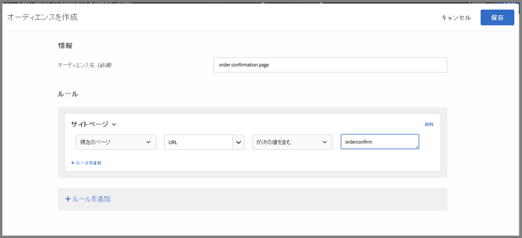
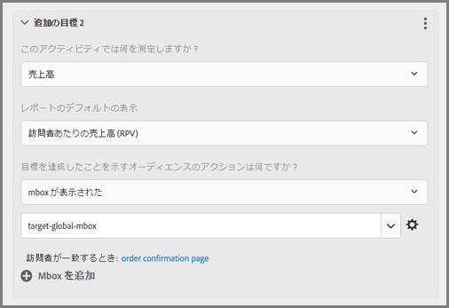

# グローバル mbox に関するよくある質問{#global-mbox-frequently-asked-questions}

グローバルmboxに関するよくある質問（FAQ）のリストです。

## Target アカウントが複数のドメインにまたがって設定されている場合、複数のグローバル mbox を使用できますか？{#section_B7252BA6C3BB4EF4AE9E53F47FD58ABD}

アカウント全体で使用できるグローバル mbox は 1 つだけです。

アクティビティに URL ルールを追加することで、アクティビティの実行場所を制限できます。詳しくは、[類似のページに同じエクスペリエンスを組み込む](../../../c-experiences/c-visual-experience-composer/temtest.md#task_2539D51A18044F82B0D9895636546781)を参照してください。

また、targetPageParamsを使用し [てページ上のパラメーターを渡す](/help/c-implementing-target/c-implementing-target-for-client-side-web/targetpageparams.md) ことも、 [!UICONTROL Visual Experience Composer] （VEC）の«URLを設定»セクションでこれらのパラメーターを選択するか、フォームベースのExperience Composerでパラメーターを«絞り込み»として追加することもできます。

## Target のグローバル mbox に売上高データを渡すには、どうすればよいですか？{#section_17AEA933BADA4D169CCEDF5833C41306}

target-global-mbox で売上高と注文の情報を収集するには、「mbox パラメーター」を Target に送信する必要があります。このパラメーターは名前と値のペアで、Target により多くの情報を送信するために使用します。Target はこれらのパラメーター（予約された名前）を自動的に検索し、売上高データを設定します。

`orderConfirmPage` の場合、`orderTotal`、`orderId`、および `productPurchasedId` を渡す必要があります。詳しくは、「[注文の確認 mbox の作成 - mbox.js](../../../c-implementing-target/c-implementing-target-for-client-side-web/t-mbox-download/orderconfirm-create.md#task_0036D5F6C062442788BB55E872816D82)」を参照してください。

`targetPageParams()` () を使用して、これと同じパラメーターを target-global-mbox に送信する必要があります。詳しくは、「[グローバル mbox にパラメーターを渡す](../../../c-implementing-target/c-implementing-target-for-client-side-web/t-mbox-download/c-understanding-global-mbox/pass-parameters-to-global-mbox.md#concept_33362A04146C4E3C8E7089B65F38B5E5)」を参照してください。

以下のように、注文確認ページが表示された場合のみ Target が target-global-mbox でコンバージョンをカウントするよう、コンバージョンページに対するターゲット設定を追加することもお勧めします。

上図の「サイトのページ」セクションの選択内容は、「現在のページ」、「URL」、「次を含む」、「orderconfirm」となっています。

上図のオプションは、以下の設定で構成されています。

* **このアクティビティでは何を測定しますか？：**売上高
* **レポートのデフォルトの表示：**訪問者あたりの売上高（RPV）
* **目標を達成したことを示すオーディエンスのアクションは何ですか？** mbox が表示された、target-global-mbox