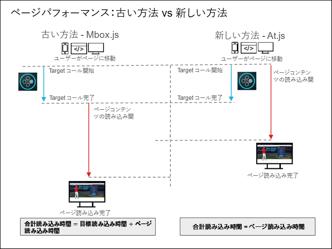

# at.js に関するよくある質問{#at-js-frequently-asked-questions}

at.js に関するよくある質問への回答を紹介します。

## mbox.js と比較して at.js を使用するメリットは何ですか。{#section_FE30D01A577C46ACB0F787B85F5E0F6B}

[!DNL at.js]が[!DNL mbox.js]に替わって使用されますが、[!DNL mbox.js] も引き続きサポートされます。ただし、ほとんどのユーザーにとって、[!DNL at.js] には [!DNL mbox.js] よりも優れた利点があります。

[!DNL at.js] のメリットの例として、Web 実装のページ読み込み時間の改善、セキュリティの強化、シングルページアプリケーション向けのより優れた実装オプションの提供があげられます。

次の図は、mbox.js と at.js を使用した場合のページ読み込みパフォーマンスを示しています。



上の図に示される通り、mbox.js を使用すると、[!DNL Target] の呼び出しが完了するまでページ内容が読み込まれません。at.js を使用すると、[!DNL Target] の呼び出しが開始するとページ内容が読み込まれ、呼び出しが完了するまで待ちません。 

## at.js を旧バージョンから 1.0.0 にアップグレードした後、応答時間が長くなったように感じるのはなぜですか。{#section_DFBA5854FFD142B49AD87BFAA09896B0}

[!DNL at.js] バージョン 1.0.0 以降では、すべてのリクエストが同時並行で実行されます。旧バージョンではリクエストが順番に実行されます。そのため、Target では、リクエストをキューに入れ、最初のリクエストの処理が完了するまで待ってから次のリクエストに移ります。

この [!DNL at.js] の旧バージョンでのリクエストの実行方法では、いわゆる「ヘッドオブラインブロッキング」の問題が生じやすくなります。[!DNL at.js] 1.0.0 以降では、Target が同時並行でリクエストを実行するように変更されました。

[!DNL at.js] 0.9.1 で「ネットワーク」タブのウォーターフォールをチェックすると、Target の現在のリクエストの処理が完了するまで、次のリクエストが実行されないことがわかります。一方、[!DNL at.js] 1.0.0 以降では、処理方法が異なり、基本的にすべてのリクエストが同時に実行されます。

応答時間に関しては、次のような数式が成り立ちます。

<ul class="simplelist"> 
 <li> at.js 0.9.1：すべての Target リクエストの応答時間 = リクエストの応答時間の合計 </li> 
 <li> at.js 1.0.0 以降：すべての Target リクエストの応答時間 = リクエストの応答時間の最大値 </li> 
</ul>

このように、[!DNL at.js] 1.0.0 の方がリクエストの処理が早く完了します。また、[!DNL at.js] のリクエストは非同期なので、Target によってページレンダリングがブロックされることはありません。リクエストの処理に数秒を要した場合でも、レンダリングされたページが表示されます。Target が Target エッジからの応答を受け取るまで、ページの一部分が空白になるだけです。

## at.js はページ読み込み時間にどのように影響しますか。 {#section_90B3B94FE0BF4B369577FCB97B67F089}

詳しくは、「[Target JavaScript ライブラリについて](../../../c-implementing-target/c-considerations-before-you-implement-target/target-implement.md#concept_60B748DE4293488F917E8F1FA4C7E9EB)」を参照してください。

## Target ライブラリを非同期で読み込むことはできますか。{#section_AB9A0CA30C5440C693413F1455841470}

at.js 1.0.0 リリースでは、Target ライブラリを非同期で読み込めるようになりました。

at.js を非同期で読み込む手順は次のとおりです。

* 推奨されるアプローチは、Adobe LaunchまたはAdobe Dynamic Tag Manager（DTM）などのタグマネージャーを使用することです。詳しくは [、起動チュートリアルを使用したWebサイトへのExperience](https://docs.adobe.com/content/help/en/experience-cloud/implementing-in-websites-with-launch/implement-solutions/target.html) Cloud [の実装の&quot;Adobe](https://docs.adobe.com/content/help/en/experience-cloud/implementing-in-websites-with-launch/index.html) Targetの追加」のレッスンを参照してください。
* at.js を読み込むスクリプトタグに async 属性を追加することで、at.js を非同期で読み込むこともできます。例えば、次のようにします。

   ```
   <script src="<URL to at.js>" async></script>
   ```

* 次のコードでも、at.js を非同期で読み込むことができます。

   ```
   var script = document.createElement('script'); 
   script.async = true; 
   script.src = "<URL to at.js>"; 
   document.head.appendChild(script);
   ```

at.js を非同期で読み込む方法は、ブラウザーによるレンダリングのブロックを防ぐのに最適ですが、Web ページにちらつきが生じることがあります。

ページ（または指定した部分）を非表示にして、at. jsの後に表示し、グローバルリクエストが完全に読み込まれた後に、ちらつきを回避することができます。このスニペットは、at.js の読み込みの前に追加する必要があります。

非同期起動の実装を通じてat. jsをデプロイする場合は、&quot;Launch（起動）」チュートリアルを使用して、&quot;WebサイトでのExperience [Cloudの実装」の「スニペットを非表示にする」](https://docs.adobe.com/content/help/en/experience-cloud/implementing-in-websites-with-launch/implement-solutions/target.html#add-the-target-pre-hiding-snippet) セクションの説明に従って、「埋め込みコードを起動」の前に [、ページに直接スニペットを非表示にするようにし](https://docs.adobe.com/content/help/en/experience-cloud/implementing-in-websites-with-launch/index.html)てください。

同期DTM実装を介してat. jsを導入する場合、ページの最上部にあるページ型ルールを通して、スニペットを非表示にすることができます。

詳しくは、「[at.js によるちらつきの制御方法](/help/c-implementing-target/c-implementing-target-for-client-side-web/c-how-atjs-works/manage-flicker-with-atjs.md)」を参照してください。

## at.js は Adobe Experience Manager 統合（AEM）と互換性がありますか。{#section_6177AE10542344239753764C6165FDDC}

[!DNL Adobe Experience Manager] 6.2 と FP-11577（またはそれ以降）で、[!DNL at.js] 実装とその [!UICONTROL Adobe Target Cloud Services] 統合をサポートします。詳しくは、*Adobe Experience Manager 6.2* ドキュメントの[機能パック](https://docs.adobe.com/docs/en/aem/6-2/release-notes/feature-packs.html)および [Adobe Target との統合](https://docs.adobe.com/docs/en/aem/6-2/administer/integration/marketing-cloud/target.html)を参照してください。

## どうしたら at.js を使用してページ読み込み時のちらつきを回避できますか。{#section_4D78AAAE73C24E578C974743A3C65919}

Target には、ページ読み込み時のちらつきを回避する方法がいくつか用意されています。詳しくは、「[at.js によるちらつきの回避](../../../c-implementing-target/c-implementing-target-for-client-side-web/c-how-atjs-works/manage-flicker-with-atjs.md#concept_AA168574397D4474B993EEAB90865EBA)」を参照してください。

## at.js のファイルサイズはどれほどですか。{#section_6A25C9A14C66441785A7635FEF5C4475}

at.js ファイルはダウンロード時には約 109 KB あります。ただし、ほとんどのサーバーは自動的にファイルを圧縮してファイルのサイズを小さくするので、（GZIP またはその他の方法を使用して）サーバーで圧縮され、ユーザーが Web サイトを訪問した際に読み込まれる at.js は約 34 KB になります。at.js をインストールしたサーバーの圧縮設定により、実際の圧縮サイズが決まります。

## at.js が mbox.js よりも大きいのはなぜですか。{#section_AA1C43897E46448FA3E26EEC10ED7E51}

at.js 実装が単一のライブラリ（[!DNL at.js]）を使用するのに対して、mbox.js 実装は、実際には 2 つのライブラリ（[!DNL mbox.js] および [!DNL target.js]）を使用します。そのため、より公平な比較は、at.js 対 mbox.js* および* `target.js` になります。2 つのバージョンの gzip 圧縮サイズを比較すると、at.js バージョン 1.2 は 34 KB で、mbox.js バージョン 63 は 26.2 KB です。

at.js がより大きいのは、mbox.js に比べて、より多くの DOM 解析をおこなうためです。at.js は JSON 応答で「生」データを取得し、その意味を理解する必要があるので、これが必要です。mbox.js は `document.write()` を使用し、すべての解析はブラウザーによって行われます。

より大きなファイルサイズにもかかわらず、アドビのテストでは、at.js のページの読み込みは mbox.js に比べて高速であることを示しています。さらに、at.js は、追加のファイルを動的に読み込まず、`document.write` を使用しないので、セキュリティの観点からも優れています。

## at.js には jQuery が含まれていますか。既に Web ページに jQuery があるので、at.js のこの部分を削除できますか。{#section_E4604E46E7B34460B8DD6A78D9B476F9}

at.js は、現在、jQuery の一部を使用しています。そのため、at.js の上部で MIT ライセンス通知を確認できます。jQuery は、公開されておらず、バージョンが異なる可能性のある、既にページにある jQuery ライブラリに干渉しません。at.js 内の jQuery コードの削除は、サポートされていません。

## at.js は、Safari とクロスドメインの「x のみ」の設定をサポートしますか。{#section_114EC271A6E045E1B2183B66F1B71285}

いいえ、クロスドメインが「x のみ」に設定され、 Safari がサードパーティの cookie を無効化している場合、[!DNL mbox.js] と at.js の双方が無効化された cookie を設定し、そのクライアントのドメインでは mbox のリクエストが実行されません。

Safari の訪問者をサポートするには、「無効化」（ファーストパーティの cookie のみ設定）または「有効化」（Safari ではファーストパーティの cookie のみ設定、他のブラウザーではファーストパーティとサードパーティの cookie を設定）の方がクロスドメインの設定として優れています。

## at.js と mbox.js を一緒に実行できますか。{#section_4DCAF38DBAEB430CA486FAEFAE0E0A29}

同じページに配置できません。ただし、[!DNL at.js] を実装およびテストする間、[!DNL at.js] を完全に検証するまで、[!DNL mbox.js] を一部のページで実行し、[!DNL at.js] を別のページで実行できます。

## Target Visual Experience Composer をシングルページアプリケーションで使用できますか。{#section_459C1BEABD4B4A1AADA6CF4EC7A70DFB}

はい、at. js2. xを利用している場合は、SPA用にVECを使用できます。詳しくは [、「シングルページ（SPA） Visual Experience Composer](/help/c-experiences/spa-visual-experience-composer.md)」を参照してください。

## Adobe Experience Cloud デバッガーを at.js の実装と一緒に使用できますか。{#section_FF3CF4C5FD2F4DB1BF1A6B39DA161637}

はい。また、mboxTrace をデバッグ目的で使用したり、ブラウザーの開発者ツールを使用して、ネットワーク要求を調査し、「mbox」にフィルターして mbox 呼び出しを分離することもできます。

## at.js を使用した mbox 名に特殊文字を使用できますか。{#section_8E31D2E8A27642098934D7DACFB2A600}

はい、mbox.js の場合と同じです。

## Web ページで mbox が実行されないのはなぜですか。{#section_4BA5DA424B734324AAB51E4588FA50F5}

 のお客様は、[!DNL Target]Target でクラウドベースのインスタンスを使用してテストをおこなったり、簡単な概念実証に利用したりする場合があります。これらのドメインは、他の多くのドメインと同様に[パブリックサフィックスリスト](https://publicsuffix.org/list/public_suffix_list.dat)に含まれています。

これらのドメインを使用する場合は、targetGlobalSettings() を使用して `cookieDomain` 設定をカスタマイズしないと、最新のブラウザーでは Cookie が保存されません。詳しくは、「[Target でのクラウドベースのインスタンスの使用](../../../c-implementing-target/c-implementing-target-for-client-side-web/c-target-debugging-atjs/targeting-using-cloud-based-instances.md#concept_A2077766948F4EA081CE592D8998F566)」を参照してください。

## at.js を使用する際に、IP アドレスを Cookie ドメインとして使用することはできますか。{#section_8BEEC91A3410459D9E442840A3C88AF7}

はい。[at.js バージョン 1.2 以降](../../../c-implementing-target/c-implementing-target-for-client-side-web/target-atjs-versions.md#reference_DBB5EDB79EC44E558F9E08D4774A0F7A)では使用可能です。ただし、常に最新バージョンを使用することを強くお勧めします。

>[!NOTE]
>
>次の例は、at.js バージョン 1.2 以降を使用する場合は不要です。

[targetGlobalSettings](/help/c-implementing-target/c-implementing-target-for-client-side-web/targetgobalsettings.md)の使用方法によっては、at. jsのダウンロード後にコードを変更する必要があることがあります。例えば、様々な Web サイトで [!DNL Target] の実装にそれぞれ若干異なる設定が必要で、これらの設定をカスタム JavaScript により動的に定義することができない場合、ファイルをダウンロードした後、各 Web サイトにアップロードする前に、カスタマイズを手動でおこなってください。

次の例では、 `targetGlobalSettings()` at.js 関数を使用して、IP アドレスをサポートするためのコードスニペットを挿入できます。

この例は単一の IP アドレス向けです。

```
if (window.location.hostname === '123.456.78.9') { 
    window.targetGlobalSettings = window.targetGlobalSettings || {}; 
    window.targetGlobalSettings.cookieDomain = window.location.hostname; 
}
```

この例は IP アドレスの範囲向けです。

```
if (/^123\.456\.78\..*/g.test(window.location.hostname)) { 
    window.targetGlobalSettings = window.targetGlobalSettings || {}; 
    window.targetGlobalSettings.cookieDomain = window.location.hostname; 
}
```

## 「アクションでセレクターが見つかりません」などの警告メッセージが表示されるのはなぜですか。 {#section_C36BED5B16634361A1BA46FCB731489D}

これらのメッセージは [!DNL at.js] 機能と関係がありません。[!DNL at.js] ライブラリは、DOM 内で見つからないすべてのものを報告します。

この警告メッセージが表示された場合は、次のような原因が考えられます。

* アクティビティが実行されているページの構造が変更されている。Visual Experience Composer（VEC）でアクティビティを再度開くと、警告メッセージが表示されます。アクティビティを更新して、必要な要素がすべて見つかるようにする必要があります。
* 基になるページがシングルページアプリケーション（SPA）の一部であるか、ページの下部に表示される要素がページに含まれていて、[!DNL at.js] の「セレクターポーリングメカニズム」がこれらの要素を見つけることができない。`selectorsPollingTimeout` の値を増やすと問題が解決する場合があります。詳しくは、[targetGlobalSettings()](/help/c-implementing-target/c-implementing-target-for-client-side-web/targetgobalsettings.md) を参照してください。
* いずれかのクリック追跡指標が、その指標が設定された URL に関係なく、それ自体をすべてのページに追加しようとしている。害はありませんが、この状況ではこれらのメッセージの多くが表示されます。[!DNL at.js] の最新バージョンではこれらのメッセージは出力されませんが、多くのお客様は [!DNL at.js] または [!DNL mbox.js] の以前のバージョンを使用しています。

   最良の結果を得るには、[!DNL at.js] の最新バージョンをダウンロードして使用してください。詳しくは、「[at.js のバージョンの詳細](../../../c-implementing-target/c-implementing-target-for-client-side-web/target-atjs-versions.md#reference_DBB5EDB79EC44E558F9E08D4774A0F7A)」および「[at.js のダウンロード](../../../c-implementing-target/c-implementing-target-for-client-side-web/how-to-deployatjs/implementing-target-without-a-tag-manager.md#concept_1E1F958F9CCC4E35AD97581EFAF659E2)」を参照してください。

## Target のサーバー呼び出しが送られる tt.omtrdc.net というドメインは何ですか。{#section_999C29940E8B4CAD8A957A6B1D440317}

[!DNL tt.omtrdc.net] は、Target のすべてのサーバー呼び出しを受信する Adobe の EDGE ネットワークの名前です。

## at.js および mbox.js で HttpOnly および Secure の Cookie フラグが使用されないのはなぜですか？{#section_74527E3B41B54B0A83F217C3E664ED1F}

HttpOnly はサーバー側コードでのみ設定できます。mbox などの Target Cookieは JavaScript コードで作成され保存されるので、Target では HttpOnly の Cookie フラグを使用できません。

Secure は、ページが HTTPS でロードされた場合にのみ、JavaScript で設定できます。ページが最初 HTTP でロードされる場合、JavaScript ではこのフラグを設定できません。さらに、Secure フラグを使用する場合、Cookie は HTTPS ページでのみ使用できます。

Target がユーザーを適切に追跡できるようにするために、および、Cookie が クライアント側で生成されるという理由で、Target ではこれらのフラグをどちらも使用しません。

## at.js はどのくらいの頻度でネットワークリクエストを送信しますか？ {#section_57C5235DF7694AF093A845D73EABADFD}

Adobe Target は、すべての決定をサーバー側で実行します。つまり、at.js は、ページの再読み込みが発生するたび、または at.js パブリック API が呼び出されるたびに、ネットワークリクエストを送信します。

## ベストケースのシナリオの場合、コンテンツの非表示、置換、表示に関連するページ読み込みの際に、ユーザーが何らかの目に見える効果に気付くことはないと考えてもよいですか？{#section_CB3C566AD61F417FAC0EC5AC706723EB}

at.js は、HTML BODY やその他の DOM 要素があらかじめ非表示にされている時間が長くなりすぎないようにしようと試みますが、これはネットワークの状態やアクティビティの設定に依存します。at.js [設定](/help/c-implementing-target/c-implementing-target-for-client-side-web/targetgobalsettings.md)を使用すると、BODY を非表示にする CSS スタイルをカスタマイズして、HTML BODY 全体を非表示にする代わりに、ページの一部のみをあらかじめ非表示にできます。これらの部分には、「パーソナライズ」する必要のある DOM 要素が含まれていることが予想されます。

## ユーザーがアクティビティの対象になる標準的なシナリオにおいてイベントはどのような順序で発生しますか？ {#section_56E6F448E901403FB77DF02F44C44452}

at.js リクエストは非同期の `XMLHttpRequest` なので、次の手順が実行されます。

1. ページが読み込まれます。
1. at.js により、HTML BODY があらかじめ非表示にされます。HTML BODY の代わりに特定のコンテナをあらかじめ非表示にする設定もあります。
1. at.js リクエストが送信されます。
1. Target 応答が受信された後、Target が CSS セレクターを抽出します。
1. CSS セレクターを使用して、Target が、カスタマイズする DOM 要素をあらかじめ非表示にするための STYLE タグを作成します。
1. HTML BODY をあらかじめ非表示にする STYLE が削除されます。
1. Target が DOM 要素のポーリングを開始します。
1. DOM 要素が見つかった場合は、Target が DOM の変更を適用し、要素をあらかじめ非表示にする STYLE が削除されます。
1. DOM 要素が見つからない場合は、破損したページにならないように、グローバルタイムアウトが経過すると要素の非表示が解除されます。

## アクティビティによって変更されている要素の非表示が at.js によって最終的に解除された後、そのページのコンテンツはどのくらいの頻度で完全に読み込まれて表示されますか？{#section_01AFF476EFD046298A2E17FE3ED85075}

「アクティビティによって変更されている要素の非表示が at.js によって最終的に解除された後、そのページのコンテンツはどのくらいの頻度で完全に読み込まれて表示されますか？」という上記のシナリオを検討してみましょう。言い換えると、そのページはアクティビティのコンテンツを除いて完全に表示され、その少し後にアクティビティのコンテンツが表示されます。

at.js は、ページのレンダリングをブロックしません。ユーザーは、ページ上のいくつかの空白領域に気付く可能性があります。これらの領域は、Target によってカスタマイズされる要素の配置場所になります。適用されるコンテンツに SCRIPT や IMG などのリモートアセットが多く含まれていない場合は、すべてが瞬時にレンダリングされます。

## 完全にキャッシュされたページは上記のシナリオにどのように影響しますか？ページ上の他のコンテンツが読み込まれた後は、アクティビティのコンテンツがよりはっきりと見えるようになるのですか？ {#section_CE76335A3E0B41CB8253DEE5E060FCDA}

ユーザーの場所から近くても Target エッジからは遠い CDN にページがキャッシュされている場合、そのユーザーは多少の遅延を感じる可能性があります。ただし、Target エッジは世界中に分散されているので、ほとんどの場合、これは問題になりません。

## ヒーロー画像が表示された後に、少し遅れてスワップアウトされる可能性はありますか？ {#section_C25B07B25B854AAE8DEE1623D0FA62A3}

次のシナリオを考えてみましょう。

Target のタイムアウトは 5 秒です。ヒーロー画像をカスタマイズするアクティビティが存在するページをユーザーが読み込みます。適用するアクティビティがあるかどうかを確認するリクエストを at.js が送信したところ、初期応答がありません。関連付けられているアクティビティがあるかどうかに関する Target からの応答を受け取っていないので、このユーザーに対してはヒーロー画像の通常のコンテンツが表示されます。4 秒後、Target がアクティビティコンテンツと共に応答を返します。

この段階で代替バージョンが表示される可能性はありますか？つまり、4 秒後にヒーロー画像がスワップアウトされて、この画像のスワップにユーザーが気付く可能性はありますか？

最初は、画像ヒーロー DOM 要素は非表示になっています。Target からの応答を受信した後、at.js は、DOM の変更（IMG の置き換え、カスタマイズされたヒーロー画像の表示など）を適用します。

## at. jsにはどのようなHTML doctypeが必要ですか?

at. jsにはHTML5doctypeが必要です。

この構文は次のとおりです。

`<!DOCTYPE html>`

HTML5doctypeを使用すると、ページが標準モードで読み込まれます。互換モードでロードする場合、at. jsが依存する一部のJS APIは無効になります。Targetは、互換モードでat. jsを無効にします。
