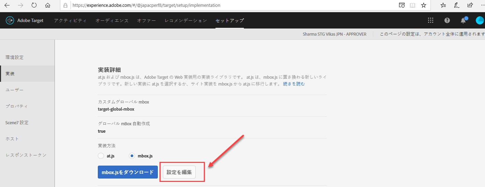
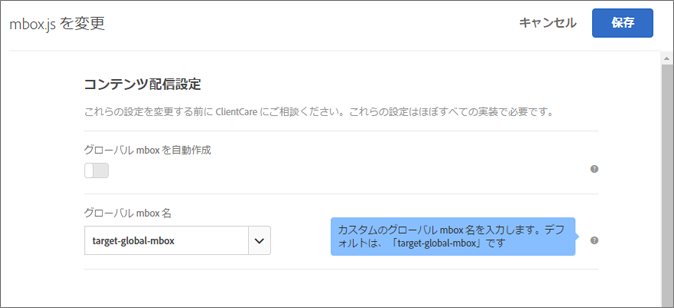
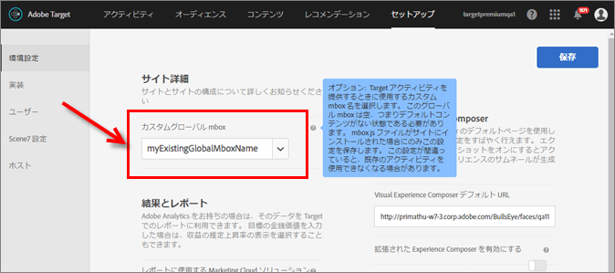

# グローバル mbox のカスタマイズ{#customize-a-global-mbox}

at.js および mbox.js の両方でグローバル mbox をカスタマイズするために役立つ情報を紹介します。

1. mbox.js を編集します。

   「**[!UICONTROL Target]**」／「**[!UICONTROL セットアップ]**」／「**[!UICONTROL 実装]**」の順に移動します。

   * mbox.js の場合、「**[!UICONTROL mbox.js 設定を編集]**」をクリックします。
   * [!DNL at.js] の場合、「実装方法」の下で「**[!UICONTROL at.js]**」を選択し、「**[!UICONTROL mbox.js 設定を編集**]」をクリックします。
   

1. [!DNL mbox.js] または [!DNL at.js] を編集します。

   「**[!UICONTROL グローバル mbox 自動作成]**」を無効にして、[!DNL Target Standard/Premium] からアクティビティを配信する際に使用するカスタムグローバル mbox の名前を追加します。このカスタムグローバル mbox は、クリック追跡にも使用されます。

   

   終了したら「**[!UICONTROL 保存]」をクリックします。**
1. [!DNL mbox.js] または [!DNL at.js] ライブラリをサイトに導入します。

* mbox. js については、「[mbox. js の実装](../../../../c-implementing-target/c-implementing-target-for-client-side-web/t-mbox-download/mbox-download.md#task_4EAE26BB84FD4E1D858F411AEDF4B420)」を参照してください。
* at.js については、「[at.js の実装](../../../../c-implementing-target/c-implementing-target-for-client-side-web/t-mbox-download/c-target-atjs-implementation/target-atjs-implementation.md#concept_8AC8D169E02944B1A547A0CAD97EAC17)」を参照してください。

1. リリースへの移行のタイミングをはかります。

   [!DNL Target Standard/Premium] がすべてのアクティビティについてグローバル mbox を使用し始める準備が整ったら、次の手順をおこないます。

   カスタムグローバル mbox の名前が前述の手順 2 で使用した名前に一致するよう更新します。

   

   >[!IMPORTANT]
   >
   >保存すると、アカウント内のすべてのアクティビティがこの mbox に同期します。この mbox がサイト上になかった場合、すべてのアクティビティが機能しなくなります。

   「**[!UICONTROL 保存]**」をクリックします。
