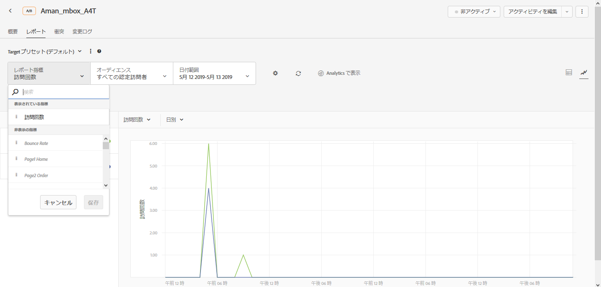
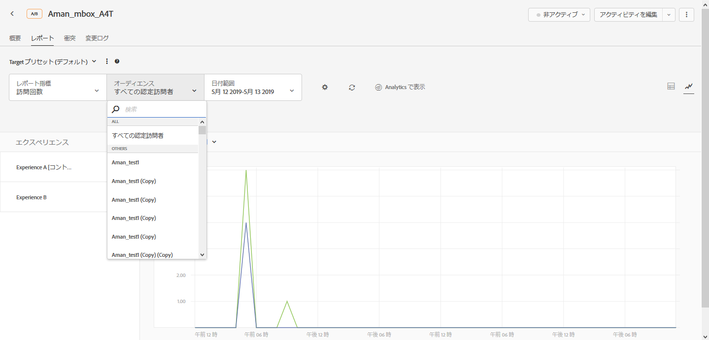
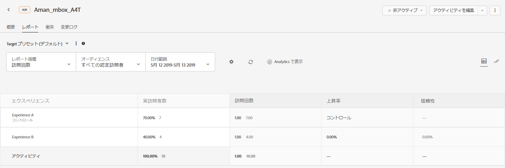

# Adobe Target のレポートソースとしての Adobe Analytics（A4T）{#adobe-analytics-as-the-reporting-source-for-adobe-target-a-t}

アドビの「Analytics for Target」（A4T）は、Analytics のコンバージョン指標とオーディエンスセグメントに基づいてアクティビティを作成できるクロスソリューション統合です。この A4T 統合により、Analytics レポートを使用して結果を確認できます。Analytics をアクティビティのレポートソースとして使用しているときは、そのアクティビティのレポート作成とセグメント化はすべて Analytics のデータ収集に基づいておこなわれます。

## A4T の概要 {#section_92B66069210C40DBA937790E8CC596CF}

Target と Analytics を統合する Analytics for Target では、組織の最適化プログラムに適した強力な分析機能と時間節約ツールを利用できます。

Target で Analytics データを使用するメリットには主に次の 3 つがあります。

* マーケティング担当者が、Analytics の成功指標やレポートセグメントを Target のアクティビティレポートにいつでも動的に適用できます。アクティビティを実行する前にすべての項目を指定する必要がありません。
* 単一のデータソースにより、2 つの異なるシステムのデータを収集した場合に生じる偏差が排除されます。
* 現在の Adobe Analytics の実装によって、すべての必要なデータが収集されます。レポート用のデータを収集する目的のためだけにページに mbox を実装する必要はありません。ただし、自動パーソナライゼーション（AP）アクティビティには注文の確認 mbox を実装することをお勧めします。

>[!IMPORTANT]
>
>A4T を使用する際は、事前にアカウントで統合のプロビジョニングを依頼しておく必要があります。プロビジョニングの依頼には[このフォーム](https://www.adobe.com/go/audiences)を使用します。
>
>この統合をおこなうと、Adobe Analytics を Adobe Target のデータソースとして使用できます（A4T）。これは Test&amp;Target を SiteCatalyst のデータソースとして使用するプラグインの後継と言えます。このプラグインは廃止されていますが、既存の利用者のために今でもサポートされています。

Analytics をアクティビティのレポートソースとして使用しているときは、そのアクティビティのレポート作成とセグメント化はすべて Analytics に基づいておこなわれます。

すべての Analytics の指標（計算指標も含む）は、Target Standard/Premium と Analytics の Target アクティビティレポートで利用できます。Analytics のセグメントも、すべて両方のソリューションに適用できます。テスト開始後、またはテストが完了した後でも、Target Standard/Premium のレポートに指標やオーディエンスを適用できます。

顧客の指標や Analytics に組み込まれている計算指標を含む、すべての指標を利用できます。

分類期間後、これらのレポートでは、データが Web サイトから収集された約 1 時間後にデータが表示されます。レポート内のすべての指標、セグメントおよび値は、アクティビティを設定したときに選択したレポートスイートから収集されます。

A4T の使用を検討している場合は、次の点に注意してください。

* Adobe Analytics を Adobe Target のレポートソースとして使用するには、利用者および企業が Adobe Analytics と Adobe Target の両方にアクセスできる必要があります。[アカウント担当者にお問い合わせください](../../cmp-resources-and-contact-information.md#concept_34A1CA16F2244D42930BB77846A5ABBB)。
* レポートソースはアクティビティごとに設定されます。Target はレポートに使用するデータを引き続き収集するので、Target によって収集されたデータをアクティビティのベースにしたい場合は、Target のデータを利用できます。
* どちらか 1 つのレポートソースを選ぶ必要があります。両方のソースから 1 つのアクティビティのデータを収集することはできません。
* A4T を使用する場合は、アクティビティに使用できる成功指標はすべて Analytics の指標です。ただし、目標指標は mbox の呼び出しをベースにすることができます。例えば、Analytics のクリック追跡コードを実装する代わりに、Target が備えているクリック追跡機能を A4T で使用できます。
* Target UI で A4T アクティビティのレポートを表示すると、Analytics のデータが表示されます。例えば、Target で訪問者指標を使った場合、使用されるのは Analytics の訪問者指標であり、Target の訪問者指標ではありません。その場合、Target の訪問者指標は参加者と呼ばれます。この違いは、特に基本的なトラフィック指標（訪問者、訪問、ページビュー）とコンバージョン指標において重要です。
* 既存の Target アクティビティは引き続き Target のデータ収集を使用するので、A4T を有効にしても影響を受けません。
* Analytics をレポートソースとして使用する場合、許可される mbox ベースの指標は 1 つのみです。
* Target から Analytics へのサーバー間コールによって、アクティビティとエクスペリエンスの情報が Analytics に送られます。この統合によって、Target または Analytics に追加のサーバーコールが生じることはありません。

   状況によっては、TargetからAnalyticsへの分類呼び出しが失敗し、アクティビティにAnalyticsのデータが表示されない場合があります。 この問題が発生した場合は、AnalyticsとTarget [の統合のトラブルシューティング(A4T)を参照してください](/help/c-integrating-target-with-mac/a4t/c-a4t-troubleshooting/a4t-troubleshooting.md)。 ClientCareにお問い合わせの [場合も](/help/cmp-resources-and-contact-information.md#concept_34A1CA16F2244D42930BB77846A5ABBB) 、ご不明な点があります。

## サポートされているアクティビティのタイプ {#section_F487896214BF4803AF78C552EF1669AA}

次の表には、Analytics がレポートソースとしてサポートされるアクティビティタイプを示しています（A4T）。

| アクティビティのタイプ | A4T との互換性 | メモ（該当する場合） |
|--- |--- |--- |
| 手動トラフィック分割を使用した A/B アクティビティ | ○ |  |
| 自動配分を使用した A/B アクティビティ | × |  |
| 自動ターゲットを使用した A/B アクティビティ | × |  |
| エクスペリエンスターゲット設定（XT） | ○ |  |
| 多変量分析テスト（MVT） | ○ | 要素貢献度レポートを取得するには、mbox ベースの目標指標の目標が必要です。要素貢献度レポートは現在、Analytics の指標をサポートしていません。 |
| 自動パーソナライゼーション（AP）アクティビティ | × |  |
| Recommendations アクティビティ | ○ |  |
| モバイルアプリ | ○ | Mobile Services SDK バージョン 4.13.1 以降でサポートされています。詳しくは、[Mobile Services のドキュメント](https://docs.adobe.com/content/help/en/mobile-services/using/home.html)を参照してください。 |
| 電子メール | × |  |
| Server Side Delivery API | ○ | 詳細については、「[サーバー側：Target の実装](/help/c-implementing-target/c-api-and-sdk-overview/api-and-sdk-overview.md)」を参照してください。 |
| NodeJS SDK | ○ | 詳細については、「[サーバー側：Target の実装](/help/c-implementing-target/c-api-and-sdk-overview/api-and-sdk-overview.md)」を参照してください。 |
| AEM 6.1（またはそれ以前）のクラウドサービス統合 | × |  |
| AEM 6.2（またはそれ以降）のクラウドサービス統合 | ○ | 詳しくは、Adobe Experience Manager 6.2 のドキュメントの [Adobe Target との統合](https://helpx.adobe.com/experience-manager/6-2/sites/administering/using/target.html)を参照してください。 |
| リダイレクトオファーを使用するすべてのアクティビティ | ○ | A4T でリダイレクトオファーを使用する場合は、より厳格な最小要件が適用されます。詳しくは、[リダイレクトオファー - A4T に関する FAQ](/help/c-integrating-target-with-mac/a4t/r-a4t-faq/a4t-faq-redirect-offers.md) を参照してください。 |
| Node.JS | ○ |  |

まだ A4T をサポートしていないアクティビティタイプがあるので、「orderConfirmPage」mbox など、重要なコンバージョン mbox を保持または実装することをお勧めします。

## A4T レポートの例 {#section_F0A43A1CB2F04E8282B909E4D7034361}

[!DNL Target]**で A4T レポートを表示するには、「[!UICONTROL アクティビティ]**」をクリックし、[!DNL Analytics] をレポートソースとして使用するリストから目的のアクティビティをクリックして、「**[!UICONTROL レポート]」タブをクリックします。**

>[!NOTE]
>
>[!UICONTROL アクティビティ]ページの最上部にある「[!UICONTROL レポートソース]」ドロップダウンリストを使用して、[!DNL Analytics] をレポートソースとして使用するアクティビティのみを表示できます。

レポートの右上隅にある適切なアイコンをクリックすることで、レポートのテーブル表示と[!UICONTROL グラフ表示]を切り替えることができます。

以下の図に、使用可能な [!UICONTROL  目標指標を表示する]レポート指標[!UICONTROL ドロップダウンリストを含む、A4T レポートの]グラフ表示[!DNL Analytics]を示します。

以下の図に、使用可能な [!UICONTROL  オーディエンスを表示する ]Audience[!UICONTROL  ドロップダウンリストを含む、A4T レポートの]グラフ表示[!DNL Analytics]を示します。

以下の図に、A4T レポートの[!UICONTROL テーブル表示]を示します。

[!DNL Analytics] ではなく [!DNL Target] でレポートを表示するには、レポートの上部にある「**[!UICONTROL Analytics で表示]**」をクリックします。

## 「Analytics＆Target：分析のベストプラクティス」チュートリアル{#section_3438E6E77A464424B717A4FD333B84B2}

Adobe Experience League が提供する [Analytics＆Target：分析のベストプラクティス](https://spark.adobe.com/page/Lo3Spm4oBOvwF/)チュートリアルを開きます。

## トレーニングビデオ：

以下のビデオは、この記事で説明する概念についてさらに詳しく説明しています。

### Analytics for Target（A4T）（4：32）

このビデオでは、最適化プログラムの分析を推進するために Adobe Target で Adobe Analytics をレポートソースとして使用する方法を説明します。

* A4T とは何かと、使用する理由の説明
* A4T の仕組みの説明
* A4T を使用する前に必要な前提条件の理解

>[!VIDEO](https://video.tv.adobe.com/v/17384?captions=jpn)

### Analytics と Target の統合（A4T）（40：33）

このビデオは、「[Office Hours](../../cmp-resources-and-contact-information.md#concept_58EA30379D3B48C4848BA2A8C464A5B7)」（アドビカスタマーケアチーム主導による取り組みの 1 つ）の録画です。

* 統合を設定し、統合が機能することを検証する方法
* 統合の仕組み
* Analytics での使用に最適なレポートの詳細
* A4T に関するよくある質問への回答

[Analytics/Target統合(A4T)の営業時間](https://helpx.adobe.com/customer-care-office-hours/target/analytics-target-A4T-integration.html)