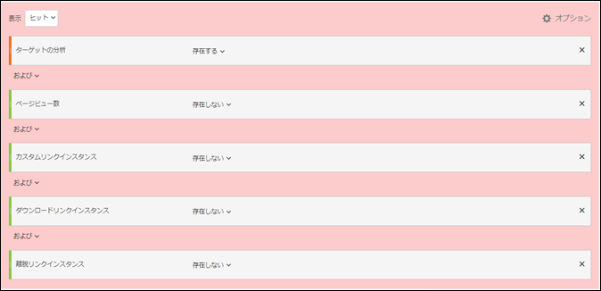

# A4T での水増しされた訪問と訪問者カウントの最小化{#minimizing-inflated-visit-and-visitor-counts-in-a-t}

[!DNL Adobe Analytics]を[!DNL Adobe Target]のレポートソースとして使用する場合(A4T)に、水増しされた訪問と訪問者カウントの影響を最小限に抑えるための情報です。

>[!IMPORTANT]
>2016 年 11 月 15 日に、Adobe Analytics では、Target で Analytics レポートを使用（A4T）しているお客様のために、一部のデータの処理方法を変更しました。この変更により、Adobe Target データと Adobe Analytics のデータモデルとの整合性が向上しています。この変更は、A4T をご利用のすべてのお客様にロールアウトされています。具体的には、この変更では、一部の顧客から指摘のあった、Target アクティビティが実行されているときに訪問者カウントが水増しされる問題を解決します。
>
>この変更はさかのぼっては適用されません。履歴レポートに水増しされたカウントが表示され、レポートからそれらのカウントを除外したい場合は、下で説明されているように、仮想レポートスイートを作成できます。
>
>また、水増しされたカウントを最小限に抑えるために、いくつかのJavaScriptライブラリが更新されました。 Adobeでは、次のライブラリバージョン（またはそれ以降）にアップグレードすることをお勧めします。
>
>* Experience Cloud 訪問者 ID サービス：visitorAPI.js バージョン 2.3.0 以降。
>* Adobe Analytics：appMeasurement.js バージョン 2.1。
>* Adobe Target：at.js バージョン 0.9.6 以降（A4T でリダイレクトオファーを使用している場合はバージョン 1.1.0 を除く）。

>
>  
mbox.js ライブラリを使用している場合、A4T によるリダイレクトオファーはサポートされません。実装では at.js を使用する必要があります。

## 変更内容 {#section_9CCF45F5D66D48EBA88F3A178B27D986}

[!DNL Adobe Analytics]を使用して[!DNL Target]アクティビティ（A4Tと呼ばれる）の測定を行うと、[!DNL Analytics]は、ページに[!DNL Target]アクティビティがない場合に利用できない追加のデータを収集します。 [!DNL Target]アクティビティはページの上部で呼び出しを実行しますが、[!DNL Analytics]は通常、ページの下部でデータ収集呼び出しを実行します。 今までのA4Tの実装では、[!DNL Target]アクティビティがアクティブな場合は常に、Adobeにこの追加データが含まれます。 今後、この追加データは、[!DNL Target]タグと[!DNL Analytics]タグの両方が実行された場合にのみAdobeに組み込まれます。

## この変更をおこなった理由{#section_92380A4BD69E4B8886692DD27540C92A}

アドビはデータの正確性と品質に自信を持っています。[!DNL Target]タグが起動し、[!DNL Analytics]タグが実行しない場合、Analyticsは「部分的なデータ」（「未関連付けヒット」とも呼ばれる）を記録します。 [!DNL Target]アクティビティがない場合、これらの未関連付けヒットは[!DNL Analytics]によってキャプチャされません。 この部分的なデータを[!DNL Analytics]レポートに含めると追加情報が得られますが、[!DNL Target]アクティビティが実行されなかった期間の履歴データとの矛盾も生じます。 この状況は、[!DNL Analytics]ユーザーが経時的にトレンドを分析している場合に問題を引き起こす可能性があります。 [!DNL Analytics]でのデータの一貫性を確保するために、Adobeは部分的なデータをすべて除外します。

## 部分的なデータが生じる原因{#section_C9C906BEAA7D44DAB9D3C03932A2FEB8}

[!DNL Analytics]に部分的なデータの割合が高いお客様がいる場合、Adobeに遭遇しました。 部分的なデータの割合が高いと、不適切な実装が原因で生じる可能性がありますが、正当な原因もあります。

部分的なデータが生じる原因として特定されているものは次のとおりです。

* **レポートスイート ID（実装）の不一致：**&#x200B;アクティビティの設定中に指定されたレポートスイートが、テストが配信されるページのレポートスイートと一致していません。[!DNL Analytics]サーバーでデータを調整できないので、部分的なデータのようです。
* **遅いページ：** [!DNL Target] 呼び出しはページの先頭に、 [!DNL Analytics] 呼び出しは通常ページの末尾にあります。ページの読み込みが遅い場合は、[!DNL Target]の呼び出しの後、かつ[!DNL Analytics]の呼び出しの前に、訪問者がページを離れる可能性が高くなります。 遅いページは、接続速度が頻繁に低下するモバイルWebサイトでは特に問題を起こす可能性があります。
* **ページエラー：JavaScriptエラーがある** 場合や、各タッチポイントが実行されないシナリオ(Experience CloudIDサービス、ターゲットおよびAnalytics)の場合、データの一部が結果に返されます。
* **[!DNL Target]** アクティビティのリダイレクトオファー:A4Tを使用するアクティビティのリダイレクトオファーでは、実装が特定の最小要件を満たす必要があります。また、知っておくべき重要な情報もあります。 詳しくは、[リダイレクトオファー - A4T に関する FAQ](/help/c-integrating-target-with-mac/a4t/r-a4t-faq/a4t-faq-redirect-offers.md#section_FA9384C2AA9D41EDBCE263FFFD1D9B58) を参照してください。
* **古いバージョンのライブラリ：** 過去1年間に、AdobeでJavaScriptライブラリ( [!DNL appMeasurement.js]、 `at.js/mbox.js`および `visitorAPI.js`)に対していくつかの改善が加えられ、データが可能な限り効率的に送信されるようになりました。導入に必要な条件について詳しくは、[実装する前に](/help/c-integrating-target-with-mac/a4t/before-implement.md#concept_046BC89C03044417A30B63CE34C22543)を参照してください。

## 部分的なデータを減らすためのベストプラクティス{#section_065C38501527451C8058278054A1818D}

部分的なデータ収集を減らすには、次の手順を確認します。

| 手順 | タスク |
| --- | --- |
|  | [!DNL Target]で選択したレポートスイートが、アクティビティが表示されているページのレポートスイートと同じであることを確認します。 |
|  | visitorAPI.js、appMeasurement.js、at.js/mbox.jsライブラリがA4Tと互換性のあるバージョンにあることを確認します。 導入に必要な条件について詳しくは、[実装する前に](/help/c-integrating-target-with-mac/a4t/before-implement.md)を参照してください。 |
|  | ページを離れるすべての[!DNL Target]呼び出しと[!DNL Analytics]呼び出しでSDIDが設定され、それらが一致していることを確認します。 ネットワークアナライザまたはデバッグツールを使用して、呼び出し時の `mboxMCSDID` パラメータが呼び出し時のSDIDパラメータと一致するこ [!DNL Target] とを確認 [!DNL Analytics] します。 |
|  | サイトで実装ライブラリが正しい順序で読み込まれることを確認します。詳しくは、[Analytics for Target の実装](/help/c-integrating-target-with-mac/a4t/a4timplementation.md). |

## 部分的なデータの部分を見るにはどうすればよいですか？{#section_89B663E2824A4805AB934153508A0F4B}

この情報を [!DNL Analytics] で直接入手することはできませんが、アドビカスタマーケアに連絡して、部分的なデータレポートを取得できます。このレポートは、デバッグを支援するためのものです。

## 部分的なデータを含まない履歴トレンドを表示するにはどうしたらよいですか？{#section_4C9DED560FAD4428B362DDA2064897C3}

この処理の変更は、リリース日（2016年11月14日）以降のデータにのみ影響します。 履歴指標を一致するように調整する場合は、部分的なデータを除外するセグメントを作成することをAdobeにお勧めします。

この変更に関連する次の情報には、セグメントを定義し、仮想レポートスイートに適用して、このセグメントが常に [!DNL Analytics] ビューに適用されるようにするための手順が含まれています。

ほとんどの状況では、 [!DNL Target] ヒットが各ウェブページの [!DNL Analytics] ヒットで結び付けられます。[!DNL Target] および [!DNL Analytics] 呼び出し両方と同じページの [!DNL Analytics] 呼び出しに [!DNL Experience Cloud ID]（MCID） に一貫した SDID がある場合、この関連付けが発生します。[!DNL Target] は通常もMCIDを持ちますが、訪問者IDが返される前に [!DNL Target] 発生する呼び出しは、SDIDのために継続されます。また、[!DNL Target] を呼び出した後、[!DNL Analytics] を呼び出すまで、ユーザーが同じページにとどまる必要もあります。このシナリオは理想的です。

**部分的なデータヒット:** ユーザーは、呼び出しを [!DNL Analytics] 送信するまでに十分な長さのページにとどまり、適切なMCIDが [!DNL Target] あることがあります。このシナリオでは、部分的なデータヒットが発生します([!DNL Analytics]ページ表示のないヒット)。 これらのユーザーがサイトに戻ってきて[!DNL Analytics]コードを含むページを表示した場合、再訪問者として正しくカウントされます。 ページに[!DNL Analytics]コードしかない場合、これらのヒットは失われています。 このヒットのデータは、一定の指標（訪問数）を水増しし、他の指標（1 訪問あたりのページビュー数、1 訪問あたりの時間など）を下げてしまうため、そういったデータを望まないクライアントもいます。また、ページ表示のない訪問も表示されます。 ただし、このデータを保持する正当な理由もあります。

部分的なデータヒットを最小限に抑えるには、ページの読み込みを高速化したり、ライブラリの最新バージョンに更新したり、それらのヒットを除外した[仮想レポートスイート](https://experienceleague.adobe.com/docs/analytics/components/virtual-report-suites/vrs-workflow/vrs-create.html)を作成したりします。手順については、『*Analyticsコンポーネントガイド*』の[仮想レポートスイートの作成](https://experienceleague.adobe.com/docs/analytics/components/virtual-report-suites/vrs-workflow/vrs-create.html)を参照してください。

次の図には、仮想レポートスイートのセグメント定義を示しています。

仮想レポートスイートを作成するときは、セグメント定義の次の設定を指定します（上の図を参照）。

* **表示：ヒット**
* Analytics for Target：存在する
* AND
* ページビュー数：存在しない
* AND
* カスタムリンクインスタンス：存在しない
* AND
* ダウンロードリンクインスタンス：存在しない
* AND
* 離脱リンクインスタンス：存在しない

**親なしヒット：** Analytics が呼び出される前にユーザーがページを離れてしまい、Target が適切な MCID を受け取らないこともありえます。これらのヒットは、Adobeが「親なし」ヒットと定義するものです。 これらのヒットは、ほとんど戻ってくることのない顧客を表し、訪問数と訪問者数を不適切に水増しします。

こういった「親なし」ヒットを最小限に抑えるには、上で説明しているように、こうしたヒットを除外する[仮想レポートスイート](https://experienceleague.adobe.com/docs/analytics/components/virtual-report-suites/vrs-workflow/vrs-create.html)を作成することができます。

## [!DNL Target] レポートの意味は何ですか？{#section_AAD354C722BE46D4875507F0FCBA5E36}

この変更が行われると、[!DNL Adobe]は部分的なデータの処理を行わないので、ライブテストへの新しい訪問者数と訪問数が減少する可能性があります。 他の [!DNL Analytics] の指標のコンバージョンおよびヒットは変更されません。
