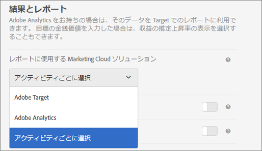

# アクティビティの設定 - A4T FAQ{#activity-settings-a-t-faq}

このトピックには、アクティビティの設定と、Analytics を Target のレポートソースとして使用すること（A4T）に関するよくある質問に対する回答が含まれています。

## レポートソースとしての Analytics（A4T）がサポートされるのは、どのアクティビティタイプですか？{#section_5E4F58CD25A5424E869E6FE0803968EF}

完全なリストについては、「[Adobe Target のレポートソースとしての Adobe Analytics（A4T）](../../../c-integrating-target-with-mac/a4t/a4t.md#concept_7540C8C04259434AB6EE33B09F47A1DE)」の「サポートされているアクティビティのタイプ」を参照してください。

## アクティビティを作成しました。データが表示されないのはなぜですか？{#section_9F8092BE4225442896F926540292F221}

アクティビティを作成すると、Target は、分類ファイルを Analytics に送信します。Analytics は、データをキャプチャおよび処理しますが、分類ファイルが更新されるまでレポートは表示されません。これには、最大 24 時間かかることがあります。48 時間経過してもデータが表示されない場合は、[カスタマーケアにお問い合わせ](/help/cmp-resources-and-contact-information.md#reference_ACA3391A00EF467B87930A450050077C)ください。または、アクティビティを開始することがわかっている場合は、数日前にあらかじめアクティビティを作成して、アクティビティを保存する際に分類が送信されるようにしておきます。こうすることで、開始時にレポートにデータが表示されます。Analytics でデータが処理されるまで 45 ～ 90 分かかることに注意してください。

## 新しいアクティビティを作成する際に、Analytics をレポートソースとして選択できないのはなぜですか？ {#section_9F4F69C3085F4C2480AF439127EB27CD}

「管理」で「レポート設定」オプションを変更できます。

1. In Adobe Target, click **[!UICONTROL Administration]**.
1. 「**[!UICONTROL レポートに使用する Experience Cloud ソリューション]**」ドロップダウンリストで、「**[!UICONTROL アクティビティごとに選択]**」を選択します。

アクティビティを作成および編集する&#x200B;**[!UICONTROL 目標と設定]**&#x200B;画面で、**[!UICONTROL レポートソース]**&#x200B;ドロップダウンリストが有効になります。

To always use Analytics as the reporting source, select **[!UICONTROL Adobe Analytics]** from the drop-down list in Administration.
