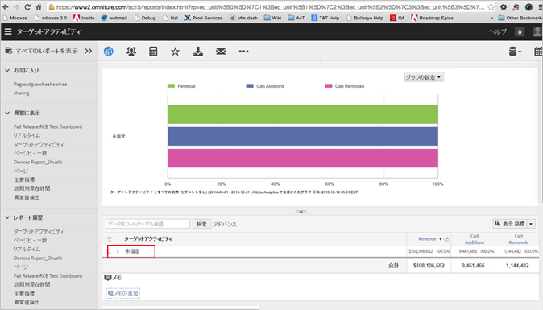

# レポートの表示 - A4T FAQ{#view-reports-a-t-faq}

このトピックには、Analytics を Target のレポートソースとして使用する（A4T）場合のレポートの表示に関するよくある質問に対する回答が含まれています。

## カウント手法とは何ですか？ その使い方を教えてください。{#section_E9C21C47B5BE4E54BABF0CD7F03D3945}

カウント手法は、Target がコンバージョン率の分母として何を使用するかを指定します。選択肢は次のとおりです。

* インプレッション数
* 訪問者数
* 訪問回数

## Target レポートのデフォルト指標を設定できますか？ {#section_50C20D286AA042CCA958184C9C0767DD}

アクティビティレポートについては、管理者がデフォルト指標を変更できるので、同じ指標を表示するレポートをいつでも実行できます。それ以外については、レポートは、最後に使用したレポートに適用した最後の指標がデフォルトになります。

詳細については、*Reports and Analytics のインターフェイスのヘルプ*&#x200B;ガイドの[デフォルトのレポート指標の選択](https://marketing.adobe.com/resources/help/en_US/sc/user/t_metrics_set_default.html)を参照してください。

## セグメントをレポートに適用するのに対して、いつセグメントを指標（計算指標を含む）に適用すればよいですか？{#section_BC29DEE6D2734911A5CD6FBF1189EB89}

レポートに適用したセグメントは、Target Classic でセグメントを適用するのに似ています。この手法は、テストがユーザーのサブセットにどのように影響するか（例えば、このテストがイギリスにいる人々にどのように機能したか）を確認するのに最も役立ちます。

計算指標を含む指標にセグメントを適用できます。これは、通常、新しいタイプの成功指標を作成したい場合におこなわれます。例えば、アクティビティがもたらした再訪問者の数や、あるページへの訪問者のうちテストを表示した人数を確認したい場合です。現在のところ、上昇率および信頼性は、計算指標用に生成できないことに注意してください。

## レポートを表示する際に、訪問者数、アクティビティのインプレッションまたは訪問回数を使用する必要はありますか？ {#metrics}

いくつかのオプションがあり、それぞれに独自の利点があります。

* ***実訪問者数***&#x200B;は、あるユーザーが初めてアクティビティの対象になったときに 1 回増加します。
* ***訪問回数***&#x200B;は、あるユーザー（実訪問者）がアクティビティに入るとセッションのたびに 1 回増加します（その後の訪問でそのアクティビティが表示されない場合も含む）。
* ***アクティビティのインプレッション***&#x200B;は、アクティビティコンテンツが配信されるたびに増加します（Target によって測定されます）。
* ***インスタンス***&#x200B;は、アクティビティコンテンツが配信されると、ページごとに 1 回増加します（Analytics によって測定されます）。

アクティビティが含まれているページを訪問者が閲覧すると、該当するアクティビティの名前を含む変数がその訪問者に対して設定されます。各カウント方法を比較する方法については、以下の詳細なシナリオを参照してください。

次の点に留意してください。

* 上記の指標はすべて、ユーザーがアクティビティの対象となり、[!DNL Target] からコンテンツが返されたときにトリガーされます。したがって、必ずしもそのユーザーがオファーを見たかどうかはわかりません。アクティビティエクスペリエンスがスクロールしないと見えない場所にある場合、[!DNL Target] によってオファーが配信されていても、ユーザーがページを下にスクロールしなければ、オファーは見られていないことになります。
* （[!UICONTROL  によって測定される）]アクティビティのインプレッション[!DNL Target]と（[!UICONTROL  によって測定される）]インスタンス[!DNL Analytics]は同じ値になります。ただし、同じアクティビティで複数の mbox 呼び出しが同じページに対しておこなわれた場合を例外です。この場合、[!UICONTROL アクティビティのインプレッション]は複数回カウントされますが、[!UICONTROL インスタンス]は 1 回しかカウントされません。
* アクティビティ [!UICONTROL インプレッション] および [!UICONTROL アクティビティコンバージョン] 指標を使用する場合 [!DNL Analysis Workspace]は、両方の指標が [!UICONTROL 同じタッチ] アトリビューションモデルを適用していることを確認してください。モデルを適用するには、列設定ギアをクリックし、 [!UICONTROL デフォルトでないアトリビューションモデルを有効に]して、 [!UICONTROL 「同じタッチ]」を選択します。属性IQの [概要](https://docs.adobe.com/content/help/en/analytics/analyze/analysis-workspace/panels/attribution.html) について詳しくは *、Analyticsツールガイド*&#x200B;の説明を参照してください。

## アクティビティの設定中にマーケティング担当者が Analytics 指標を選択する場合、「アクティビティコンバージョン」は何を意味しますか？{#section_F3EBACF85AF846E9B366A549AAB64356}

アクティビティのコンバージョン指標として Analytics 指標が選択されると、アクティビティコンバージョンは、空になります。

## Analytics レポートで「未指定」と表示されるのはなぜですか？これはどういう意味ですか。{#unspecified}

他のレポートの場合、「未指定」は、データが分類ルールを満たしていなかったことを意味しますが、A4T の場合は、これは発生しないはずです。「未指定」と表示される場合、分類サービスがまだ実行されていません。通常、アクティビティデータがレポートに表示されるまでには24~72時間かかります。それまではアクティビティがこのレポートに表示されないとしても、これらのアクティビティに結び付けられたすべての訪問者データは、キャプチャされ、分類が完了すると表示されます。

分類期間後、これらのレポートでは、データが Web サイトから収集された約 1 時間後にデータが表示されます。レポート内のすべての指標、セグメントおよび値は、アクティビティを設定したときに選択したレポートスイートから収集されます。

## アクティビティを非アクティブ化した後も Target 指標が Analytics に送信されるのはなぜですか？{#section_38AA8380A4D54A18972F1EF3E73E22EF}

[!DNL Target] に送信される [!DNL Analytics] 変数には、デフォルトで 90 日間の有効期限があります。この有効期限は必要に応じて ClientCare で調整できます。この設定は、すべてのアクティビティでグローバルなので、1 つの事例のために調整することはしないでください。

有効期限が 90 日なのは、そのユーザーが A4T が有効な別の Target アクティビティを表示しなかった場合のみなので、有効期限後に Target 変数が Analytics に送信されることがあります。ユーザーが 45 日目にサイトに戻り、別のアクティビティを表示すると、A4T eVar 全体の値で、カウンターが 90 日にリセットされます。つまり、最初のキャンペーンは、1 日目から最大 45 + 90 = 135 日間残っていることになります。ユーザーが戻り続けると、かなり古いアクティビティからのレポートで指標が Analytics に送信されたのを確認できることがあります。ユーザーが cookie を削除してサイトに戻らないと、このアクティビティ内の数は減少しますが、依然として表示されます。

つまり、アクティビティがアクティブであった期間に参加した参加者については、アクティビティが終了した後も、最長 90 日間はそのアクティビティでページビューや訪問数などが収集されます。ただし、[!UICONTROL アクティビティのインプレッション]指標を見ると、アクティビティの終了後にはインプレッションが表示されていません。

これは、期待どおりの正常な動作です。A4T 変数は、他の eVar のように機能します。有効期間（90 日）が経過するまで、値はユーザーに関連付けられます。その結果、アクティビティが 2 週間のみアクティブである場合、値は、少なくとも次の 90 日間はユーザーに関連付けられます。

ベストプラクティスは、アクティビティがライブだった期間のみのアクティビティのレポートを表示することです。Analytics でアクティビティを表示する場合、日付は、デフォルトで正しく設定される必要があるので、手動で日付を延長しない限り、レポートの観点からはこれは問題にはなりません。

例として、A4T 変数が 90 日後に期限切れになり、テストが 1 月 1 日から 1 月 15 日までアクティブである場合を見てみましょう。

1 月 1 日に、ユーザーがサイトを訪れて、アクティビティ XYZ を 1 回表示し、その後 5 ページを表示しました。次の 2 週間の間、ユーザーはサイトに戻りませんでした。このユーザーのデータは、以下のようになります。

| アクティビティ名 | インスタンス数（インプレッション数） | ページビュー数 | 訪問回数 | 実訪問者数 |
|--- |--- |--- |--- |--- |
| XYZ | 1 | 5 | 1 | 1 |

ユーザーは 2 月 1 日に戻り、さらに 5 ページを表示して、追加の Target アクティビティは発生しませんでした。元のアクティビティは既にアクティブでなくなっています。アクティビティはアクティブではありませんが、eVar の永続性により、まだユーザーをフォローしています。現在のデータは、以下のようになります。

| アクティビティ名 | インスタンス数（インプレッション数） | ページビュー数 | 訪問回数 | 実訪問者数 |
|--- |--- |--- |--- |--- |
| XYZ | 1 | 10 | 2 | 1 |

ユーザーは 3 月 1 日に戻り、新しいアクティビティ、ABC を表示します。また、ユーザーは 5 ページを表示します。アクティビティ XYZ は、永続性により、まだユーザーをフォローしており、このユーザーには ABC が設定されたので、レポートには 2 行の項目が表示されます。

| アクティビティ名 | インスタンス数（インプレッション数） | ページビュー数 | 訪問回数 | 実訪問者数 |
|--- |--- |--- |--- |--- |
| XYZ | 1 | 15 | 3 | 1 |
| ABC | 1 | 5 | 1 | 1 |

その後、ユーザーは 4 月 1 日に戻り、別の 5 ページを表示して、買い物をしました。最初の eVar 値の 90 日の有効期限は 4 月 1 日にリセットされたので、レポートに表示されます。そして、ユーザーに表示されるすべての Target アクティビティは、コンバージョンのクレジットを受け取りますが、コンバージョンの合計は重複除外されます。

| アクティビティ名 | インスタンス数（インプレッション数） | ページビュー数 | 訪問回数 | 実訪問者数 | 購入回数 |
|--- |--- |--- |--- |--- |--- |
| XYZ | 1 | 20 | 4 | 1 | 1 |
| ABC | 1 | 10 | 2 | 1 | 1 |
| 合計 | 2 | 20 | 3 | 1 | 1 |

両方のエクスペリエンスがコンバージョン前に表示されているので、両方とも注文の「クレジット」を受け取ります。しかし、システムでの注文は 1 回のみなので、合計にはそれが反映されています。Target レポートの場合、どちらがより成功しているかを確認するためのアクティビティに対する Target アクティビティを設定していないので、ユーザーに表示されるすべてのアクティビティがクレジットを獲得することは問題にはなりません。1 つのアクティビティ内の 2 つの項目の結果を比較しており、ユーザーは同じアクティビティで異なるエクスペリエンスを表示できないので、注文クレジットの二次汚染を心配する必要はありません。

詳しくは、Analytics ヘルプの[コンバージョン変数（eVar）](https://marketing.adobe.com/resources/help/en_US/reference/conversion_var_admin.html)を参照してください。

## Analytics と Analytics for Target（A4T）が実訪問者数指標の数を違うように計算するのはなぜですか？{#section_0C3B648AB54041F9A2AA839D51791883}

スチューデントの t 検定（信頼感指標）を使用してテストの勝者を選択する A/B テストを実行する場合、前提の 1 つは、固定された時間範囲があるということです。その固定サンプルサイズを調べていない限り、テストは統計的に有効ではありません。

実訪問者数指標が Analytics と Target で異なるのは、実際のテストよりも短い一定時間に調べている場合のみです。サンプルサイズに到達していない場合、テストは信頼できるものにはなりません。詳しくは、[Evan Miller の Web サイト](https://www.evanmiller.org/index.html)の [How Not to Run an A/B Test](https://www.evanmiller.org/how-not-to-run-an-ab-test.html)（英語）を参照してください。

実訪問者数指標は、指定された期間にサイトを訪問し、テストの対象となった人の数を表示します。そうした人々は、依然としてテストに参加しており、カウントされる必要があります。1 週間の間に対象となった人数のみを表示したい場合、アクティビティのインプレッションがある訪問者のセグメントを作成して、レポートに適用できます。

Target 変数がセッションに至るまでの持続時間を短縮できます。ただし、通常、テストにとって、コンバージョンイベントが同じセッション内で発生しそうにないという問題があります。

## Analytics で、複数のエクスペリエンスで同じ訪問者がカウントされる場合があるのはなぜですか？ {#section_1397E972D31C4207A142E4D2D6D794A2}

Analytics で、同一の訪問者が複数のエクスペリエンスでカウントされる理由は次のとおりです。

* Target プロファイルの有効期限は切れましたが、Analytics の Cookie がまだ残っています。その場合は、Target は該当のユーザーを再評価しますが、Analytics は該当の訪問者が同一ユーザーであると認識します。
* 訪問者が `mbox3rdPartyId` を使用している場合、その匿名の訪問者がサードパーティの ID プロファイルと統合されると、Target はサードパーティの ID と適合させるために、訪問者に別のエクスペリエンスを割り当てます。詳細については、「[mbox3rdPartyID のリアルタイムプロファイル同期](../../../c-target/c-visitor-profile/3rd-party-id.md#concept_BF4113593F614987B1D3E359AE1C5732)」を参照してください。
* Analytics は、Target とは違う方法で、複数のデバイスを同一の訪問者として追跡する場合があります。Target で設定されたサードパーティ ID は、Analytics のものとは異なるためです。

## A4Tは仮想レポートスイートをサポートしていますか?

仮想レポートスイートはレポートスイートリストに含まれて&#x200B;*いません*。また、仮想レポートスイートのオーディエンスは A4T レポートではサポートされていません。

## アクティビティをアクティブ化した後に、A4T を使用するそのアクティビティのトラフィック割り当ての割合を変更できますか？

アクティブ化後にアクティビティ内のトラフィック割り当ての割合を変更すると、変更が新しい訪問者にのみ影響するため、Analyticsでのレポートの不一致が発生する可能性があります。再訪問者は影響を受けません。

ベストプラクティスとして、既存のアクティビティを停止し、アクティブ化の後に割合を変更するのではなく、新しいアクティビティを作成する必要があります。新規訪問者と再訪問者のデータから新しいアクティビティをレポートすることで、レポートの不一致が生じることはありません。

## Adobe Analysis Workspace で Target アクティビティデータを表示できますか？

[!DNL Adobe Analysis Workspace] を使用すると、データをより深く分析したり、データを可視化したり、表に現れない隠れたインサイトを明らかにしたりできます。

For detailed information and examples, open the [Analytics &amp; Target: Best Practices for Analysis tutorial](https://spark.adobe.com/page/Lo3Spm4oBOvwF/), provided by Adobe Experience League.