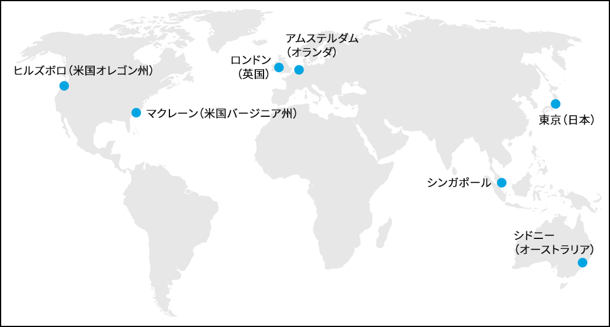

# Adobe Target の仕組み{#how-adobe-target-works}

Target JavaScriptライブラリ（at. jsおよびmbox. js）に関する情報、およびTargetに含まれる様々なアクティビティタイプなど、Adobe Targetの仕組みについて取り上げます。

## Target JavaScriptライブラリ {#libraries}

Adobe Target は、2 つの JavaScript ライブラリのいずれかによって Web サイトと統合されます（at.js または mbox.js）。

* **at.js：**[at.js library ](../c-implementing-target/c-implementing-target-for-client-side-web/t-mbox-download/c-target-atjs-implementation/target-atjs-implementation.md#concept_8AC8D169E02944B1A547A0CAD97EAC17) は、Target の新しい実装ライブラリです。at.js ライブラリは、Web 実装のページ読み込み時間を改善し、シングルページアプリケーション向けのより優れた実装オプションを提供します。at.js は推奨される実装ライブラリであり、頻繁にアップデートされて新しい機能が追加されます。すべてのお客様に対して、[at.js の最新バージョン](../c-implementing-target/c-implementing-target-for-client-side-web/target-atjs-versions.md#reference_DBB5EDB79EC44E558F9E08D4774A0F7A)を実装するか、最新バージョンに移行することをお勧めします。
* **mbox.js：** mbox.js ライブラリは、Target のレガシー実装ライブラリです。mbox.js ライブラリは引き続きサポートされますが、機能のアップデートはおこなわれません。

>[!IMPORTANT]
>
>すべてのお客様が at.js に移行する必要があります。詳細については、「[mbox.js から at.js への移行を参照](../c-implementing-target/c-implementing-target-for-client-side-web/t-mbox-download/c-target-atjs-implementation/target-migrate-atjs.md#task_DE55DCE9AC2F49728395665DE1B1E6EA)」を参照してください。

サイト上のすべてのページでいずれかの Target JavaScript ファイルを参照する必要があります。例えば、これをグローバルヘッダーに追加します。

訪問者が Target に最適化されたページを要求するたびに、そのリクエストがターゲット設定システムに送信され、訪問者に提供するコンテンツが特定されます。このプロセスはリアルタイムで実行されます。つまり、ページが読み込まれるたびに、コンテンツへのリクエストが作成され、システムで処理されます。コンテンツは、マーケティング担当者が制御するアクティビティおよびエクスペリエンスのルールによって管理され、個々のサイト訪問者がターゲットになります。応答率、獲得率および売上高が最大化されるように、各サイト訪問者が応答し、やり取りをおこない、最終的に購入する可能性の最も高いコンテンツが提供されます。

Target では、ページ上の各要素は、ページ全体の単一のエクスペリエンスの一部になります。各エクスペリエンスには、ページ上の複数の要素が含まれています。追跡する各ページの `<head>` に単一行のコードを記述して、ページを最適化します。

訪問者に表示されるコンテンツは、作成するアクティビティのタイプによって異なります。

### A/B テスト

詳細については、「[A/B テストの作成](../c-activities/t-test-ab/t-test-create-ab/test-create-ab.md#task_68C8079BF9FF4625A3BD6680D554BB72)」を参照してください。

基本的な A/B テストで表示されるコンテンツは、各エクスペリエンスに対して選択したパーセンテージに従って、アクティビティに割り当てたアセットからランダムに選択されます。このランダムなトラフィック分割の結果、トラフィックの割合が均等化するまでの初期のトラフィック量が多くなる場合があります。例えば、2 つのエクスペリエンスを作成した場合、最初のエクスペリエンスはランダムに選択されます。トラフィック量がほとんどない場合は、訪問者の割合が一方のエクスペリエンスに偏っている可能性があります。トラフィックが増加するほど、その割合も均等化されていきます。

エクスペリエンスごとに割合のターゲットを指定できます。この場合、乱数が生成され、その乱数を使用して、表示するエクスペリエンスが選択されます。結果の割合が指定したターゲットと完全に一致しないこともありますが、トラフィックが多いほど、エクスペリエンスがターゲットに近い割合で分割されます。

1. 訪問者が、サーバー上のページをリクエストしてブラウザーに表示します。
2. ファーストパーティ Cookie が、訪問者行動を保存するために訪問者のブラウザー内に設定されます。
3. ページから、ターゲット設定システムが呼び出されます。
4. キャンペーンのルールに基づいてコンテンツが表示されます。

### 自動配分

詳細については、「[自動配分](../c-activities/automated-traffic-allocation/automated-traffic-allocation.md#concept_A1407678796B4C569E94CBA8A9F7F5D4)」を参照してください。

自動配分では、2 つ以上のエクスペリエンスの中から勝者を特定したうえで、自動的にその勝者エクスペリエンスに配分するトラフィックを増やすことでコンバージョンを促進します。その間もテストによる学習は続けられます。

### 自動ターゲット（AT）

詳細については、「[自動ターゲット](../c-activities/auto-target-to-optimize.md#concept_67779E5B7F67427A97D7EA2A6FB919B3)」を参照してください。

自動ターゲットでは、高度な機械学習を利用して、マーケティング担当者が定義した高パフォーマンスのエクスペリエンスを複数選択します。また、個々の顧客プロファイルや同様のプロファイルを持つ過去の訪問者の行動に基づいて、各訪問者に詳細にカスタマイズしたエクスペリエンスを配信することで、コンテンツをパーソナライズしてコンバージョンを促進していきます。

### Automated Personalization（AP）

詳細については、「[Automated Personalization](../c-activities/t-automated-personalization/automated-personalization.md#task_8AAF837796D74CF893CA2F88BA1491C9)」を参照してください。

Automated Personalization（AP）では、オファーやメッセージを組み合わせて、高度な機械学習を使用することで、個々の顧客プロファイルに合わせて各訪問者に様々なオファーのバリエーションを表示しながら、コンテンツをパーソナライズして上昇率を高めていきます。

### エクスペリエンスターゲット設定（XT）

[SPA 向けのエクスペリエンスのターゲット設定](../c-activities/t-experience-target/experience-target.md#task_A53DF336CB9F4D7BB87EF2106099EFC4)

エクスペリエンスのターゲット設定（XT）では、マーケティング担当者が定義した一連のルールや条件を基にして、特定のオーディエンスにコンテンツを配信します。

エクスペリエンスのターゲット設定（ジオターゲティングを含む）は、特定のオーディエンスに特定のエクスペリエンスまたはコンテンツをターゲット設定するルールを定義する際に有効です。アクティビティで複数のルールを定義して、様々なオーディエンスに異なるコンテンツのバリエーションを提供します。訪問者がサイトを表示すると、エクスペリエンスのターゲット設定（XT）は、その訪問者を評価して、設定した条件を満たしているかどうかを判断します。条件に一致した場合、その訪問者はアクティビティに組み込まれて、条件が一致したオーディエンス用に設計されたエクスペリエンスが表示されます。単一のアクティビティ内で、複数のオーディエンスに対してエクスペリエンスを作成できます。

### 多変量分析テスト（MVT）

詳しくは、[多変量分析テスト](../c-activities/c-multivariate-testing/multivariate-testing.md#concept_628695CDC71B449B8DCC2F5654C11499)を参照してください。

多変量分析テスト（MVT）では、ページ上の要素内のオファーの組み合わせを比較し、特定のオーディエンスに対して最も効果が高い組み合わせと、アクティビティの成功に最も効果が高い要素を特定します。

### Recommendations

詳細については、「[Recommendations ](../c-recommendations/recommendations.md#concept_7556C8A4543942F2A77B13A29339C0C0)」を参照してください。

Recommendations のアクティビティは、以前のユーザーアクティビティまたはその他のアルゴリズムを基にして、顧客が興味を持つ可能性のある製品またはコンテンツを自動的に表示します。Recommendations により、顧客が関心を持ちそうな商品を積極的に紹介することが可能になります。

## Edge ネットワーク {#concept_0AE2ED8E9DE64288A8B30FCBF1040934}

「Edge」は、コンテンツを要求するエンドユーザーが世界中のどこにいても最適な応答時間を確保できる、地理的に分散された配信アーキテクチャです。

応答時間を向上するために、Edge 環境ではアクティビティのロジックとキャッシュされたプロファイルおよびオファーの情報のみが格納されます。アクティビティおよびコンテンツのデータベース、[!DNL Analytics] データ、API、およびマーケティング担当者向けのユーザーインターフェイスは、アドビの中央データ環境に格納されます。その後、最新情報が Edge ノードに送信されます。この中央環境と Edge ノードが自動的に同期され、キャッシュされたアクティビティデータが継続的に更新されます。また、1:1 モデリングは各エッジに保存されるので、複雑なリクエストも Edge 上で処理できます。

各 Edge ノードには、ユーザーのコンテンツリクエストに応答し、そのリクエストに関する分析データを追跡するために必要な情報がすべてあります。ユーザーリクエストは最寄りの Edge ノードに送信されます。

コアエッジサイト拠点には、データ収集センターとデータ処理センターの両方が設置されています。エッジサイト拠点には、データ収集センターのみ設置されています。個々のレポートスイートは特定のデータ処理センターに割り当てられています。

現在、アドビのデータセンターは、北米、欧州、アジアの複数の地域を含め、複数の大陸にあります。

1 つの場所からすべてのターゲットリクエストに応答するのではなく、リクエストの発生地点に最も近い Edge 環境から応答することで、ネットワークやインターネットでのデータ移動時間の影響が緩和されます。

Edge ネットワークは、フェイルオーバーメカニズムの役割も果たします。あるエッジノードが機能していない場合、リクエストは次の最も近いノードにリダイレクトされるので、ユーザーにデフォルトコンテンツ（リクエストを完了できない場合の一般的なバックアップ応答）が提供されるようなことはありません。

## 保護されたユーザーエクスペリエンス {#concept_40A5E781D90A41E4955F80EA9E5F8F96}

アドビは、ターゲット設定インフラストラクチャの可用性とパフォーマンスが可能な限り安定するようにしています。ただし、エンドユーザーのブラウザーとアドビのサーバー間の通信が切断されると、コンテンツ配信が中断される可能性があります。

サービスの中断や接続性の問題から保護するために、すべての場所にデフォルトコンテンツ（クライアントが定義）を設定します。このデフォルトコンテンツは、ユーザーのブラウザーが [!DNL Target] に接続できない場合に表示されます。

ユーザーのブラウザーが、定義されたタイムアウト時間（デフォルトで 15 秒）以内に接続できない場合は、ページは変更されず、デフォルトのままになります。このタイムアウトのしきい値に達した場合は、ユーザーに対して他のすべての場所のデフォルトコンテンツが即座に表示されるように、Cookie 内の設定が変更されます。この状態は 30 分続き、その後、ユーザーのブラウザーは再度アドビのサーバーに接続してコンテンツリクエストの送信を試行します。

アドビは、パフォーマンスの最適化と保護によってユーザーエクスペリエンスを保護しています。

* アドビは、業界標準に基づいたパフォーマンスベンチマークを実施しており、このベンチマークはアドビのサービス契約によって保証されています。
* Edge ネットワークによって、タイムリーなデータ配信を実現しています。
* アプリケーションをセキュリティ保護するための多層型アプローチを使用し、お客様に対して最高レベルの可用性と信頼性を確保しています。
* [!DNL Target] コンサルティングは、導入支援と継続的な製品サポートをおこなっています。

## 検索エンジン最適化（SEO）対応テスト {#concept_C0C865663CAB4251B66A1F250FD25E6A}

[!DNL Adobe Target] はテストのための検索エンジンガイドラインに従っています。

Google はユーザーテストを推奨するとともに、ドキュメンテーションで、いくつかの簡単なガイドラインに従えば A/B と多変量分析テストは自然検索エンジンのランキングを損なうことはない、と説明しています。

詳しくは、次の Google のリソースを参照してください。

* [ウェブテストが Google 検索に与える影響](https://webmasters.googleblog.com/2012/08/website-testing-google-search.html)
* [ウェブテストとクローキング](https://support.google.com/analytics/answer/2576845?hl=en&ref_topic=1745207)

ガイドラインは[Google ウェブマスター向け公式ブログ](https://webmasters.googleblog.com/2012/08/website-testing-google-search.html)の投稿として公表されています。この投稿は 2012 年のものですが、この問題に関する Google からの最新の発言であり、ガイドラインは現在でも通用します。

* **クローキングをしない** - クローキングとは、検索エンジンボットを特別に識別し、意図的に異なるコンテンツをフィードすることで、ユーザー向けとは別のコンテンツを検索エンジンボット向けに表示することです。

   Target は、プラットフォームとしては検索エンジンボットを他のユーザーと同様に扱うよう設定されています。このため、ボットがランダムに選択してテストのバリエーションを「見た」場合、実行するテストにボットも含まれる場合があります。

* **rel=&quot;canonical&quot; を使う** - バリエーションを付けるために異なる URL を使用して A/B テストを設定する必要のあることがあります。これらの場合、元来の（コントロール）URL を参照する `rel="canonical"` タグをすべてのバリエーションに含ませます。例えば、Adobe がバリエーションごとに異なる URL を使用してホームページをテストしていた場合、ホームページの次の canonical タグをそれぞれのバリエーションの `<head>` タグに入れます。

   `<link rel="canonical" href="https://www.adobe.com" />`

* **302（一時的）リダイレクトを使う** - テストで複数バリエーションのページで異なる URL が使用される場合、Google は 302 リダイレクトを使用してテストバリエーションに直接トラフィックをリダイレクトすることを勧めています。こうすると、リダイレクトは一時的で、テストが動作している間のみ有効なものである、と検索エンジンに教えることになります。

   302 リダイレクトは、サーバー側のリダイレクトで、Target は他の大多数の最適化プロバイダーと同様、クライアント側の機能を使います。このため、これは Target が Google の推奨事項に完全に準拠していない部分になります。ただし、これはほんの一部のテストに影響するだけです。Target でテストを実行するための基本的アプローチは、1 つの URL 内でコンテンツを変更することであり、リダイレクトの必要はありません。クライアントのテストバリエーションに相当するように複数の URL を使う必要がある場合もあります。そういった場合には、Target は JavaScript の `window.location` コマンドを使い、テストバリエーションにユーザーをリダイレクトしますが、この方法では、リダイレクトが 301 なのか 302 なのか、明示的に示しません。

   Adobe では、検索エンジンガイドラインに完全に即した実現可能な解決策を見つける努力を続けますが、テストに複数の URL を使わなければならないクライアントでも、上に記述した通り canonical タグの適切な実装をおこなうことで、この方法にまつわるリスクを軽減できる、と確信しています。

* **テスト期間は必要な期間だけにする** - 「必要な期間」とは統計的有意性に到達するまでの期間と考えます。Target は、テストがこの時点に到達した時を判断するための[ベストプラクティスを提供](https://docs.adobe.com/content/target-microsite/testcalculator.html)します。勝者テストのハードコード実装をテストワークフローに導入し、適切なリソースを割り当てることをお勧めします。

   Target プラットフォームを使用して、勝者テストを「公開」することは、恒久的な解決策としては推奨されていませんが、100％ のユーザーに 100％ の確率で勝者テストが公開されている限り、勝者テストのハードコード処理が完了するまでこの方法を使うことができます。

   テストが変更した点に留意することも大切です。単純にページ上のボタンの色やその他文字ベースでないアイテムを更新しても、自然ランキングには大きな影響はありません。ただし、文字の変更はハードコードする必要があります。

   テストしているページへのアクセスのしやすさに留意することも大切です。電子メールキャンペーンのランディングページなど、検索エンジンからはアクセスできず、もともと自然検索でランク付けされるようにデザインされていないページには、上記の留意事項はどれも適用されません。

Google によると、これらのガイドラインに従えば、「テストがサイトの検索結果に及ぼす影響はほとんどあるいはまったくない。」とのことです。

これらのガイドラインに加えて、Google はまた、Content Experiments ツールのドキュメンテーションでもう 1 つのガイドラインを提供しています。

* 「バリエーションの各ページは、元来のページ内容の主旨を保持する必要があります。こういったバリエーションは、元来の内容に対しユーザーが持つ全般的イメージを変えてはいけません。」

Google は例として、「ユーザーに表示される組み合わせに関連しないキーワードでサイトの元来のページが読み込まれる場合、そのサイトを Google のインデックスから外すことがあります」と記述しています。

複数のテストバリエーションによって意図せず元来のページの意味を変えてしまうことはあまりないと考えますが、ページのキーワードテーマに気をつけ、それらの用語を保持することをお勧めします。ページ内容を変更、特に関連のあるキーワードを追加したり削除したりすると、自然検索でのその URL のランキングが変わってしまう場合があります。テストプロトコールの一部として、SEO パートナーに協力を仰ぐことをお勧めします。