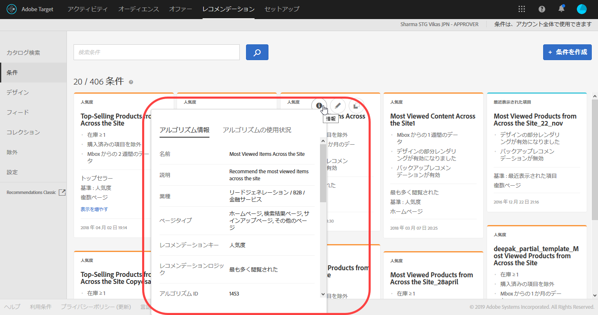
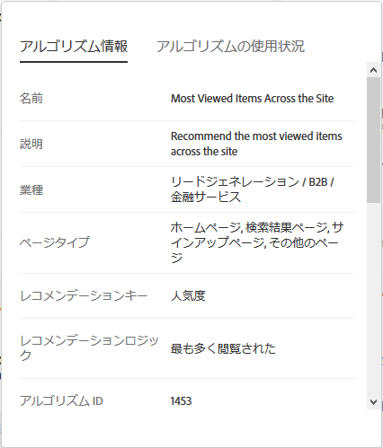
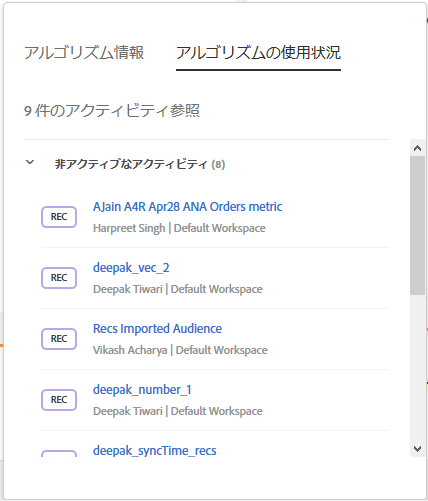

#  条件{#criteria}

条件とは、事前に定義されている訪問者の行動に基づいて、どの商品をレコメンデーションするかを決定するルールです。

条件によって、どのアクションの結果どのレコメンデーションが引き起こされるかが決定されます。複数の条件を追加することで、複数のレコメンデーションタイプを相互にテストすることができます。

## 業種 {#section_936BCFCF234C49A2BEC1C38AAC2D71AF}

レコメンデーションアクティビティの目標に基づいて業種を選択します。

| 業種 | 目標 |
|--- |--- |
| 小売／e コマース | 購入をもたらすコンバージョン |
| リードジェネレーション／B2B／金融サービス | 購入を伴わないコンバージョン |
| メディア／投稿 | エンゲージメント |

## レコメンデーションキー {#section_885B3BB1B43048A88A8926F6B76FC482}

選択するレコメンデーションキーが条件の種類を決定します。いくつかの条件の種類があり、[!DNL Recommendations] アクティビティを設定する際に条件カードとして表示されます。

| 条件の種類 | キー |
|--- |--- |
| 現在のページアクティビティ | 現在のページでユーザーがおこなったことに基づいてレコメンデーションされる品目です。例えば、特定の記事を表示した訪問者は、同じカテゴリの記事を見る可能性があると考えられます。<ul><li>現在の品目</li><li>現在のカテゴリ</li></ul> |
| カスタム | カスタム属性に基づいてレコメンデーションされる品目です。<ul><li>カスタム属性</li></ul>レコメンデーションをカスタム属性に基づいておこなう場合、カスタム属性を選択してからレコメンデーションタイプを選択する必要があります。 カスタム条件の出力にリアルタイムでフィルターを適用することができます。例えばレコメンデーション品目を、訪問者のお気に入りのカテゴリやブランドのものに絞ることができます。オフラインの計算結果とリアルタイムのフィルタリングを組み合わせることができます。 つまり Target を利用して、オフラインで計算されたレコメンデーションや独自に作成したリストに、パーソナライゼーションを加えられるということです。これにより、データサイエンティストのスキルと、配信、ランタイムフィルタリング、A/B テスト、ターゲティング、レポート、統合などのアドビの実証済みの機能を連携させることができます。 カスタム条件にインクルージョンルールを追加することで、静的なレコメンデーションを、訪問者の興味に合わせた動的なレコメンデーションに変えることができます。<ul><li>カスタム条件は、レコメンデーションの他の条件と同じように変更可能です。</li><li>他の条件と同じ方法で、[コレクション](/help/c-recommendations/c-products/collections.md)、[除外](/help/c-recommendations/c-products/exclusions.md)、および[インクルージョン](/help/c-recommendations/c-algorithms/use-dynamic-and-static-inclusion-rules.md)（価格および在庫用の特殊なルールも含む）を使用できます。</li></ul>主な使用例は次のとおりです。<ul><li>独自に作成したリストのムービーをレコメンデーションしようと考えているが、まだ対象のムービーを視聴していない訪問者のみをターゲットにしたい。</li><li>オフラインでアルゴリズムを実行し、その結果をレコメンデーションに生かそうと考えているが、在庫切れの品目はレコメンデーションの対象から外したい。</li><li>訪問者のお気に入りのカテゴリの品目のみに対象を絞りたい。</li></ul> |
| 過去の行動 | 過去、訪問者がある品目にどのように反応したかに基づいてレコメンデーションされる品目です。例えば、ある特定のブランドを購入したことがある人は、同じブランドの別の品目を購入する可能性が高いと考えられます。<ul><li>最後に購入された品目</li><li>最後に閲覧された品目</li><li>最も多く閲覧された品目</li><li>お気に入りのカテゴリ</li></ul> |
| 人気度 | 関連するカテゴリで一番人気のあるビデオや、サイトで一番表示されている製品など、一番人気のある品目がレコメンデーションされます。<ul><li>人気度</li></ul> |
| 最近表示された項目 | 訪問者が前回サイトに訪問した際に表示した品目や、現在一番好まれている記事など、訪問者が最近表示した品目をレコメンドします。 「最近表示された項目」アルゴリズムは、[環境](/help/administrating-target/hosts.md)内の訪問者のアクティビティ固有の結果を返します。2 つのサイトが異なる環境に属している場合、訪問者が 2 つのサイトを切り替えると、アルゴリズムは適切なサイトから最近表示された項目のみを返します。 この条件タイプは、コレクションによって制限されません。<ul><li>最近表示された項目</li></ul>**注意：** 最近表示された項目の条件は、バックアップレコメンデーションには使用できません。 最近表示された項目／メディアは、フィルターを適用し、特定の属性を含む項目のみを表示できます。<ul><li>最近表示された項目の条件は、レコメンデーションの他の条件と同じように変更可能です。</li><li>他の条件と同じ方法で、[コレクション](/help/c-recommendations/c-products/collections.md)、[除外](/help/c-recommendations/c-products/exclusions.md)、および[インクルージョン](/help/c-recommendations/c-algorithms/use-dynamic-and-static-inclusion-rules.md)（価格および在庫用の特殊なルールも含む）を使用できます。</li></ul>主な使用例は次のとおりです。<ul><li>複数のビジネスを営む多国籍企業で、複数のデジタルプロパティで項目を閲覧する訪問者がいるとします。その場合は、最近表示した項目をレコメンデーションする場所を、それが表示された各プロパティのみに制限できます。これにより、最近表示された項目が別のデジタルプロパティでレコメンデーションされるのを防ぐことができます。</li></ul> |

## 条件／アルゴリズム {#section_DC4E38A00B9744959F05F8E10A0087A1}

[!DNL Target Recommendations] は、高度なアルゴリズムを使用して、訪問者のアクションがアクティビティに設定された条件に該当するタイミングを決定します。レコメンデーションキーは、利用可能なレコメンデーションロジックオプションを決定します。

| 条件 | 説明 |
|--- |--- |
| 類似の属性を持つ品目／メディア | 現在のページアクティビティまたは過去の訪問者の行動に基づいた品目またはメディアに類似した品目またはメディアをレコメンドします。 **注意：** 類似の属性を持つ品目／メディアを選択した場合、コンテンツの類似性ルールを設定することができます。 |
| これを閲覧した人が他に閲覧したもの | 指定した品目が閲覧された同じセッションで、閲覧される頻度が最も高い品目をレコメンドします。 |
| これを閲覧した人が購入したもの | 指定した品目が閲覧された同じセッションで、購入される頻度が最も高い品目をレコメンドします。この条件によって、顧客が指定の商品を閲覧した後で購入した他の商品が返されるので、指定した商品は結果セットに含まれません。 |
| これを購入した人が他に購入したもの | 指定した品目と同時に顧客に購入される頻度が最も高い品目をレコメンドします。 |
| サイトの親和性 | 品目間の関係の確実性に基づいて品目をレコメンドします。この条件を設定して、レコメンデーションが提示される前に必要となるデータ量をインクルージョンルールスライダーで決定できます。例えば、「非常に強い」を選択すると、適合する確実性が最も強い商品がレコメンデーションされます。 例えば、非常に強い親和性を設定して、デザインに 5 つの品目を含め、そのうちの 3 つが結びつきの強さのしきい値を満たしている場合、強さの最低要件を満たさない 2 つの品目は、レコメンデーションには表示されず、あらかじめ定義された代替品目が代わりに表示されます。最も強い親和性を持つ品目が最初に表示されます。 多様な商品コレクションや多様なサイト行動のある顧客の場合は、サイトの親和性を弱く設定した方が、最適な結果が得られることがあります。 |
| トップセラー | 完了した注文の最も多くに含まれている品目。1 回の注文で同じ品目が複数含まれていても、1 回の注文としてカウントします。 |
| 最も頻繁に閲覧された | 最も高い頻度で閲覧される品目またはメディア。 |
| 最近表示した品目／メディア | 訪問者が最近表示した品目。この条件を使用する場合、以前表示された品目では表示するのに十分でなく、空白のレコメンデーションが表示されてしまうという状況に対処するために、Target デザインを更新する必要があります。 |

>[!NOTE] {class=&quot;- topic/note &quot;}
>
>レコメンデーションを実行中にその条件を変更すると、レポートデータが失われます。

訪問者に関する既知の追加情報を使用して、レコメンデーションを強化することもできます。

1 日条件は、すべて 1 日に 2 回実行します。1 週間およびそれ以上の条件は、すべて 1 日に 1 回実行します。サイトの親和性条件は、1 日に 1 回実行します。代替条件は、1 日に 2 回実行します。

## 条件情報の表示 {#section_7162DE58E4594FD688A4D7FDB829FD8B}

ポップアップカードにカーソルを合わせてから、条件カードの情報アイコンをクリックすると、条件を開くことなくポップアップカードの条件の詳細を表示できます。

「**[!UICONTROL アルゴリズム情報]」タブをクリックして、選択した条件に関する一般的な情報（名前、説明、業種、ページタイプ、レコメンデーションキー、レコメンデーションロジック、アルゴリズム ID など）を表示します。**

「**[!UICONTROL アルゴリズム使用状況]」タブをクリックして、選択した条件を参照するアクティビティのリストを表示します。** カードには、アクティブなアクティビティと非アクティブなアクティビティが一覧表示されます。「ライブアクティビティ」または「非アクティブなアクティビティ」ドロップダウンリストをクリックして、その条件を参照するアクティビティのリスト全体を表示します。アクティビティリンクをクリックすると、編集するアクティビティを開くことができます。

## 条件の結果を表示するタイミングの決定 {#section_03F328C07F234692B6D996DF745584B3}

アクティビティ図では、条件カードに結果を表示するタイミングが示されるようになりました。結果が表示されているかどうかを確認することにより、アクティビティをライブにできるかどうかを判断できます。また、結果が表示されているかどうかを確認することにより、条件に問題があるかどうかを把握するのに役立ちます。

>[!NOTE]
>
>読み込み時間の説明については、[条件の作成](../../c-recommendations/c-algorithms/create-new-algorithm.md#task_8A9CB465F28D44899F69F38AD27352FE)の「予期される条件の処理時間」を参照してください。

次の図は、Recommendations アクティビティの概要ページのアクティビティ図を示しています。また、アクティビティ作成ワークフローの手順 2 で、条件ステータスの結果を示すアクティビティ図を表示することもできます。

ステータスの結果には、次の図に示すように、Results Ready（結果を表示できます）、Results Not Ready（結果は準備中です）、Feed Failure（フィードに問題があります）が含まれます。

