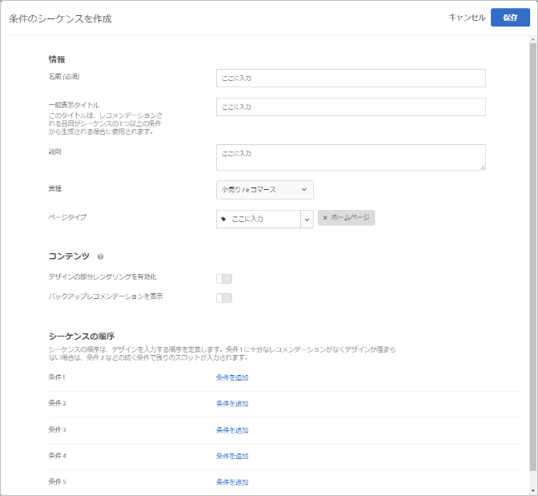
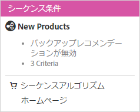

#  条件のシーケンスの作成{#create-criteria-sequences}

最大 5 つの条件のシーケンスを使用して、Recommendations アクティビティで表示される項目をより詳細に制御します。

>[!NOTE]
>
>[!DNL Target Premium] の 2016 年 10 月リリースより前に作成された [!UICONTROL Recommendations] アクティビティでは、条件のシーケンスは使用できません。

条件のシーケンスを作成するには、まずシーケンスに含める条件を作成する必要があります。詳しくは、[条件の作成](../../c-recommendations/c-algorithms/create-new-algorithm.md#task_8A9CB465F28D44899F69F38AD27352FE)を参照してください。

1 つの条件ではデザインを埋めるのに十分な結果が返されない場合、汎用的なバックアップレコメンデーションを使用する代わりに、条件のシーケンスを使用することで、ターゲットのレコメンデーションを追加で提供できます。一般に、条件のシーケンスは、より具体的なターゲット設定（より少ない結果が返される可能性がある）からより一般的なターゲット設定（通常、より多くの結果が返される）に進みます。

例えば、製品ページの条件のシーケンスは次のような順序に従います。

1. 現在の品目に基づいて、同じブランドから
1. 現在の品目に基づいて、すべてのブランドから
1. コンテンツの類似性に基づいて
1. トップセラーに基づいて
1. サイト全体で最もよく閲覧された品目に基づいて

ホームページの条件のシーケンスは次のような順序に従います。

1. 訪問者の最後の購入に基づいて
1. 訪問者のお気に入りの品目に基づいて
1. 訪問者のお気に入りのカテゴリーに基づいて
1. トップセラーに基づいて
1. サイト全体で最もよく閲覧された品目に基づいて

[!UICONTROL 条件のシーケンスを作成]画面を表示するには、複数の方法があります。一部の画面オプションは、画面の表示方法によって異なります。

* [!UICONTROL Recommendations] アクティビティを作成している場合、[!UICONTROL 条件を選択]画面の**[!UICONTROL 新規作成]**／**[!UICONTROL 条件のシーケンスを作成]**をクリックします。他の [!UICONTROL Recommendations] アクティビティで使用するために新しい条件のシーケンスを保存するオプションがあります。
* [!UICONTROL Recommendations] アクティビティを編集している場合、ページの「[!UICONTROL レコメンデーションの場所] 」ボックスをクリックして、「**[!UICONTROL 条件を変更]**」をクリックします。[!UICONTROL 条件を選択]画面で、**[!UICONTROL 新規作成]**／**[!UICONTROL 条件のシーケンスを作成]**をクリックします。他の [!UICONTROL Recommendations] アクティビティで使用するために新しい条件を保存するオプションがあります。
* **[!UICONTROL レコメンデーション]** ／**[!UICONTROL 条件]**ライブラリ画面で、**[!UICONTROL 条件を作成]**／**[!UICONTROL 条件のシーケンスを作成]**をクリックします。ここで作成した条件は、自動的にすべての [!UICONTROL Recommendations] アクティビティで利用できるようになります。

1. 「**[!UICONTROL 条件を作成]**」または「**[!UICONTROL 新規作成]**」をクリックします。

   

1. 「**[!UICONTROL 条件のシーケンスを作成]**」を選択します。

   

1. シーケンスの**[!UICONTROL 名前]**を入力します。

   これは、条件のシーケンスの説明に使用される「内部」名です。サイトの訪問者にこの名前は表示されません。
1. シーケンス内の複数の条件を使用して [!UICONTROL Recommendations] デザインを埋める場合は、公開される**[!UICONTROL 一般表示タイトル]**を入力します。このタイトルはページに表示されます。

   例えば、複数の[!UICONTROL レコメンデーション]キーに基づく品目がデザインに含まれている場合は、「これを見たお客様はこちらも...」を「お勧め」に置き換えることができます。
1. 条件のシーケンスの簡単な**[!UICONTROL 説明]**を入力します。

   説明は条件のシーケンスの特定に役立ちます。ここに条件のシーケンスの目的についての情報を含めることもできます。
1. 「**[!UICONTROL 業種]**」を選択します。

   デフォルトの業種が自動的に表示されます。
1. **[!UICONTROL ページタイプ]**を選択します。

   複数のページタイプを選択できます。

   業種とページタイプを共に使用して、保存した条件のシーケンスを分類し、他の [!UICONTROL Recommendations] アクティビティで簡単に再利用できるようにします。
1. 「**[!UICONTROL コンテンツ]**」のルールを設定します。

   条件のシーケンスを作成すると、シーケンスを構成する個々の条件のバックアップレコメンデーションおよびデザインの部分レンダリング設定は無視されます。バックアップレコメンデーションとデザインの部分レンダリングを使用するには、それらをシーケンスに対して有効にする必要があります。適切なものに切り替えて選択します。バックアップレコメンデーションを許可すると、バックアップレコメンデーションにインクルージョンルールを適用するかどうかを選択することもできます。
1. シーケンスの順序を設定します。

1. 「**[!UICONTROL 条件を追加]**」をクリックします。
1. 条件を追加画面で、条件を選択します。
1. 「**[!UICONTROL 追加]**」をクリックします。

   1 つのシーケンスに最大 5 つの条件を追加できます。
1. 「**[!UICONTROL 保存]**」をクリックします。

   条件のシーケンスが条件リストに表示されます。

   

   レコメンデーションロジックのオプションについて詳しくは、[条件](../../c-recommendations/c-algorithms/algorithms.md#concept_4BD01DC437F543C0A13621C93A302750)を参照してください。
