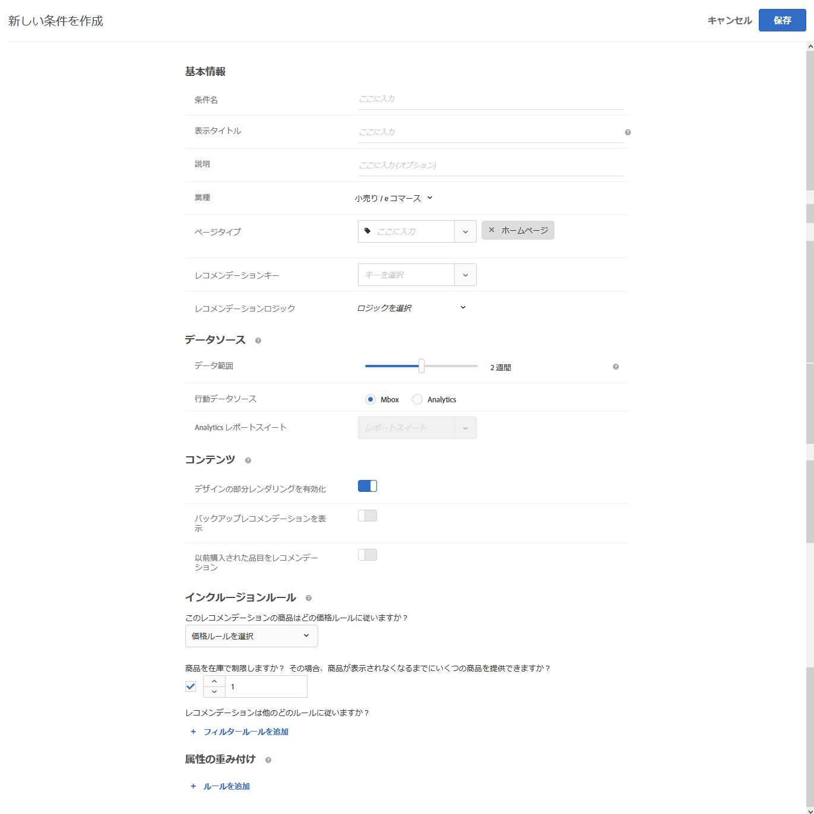

#  条件を作成

推奨事項について [!UICONTROL  は、アドビシステムズ社の認定条件に ]  よって内容が制御され  ます。 アクティビティに最適なレコメンデーションを表示するために、条件を作成します。このような条件として、ビジターのアクションを使用して、表示するコンテンツまたは製品を指定します。

次の節では、新しい条件を作成する方法について説明します。

## 「新規条件の作成」画面へのアクセス

[!UICONTROL 新しい条件を作成]画面を表示するには、複数の方法があります。一部の画面オプションは、画面の表示方法によって異なります。

* 推奨設定 **** > **[!UICONTROL 基準]** ライブラリ画面で、「条件の作成」ボタンをクリックして **** 検索条件を作成 > をクリックし **** ます。 ここで作成した条件は、自動的にすべての [!DNL Recommendations] アクティビティで利用できるようになります。
* [!DNL Recommendations]視覚的なエクスペリエンスコンポーザー (VEC) を使用してアクティビティを作成している場合  は、 [!UICONTROL  ページ上のエレメントを選択してから、「条件を選択」画面に直ちに移動します。または、「 ] 推奨設定  を変更」をクリックし   ます。使用可能な条件を選択するか、または「基準を作成」をクリックし **** ます。 新しい条件を作成する場合は、他の操作で使用するための条件を保存することができ [!DNL Recommendations] ます。 詳細については、 [ 推奨事項の作成を参照してください ](/help/c-recommendations/t-create-recs-activity/create-recs-activity.md) 。
* [!DNL Recommendations] アクティビティを編集している場合、ページの「 [!UICONTROL レコメンデーションの場所]」ボックスをクリックして、「**[!UICONTROL 条件を変更]**」を選択します。[!UICONTROL 「条件の選択」 ] 画面で、「条件の作成」をクリックし **** ます。他の [!DNL Recommendations] アクティビティで使用するために新しい条件を保存するオプションがあります。

次の手順では、最初の方法として  「推奨さ > 基準ライブラリ画面」を使用して、「新規条件の作成」画面にアクセスすることを想定して **** **** います。

1. 「 **[!UICONTROL 推奨]** 条件の >」をクリックし **** ます。

1. 「 **[!UICONTROL 基準を作成 >」をクリックして]** **[!UICONTROL 条件を作成し]** ます。

   

1. 以下の各セクションで説明されている情報を設定します。

## [!UICONTROL 基本情報] {#info}

1. 「**[!UICONTROL 条件名]**」を入力します。

   これは、条件の説明に使用される「内部」名です。例えば、条件を「利幅の高い商品」と呼びたいが、正式に表示されるタイトルにはそれを使いたくないという場合があります。公開されるタイトルを設定するには、次の手順を参照してください。

   

1. この条件を使用するすべての Recommendations 用にページに表示する、公開される「**[!UICONTROL 表示されるタイトル]**」を入力します。

   例えば、この条件を使用してレコメンデーションを表示する際に、「これを表示したひとはこれも表示しています」または「類似の商品」と表示したい場合があります。

1. 条件の簡単な&#x200B;**[!UICONTROL 説明]**&#x200B;を入力します。

   この説明は、条件を識別するために使用されます。また、条件の目的に関する情報が含まれている場合もあります。

1. 推奨作業の目的に応じて、業界の垂直を選択します。

   | 業種 | 目標 |
   |--- |--- |
   | 小売／e コマース | 購入をもたらすコンバージョン |
   | リードジェネレーション／B2B／金融サービス | 購入を伴わないコンバージョン |
   | メディア／投稿 | エンゲージメント |

   その他の条件オプションは、選択した業種によって異なります。

1. **[!UICONTROL ページタイプ]**&#x200B;を選択します。

   複数のページタイプを選択できます。

   業種とページタイプをともに使用して、保存した条件を分類し、他の [!DNL Recommendations] アクティビティで簡単に再利用できるようにします。

## [!UICONTROL 推奨設定アルゴリズム] {#rec-algo}

1. **[!UICONTROL アルゴリズムタイプとアルゴリズムを選択し]** **** ます。

   

   | アルゴリズムタイプ | 使用する場合 | 使用可能なアルゴリズム |
   | --- | --- | --- |
   | [!UICONTROL 人気ランキング] | サイト全体でのアイテムの人気度に基づいて、またはユーザーが気に入っていたカテゴリや、最もよく閲覧されるカテゴリー、ブランド、ジャンルなどのアイテムが最も人気が高いことを基準として、推奨事項を設定します。 | <ul><li>サイト全体で表示されているほとんどの表示</li><li>最もよく表示されるカテゴリー</li><li>最もよく表示されるアイテム属性</li><li>サイト全体の上位の売り手</li><li>カテゴリ別上位売り手</li><li>品目属性ごとの上位売り手</li><li>分析基準によって上位に戻る</li></ul> |
   | [!UICONTROL 品目ベース] | ユーザーが現在表示しているアイテム、または最近閲覧したアイテムに類似するアイテムを検索することによって、推奨事項を作成します。 | <ul><li>これを閲覧した人が他に閲覧したもの</li><li>これを閲覧した人が購入したもの</li><li>これを購入した人が他に購入したもの</li><li>類似した属性のアイテム</li></ul> |
   | [!UICONTROL ユーザーによる] | ユーザーの操作に基づいて推奨事項を作成します。 | <ul><li>最近表示された項目</li><li>お勧めします。</li></ul> |
   | カートベース | ユーザーのカートの内容に基づいて推奨事項を作成します。 | <ul><li>このようなユーザーに対して表示した場合は、</li><li>このような人がこれを見て購入したとします。</li><li>このような購入者は、</li></ul> |
   | [!UICONTROL カスタム条件] | アップロードするカスタムファイルに基づいて推奨事項を作成します。 | <ul><li>カスタムアルゴリズム</li></ul> |

   >[!NOTE]
   >
   >類似した属性が指定されているアイテムまたはメディアを選択した場合 **** **** は、コンテンツの類似性ルールを設定するためのオプションが表示され  ます。

1. 必要に応じて、 **** 一致するアイテム属性と **プロファイル属性** 、 **認定キー** 、 **フィルターキー、** または解析メトリック **** を選択してアルゴリズムを設定します。

推奨キーを選択する方法について詳しくは、推奨キーについてを参照してください  。

## [!UICONTROL Data Source] {#data-source}

1. 目的の **[!UICONTROL 動作データソース]** [!UICONTROL  (Adobe ターゲット ] または [!UICONTROL  解析) を選択し ] ます。

   >[!NOTE]
   >
   >[!UICONTROL 「ビヘイビアデータソース ] 」セクションが表示されるのは、実装において、 [ ターゲットに対してアナリティクス (A4T) が使用されている場合のみ ](/help/c-integrating-target-with-mac/a4t/a4t.md) です。

   

   「[!UICONTROL Analytics]」を選択した場合、目的のレポートスイートを選択します。

   条件が振る舞いデータソースとして使用される場合は、次に説明するように、 [!DNL Adobe Analytics] 作成後に、選択したレポートスイートと復帰ウィンドウが他の基準として使用されているかどうかによって、条件の指定可能時間が決まります。

   * **1 回限りのレポートスイート設定**：指定されたデータ範囲のルックバックウィンドウで最初にレポートスイートが使用されると、[!DNL Target Recommendations] は、選択されたレポートスイートの行動データを [!DNL Analytics] から完全にダウンロードするまで 2 ～ 7 日間かかる可能性があります。このタイムフレームは、システムの負荷によって異なり [!DNL Analytics] ます。
   * **新しい条件または既に使用可能なレポートスイートを使用して編集した条件**：新しい条件を作成したり既存の条件を編集したりする場合、選択されたレポートスイートが選択されたデータ範囲以下のデータ範囲で既に [!DNL Target Recommendations] で使用されていれば、データは即座に使用でき、1 回限りの設定は必要ありません。この場合、または選択されたレポートスイートまたはデータ範囲が変更されずにアルゴリズムの設定が編集されると、12 時間以内にアルゴリズムが実行または再実行されます。
   * **進行中のアルゴリズム実行**：毎日の [!DNL Analytics] から [!DNL Target Recommendations] へのデータフロー。例えば、[!UICONTROL 表示の親和性]レコメンデーションの場合、ユーザーが製品を表示すると、製品表示トラッキングコールがほぼリアルタイムで [!DNL Analytics] に渡されます。[!DNL Analytics] データが翌日早くに [!DNL Target] にプッシュされ、[!DNL Target] が 12 時間以内にアルゴリズムを実行します。

   詳しくは、「 [ ターゲット推奨事項の使用」を参照してください ](/help/c-recommendations/c-algorithms/use-adobe-analytics-with-recommendations.md) 。

1. **[!UICONTROL 「戻る」ウィンドウを設定して、]** 表示する推奨事項を決定する際に使用する、使用可能な履歴ユーザー操作データの時間範囲を決定します。このオプションは、類似する属性およびカスタムアルゴリズムを使用したアイテムを除き、すべてのアルゴリズムで使用できます。

   

   サイトのトラフィックが多く、行動が頻繁に変わる場合は、データの範囲を狭めます。[!DNL Recommendations] は、範囲を狭くするほどマーケットやビジネスの変化に反応しやすくなります。例えば、範囲を狭く設定した場合、訪問者が新学期やクリスマスなどの季節の製品の購入を始めると、[!DNL Recommendations] は訪問者の行動の変化を検知して季節に適した品目をレコメンデーションするようになります。

   データ量が多くない場合や、訪問者の行動が頻繁に変化しない場合は、範囲を長くすることもできます。ただし、多くのサイトでは、ウィンドウが短いほど質の高い推奨内容になります。

   有効なデータ範囲は、次のとおりです。

   | 「後ろに戻る」ウィンドウオプション | 更新された頻度 (ポイントしたときに表示されます) | サポートされている alogrithms |
   | --- | --- | --- |
   | 6時間 | 3-6 時間ごとに実行されるアルゴリズム | 選択された [!UICONTROL  動作データソースが、人気をベースにしたアルゴリズム ][!DNL Adobe Target] |
   | 1日 | 12-24 時間ごとに実行されるアルゴリズム | [!UICONTROL 人気をベースとした ] アルゴリズム |
   | 2 日 | 12-24 時間ごとに実行されるアルゴリズム | <ul><li>[!UICONTROL 人気をベースとした ] アルゴリズム</li><li>[!UICONTROL アイテムベースの ] アルゴリズム</li><li>[!UICONTROL ユーザーベースの ] アルゴリズム</li><li>[!UICONTROL カートベースの ] アルゴリズム</li></ul> |
   | 1 週間 | 24-48 時間ごとに実行されるアルゴリズム | <ul><li>[!UICONTROL 人気をベースとした ] アルゴリズム</li><li>[!UICONTROL アイテムベースの ] アルゴリズム</li><li>[!UICONTROL ユーザーベースの ] アルゴリズム</li><li>[!UICONTROL カートベースの ] アルゴリズム</li></ul> |
   | 2 週間 | 24-48 時間ごとに実行されるアルゴリズム | <ul><li>[!UICONTROL 人気をベースとした ] アルゴリズム</li><li>[!UICONTROL アイテムベースの ] アルゴリズム</li><li>すべて [!UICONTROL  のユーザーベースの ] アルゴリズム</li><li>[!UICONTROL カートベースの ] アルゴリズム</li></ul> |
   | 1か月 (30 日) | 24-48 時間ごとに実行されるアルゴリズム | <ul><li>[!UICONTROL 人気をベースとした ] アルゴリズム</li><li>[!UICONTROL アイテムベースの ] アルゴリズム</li><li>[!UICONTROL ユーザーベースの ] アルゴリズム</li><li>[!UICONTROL カートベースの ] アルゴリズム</li></ul> |
   | 2か月 (61 日) | 24-48 時間ごとに実行されるアルゴリズム | <ul><li>[!UICONTROL 人気をベースとした ] アルゴリズム</li><li>[!UICONTROL アイテムベースの ] アルゴリズム</li><li>[!UICONTROL ユーザーベースの ] アルゴリズム</li><li>[!UICONTROL カートベースの ] アルゴリズム</li></ul> |

## [!UICONTROL コンテンツのバックアップ] {#content}

推奨アイテムの数が推奨設定に含まれていない場合、バックアップコンテンツルールによって何が実行されるかが決まり  ます。[!DNL Recommendations] の条件によって、デザインが呼び出すよりも少ないレコメンデーションを返すことがあります。例えば、デザインに4つのアイテムのスロットがある場合に、条件によって2つのアイテムだけが推奨されるようにする場合は、残りのスロットを空のままにしておくことができます。必要に応じて、バックアップに関する推奨事項を使用して追加することができます。

1. オプション部分的なデザインレンダリングをスライドさせると、 **** 「on」の位置に切り替えられます。

   可能な限り多くのスロットが入力されますが、デザインテンプレートには残りのスロット用の空白の領域が含まれている場合があります。 このオプションをオフにすると、使用可能なすべてのスロットを埋めるのに十分なコンテンツがない場合、代わりに推奨事項が表示されず、デフォルトのコンテンツが表示されます。

   このオプションを有効にするのは、推奨される「空のスロット」を使用する場合です。 このような場合は、次の手順で説明するように、検索条件スロットに、サイト内の類似したコンテンツや人気のあるコンテンツが入力された空のスロットに格納されたコンテンツを入力しておくことをお勧めします。

1. オプション **[!UICONTROL 「バックアップの内容を表示」をスライドすると、]** 「on」の位置に切り替えられます。

   デザイン内の残りの空のスロットには、サイト全体で、最もよく表示される製品をランダムに選択して入力します。

   バックアップ推奨事項を使用すると、使用可能なすべてのスロットが推奨されることになります。 次の図に示すように、4×1のデザインがあるものとします。

   

   抽出条件によって2つのアイテムだけが推奨されるものとします。 部分的なデザインレンダリングオプションをオンにすると、最初の2つのスロットに値が  入力されますが、残りの2つのスロットは空のままになります。 ただし、「 [!UICONTROL  推奨バックアップの表示」オプションをオンにすると、最初の ] 2 つのスロットは指定した条件に基づいて入力されます。残りの2つのスロットはバックアップの推奨内容に基づいて入力されます。

   次の図は、 [!UICONTROL  部分的なデザインの表示とバックアップのコンテンツのオプションを使用した場合の結果を示してい ]  ます。

   | デザインの部分レンダリング | コンテンツのバックアップ | 結果 |
   |--- |--- |--- |
   | 無効 | 無効 | 返されたレコメンデーションがデザインで指定されているよりも少ない場合、レコメンデーションデザインはデフォルトコンテンツに置き換えられ、レコメンデーションは表示されません。 |
   | 有効 | 無効 | デザインはレンダリングされますが、返されたレコメンデーションがデザインで指定されているよりも少ない場合、空白スペースが含まれることがあります。 |
   | 有効 | 有効 | 使用可能なデザインの「スロット」に代替レコメンデーションが挿入され、デザインが完全にレンダリングされます。 インクルージョンルールを代替レコメンデーションに適用するとデザインに挿入できなくなるほど適格な代替レコメンデーションの数が制限される場合、デザインは部分的にレンダリングされます。 この基準がレコメンデーションを返さず、インクルージョンルールが代替レコメンデーションをゼロに制限する場合、デザインはデフォルトコンテンツで置き換えられます。 |
   | 無効 | 有効 | 使用可能なデザインの「スロット」に代替レコメンデーションが挿入され、デザインが完全にレンダリングされます。 インクルージョンルールを代替レコメンデーションに適用するとデザインに挿入できなくなるほど適格な代替レコメンデーションの数が制限される場合、デザインはデフォルトコンテンツに置き換えられ、レコメンデーションは表示されません。 |

   詳しくは、『 [ バックアップ推奨事項の使用』を参照してください ](/help/c-recommendations/c-algorithms/backup-recs.md) 。

1. 条件 **[!UICONTROL 前の手順で「バックアップの内容を表示」を選択した場合は]** 、「 **[!UICONTROL バックアップの推奨設定に対する適用ルールを適用」を有効にすることができ]** ます。

   包含ルールは、推奨事項に含めるアイテムを指定します。 使用できるオプションは、業種によって異なります。

   詳しくは、以下の包含ルールの指定を参照してください  。

1. オプションスライドのスライドには、 **[!UICONTROL 事前に購入したアイテム]** を「on」の位置に切り替えることができます。

   この設定は、`productPurchasedId` に基づいています。デフォルトの動作では、以前に購入された品目はレコメンドされません。ほとんどの場合、顧客が最近購入した品目を再び推奨することは望ましくありません。カヤックなど、通常 1 回しか購入しない品目を販売する場合に便利です。Shampoo やその他の個人アイテムなど、定期的に購入することが必要なアイテムを販売する場合は、このオプションを有効にする必要があります。

## コンテンツの類似性 {#similarity}

[!UICONTROL コンテンツの類似性ルール]を使い、品目またはメディアの属性に基づいたレコメンデーションをおこないます。

>[!NOTE]
>
>**** **[!UICONTROL アルゴリズムタイプとアルゴリズムに、類似する属性を持つ「アイテムベースの」または「メディア」を選択した場合は]** 、コンテンツの類似性ルールを設定することができます。

コンテンツの類似性では、アイテム属性キーワードを比較し、複数の項目に共通するキーワードの数に基づいてレコメンデーションを作成します。コンテンツの類似性に基づくレコメンデーションでは、過去のデータがなくても質の高い結果が得られます。

コンテンツの類似性によるレコメンデーションの生成は、新しい項目について特に有効です。新しい項目は過去の動作に基づく「*○○を表示した人*」などのロジックを使用したレコメンデーションでは通常は表示されません。また、コンテンツの類似性を使用すると、過去の購入などの履歴データがない新規訪問者に対する便利なレコメンデーションを生成することもできます。

類似した **[!UICONTROL 属性が設定されているアイテムベースまたはメディアを選択した場合は、推奨設定を決定する際に、]** **** 特定の項目属性の重要度を調整するためのルールを作成することができます。 本などの項目については、*ジャンル*、*著者*、*シリーズ*&#x200B;などの属性の重要度を高くして、類似する本を推奨することができます。

コンテンツの類似性ではキーワードを使用して項目を比較しているため、*メッセージ*&#x200B;や&#x200B;*説明*&#x200B;などの一部の属性により比較に「邪魔」が入ることがあります。このような属性については、ルールを作成して無視することができます。

デフォルトでは、すべての属性は「*ベースライン*」に設定されています。この設定を変更しない場合、ルールを作成する必要はありません。

>[!NOTE]
>
>コンテンツの類似アルゴリズムは、アイテム間の類似性の計算でランダムなサンプリングを使用する場合があります。 その結果、アイテム間の類似性のランクは、アルゴリズムの実行によって異なる場合があります。

## インクルージョンルール {#inclusion}

いくつかのオプションを使用して、レコメンデーションに表示する品目を絞り込むことができます。条件やプロモーションの作成時にインクルージョンルールを使用できます。

インクルージョンルールはオプションです。ただし、これらの詳細を設定すると、レコメンデーションに表示される項目をさらに制御できるようになります。詳細を設定するたびに、表示基準をより詳細に絞り込むことができます。

例えば、在庫数が 50 を超えていて、価格が $25～$45 の婦人靴だけを表示するよう選択できます。また、ビジネス上非常に重要な品目が最も表示されやすくなるように各属性に対して重みを付けることもできます。

別の例として、サイトにアクセスした訪問者のうち、特定の都市にいて、特定の学位を取得している訪問者に求人情報を表示できます。

インクルージョンルールのオプションは、業種によって異なります。デフォルトでは、インクルージョンルールは代替レコメンデーションに適用されます。

>[!IMPORTANT]
>
>インクルージョンルールは使用する際に注意が必要です。例えば、会社で、あるブランドが表示されているときに別のブランドをレコメンデーションしないというルールがある場合に、このフィルターは便利です。ただし、この機能には機会費用が伴う場合があります。アクティビティ条件によって通常表示されると考えられる一部の品目を、表示しないように制限することで、上昇率が減少する可能性があります。

インクルージョンルールは、AND で結合されます。品目がレコメンデーションに含まれるためには、すべてのルールを満たす必要があります。

上述の例のように、在庫数が 50 を超えていて、価格が $25～$45 の婦人靴だけを表示するシンプルなインクルージョンルールは、次の手順で作成できます。

1. レコメンデーションする商品の価格帯を設定します。
1. レコメンデーションする商品の最小在庫数を設定します。
1. 特定の基準を満たす場合のみ品目を表示するよう、レコメンデーションを設定します。

   

   一覧にある属性のいずれかが、1 つまたは複数の指定の条件を満たす、あるいは満たさない場合のみ、品目を含めるよう指定できます。

   使用できる評価演算子は、最初のドロップダウンで選択する値によって異なります。複数の品目を指定することができます。この品目は、OR で評価されます。

   複数のルールは、AND で結合できます。

   >[!NOTE]
   >
   >このオプションは、レコメンデーションに表示される品目を限定します。そのレコメンデーションがどのページに表示されるかには影響しません。レコメンデーションを表示する場所を制限するには、Experience Composer でページを選択します。

詳しくは、 [ dynamic and static include ルールの使用を参照してください ](/help/c-recommendations/c-algorithms/use-dynamic-and-static-inclusion-rules.md) 。

## 属性の重み付け {#weighting}

特定の項目が表示される可能性が高いように、複数のルールを追加すると、重要な情報やコンテンツカタログに関するメタデータに基づいてアルゴリズムを微調整することができます。

例えば、セール品に対してより大きな重み付けを適用して、より頻繁にレコメンデーションに表示されるようにできます。その結果、非セール品は完全に除外されませんが、表示される頻度は低くなります。複数の重み付け属性を同じアルゴリズムに適用することができ、レコメンデーションの分割したトラフィックについて重み付け属性をテストできます。

1. 値を選択します。

   この値は、利用可能な条件のいずれかに基づいて、より表示される可能性の高くなる品目のタイプを決定します。

1. 評価基準を選択します。

1. キーワードを入力して、ルール属性を完成させます。

   例えば、完全なルールには、「カテゴリに含まれる部分文字列が含まれています。

   

1. ルールに割り当てる重みを選択します。

   オプションの範囲は 0 ～ 100（25 単位の増分）です。

1. 必要に応じて、その他のルールを追加します。

終了したら「**[!UICONTROL 保存]**」をクリックします。

新しい [!UICONTROL Recommendations] アクティビティを作成したり、既存のものを編集したりする場合、「**[!UICONTROL 後で使用するために条件を保存]**」チェックボックスがデフォルトで選択されています。他のアクティビティで条件を使用したくない場合、保存する前にチェックボックスをオフにします。

## トレーニングビデオ: 勧告 (12:33) での検索条件の作成 () 

このビデオには、次の情報が含まれています。

* 条件の作成
* 条件のシーケンスの作成
* カスタム条件のアップロード

>[!VIDEO](https://video.tv.adobe.com/v/27694?quality=12)
