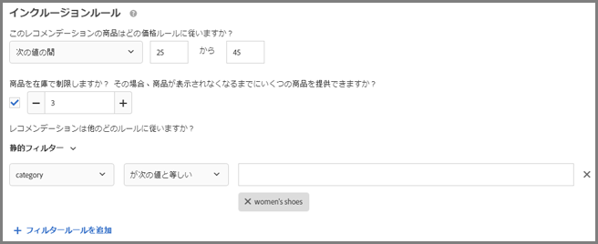
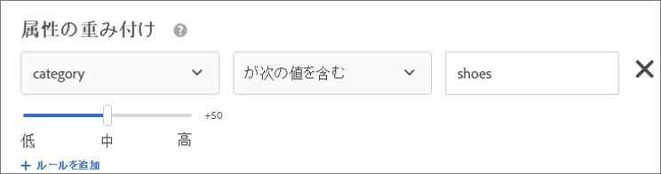
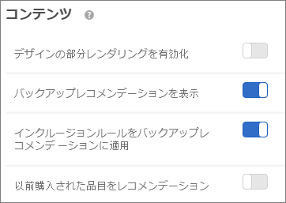
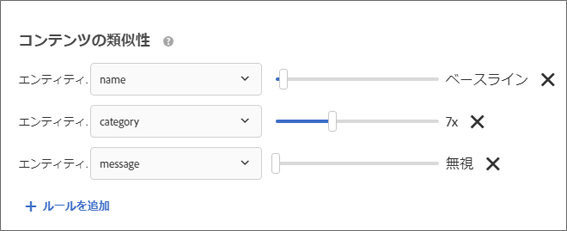

#  条件を作成{#create-criteria}

条件は、 Recommendations アクティビティの内容を制御します。アクティビティに最適なレコメンデーションを表示するために、条件を作成します。

## 条件の作成 {#task_8A9CB465F28D44899F69F38AD27352FE}

条件は、[!DNL Recommendations] アクティビティの内容を制御します。アクティビティに最適なレコメンデーションを表示するために、条件を作成します。

[!UICONTROL 新しい条件を作成]画面を表示するには、複数の方法があります。一部の画面オプションは、画面の表示方法によって異なります。

* [!DNL Recommendations]**アクティビティを作成している場合、[!UICONTROL 条件を選択]画面の「** 新規作成[!UICONTROL ]」をクリックします。他の [!DNL Recommendations] アクティビティで使用するために新しい条件を保存するオプションがあります。
* [!DNL Recommendations] アクティビティを編集している場合、ページの「 [!UICONTROL レコメンデーションの場所]」ボックスをクリックして、「**[!UICONTROL 条件を変更]**」を選択します。[!UICONTROL 条件を選択]画面で、「**[!UICONTROL 新規作成]**」をクリックします。他の [!DNL Recommendations] アクティビティで使用するために新しい条件を保存するオプションがあります。
* **[!UICONTROL レコメンデーション]**／**[!UICONTROL 条件]** ライブラリ画面で、「**[!UICONTROL 条件を作成]**」をクリックします。ここで作成した条件は、自動的にすべての [!DNL Recommendations] アクティビティで利用できるようになります。

1. 「**[!UICONTROL 条件を作成]**」または「**[!UICONTROL 新規作成]**」をクリックします。

   

1. 「**[!UICONTROL 条件を作成]**」をクリックします。

   

1. 「**[!UICONTROL 条件名]**」を入力します。

   これは、条件の説明に使用される「内部」名です。例えば、条件を「利幅の高い商品」と呼びたいが、正式に表示されるタイトルにはそれを使いたくないという場合があります。公開されるタイトルを設定するには、次の手順を参照してください。

1. この条件を使用するすべての Recommendations 用にページに表示する、公開される「**[!UICONTROL 表示されるタイトル]**」を入力します。

   例えば、この条件を使用してレコメンデーションを表示する際に、「これを表示したひとはこれも表示しています」または「類似の商品」と表示したい場合があります。

1. 条件の簡単な **[!UICONTROL 説明]** を入力します。

   説明は条件の特定に役立ちます。ここに条件の目的についての情報を含めることもできます。

1. 「**[!UICONTROL 業種]**」を次の中から選択します。

   * [!UICONTROL 小売／e コマース]
   * [!UICONTROL リードジェネレーション／B2B／金融サービス]
   * [!UICONTROL メディア／投稿]
   その他の条件オプションは、選択した業種によって異なります。

1. **[!UICONTROL ページタイプ]** を選択します。

   複数のページタイプを選択できます。

   業種とページタイプをともに使用して、保存した条件を分類し、他の [!DNL Recommendations] アクティビティで簡単に再利用できるようにします。

1. 「**[!UICONTROL レコメンデーションキー]**」を選択します。

   キーに基づく条件の設定について詳しくは、[レコメンデーションキーに基づくレコメンデーションの設定](../../c-recommendations/c-algorithms/create-new-algorithm.md#task_2B0ED54AFBF64C56916B6E1F4DC0DC3B)を参照してください。

1. 「**[!UICONTROL レコメンデーションロジック]**」を選択します。

   レコメンデーションロジックのオプションについて詳しくは、[条件](../../c-recommendations/c-algorithms/algorithms.md#concept_4BD01DC437F543C0A13621C93A302750)を参照してください。

   >[!NOTE]
   >
   >**[!UICONTROL 類似の属性を持つ品目]**／**[!UICONTROL メディア]** を選択した場合、[コンテンツの類似性ルール](../../c-recommendations/c-algorithms/create-new-algorithm.md#concept_5402DAFA279C4E46A9A449526889A0CB)を設定することができます。

1. 「**[!UICONTROL データ範囲]** 」を設定して、表示するレコメンデーションを決定する際に使用するユーザーの行動履歴データの範囲を決定します。

   サイトのトラフィックが多く、行動が頻繁に変わる場合は、データの範囲を狭めます。[!DNL Recommendations] は、範囲を狭くするほどマーケットやビジネスの変化に反応しやすくなります。例えば、範囲を狭く設定した場合、訪問者が新学期やクリスマスなどの季節の製品の購入を始めると、[!DNL Recommendations] は訪問者の行動の変化を検知して季節に適した品目をレコメンデーションするようになります。

   データ量が多くない場合や、訪問者の行動が頻繁に変化しない場合は、範囲を長くすることもできます。ただし、多くのサイトでは、範囲を短くすることによってレコメンデーションが向上しています。

   有効なデータ範囲は、次のとおりです。

   * 2 日
   * 1 週間
   * 2 週間
   * 1 か月
   * 2 か月

1. 「**[!UICONTROL 行動データソース]**」で目的に応じて「[!UICONTROL mboxes]」または「[!UICONTROL Analytics]」を選択します。

   「[!UICONTROL Analytics]」を選択した場合、目的のレポートスイートを選択します。

1. 「**[!UICONTROL コンテンツ]**」のルールを設定します。

   コンテンツルールは、デザインを埋めるのにレコメンデーション品目の数が足りない場合の動作を決定します。例えば、デザインに 5 品目分のスペースがあるが、条件によって 3 品目しかレコメンデーションされない場合、残りのスペースを空のままにしておくか、代替レコメンデーションを使用して余分なスペースを埋めることができます。

   適切なものに切り替えて選択します。

   * [!UICONTROL デザインの部分レンダリングを有効化]
   * [!UICONTROL バックアップレコメンデーションを表示]
   * [!UICONTROL 以前購入された品目をレコメンデーション]
   この設定は、`productPurchasedId` に基づいています。カヤックなど、通常 1 回しか購入しない品目を販売する場合に便利です。シャンプーやその他個人的に使用する品目など、繰り返し購入される品目を販売する場合は、このオプションを無効にする必要があります。

1. **[!UICONTROL インクルージョンルール]** を設定します。

   インクルージョンルールによって、レコメンデーションに含める品目を決めることができます。使用できるオプションは、業種によって異なります。

   詳しくは、[インクルージョンルール](../../c-recommendations/c-algorithms/create-new-algorithm.md#task_28DB20F968B1451481D8E51BAF947079)を参照してください。

1. 「**[!UICONTROL 属性の重み付け]**」を設定します。

   複数のルールを追加して、コンテンツカタログについての重要な説明またはメタデータに基づいて、アルゴリズムを「一押し」できます。例えば、セール品に対してより大きな重み付けを適用して、より頻繁にレコメンデーションに表示されるようにできます。

   詳しくは、[属性の重み付け](../../c-recommendations/c-algorithms/create-new-algorithm.md#task_2AEDA0DB15B74770B76F6982B24C2E42)を参照してください。

1. 終了したら「**[!UICONTROL 保存]**」をクリックします。

   新しい [!UICONTROL Recommendations] アクティビティを作成したり、既存のものを編集したりする場合、「**[!UICONTROL 後で使用するために条件を保存]」チェックボックスがデフォルトで選択されています。** 他のアクティビティで条件を使用したくない場合、保存する前にチェックボックスをオフにします。

### 予期される条件の処理時間

* **mbox：** mbox を行動データソースとして使用する条件を作成すると、即座に実行されます。使用される行動データの量とカタログのサイズに応じて、アルゴリズムの実行には最大で 12 時間かかります。条件の設定を変更すると、条件が再実行されます。

* **Analytics**：[!DNL Adobe Analytics] を行動データソースとして使用する条件を作成した場合は、選択されているレポートスイートとルックバックウィンドウが他の条件でも使用されているかどうかに応じて、条件が使用可能になる時間が異なります。選択したルックバックウィンドウの長さ以上のルックバックウィンドウでレポートスイートが既に使用されている場合、行動データは Target で既に利用可能であり、Recommendations によって即座に条件が実行されます。使用される行動データの量とカタログのサイズに応じて、アルゴリズムの実行には最大で 12 時間かかります。レポートスイートが以前に使用されたことがない場合、または以前よりも長いルックバックウィンドウで使用されている場合、Recommendations は、Adobe Analytics にデータを要求し、データを受信した後でアルゴリズムを実行する必要があります。Analytics との同期プロセスには通常 2 日以上かかり、Analytics のシステム負荷によっては完了するまでに最大で 7 日かかる場合があります。

## レコメンデーションキーに基づくレコメンデーションの設定 {#task_2B0ED54AFBF64C56916B6E1F4DC0DC3B}

キーに基づくレコメンデーションでは、訪問者の行動のコンテキストを考慮して関連する結果を表示します。

レコメンデーションには次の 2 種類があります。

* **人気度：** 最も多く閲覧された、販売数トップおよびトップの指標を基準に品目を表示します。人気度の条件では、キーは空になります。
* **キーベース：** 他の条件で構成されます。キーのタイプに関しては、レコメンデーションでは様々なオプションを利用できます。「現在の品目/項目」から「プロファイルパラメーター」まで、様々なオプションが用意されているので、レコメンデーション対象の値のキーをプログラムによって設定できます。各条件の基準を異なるキーにすることで、複数の条件をテストして比較することもできます。

各条件は独自のタブで定義されます。トラフィックは、異なる条件のテスト全体で等しく分割されます。つまり、2 つの条件がある場合、トラフィックは等しく 2 分割されます。2 つの条件と 2 つのデザインがある場合、トラフィックは 4 つの組み合わせに対して等しく分割されます。さらに、比較のために、デフォルトコンテンツを表示するサイト訪問者の割合も指定できます。この場合、指定した割合の訪問者に対してデフォルトコンテンツが表示され、残りの割合の訪問者は条件とデザインの組み合わせの間で分割されます。

1. 新しいレコメンデーションを作成するか、既存のレコメンデーションを選択して「**[!UICONTROL 編集]**」をクリックします。
1. レコメンデーションキーを変更するには、[!UICONTROL レコメンデーションキー]ドロップダウンリストから新しいキーを選択してから、「**[!UICONTROL 保存]**」をクリックします。

   異なるロジックが異なるレコメンデーションキーにマッピングされているので、異なるレコメンデーションは、ページの異なるタイプに配置するのに適しています。各キーについて詳細は、以下のセクションを参照してください。

### 現在の品目

レコメンデーションは、訪問者が現在閲覧中の品目によって決定されます。

レコメンデーションは、指定した品目に興味を示している訪問者が興味を示す可能性のある他の品目を表示します。

このオプションを選択した場合、`entity.id` の値を表示 mbox でパラメーターとして渡す必要があります。

**ロジック（条件）**

* [!UICONTROL 類似の属性を持つ品目]
* [!UICONTROL これを閲覧した人が他に閲覧したもの]
* [!UICONTROL これを閲覧した人が購入したもの]
* [!UICONTROL これを購入した人が他に購入したもの]
* [!UICONTROL サイトの親和性]

**サイトで使用する場所**

商品ページなどの、単一の品目ページ。

検索結果が null のページに使用しないでください。

### 現在のカテゴリ

レコメンデーションは、訪問者が現在閲覧中の商品カテゴリによって決定されます。

レコメンデーションは、指定した商品カテゴリの品目を表示します。

このオプションを選択した場合、`entity.categoryId` の値を表示 mbox にパラメーターとして渡す必要があります。

**ロジック（条件）**

* トップセラー
* 最も頻繁に閲覧された

**サイトで使用する場所**

単一のカテゴリページ。

検索結果が null のページに使用しないでください。

### カスタム属性 {#custom}

レコメンデーションは、2 つの属性（user.*x* または profile.*x* 属性）のどちらかを使用して、訪問者のプロファイルに格納された品目によって決定されます。

このオプションを選択した場合、`entity.id` の値がプロファイル属性に存在する必要があります。

**ロジック（条件）**

* [!UICONTROL これを閲覧した人が他に閲覧したもの]
* [!UICONTROL これを閲覧した人が購入したもの]
* [!UICONTROL これを購入した人が他に購入したもの]
* [!UICONTROL 総合的な行動]
* [!UICONTROL 最も頻繁に閲覧された]
* [!UICONTROL トップセラー]

キーがカスタムプロファイル属性で、アルゴリズムのタイプが最も頻繁に閲覧された、またはトップセラーの場合は、「次の一意の値でグループ化」という新しいドロップダウンリストが表示されます。このリストには既知のエンティティ属性（ID、カテゴリ、利益、値、在庫、環境を除く）が表示されます。このフィールドは必須です。

**サイトで使用する場所**

どのページでも使用できます。

**カスタムレコメンデーションキーを使用**

カスタムプロファイル属性の値に基づいてレコメンデーションを設定できます。例えば、訪問者のキューに訪問者自身が最近追加したムービーに基づいて、お勧めのムービーを表示するとしましょう。

1. 「**[!UICONTROL レコメンデーションキー]**」ドロップダウンリストからカスタムプロファイル属性（例：「ウォッチリストに最近追加した番組」）を選択します。
1. 次に、「**[!UICONTROL レコメンデーションロジック]**」を選択します（例：「これを閲覧した人が他に閲覧したもの」）。

   

カスタムプロファイル属性と直接一致するエンティティ ID がない場合は、エンティティとの照合方法を [!DNL Recommendations] に指示する必要があります。例えば、訪問者のお気に入りのブランドからトップセラー商品を表示するとしましょう。

1. 「**[!UICONTROL レコメンデーションキー]**」ドロップダウンリストからカスタムプロファイル属性（例：「お気に入りのブランド」）を選択します。

1. 次に、このキーで使用する「**[!UICONTROL レコメンデーションロジック]**」を選択します（例：「トップセラー」など）。

   「[!UICONTROL 次の一意の値でグループ化]」オプションが表示されます。

1. 選択したキーに一致するエンティティ属性を選択します。この場合は、「お気に入りのブランド」が `entity.brand` に一致します。

   [!DNL Recommendations] では、各ブランドの「トップセラー」リストを生成し、訪問者の「お気に入りのブランド」プロファイル属性に保存されている値に基づいて、適切な「トップセラー」リストを訪問者に表示します。

   

### 最後に購入された品目

レコメンデーションは、個別の訪問者が購入した最後の品目によって決定されます。これは自動的に取り込まれるので、ページに値を渡す必要はありません。

**ロジック（条件）**

* [!UICONTROL 類似の属性を持つ品目]
* [!UICONTROL これを閲覧した人が他に閲覧したもの]
* [!UICONTROL これを閲覧した人が購入したもの]
* [!UICONTROL これを購入した人が他に購入したもの]
* [!UICONTROL サイトの親和性]

**サイトで使用する場所**

ホームページ、マイアカウントページ、オフサイト広告。

商品ページまたは購入に関連するページには使用しないでください。

### 最後に閲覧された品目

レコメンデーションは、個別の訪問者が閲覧した最後の品目によって決定されます。これは自動的に取り込まれるので、ページに値を渡す必要はありません。

**ロジック（条件）**

* [!UICONTROL 類似の属性を持つ品目]
* [!UICONTROL これを閲覧した人が他に閲覧したもの]
* [!UICONTROL これを閲覧した人が購入したもの]
* [!UICONTROL これを購入した人が他に購入したもの]
* [!UICONTROL サイトの親和性]

**サイトで使用する場所**

ホームページ、マイアカウントページ、オフサイト広告。

商品ページまたは購入に関連するページには使用しないでください。

### 最も多く閲覧された品目

レコメンデーションは、最も頻繁に閲覧された品目によって決定され、お気に入りのカテゴリに使用されたのと同じメソッドを採用します。

これは次のように動作するリーセンシー／頻度条件により決定されます。

* 初回の商品閲覧は 10 ポイント
* 以降の閲覧は毎回 5 ポイント
* セッションの終わりにすべての値を 2 で割る

例えば、1 つのセッションで surfboardA を閲覧後に surfboardB を閲覧すると、その結果は A：10、B：5 になります。セッションの終了時には、A：5、B：2.5 になります。次のセッションで同じ品目を閲覧すると、値は A：15、B：7.5 に変化します。

**ロジック（条件）**

* [!UICONTROL 類似の属性を持つ品目]
* [!UICONTROL これを閲覧した人が他に閲覧したもの]
* [!UICONTROL これを閲覧した人が購入したもの]
* [!UICONTROL これを購入した人が他に購入したもの]
* [!UICONTROL サイトの親和性]

**サイトで使用する場所**

ホームまたはランディングページとオフサイト広告などの、一般的なページ。

### お気に入りのカテゴリ

レコメンデーションは、最も多くのアクティビティを受信したカテゴリによって決定されます。商品ではなくカテゴリにポイントが付けられることを除き、「最も多く閲覧された品目」と同じメソッドを採用します。

これは次のように動作するリーセンシー／頻度条件により決定されます。

* 初回のカテゴリ閲覧は 10 ポイント
* 以降の閲覧は毎回 5 ポイント

最初に訪問したカテゴリには、10 ポイントが付与されます。同じカテゴリへの次の訪問には、5 ポイントが付与されます。訪問ごとに、以前表示した現在のカテゴリ以外のカテゴリは、1 ポイントずつ減点されます。

例えば、1 つのセッションでカテゴリ A を閲覧後にカテゴリ B を閲覧すると、その結果は A：9、B：10 になります。次のセッションで同じ品目を閲覧すると、値は 「A：20 B：9」 に変化します。

**ロジック（条件）**

* [!UICONTROL トップセラー]
* [!UICONTROL 最も頻繁に閲覧された]

**サイトで使用する場所**

ホームまたはランディングページとオフサイト広告などの、一般的なページ。

### 人気度

レコメンデーションはサイトでの人気度によって決定されます。人気度には、トップセラーや mbox データによる最多閲覧、また Adobe Analytics を使用している場合は、商品レポートで使用できるすべての指標が加味されます。選択したレコメンデーションロジックに基づいて品目がランク付けされます。

**ロジック（条件）**

* [!UICONTROL トップセラー]
* [!UICONTROL 最も頻繁に閲覧された]
* 製品レポート指標（Adobe Analytics を使用している場合）

**サイトで使用する場所**

ホームまたはランディングページとオフサイト広告などの、一般的なページ。

### 最近表示された項目 {#recently-viewed}

訪問者の履歴（複数セッションにわたる）を使用して、デザインのスロット数に基づいて、訪問者が閲覧した最後の *x* 品目を提示します。

最近表示された項目の条件で、特定の[環境](/help/administrating-target/hosts.md)に固有の結果が返されるようになりました。別々の環境に属する 2 つのサイトがあり、訪問者がそれらのサイト間を移動した場合、各サイトでは、そのサイトで最近表示された項目のみが表示されます。同じ環境に属する 2 つのサイトがあり、訪問者がそれらのサイト間を移動した場合、訪問者には、両方のサイトで最近表示された共通の項目が表示されます。

**サイトで使用する場所**

ホームまたはランディングページとオフサイト広告などの、一般的なページ。

### Previously Purchased Items {#previously-purchased}

Uses the visitor&#39;s history (spanning sessions) to present the last *x* items the visitor has purchased, based on the number of slots in the design.

The Recently Purchased Items criteria now returns results specific to a given [environment](/help/administrating-target/hosts.md). 2つのサイトが異なる環境に属し、訪問者が2つのサイトを切り替えた場合、各サイトには、適切なサイトから最近購入した品目のみが表示されます。2つのサイトが同じ環境にあり、訪問者が2つのサイト間を切り替えた場合、訪問者には、両方のサイトで同じ最近購入した品目が表示されます。

**サイトで使用する場所**

ホームまたはランディングページとオフサイト広告などの、一般的なページ。

## インクルージョンルール {#task_28DB20F968B1451481D8E51BAF947079}

いくつかのオプションを使用して、レコメンデーションに表示する品目を絞り込むことができます。条件やプロモーションの作成時にインクルージョンルールを使用できます。

インクルージョンルールはオプションです。ただし、これらの詳細を設定すると、レコメンデーションに表示される項目をさらに制御できるようになります。詳細を設定するたびに、表示基準をより詳細に絞り込むことができます。

例えば、在庫数が 50 を超えていて、価格が $25～$45 の婦人靴だけを表示するよう選択できます。また、ビジネス上非常に重要な品目が最も表示されやすくなるように各属性に対して重みを付けることもできます。

別の例として、サイトにアクセスした訪問者のうち、特定の都市にいて、特定の学位を取得している訪問者に求人情報を表示できます。

インクルージョンルールのオプションは、業種によって異なります。デフォルトでは、インクルージョンルールは代替レコメンデーションに適用されます。

>[!NOTE]
>
>インクルージョンルールは使用する際に注意が必要です。例えば、会社で、あるブランドが表示されているときに別のブランドをレコメンデーションしないというルールがある場合に、このフィルターは便利です。ただし、この機能には機会費用が伴う場合があります。アクティビティ条件によって通常表示されると考えられる一部の品目を、表示しないように制限することで、上昇率が減少する可能性があります。

インクルージョンルールは、AND で結合されます。品目がレコメンデーションに含まれるためには、すべてのルールを満たす必要があります。

上述の例のように、在庫数が 50 を超えていて、価格が $25～$45 の婦人靴だけを表示するシンプルなインクルージョンルールは、次の手順で作成できます。

1. レコメンデーションする商品の価格帯を設定します。
1. レコメンデーションする商品の最小在庫数を設定します。
1. 特定の基準を満たす場合のみ品目を表示するよう、レコメンデーションを設定します。

   

   一覧にある属性のいずれかが、1 つまたは複数の指定の条件を満たす、あるいは満たさない場合のみ、品目を含めるよう指定できます。

   使用できる評価演算子は、最初のドロップダウンで選択する値によって異なります。複数の品目を指定することができます。この品目は、OR で評価されます。

   複数のルールは、AND で結合できます。

   >[!NOTE]
   >
   >このオプションは、レコメンデーションに表示される品目を限定します。そのレコメンデーションがどのページに表示されるかには影響しません。レコメンデーションを表示する場所を制限するには、Experience Composer でページを選択します。

## 属性の重み付け {#task_2AEDA0DB15B74770B76F6982B24C2E42}

属性の重み付けを使用して、アルゴリズムを一押しできます。これにより、特定の品目が表示される可能性が高くなります。これによりマーケティング担当者は、コンテンツカタログについての重要な説明またはメタデータを基にして、アルゴリズムに影響を与えることができます。

レコメンデーションでより頻繁に表示されるように、セール品にはより大きな重み付けを適用します。その結果、非セール品は完全に除外されませんが、表示される頻度は低くなります。複数の重み付け属性を同じアルゴリズムに適用することができ、レコメンデーションの分割したトラフィックについて重み付け属性をテストできます。

1. 値を選択します。

   この値は、利用可能な条件のいずれかに基づいて、より表示される可能性の高くなる品目のタイプを決定します。

1. 評価基準を選択します。
1. キーワードを入力して、ルール属性を完成させます。

   例えば、完成したルールは「カテゴリに靴を含む」のようになります。

   

1. ルールに割り当てる重みを選択します。

   オプションの範囲は 0 ～ 100（25 単位の増分）です。

1. 必要に応じて、その他のルールを追加します。

## コンテンツ設定 {#concept_BC16005C7A1E4F1A87E33D16221F4A96}

[!UICONTROL コンテンツ]設定では、デザインにおけるレコメンデーションの表示方法を指定します。

[!UICONTROL Recommendations] の条件によって、デザインが呼び出すよりも少ないレコメンデーションを返すことがあります。例えば、デザインに 5 つの利用可能な「スロット」があっても、条件は 3 つのレコメンデーション品目のみを返す場合があります。[!UICONTROL コンテンツ]設定は、レコメンデーションが発生した場合の表示方法を制御します。

コンテンツルールは、デザインを埋めるのにレコメンデーション品目の数が足りない場合の動作を決定します。例えば、デザインに 5 品目分のスペースがあるが、条件によって 3 品目しかレコメンデーションされない場合、残りのスペースを空のままにしておくか、代替レコメンデーションを使用して余分なスペースを埋めることができます。

適切なものに切り替えて選択します。

* [!UICONTROL デザインの部分レンダリングを有効化]
* [!UICONTROL バックアップレコメンデーションを表示]
* [!UICONTROL インクルージョンルールをバックアップレコメンデーションに適用]
* [!UICONTROL 以前購入された品目をレコメンデーション]

   この設定は、`productPurchasedId` プロファイル値に基づいています。デフォルトの動作では、以前に購入された品目はレコメンドされません。ほとんどの場合、顧客が最近購入した品目を再び推奨することは望ましくありません。ただし、特定の品目を繰り返し購入することが多い顧客の場合は、この機能を有効にすることで以前に購入した品目を繰り返しレコメンドすることができます。

「**[!UICONTROL バックアップレコメンデーションを表示]**」を有効にすると、[インクルージョンルール](../../c-recommendations/c-algorithms/create-new-algorithm.md#task_28DB20F968B1451481D8E51BAF947079)を代替レコメンデーションに適用するオプションがデフォルトで有効になります。

| デザインの部分レンダリング | 代替レコメンデーション | 結果 |
|--- |--- |--- |
| 無効 | 無効 | 返されたレコメンデーションがデザインで指定されているよりも少ない場合、レコメンデーションデザインはデフォルトコンテンツに置き換えられ、レコメンデーションは表示されません。 |
| 有効 | 無効 | デザインはレンダリングされますが、返されたレコメンデーションがデザインで指定されているよりも少ない場合、空白スペースが含まれることがあります。 |
| 有効 | 有効 | 使用可能なデザインの「スロット」に代替レコメンデーションが挿入され、デザインが完全にレンダリングされます。 インクルージョンルールを代替レコメンデーションに適用するとデザインに挿入できなくなるほど適格な代替レコメンデーションの数が制限される場合、デザインは部分的にレンダリングされます。 この基準がレコメンデーションを返さず、インクルージョンルールが代替レコメンデーションをゼロに制限する場合、デザインはデフォルトコンテンツで置き換えられます。 |
| 無効 | 有効 | 使用可能なデザインの「スロット」に代替レコメンデーションが挿入され、デザインが完全にレンダリングされます。 インクルージョンルールを代替レコメンデーションに適用するとデザインに挿入できなくなるほど適格な代替レコメンデーションの数が制限される場合、デザインはデフォルトコンテンツに置き換えられ、レコメンデーションは表示されません。 |

## コンテンツの類似性 {#concept_5402DAFA279C4E46A9A449526889A0CB}

[!UICONTROL コンテンツの類似性ルール]を使い、品目またはメディアの属性に基づいたレコメンデーションをおこないます。

コンテンツの類似性では、アイテム属性キーワードを比較し、複数の項目に共通するキーワードの数に基づいてレコメンデーションを作成します。コンテンツの類似性に基づくレコメンデーションでは、過去のデータがなくても質の高い結果が得られます。

コンテンツの類似性によるレコメンデーションの生成は、新しい項目について特に有効です。新しい項目は過去の動作に基づく「*○○を表示した人*」などのロジックを使用したレコメンデーションでは通常は表示されません。また、コンテンツの類似性を使用すると、過去の購入などの履歴データがない新規訪問者に対する便利なレコメンデーションを生成することもできます。

**[!UICONTROL 項目]**／**[!UICONTROL 類似属性のメディア]** を選択すると、レコメンデーションを決定する際の特定の項目属性の重要度を増減させるルールを作成できます。本などの項目については、*ジャンル*、*著者*、*シリーズ*などの属性の重要度を高くして、類似する本を推奨することができます。

コンテンツの類似性ではキーワードを使用して項目を比較しているため、*メッセージ*や*説明*などの一部の属性により比較に「邪魔」が入ることがあります。このような属性については、ルールを作成して無視することができます。

デフォルトでは、すべての属性は「*ベースライン*」に設定されています。この設定を変更しない場合、ルールを作成する必要はありません。
