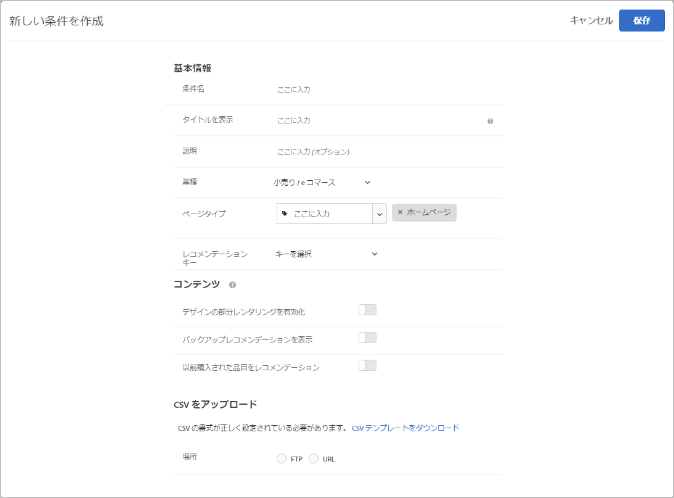

#  カスタム条件のアップロード{#upload-custom-criteria}

CSV ファイルをアップロードしてレコメンデーションをカスタマイズします。

[!UICONTROL 新しい条件を作成]画面を表示するには、複数の方法があります。一部の画面オプションは、画面の表示方法によって異なります。

* [!UICONTROL Recommendations] アクティビティを作成している場合、**[!UICONTROL 条件を選択]画面の「**[!UICONTROL 新規作成]」をクリックします。他の [!UICONTROL Recommendations] アクティビティで使用するために新しい条件を保存するオプションがあります。
* [!UICONTROL Recommendations] アクティビティを編集している場合、ページの「[!UICONTROL レコメンデーションの場所] 」ボックスをクリックして、「**[!UICONTROL 条件を変更]**」をクリックします。[!UICONTROL 条件を選択]画面で、「**[!UICONTROL 新規作成]**」をクリックします。他の [!UICONTROL Recommendations] アクティビティで使用するために新しい条件を保存するオプションがあります。
* **[!UICONTROL レコメンデーション]**／**[!UICONTROL 条件]**&#x200B;ライブラリ画面で、「**[!UICONTROL 条件を作成]**」をクリックします。ここで作成した条件は、自動的にすべての [!UICONTROL Recommendations] アクティビティで利用できるようになります。

1. 「**[!UICONTROL 条件を作成]**」をクリックします。

   

1. 「**[!UICONTROL カスタム条件をアップロード]**」を選択します。

   

1. 「**[!UICONTROL 条件名]**」を入力します。

   これは、条件の説明に使用される「内部」名です。例えば、条件を「利幅の高い商品」と呼びたいが、正式に表示されるタイトルにはそれを使いたくないという場合があります。公開されるタイトルを設定するには、次の手順を参照してください。
1. この条件を使用するすべての Recommendations 用にページに表示する、公開される「**[!UICONTROL 表示されるタイトル]**」を入力します。

   例えば、この条件を使用してレコメンデーションを表示する際に、「これを表示したひとはこれも表示しています」または「類似の商品」と表示したい場合があります。
1. 条件の簡単な&#x200B;**[!UICONTROL 説明]**&#x200B;を入力します。

   説明は条件の特定に役立ちます。ここに条件の目的についての情報を含めることもできます。
1. 「**[!UICONTROL 業種]**」を選択します。

   その他の条件オプションは、選択した業種によって異なる場合があります。1. **[!UICONTROL ページタイプ]**&#x200B;を選択します。

   複数のページタイプを選択できます。

   業種とページタイプをともに使用して、保存した条件を分類し、他の [!UICONTROL Recommendations] アクティビティで簡単に再利用できるようにします。
1. 「**[!UICONTROL レコメンデーションキー]**」を選択します。

   キーに基づく条件の設定について詳しくは、[レコメンデーションキーに基づくレコメンデーションの設定](../../c-recommendations/c-algorithms/create-new-algorithm.md#task_2B0ED54AFBF64C56916B6E1F4DC0DC3B)を参照してください。
1. 「**[!UICONTROL コンテンツ]**」のルールを設定します。

   コンテンツルールは、デザインを埋めるのにレコメンデーション品目の数が足りない場合の動作を決定します。例えば、デザインに 5 品目分のスペースがあるが、条件によって 3 品目しかレコメンデーションされない場合、残りのスペースを空のままにしておくか、代替レコメンデーションを使用して余分なスペースを埋めることができます。適切なものに切り替えて選択します。詳しくは、[コンテンツ設定](../../c-recommendations/c-algorithms/create-new-algorithm.md#concept_BC16005C7A1E4F1A87E33D16221F4A96)を参照してください。
1. **[!UICONTROL インクルージョンルール]**&#x200B;を設定します。

   インクルージョンルールを使用すると、レコメンデーションに表示する品目を絞り込むことができます。詳しくは [ 、インクルージョンルール ](../../c-recommendations/c-algorithms/create-new-algorithm.md#task_28DB20F968B1451481D8E51BAF947079) を参照してください。1. CSV ファイルの&#x200B;**[!UICONTROL 場所]**&#x200B;を選択します。

   アップロードを成功させるには、CSV ファイルが正しくフォーマットされている必要があります。「**[!UICONTROL CSV テンプレートのダウンロード]」をクリックして、正しくフォーマットされた CSV ファイルをダウンロードします。**

   次の 2 つの場所のオプションがあります。

   * **FTP：** FTP サーバーから CSV ファイルをアップロードするには、「**[!UICONTROL FTP]**」を選択し、必要な情報を入力します。CSV ファイルを安全に送信するために FTPS プロトコルを使用する、SSL の使用を選択することもできます。
   * **URL：** URL から CSV ファイルをアップロードするには、「**[!UICONTROL URL]**」を選択し、フィード URL を入力します。

1. 「**[!UICONTROL 保存]**」をクリックします。

   >[!NOTE]
   >
   >カスタム条件エンティティ（行）は、最大 1,000 のレコメンデーション品目（列）を含むことができます。

カスタム条件の更新は、デフォルトでは「累積的」です。既存のキー値ペアが、CSV アップロードファイルで指定した新しいキー値ペアで上書きされます。キーが CSV アップロードで指定されていない既存のキー値ペアは、まだ配信に使用できます。

クライアントケアに連絡して、次回の CSV アップロードに含まれていない既存の結果を破棄できるようにします。この設定を有効にすると、カスタム CSV フィードファイルに存在するキーだけが配信可能になります。この設定は、すべてのカスタム条件に適用されます。

カスタム条件フィードは 24 時間ごとに更新されます。

カスタム条件のアップロードと同期のステータスは、レコメンデーション／条件ページの各条件カードの下部に表示されます。また、カスタム条件の編集時に編集ダイアログボックスにも表示されます。

エラーが起こらなかった場合のアップロードの流れは、スケジュール設定／フィードファイルのダウンロード／読み込み／成功となります。

アップロード時に Target で問題が発生すると、次のエラーメッセージが表示されることがあります。

| エラーメッセージ | 詳細 |
|--- |--- |
| 不明なエラー | 技術的な内部エラーを示します。 |
| 解析エラー | フィードファイルの形式に問題がある可能性があります。ファイルの形式を修正し、アルゴリズムを保存し直します。そうすると、ファイルのダウンロードプロセスが再度開始されます。 |
| サーバーが見つかりません | インターネット上で認識可能な IP またはホスト名を指定します。 |
| 資格情報エラー | サーバーでアクティブなアカウントの有効なユーザー名とパスワードを指定します。 |
| ディレクトリが見つかりません | サーバーに存在するディレクトリを指定します。 |
| ファイルが見つかりません | サーバー上の指定したディレクトリに存在するファイルの名前を指定します。 |

## トレーニングビデオ:Recommendationsでの条件の作成（12:33）

このビデオには、次の情報が含まれています。

* 条件の作成
* 条件のシーケンスの作成
* カスタム条件のアップロード

>[!VIDEO](https://video.tv.adobe.com/v/27694?quality=12&captions=jpn)